# 网络钓鱼电子邮件和恶意软件流量分析

> 原文：<https://infosecwriteups.com/phishing-emails-and-malware-traffic-analysis-1234f2c1ca12?source=collection_archive---------0----------------------->


在本文中，我使用 NetworkMiner、Wireshark 和混合分析来分析几封恶意电子邮件和一个 PCAP 文件，这些文件捕获了属于恶意软件感染的网络流量。PCAP 和电子邮件文件属于蓝色团队专注于挑战[网络卫士](https://cyberdefenders.org/blueteam-ctf-challenges/21)网站，名为“*恶意软件流量分析 5* ”，由[布拉德·邓肯](https://twitter.com/malware_traffic)创建。

# 放弃

我喜欢在文章之前添加一个简短的免责声明，以鼓励人们在阅读本文之前尝试挑战，因为在这篇文章中显然会有**剧透** **。我相信，如果你先自己尝试，然后在遇到困难或需要提示时再回来写这篇文章，你会更喜欢这个挑战。因此，没有任何进一步的拖延，让我们开始吧！**

# 挑战场景

> 您在一家以感恩节为主题的公司的安全运营中心(SOC)担任分析师。一个宁静的夜晚，你听到有人在敲足球俱乐部的大门。当你去开门的时候，一个精疲力竭的邮件服务器技术人员跌跌撞撞地进来，很快就倒在了地板上。他用颤抖的声音低语道，“邮件过滤器坏了…到处都是垃圾邮件…”
> 
> 当你扶他起来的时候，他看着天空喊道:“地狱之门已经打开了！”。技术人员立即再次倒下，轻声低语道:“恐怖……恐怖……”
> 
> 邮件过滤器停机持续了整整一天。幸运的是，报道的事件很少。但是有一个例子引起了你的注意。在邮件过滤器停机期间，一名公司员工决定玩“电子邮件轮盘赌”该员工打开了收件箱中的一封恶意邮件，并将其视为合法邮件。
> 
> 你获得了该员工收到的四封恶意邮件。你还从他被感染的电脑上收到了一个 pcap 流量。你的任务？找出是哪封邮件危害了系统。

# 挑战问题

> 1.c41-MTA5-email-01:恶意文件的名称是什么？

我首先将这封邮件上传到 VirusTotal，41 家安全供应商将这封邮件标记为恶意邮件。在“行为”选项卡下查看电子邮件的输出，我可以看到恶意文件的名称。

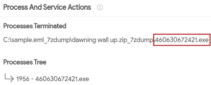

恶意文件名。

> 2.c41-MTA5-email-01:该恶意软件所属的木马家族叫什么名字？(由新出现的威胁规则集确定)。

如果我们将邮件上传到[混合分析](https://www.hybrid-analysis.com/)，我们可以看到关于邮件及其相关文件的附加信息。

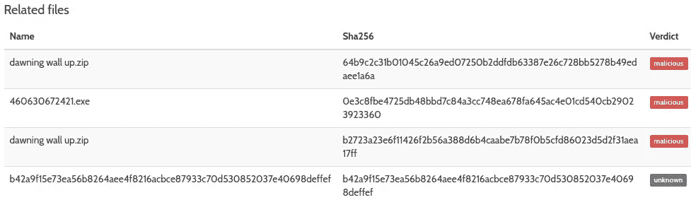

与 c41-MTA5-email-01 相关的文件。

如果我选择恶意软件文件名，我可以获得额外的信息，如猎鹰沙盒报告。

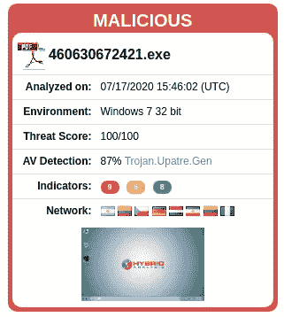

混合分析猎鹰沙盒报告。

回顾这份报告，我可以看到 Suricata 对 [Upatre](https://malpedia.caad.fkie.fraunhofer.de/details/win.upatre) 特洛伊木马恶意软件家族的警告。

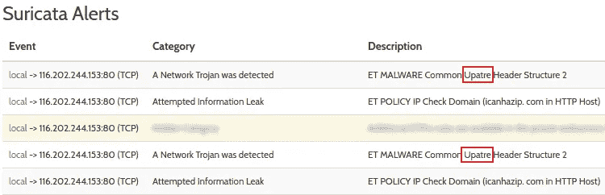

Upatre 特洛伊木马程序恶意软件家族的混合分析 Suricata 警报。

> 3.c41-MTA5-email-01:恶意软件丢弃了两个哈希相同但名称不同的恶意文件。提供这些文件的 SHA256 哈希？(查看 2015 年提交的报告)。

在混合分析中，我们可以使用前面确定的恶意软件的 SHA256 哈希来搜索 2015 年提交的任何报告。退回的报告有六份，其中一份是 2015 年提交的。

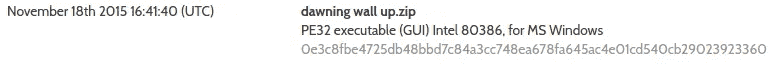

2015 年提交的报告包含 SHA256 哈希 460630672421.exe。

如果我们将报告向下滚动到提取的文件部分，我们可以看到两个标记为恶意的文件，它们具有相同的 SHA256 哈希，但文件名不同。

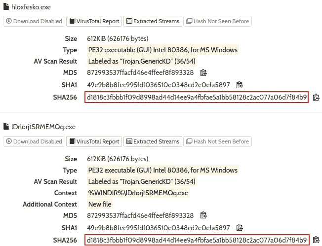

恶意软件丢弃了两个具有相同哈希但不同名称的恶意文件。

> 4.c41-MTA5-email-01:恶意软件发起了多少个 DNS 请求？(查看 2015 年提交的报告)。

在 2015 年混合分析报告中，我们可以看到提出了三个 DNS 请求。

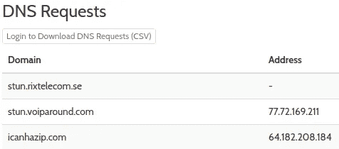

混合分析 DNS 请求。

> 5.c41-MTA5-email-02:多个流包含本文档中的宏。提供最高的数字。

我从邮件中提取了附件，并使用 [OLETOOLS](https://github.com/decalage2/oletools) 对文件进行了分析。如果你想了解更多关于 OLETOOLS 的知识，我发表了一篇文章，在这篇文章中我使用 OLETOOLS 分析了恶意的 Microsoft word 文档。

[](/maldoc101-malicious-macros-analysis-with-oletools-8be3cda84544) [## MalDoc101 —使用 OLETOOLS 进行恶意宏分析

### 这篇文章提供了我的方法来解决由 Josh Stroschein 在 CyberDefenders 上创建的 maldoc 101 CTF…

infosecwriteups.com](/maldoc101-malicious-macros-analysis-with-oletools-8be3cda84544) 

我开始使用 OLEID 来分析文件，我可以看到文件包含可疑的 VBA 宏。

```
oleid 'Bill Payment_000010818.xls'
```


OLEID 识别可疑的 VBA 宏。

接下来，我可以使用 OLEDUMP 来分析流并识别包含宏的最高流:

```
python oledump.py 'Bill Payment_000010818.xls'
```

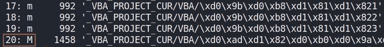

包含宏的最高流号。

> 6.c41-mt a5-email-02:Excel 宏试图下载文件。提供此文件的完整 URL？

有两种方法可以解决这个问题。第一种方法是将 excel 文件上传到 VirusTotal。44 个安全供应商和一个沙箱将该文件标记为恶意文件。在 Behavior 选项卡下，我们可以看到宏用来发出 HTTP GET 请求以下载可执行文件的 URL。

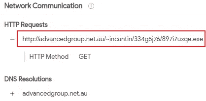

宏用来下载文件的完整 URL。

第二种方法是从 excel 文件中提取和逆向工程 VBA 代码。要提取 VBA 代码，我们可以使用 OLEVBA。

```
olevba -c "Bill Payment_000010818.xls"
```

这将返回宏的所有 VBA 源代码，无需任何进一步的分析。如果我们查看源代码，我们可以看到一个名为“ *valdis* ”的数组，其中包含大量的值。

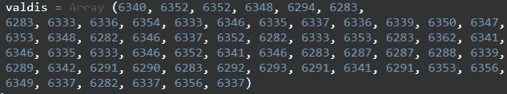

宏“valdis”数组值。

这可能是 URL，但它已经被编码，所以我们需要确定宏如何获得原始值。再往下看一点，我可以看到数组被传递给一个名为“ *Pochemu* ”的函数。

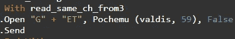

“Pochemu”函数传递了“valdis”数组。

我可以看到“GET”一词，这表明“Pochemu”函数生成的值可能提供了之前在 VirusTotal 中看到的作为 HTTP GET 请求一部分的值。我搜索了函数“ *Pochemu* ，找到了它的源代码。

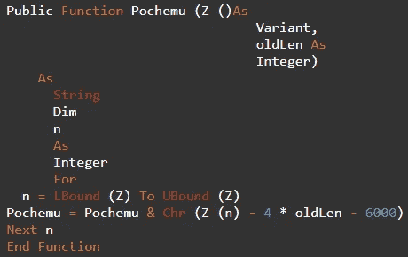

“波切姆”函数 VBA 码。

基于“ *Pochemu* ”函数的代码，它执行以下操作:

1.  函数有两个参数:

*   [一个 VBA 变量](https://software-solutions-online.com/vba-variant/#:~:text=A%20VBA%20Variant%20is%20a,%2C%20dates%2C%20time%20or%20objects.) : **一个 VBA 变量，它没有被声明为具有特定的数据类型**。因此，它可以保存 VBA 变量能够保存的任何类型的数据，无论是文本、数字、日期、时间还是对象。
*   一个叫做“oldLen”的整数值。

2.“n”变量使用 [LBound](https://docs.microsoft.com/en-us/office/vba/language/reference/user-interface-help/lbound-function) 和 [UBound](https://docs.microsoft.com/en-us/office/vba/language/reference/user-interface-help/ubound-function) 函数来**确定数组**的大小。

3.在通过“ [*Chr()*](http://Chr function converts the specified ANSI character code to a character.) ”函数将数组中的每个整数值转换为 ANSI 字符代码之前，对其执行**算术运算**。

既然我们现在有了解码 URL 的源代码和用于编码 URL 的值，我们可以使用一个简单的 python 脚本来复制由" *Pochemu* "函数执行的算术运算，并检索解码后的 URL。

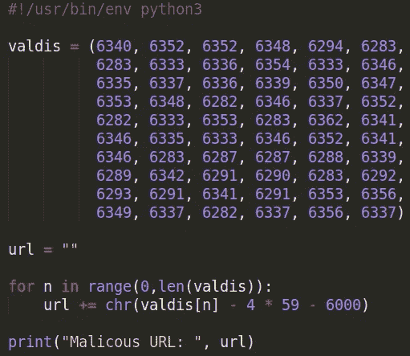

解码 URL 的 Python 脚本。

> 7.c41-MTA5-email-02:用于从下载 URL 获取数据的对象的名称是什么？

查看前面的" *Pochemu* "函数的第一张图片，我们可以看到一个名为" *read_same_ch_from3* "的对象。如果我们看看这个对象的值是在哪里设置的，我们可以看到一个部分字符串与“ *zilibobe* ”对象值连接在一起。

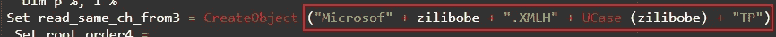

*read_same_ch_from3* 字符串值。

为了重建完整的字符串，我们需要识别" *zilibobe* "对象值。在上面的 VBA 代码中，我可以看到值被设置为“ *t* ”。

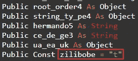

*zilibobe* 对象值。

我们现在可以重建完整的字符串: **Microsoft。XMLHTTP** 。

> 8.c41-mt a5-email-02:Excel 宏将文件写入临时文件夹。提供文件名？

同样，我们可以使用 VirusTotal 来标识写入临时文件夹的文件名。

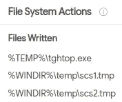

写入临时文件夹的 VirusTotal 文件名。

在 VBA 代码中，我们可以看到一个名为*的函数是 _sqr_in_string* 。

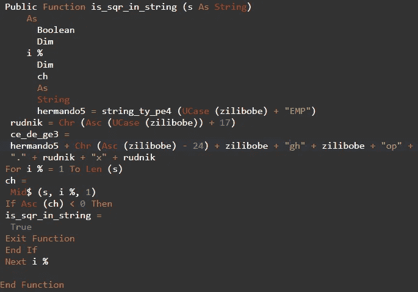

*是 _sqr_in_string* 函数的 VBA 代码。

基于上面的“ *is_sqr_in_string* ”函数的代码，我可以创建一个简单的 python 脚本来重建写入 TEMP 的文件名。

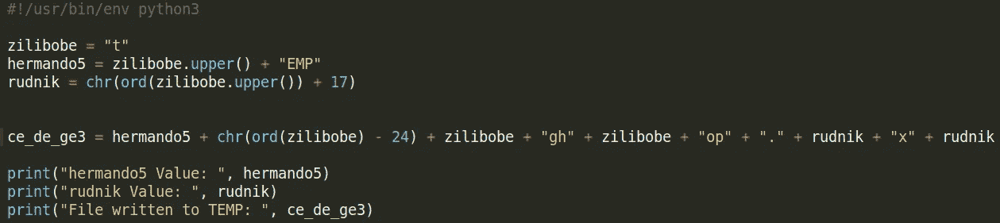

Python 脚本重建写入临时文件的文件名。

> 9.c41-MTA5-email-03:提供攻击者用来存储登录凭证的 FQDN？

如果我们将电子邮件上传到 VirusTotal，我们可以看到已识别的 FQDN 列表。

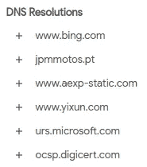

已识别电子邮件中的病毒总数 FQDN。

接下来，我们可以从电子邮件中提取 AmericanExpress.html 附件，并将文件上传到混合分析。查看生成的报告，我可以看到八个使用“*jpmmotos*”FQDN 的 HTTP GET 请求。

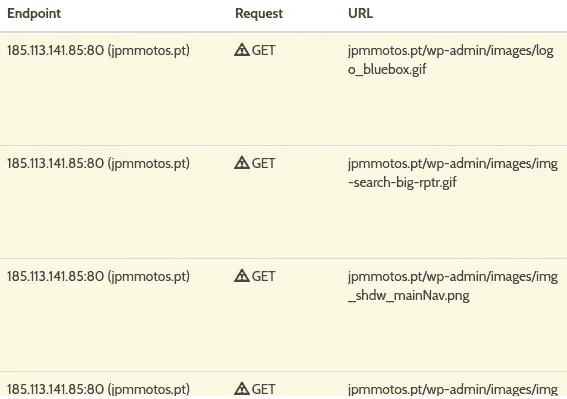

攻击者用来存储登录凭据的 FQDN。

> 10.c41-MTA5-email-04:恶意 js 中有多少个 FQDNs？
> 
> 11.c41-MTA5-email-04:用来处理和读取文件的对象叫什么名字？

我首先从标题为“ *fax000497762.zip* ”的电子邮件附件中提取恶意 JS。很难在一行中阅读，所以我把它放在一个 [JavaScript 美化器](https://beautifier.io/)中，使它更易读。

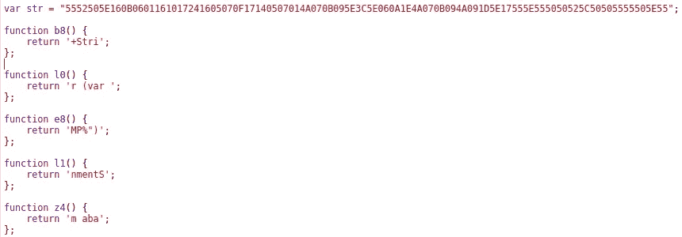

恶意 JS。

看一下 JavaScript，它似乎在重构一些 JS 代码，然后将“ *var* ”字符串值传递给它。我可以将 JavaScript 传递给一个在线编译器并得到输出。

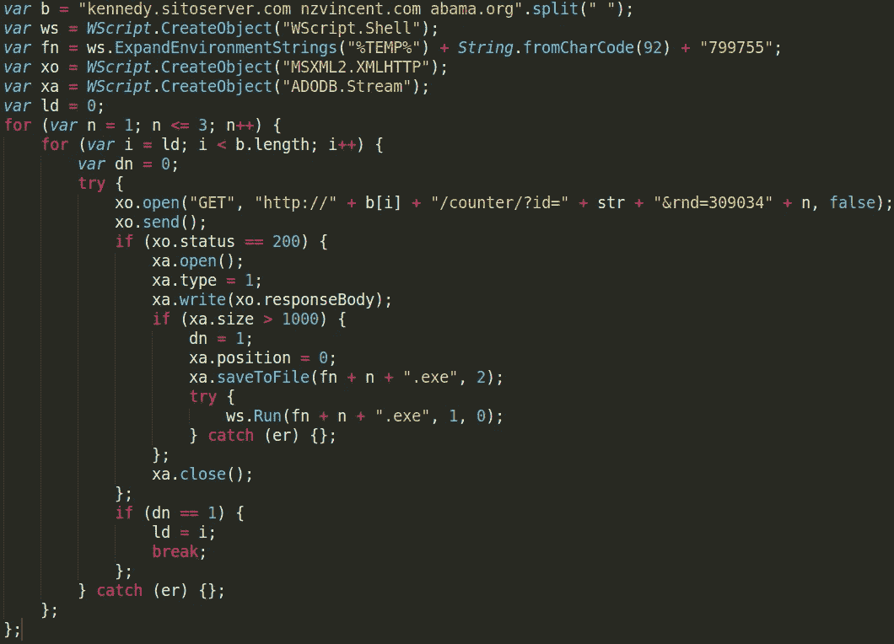

JavaScript 输出。

在 JavaScript 输出的顶部，我们可以看到列出了三个域。再往下，我们还可以看到用来处理和读取文件的对象名称是“ *ADODB。流*”。

> 12.c41-MTA5.pcap:受害人收到多封邮件；但是，用户打开了一个附件。提供附件文件名。
> 
> 13.c41-MTA5.pcap:受害机器的 IP 地址是什么？
> 
> 14.c41-MTA5.pcap:受害机器的主机名是什么？
> 
> 15.c41-MTA5.pcap:托管恶意软件的 FQDN 是什么？

以下附件列表是从所提供的电子邮件中提取的。

```
AmericanExpress.html
'Bill Payment_000010818.xls'
'dawning wall up.zip'
fax000497762.zip
```

根据我们之前对恶意附件文件的分析，我们可以使用 Wireshark 和 NetworkMiner 来查找与这些文件相关的任何迹象。在 NetworkMiner 中的 hosts 选项卡下，我从识别受感染的端点开始。我可以在组织的内部专用网络中看到一台 Windows 计算机。


NetworkMiner 感染的 Windows 计算机详细信息。

接下来，在“sessions”选项卡下，我可以看到受感染的 Windows 主机与之前在问题 10 的恶意 JavaScript 中识别的 FQDN 之一之间的会话。

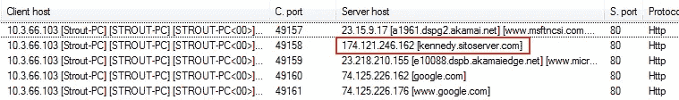

在恶意 JavaScript 中发现受感染机器和 FQDN 之间的 NetworkMiner 会话。

在 NetworkMiner 的文件选项卡下，我还可以看到三个伪装成 GIF 文件的可执行文件是从恶意 JavaScript 中找到的 FQDN 下载的。

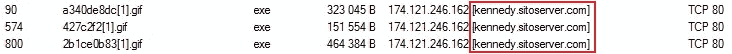

下载的 NetworkMiner 可执行文件。

在 Wireshark 中，我可以过滤 FQDN 的 IP 地址并跟踪 TCP 流。在 TCP 流中，我可以看到第一个数据包下载了一个伪装成 GIF 文件的 Windows/DOS 可执行文件(注意 MZ 头文件)。

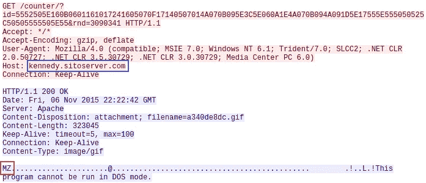

Wireshark Windows/DOS 可执行文件下载。

查看之前的恶意 JavaScript，我们还可以看到 URL 语法结构与 Wireshark 中的结构相匹配。

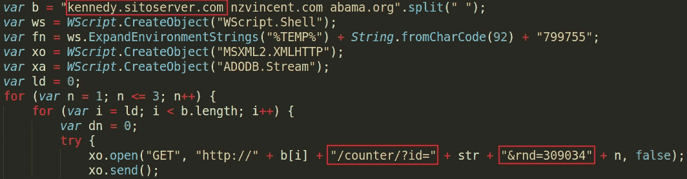

JavaScript 匹配 URL 结构。

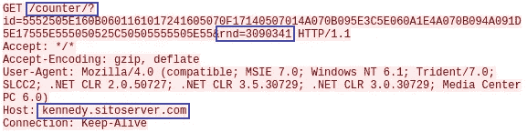

Wireshark 匹配 URL 结构。

这表明受害者打开了“ *fax000497762.zip* ”电子邮件附件，其中包含恶意 JavaScript。

> 16.c41-MTA5.pcap:打开的附件向 TEMP 文件夹写入了多个文件。提供写入磁盘的第一个文件的名称？

分析恶意 JavaScript，我可以看到，一旦 HTTP GET 请求成功，就使用“ *saveToFile()* ”文件函数，参数如下所示。

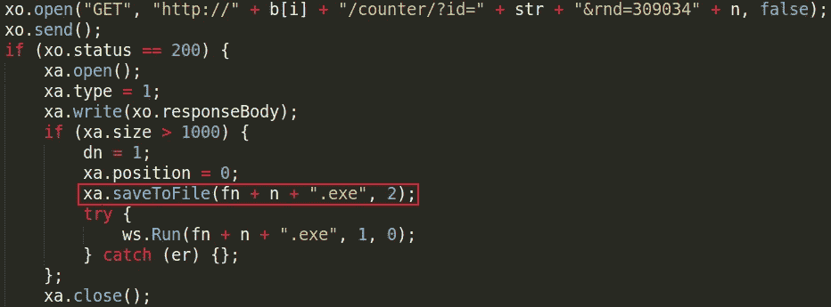

*saveToFile()* 文件功能。

文件名由存储在" *fn"* 变量中的值、" *n* 变量的当前值和字符串"*组成。exe* ”。我可以看到在第一个 for 循环中使用了" *n* "变量，并且" *fn"* 变量包含一个静态字符串值。

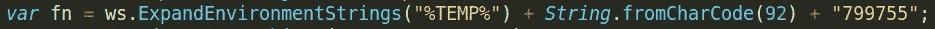

“fn”变量值。

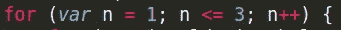

“n”变量值。

由于这是第一个文件，变量“ *n* 将被设置为 1。“ *fn* ”变量将与“*n*and”连接在一起。exe”来提供以下文件名:

```
%TEMP%\7997551.exe
```

> 17.c41-MTA5.pcap:其中一个写入磁盘的文件有如下 md5 哈希“35 a 09d 67 bee 10 c 6 aff 48826717680 c1c”；该恶意软件检查哪个注册表项来确定其存在？

为了分析恶意的可移植可执行(PE)文件，我使用了 [pestudio](https://www.winitor.com/) ，但是如果你在 Linux 机器上工作，你可以使用 [pev 工具](https://www.kali.org/tools/pev/)来代替。与其他一些工具不同，pestudio 试图根据某个文件可能具有的某些*指标*来确定该文件是否是恶意的。

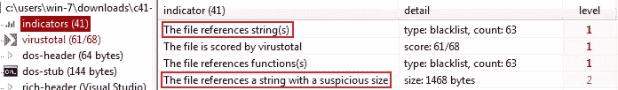

pestudio 指标。

如果我查看 pestudio 发现的一些顶级指标，我可以看到恶意文件引用了一些可疑的字符串。我可以查看 pestudio 找到的字符串，并根据大小进行组织。

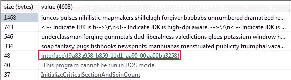

pestudio 注册表项。

我可以看到一个不寻常的字符串，它与此挑战的答案格式相匹配，并且是恶意软件用来检查其存在的注册表项。您也可以使用 pev tools 中的" *pestr"* 找到相同的字符串。

```
pestr pe-file
```

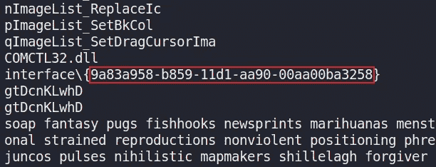

pestr 注册表项。

> 18.c41-MTA5.pcap:其中一个写入磁盘的文件具有以下 md5 哈希“e2fc 96114 e 61288 fc 413118327 c 76d 93”向“upload.php”页面发送 HTTP post 请求。提供 web 服务器 IP。(IP 不在 PCAP)

我可以将提供的 MD5 散列提交给混合分析。查看 2015 年的最后一份[报告，我可以看到该哈希的 PE 可执行文件向 web 服务器 IP 上托管的“*upload.php*”页面发出了两个 HTTP POST 请求，如下所示。](https://www.hybrid-analysis.com/sample/f195bc9c26e0819663a907f855f6cff1125812993b89ba9d7bc48272181e2c73/5640065b0e316dc229e2be8b)

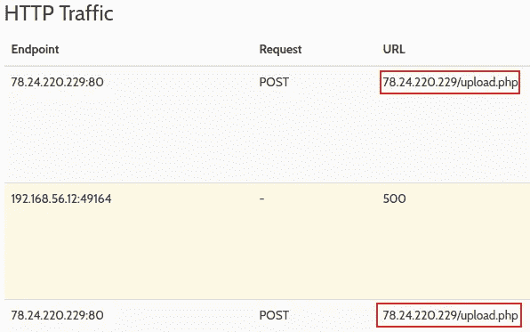

web 服务器 IP。

> 19.c41-MTA5.pcap:恶意软件在感染后发起回拨流量。提供目标服务器的 IP。

在 Wireshark 中，我可以导航到“*统计数据>对话> TCP* ”并按数据包的最高数量对对话进行排序。


Wireshark 对话。

我看到受感染的主机和上面突出显示的 IP 地址之间通过端口 80 交换了大量数据包。在 Wireshark 中，我过滤了 IP 地址和 http 流量。

```
ip.addr == 109.68.191.31 && http
```

我可以看到一个 HTTP GET 请求从受感染的机器下载一个可疑的文件。

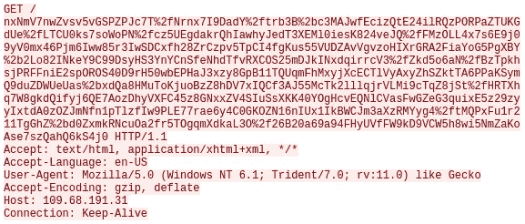

可疑的 HTTP GET 请求

如果我们查看 Wireshark 中的 HTTP 对象，我们可以看到有大量可疑流量与此 IP 地址相关联，这可能是感染后的流量..

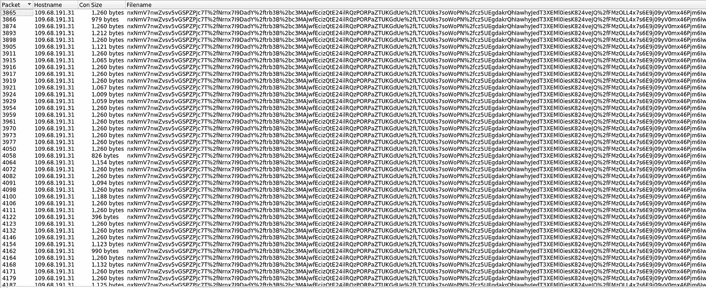

感染后流量。

# 结束语

我发现这个挑战对于使用 NetworkMiner、Wireshark 和 Hybrid-Analysis 进行实践来说非常棒。我也非常喜欢通过电子邮件和 PCAP 挑战来了解 Windows 虚拟机是如何被感染的。谢谢你一直读到最后，继续黑下去😄！

# 🔈 🔈Infosec Writeups 正在组织其首次虚拟会议和网络活动。如果你对信息安全感兴趣，这是最酷的地方，有 16 个令人难以置信的演讲者和 10 多个小时充满力量的讨论会议。[查看更多详情并在此注册。](https://iwcon.live/)

[](https://iwcon.live/) [## IWCon2022 - Infosec 书面报告虚拟会议

### 与世界上最优秀的信息安全专家建立联系。了解网络安全专家如何取得成功。将新技能添加到您的…

iwcon.live](https://iwcon.live/)