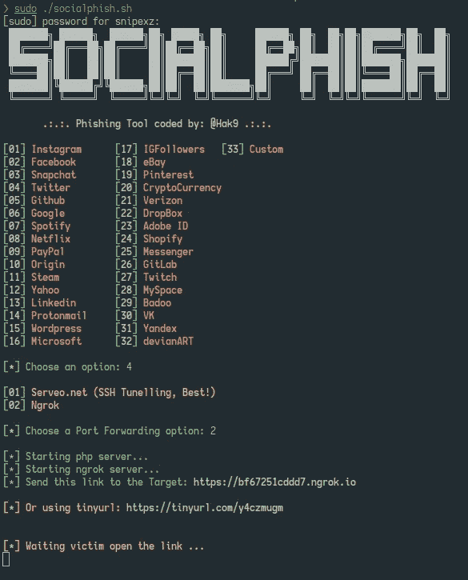
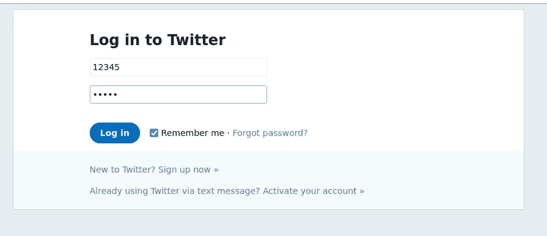
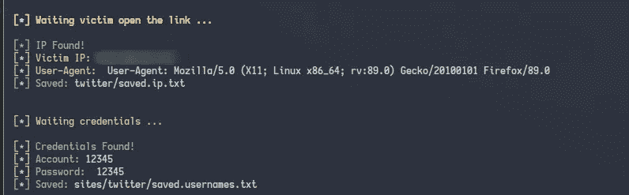

# 网络钓鱼变得更加容易

> 原文：<https://infosecwriteups.com/phishing-got-easier-with-socialphish-b04dcbab3900?source=collection_archive---------1----------------------->


```
Phishing simply put is an art of creating malicious content to mimic legitimate websites in order to acquire sensitive information by targeting mass users or main business embodiment. 
```

让我们通过使用 Kali Linux 使用一个名为 Socialphish 的网络钓鱼工具进行网络钓鱼攻击来深入了解一下。

```
Socialphish is an open sourced phishing tool which comes with 33 web template pages for popular sites such as Google, Facebook, Snapchat, Microsoft, Github, Yahoo, Netflix, Amazon, etc
```

# 装置

在 kali Linux 操作系统中打开您的终端，并执行以下操作；

```
#change directory to opt or any directory of your choice
 cd /opt/ #clone Socialphish repository 
sudo git clone https://github.com/xHak9x/SocialPhish.gitcd SocialPhish #Change permissions on the executable file 
sudo chmod +x socialphish.sh #run 
sudo ./socialphish
```

# #可选

一些网页模板有过时的设计，让我们试着改变它们…

例如，谷歌的网络模板；

```
#change directory to sites
cd sites cd twitter#Edit login page with the most recent login page using nano or any editor of your choice.
sudo nano login.html #save and exit 
ctrl + x
```

现在让我们运行这个工具。

```
#move back to the SocialPhish directory
cd ../.. #run socialphish
sudo ./socialphish # Select any phishing page of your choice and portforward your local ip 
[*] Choose an option: 1 [*]Choose a portforwarding option: 2 #Ngrok will be downloaded if not installed already.
```



Ngrok 允许您将运行在本地机器上的 web 服务器暴露给 internet。它有助于从任何设备访问该页面，因为它通过端口转发本地 IP 地址。



非法网站

在上图中，您可以看到用户名字段填写为 12345，密码字段填写为 12345。提交该表单后，php 服务器会监听受害者的击键，这些击键会显示在终端上，然后记录在保存为 saved . usernames . txt/opt/social phish/sites/" template "/saved . usernames . txt 的文件中使用的 web 模板目录中



资格证书

还有其他开源网络钓鱼工具也可以用于网络钓鱼目的，如 Socialphish，但我在 Socialphish 上取得了更大的成功。

> 请关注下一篇关于如何使用 Setoolkit 发送钓鱼邮件以及如何检测钓鱼链接的博客。

更多内容，请订阅我的 youtube 频道

[](https://www.youtube.com/channel/UCbcfcMixWSNF7BoArenrlig) [## 无畏的网络引擎

### 与朋友、家人和全世界分享您的视频

www.youtube.com](https://www.youtube.com/channel/UCbcfcMixWSNF7BoArenrlig) 

💻瞧啊。！

*原载于*[*https://www . onging . so*](https://www.notion.so/Phishing-Got-easier-with-Socialphish-fc9721889a5a4d02859bd2814fd14a18)*。*