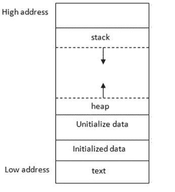

# 凤凰挑战—零堆栈

> 原文：<https://infosecwriteups.com/phoenix-challenges-stack-zero-f8743cc871ed?source=collection_archive---------2----------------------->

# 挑战

挑战的描述和源代码位于[这里](https://exploit.education/phoenix/stack-zero/)。它和所有其他 Phoenix 二进制文件都位于 **/opt/phoenix/amd64** 目录中。一篇[以前的帖子](https://secnate.medium.com/phoenix-challenges-getting-set-up-a2783e0616c6)描述了如何为 *Exploit Education 的凤凰城*挑战设置虚拟机，如果还没有这样做的话。

# 目标

查看*堆栈零的* C 代码，我们看到存储在初始化为 0 的*局部变量*结构中的 *changeme* 变量。目标是篡改它的值，使其为非零，以打印所需的语句。

# 相关概念

在计算机内存中执行的程序看起来像这样:



堆栈和堆是两种主要的内存结构。长话短说:

*   **堆栈**用于存储关于被调用函数及其局部变量的信息。当一个新的函数被调用时，机器向下扩展堆栈的大小，为存储它的局部变量和关于这个函数调用的信息提供更多的空间。相反，当一个函数退出时，机器释放堆栈内存并向上减小其大小。**堆栈内存管理在执行过程中自动执行。**
*   **堆**被程序用来在执行过程中动态分配内存。如果需要的内存量是不可预测的，这就特别有用。例如，接收可变长度消息的浏览器可能会获取大量堆内存，将传入消息放入其中进行处理。

在低级语言执行期间，程序员显式地管理堆的内存。在 C 中使用了 **malloc()、calloc()、free()和 realloc()** 函数，在 C++中使用了 **new** 和 **delete** 运算符。Python 和 Java 等更高级的内存安全语言使用内存管理器在看不见的地方安全地处理堆。

那些希望进一步了解堆栈和堆如何工作的人会发现这个解释很有帮助。

# 虫子

Stack Zero 的所有数据都存储在堆栈上，其中*局部变量*结构的*缓冲区*和 *changeme* 变量是相邻的邻居。存入*缓冲区*的多余数据将溢出到 *changeme* 变量并影响其值。这种溢出是由 **gets()** 函数造成的，该函数用于将控制台输入的输入写入 *locals.buffer* 中，而不执行任何边界检查。

# 利用

输入写入的 *locals.buffer* 有 64 个字符的空间。由于 *locals.changeme* 变量最初为 0，因此漏洞需要篡改其内存位置，使其具有非零值。这是通过输入一个 65 个字符的输入字符串来完成的，最后一个字符直接溢出到 *locals.changeme* 变量的内存中，并使其非零。

漏洞利用是用 *pwntools* 编写的，这是一个用于漏洞利用开发的 Python 框架。该代码有大量解释性注释，因为它是本系列的第一篇。它可以在我的 [Github 知识库](https://github.com/secnate/Exploit-Education-CTFs)中找到。

结果呢？

```
nathan@nathan-VirtualBox:~/Desktop/Exploit-Education- CTFs/Phoenix/stack-zero$ ./stack-zero-exploit.py
Launching The Phoenix Stack Zero Exploit!
[!] Could not find executable 'stack-zero' in $PATH, using '/opt/phoenix/amd64/stack-zero' instead
[+] Starting local process '/opt/phoenix/amd64/stack-zero': pid 12739
[*] Switching to interactive mode
[*] Process '/opt/phoenix/amd64/stack-zero' stopped with exit code 0 (pid 12739)
Welcome to phoenix/stack-zero, brought to you by https://exploit.education
Well done, the 'changeme' variable has been changed!
[*] Got EOF while reading in interactive
$
```

# 补救

为了防止这样的内存崩溃错误，我会鼓励开发人员不要用 C 编写，转而使用 Python 或 Rust 等内存安全的语言。

如果除了使用 C 别无选择，我会警告不要使用 [**gets()**](https://www.tutorialspoint.com/c_standard_library/c_function_gets.htm) 函数从命令行提取输入。正如刚才看到的，它读取输入，直到到达换行符或文件尾字符，而不管目的缓冲区的大小。

应该改用 [**fgets()**](https://cplusplus.com/reference/cstdio/fgets/) 函数。它解析命令行输入并将其放入目标缓冲区，同时执行适当的边界检查。源代码的`gets(locals.buffer);`行将是`fgets(locals.buffer, 64, stdin);`

使用 **fgets** 的一个额外好处是，它自动用终止 *null* 字符(" \0 ")终止缓冲区。程序员可能会忘记手动插入这样的字符。因此，在这个挑战中，只有 63 个字符从命令行读入缓冲区，第 64 个字符是“\0”。

用空字符终止缓冲区对于防止缓冲区过度读取漏洞至关重要。这些包括数据泄漏，因为读取缓冲区的函数没有遇到终止字符，并继续越过缓冲区的末端进入相邻的内存。

我想到的最臭名昭著的例子是 2014 年的 OpenSSL Heartbleed bug。对于那些不熟悉的人来说，OpenSSL 是一种广泛使用的 SSL 和 TLS 加密协议的开源实现，网站和系统使用它来建立安全和经过验证的连接。安全专家 Bruce Schneier 在谈到安全问题的影响时一直非常保守，[称之为灾难性的](https://www.schneier.com/blog/archives/2014/04/heartbleed.html):

> *从 1 到 10，这是 11。*

这一轮就到此为止。请继续关注 *Stack One* 挑战赛，这是 *Stack Zero* 挑战赛的延伸，不过有点难度！

这篇文章最初发表在内森·帕夫洛夫斯基的个人博客上: [secnate.github.io](http://secnate.github.io)

*来自 Infosec 的报道:Infosec 上每天都会出现很多难以跟上的内容。* [***加入我们的每周简讯***](https://weekly.infosecwriteups.com/) *以 5 篇文章、4 个线程、3 个视频、2 个 Github Repos 和工具以及 1 个工作提醒的形式免费获取所有最新的 Infosec 趋势！*