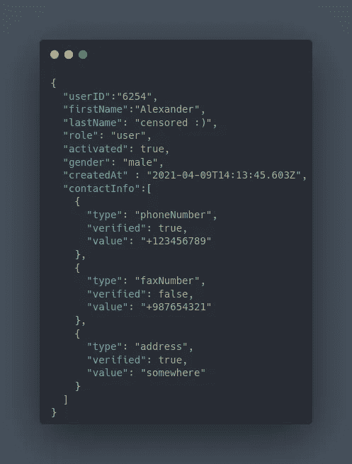
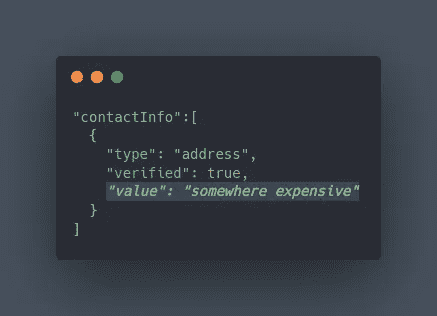
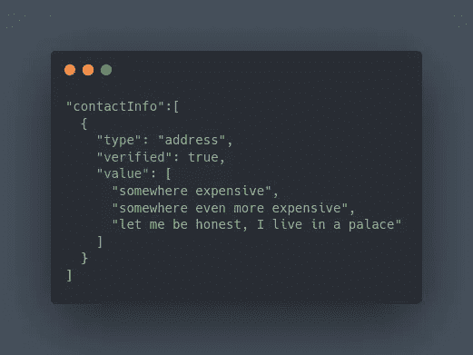

# 电话簿，做公司的方法

> 原文：<https://infosecwriteups.com/phonebook-the-way-to-dos-a-company-87d342c613b5?source=collection_archive---------1----------------------->

## 我不得不把我的个人信息添加到电话簿中，这是我不喜欢的，所以我关掉了服务器；)

分配给我一个任务:黑掉`phonebook.company.net`
于是，我启动了我的思想黑客引擎…

在做 pentest 的时候，我总是追求最高的冲击力。
但最高影响力的定义会因目标的业务模式而异。

让我解释一下。
假设目标是一个新闻网站。数据的有效性和完整性是目标的核心业务模型。
因此，一个让攻击者能够修改网站内容的漏洞会产生重大影响，并破坏公司的声誉。
例如，考虑存储的 XSS，这个 bug 通常被列为高影响，但在这种情况下，它是一个关键的 bug。

我的目标是为其他公司提供技术支持，他们的团队需要在最短的时间内联系客户。
客户的联系信息存储在内部服务器:`phonebook.company.net`

那么，这里的*最高冲击*是什么呢？如果你让电话簿服务器停止服务，公司的业务会突然停止…
被摧毁，生意是无情的。

## 第一部分:做吧

我开始使用 web 应用程序来理解它的工作流程。
让我来描述一下应用程序。
有三种不同的访问级别:
**用户**:修改自己的联系信息
**员工**:修改自己的联系信息，搜索联系信息
**管理员**:修改所有用户的联系信息，搜索联系信息

这个应用程序有三个部分。搜索页面
2。用户资料
3。管理部

我的测试账户有用户特权，我可以添加我自己的联系信息。修改用户数据的`PUT`请求的主体是这样的:

使用 GUI 时，添加联系信息有一个限制。我最多只能在我的联系信息部分添加五条记录。所以，我修改了我的详细信息，截取了请求，手动地在`contactInfo`数组中添加了三条记录，并发送了请求。服务器只是简单地接受了它，现在我的个人资料页面上有 8 条记录。

好吧，但是这个简单的行为能有用吗？
当然，因为当我可以绕过客户端限制，再添加三条记录时，这意味着我可以……
向后端数据库添加无限制的记录，
用完服务器的存储，
增加搜索结果中包含我的个人资料的搜索过程的时间，
增加处理我的个人资料所需的 RAM 存储量。

听起来像是 DoS，不是吗？🙂

运行 phonebook 应用程序的服务器并没有那么强大，只是一台处理内部团队请求的普通机器。因此，我可以更快地确认漏洞，而无需在我的个人资料中添加大量记录。

我添加了几千条记录，当我搜索我的名字时，服务器的响应时间急剧增加。再加几千个，一分钟后也没有反应。

DoS 确认。📛

## 第二部分:多做…

正如我提到的，当我搜索我的名字时，DoS 发生了，但是当我搜索别人的名字时，服务器反应很快。
我的意思是:
al…Alex…alexan…Alexander…Alexander…
—服务器对任何一步都没有反应
但是当我搜索我同事的名字:
Mi… Mich… Michael…
—服务器对每一步都反应很快

也就是说，只有当我的帐户出现在搜索结果中时，DoS 才会发生。
换句话说，员工无法使用服务器查找姓名与我的姓名首字母相同的客户。那影响有限，我不想要。所以…让我们做得更多😏

我需要变点魔法，让我的账户出现在任何搜索的结果中。
一如既往，问题是“如何做？”

搜索页面中实现了一个功能，使员工的搜索变得更容易，所以我用它来增加他们的搜索难度🙃

当您在搜索框中键入内容时，应用程序会搜索客户姓名**以及他们联系信息记录的**值——某种反向搜索:

多么好的*功能*，感谢开发团队:)

所以我写了一个小脚本来生成字母和数字的随机组合，并将它们添加为我的联系信息的*值*。这样，无论员工搜索什么，我的帐户都会出现在搜索结果中…

服务器关闭💀

## 第三部分:不够，继续努力！！

如果不能用直接添加更多记录的方法来 DoS 服务器，那该怎么办？

**亲提示:** 学好 JSON 结构。
当你遇到 JSON 数据时，试着改变“值”的类型。
如果是整数，把它转换成字符串，可能会有一个 SQLi。如果它是一个包含安全令牌的字符串，用`null`替换它，你可能会发现一个认证旁路。如果它是一个包含 OTP 的字符串，把它变成一个数组，你就可以一次破解所有可能的代码。

我使用了最后一个技巧，但不是强行添加任何东西，来添加比正常情况更多的数据:

我发送了请求，服务器接受了它。这意味着我可以向数组中添加无限的元素，并尽可能多地使用存储和 RAM。
老一套，另一个 DoS:)

这样，即使我不能添加超过五条记录，也有可能 DoS 服务器。

## 第四部分:消灭你的对手，只需 49.99 美元

这是一台内部服务器，只有员工可以访问，攻击者如何利用它呢？

正如我之前提到的，有三个访问级别:
用户
员工
管理员

员工和管理员可以直接登录到服务器，但是在具有`user`访问级别的帐户和服务器之间存在反向代理。因为`user`账户属于客户，他们添加和修改联系信息的请求由 API 提供服务。

这里是攻击场景:
假设你是一家公司，与我的目标公司竞争市场。你去他们的网站，表现得像一个想要支持他们业务的人，花 49.99 美元买他们最便宜的服务。然后你进入你的个人资料，添加数以千计的联系信息记录…
因为你想确保他们能在必要时与你取得联系😏

…他们失去了市场，RIP。

有帮助吗？
我不要求你给我买杯咖啡，
教我点什么…
不和:`**REDN#9702**`

Infosec Writeups 团队刚刚完成了我们的第一次虚拟网络安全会议和网络活动。我们有 16 位出色的演讲者，他们主持了非常有价值和鼓舞人心的会议。要查看演讲者和主题列表，请点击此处。

 [## IWCon2022 — Infosec 书面报告虚拟会议

### 与世界上最优秀的信息安全专家建立联系。了解网络安全专家如何取得成功。将新技能添加到您的…

iwcon.live](https://iwcon.live/)