# PHST CTF 2021 —报道

> 原文：<https://infosecwriteups.com/phst-ctf-2021-write-up-e6adf61eb38a?source=collection_archive---------0----------------------->

## 与挪威警察安全局一起捕捉旗帜—复活节版

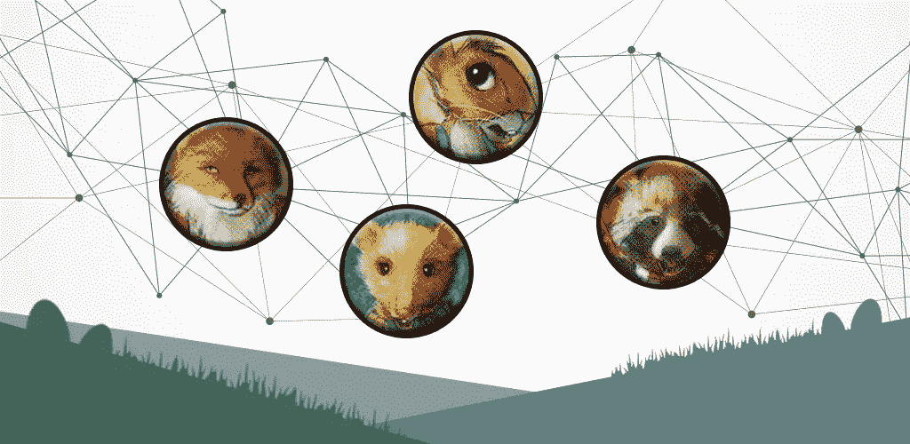

封面图片 PHST 特写——由[艺术家设计 13](https://www.freepik.com/premium-vector/abstract-connecting-dots-lines-with-geometric-background_5946699.htm#position=3) 、 [PST](https://p26e.dev/) 和 [starline](https://www.freepik.com/free-vector/happy-easter-flat-style-card-with-rabbit-grass_7186111.htm#page=1&query=easter&position=14)

像 PST(Politiets Sikkerhets tje neste)出版的大多数比赛一样，它的背后有一个有趣的故事。这一次，一个团队去了虚构的 harefjell 山(野兔山)，在复活节休息。不幸的是，并不是所有的事情都像看起来那么美好，在美好的外表背后隐藏着可怕的计划。

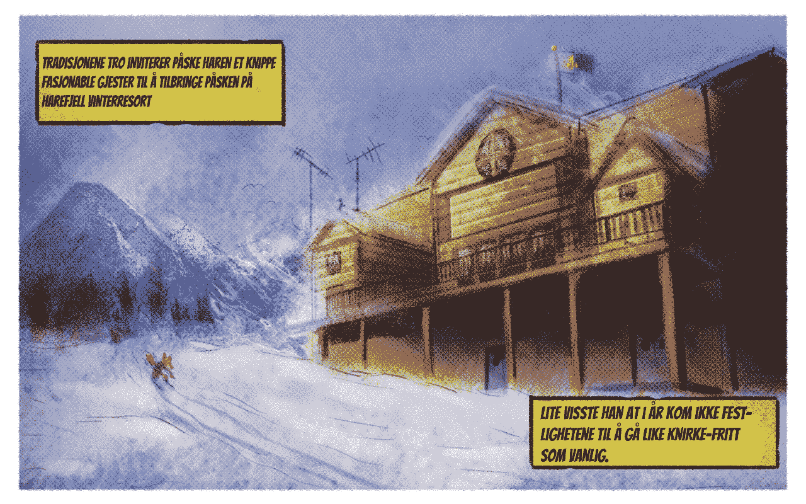

复活节故事的开始——由[太平洋标准时间](https://p26e.dev/)

在复活节的每一天，我们都会面临一个新的任务，这个任务最终将有助于揭开野兔岭的神秘面纱。

# 星期一星期四

比赛被设定为一个时间线，每天都有一个独特的图像。今天的图讲的是一个旅客来到山里的故事。拍照，其中一张写着给我在图片上贴标签，我在 Instagram 上的用户名是@mikaelfoks1337。

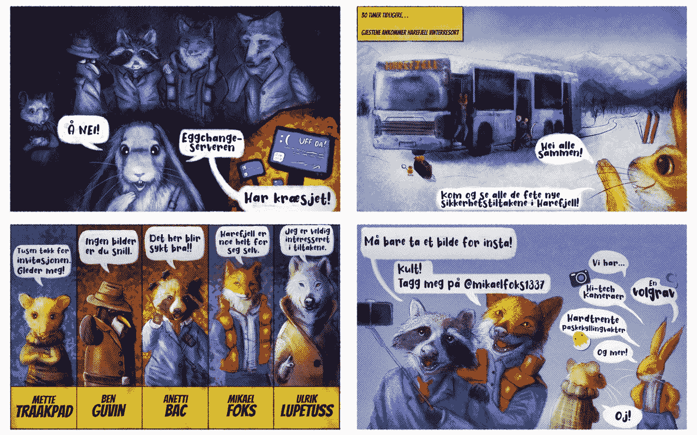

CTF 第一天—由[太平洋标准时间](https://p26e.dev/#skjaertorsdag)创建

当你访问 Instagram 页面时，你会收到一个新的提示。个人资料的描述会告诉你在鸟儿叽叽喳喳的地方找到他。这是一个暗示，我们应该检查 Twitter。


[来自 Instagram 的截图](https://www.instagram.com/mikaelfoks1337/) —作者

在 twitter 上是否有另一个网站的新提示:robotanekjem.p26e.dev

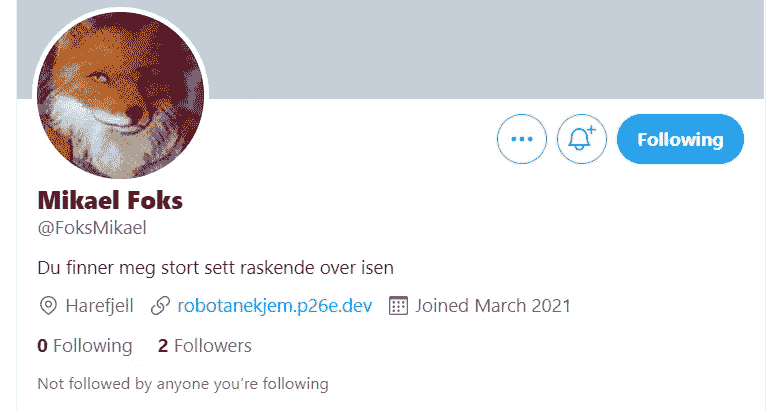

[推特截图](https://twitter.com/FoksMikael)——作者

网站上说机器人要来了。这又是一个新的提示，因此我们检查 robots.txt。

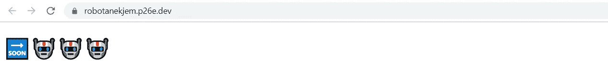

[来自 robotanekjem](https://robotanekjem.p26e.dev/) 的屏幕截图——作者

Robots.txt 为我们提供了以下内容:

```
# Usj, roboter, ha dere vekk!

User-agent: *
Disallow: /94afc738_det-første-flagget.html
```

而[94 AFC 738 _ det-fr ste-flag get . html](https://robotanekjem.p26e.dev/94afc738_det-f%C3%B8rste-flagget.html)给了我们标志。

```
🔜🤖🤖🤖Gratulerer, her er flagget: PST{snart_er_det_SOMEr}
```

# 耶稣受难节

今天的图片讲述了一个由咨询公司进行的升级导致整个系统瘫痪的故事。“Eggchange”服务器没有工作，我们所拥有的只是一个[日志文件。](https://gist.github.com/suxSx/e83c687141e86c2b5845a820430ae468)

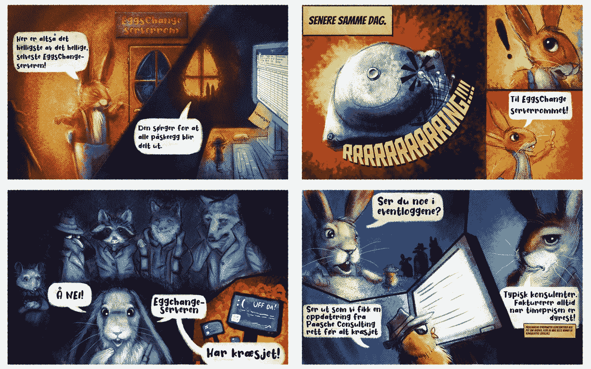

每日一图，第二天——由[太平洋标准时间](https://p26e.dev/#langfredag)拍摄

查看日志文件，我注意到更新是从 github 加载的:**git @ paaschecomsulting/eggs change**

```
[EGGSCHANGE] Set-DeliveryAddress id=0bea61679ac648bb9c5fac74fc57e46b
[EGGSCHANGE] Send-HealthStatus status=ok
[EGGSCHANGE] Update-EggContent id=f9c057294aae473cb0134868aefbf32c
[EGGNET] Set-UpdateStatus status=UpdateAvailabel
[EGGNET] Send-NewEggsChangeUpdate update=2.e66
[EGGSCHANGE] Set-DeliveryAddress id=0cd555bb4bb94466bbff809bc840a80a
[EGGSCHANGE] Set-DeliveryAddress id=ca84059bcf59417da14e05cf8eeff8e4
[EGGSCHANGE] Set-DeliveryAddress id=e58381696b44450b886b0cc958c7183d
[EGGNET] Set-EggsChangeHealth health=ok
[EGGSCHANGE] Update-EggContent id=bcff9cfa57de4fb1a76cc3b75a108b5d
[EGGNET] Get-EggsChangeHealth
[EGGSCHANGE] Update-EggContent id=5d6c3239d8b64ad78ca9749ac22a8b31
[EGGSCHANGE] Get-EggStatus id=63a50df11ce04b3992f4d83a980e4780
[EGGSCHANGE] Get-NewUpdate git@paaschecomsulting/eggschange
[EGGSCHANGE] Set-DeliveryAddress id=757929db9030410f95767cafbe492cac
```

我前往[https://github.com/paaschecomsulting/eggschange/](https://github.com/paaschecomsulting/eggschange/)找到更新文件。更新由一个主脚本、一个模块和两个二进制文件组成。

这是一个非常好的剧本，有很多幽默。当你触发它时，它“加载”感染更新，创建漂亮的 ASCII 图像。作为奖励，它加入了一个任务，让你的电脑在下午 6 点关机

这就是“eggchange”服务器宕机的原因。看了一眼之后，我发现这是唯一值得注意的代码。

当您执行脚本时，它会询问一个密钥。我们没有这个。另一方面，它说如果你怀疑。也许检查帮助文件。

我从 base64 转换帮助文件，看到有图像文件。将它们保存为 png 格式，并获得两张精美的复活节兔子图片。这并没有授予我太多，我运行他们通过各种 stegano 工具，但仍然没有。

但就在那一刻，当我在记事本中浏览它们时，我突然注意到了照片的作者。这些名字似乎非常熟悉。

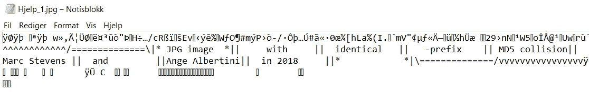

帮助文件的屏幕截图—按作者

在谷歌上快速搜索马克·斯蒂文斯和安格·阿尔贝蒂尼，我就来到了 https://github.com/corkami/collisions 的网站。

它讲述了一个漏洞，使得在两个不同的映像上有相同的 MD5 校验和成为可能。为什么不呢？我想，如果图片的 MD5 和是关键。

我把它上传到我最喜欢的工具 [**网吧**](https://gchq.github.io/CyberChef/#recipe=MD5()&input=NzY0OTJkMTExNjc0M2YwNDIzNDEzYjE2MDUwYTUzNDVNZ0I4QUhvQWRRQTJBQ3NBVUFCV0FEa0FiUUJ2QUdNQVlnQkRBR2dBU1FCNkFHVUFkZ0J4QUdnQVNRQlFBR2NBUFFBOUFId0FOd0F4QURrQU1BQTJBRElBTndBd0FESUFaZ0F6QUdNQVpnQTVBRGtBTWdBMUFHUUFaUUEzQURZQU9RQmpBREFBWVFBekFHUUFNZ0EyQUdFQU1BQXhBRGNBWVFCakFHSUFOQUJtQUdRQU53QTBBR1VBWVFCaEFEQUFNQUJsQURJQU1BQmpBRFFBTndCaUFHTUFaQUE0QURVQU9RQXdBR1FBTkFCaUFEUUFNUUEwQUdNQU13QTBBREFBTUFCaUFEY0FOd0E1QURrQVpRQTRBRGtBTWdBNUFHWUFZd0F3QURjQU1BQTVBRElBTXdCbUFEUUFOZ0JrQUdFQU13QmxBRGdBTkFBeEFEWUFPQUEwQURNQU1RQTRBRFlBTlFCbEFESUFaZ0ExQURjQU9BQTNBR01BWXdBMEFESUFOZ0JoQURNQVlRQmtBRE1BT0FBeEFHUUFNQUEyQURRQVl3QTNBREFBWVFCbUFHTUFNZ0JrQUdVQVpRQm1BRFFBTVFCbUFEY0FNQUF6QUdFQVl3QmhBRE1BWXdCakFHTUFPUUJsQURjQU5BQmlBRElBTUFBPQ) 。并得到 MD5 哈希:**4a 981 c 87 ef 142 f 95d 04424 a 29235 dcfc**。在脚本中运行它，是的，有今天的旗帜。

```
PS eggschange-main\Update_2.e66> .\Påskenott.ps1 
Velkommen til oppdateringsveiviseren for Paasche consults eggschange-server Vennligst vent mens vi laster inn nødvendige moduler cmdlet Test-EggschangeFlag at command pipeline position 1 Supply values for the following parameters: 
Decryption_key: 4a981c87ef142f95d04424a29235dcfc PST{PaascheStemning_og_Kraftskall}
```

# **复活节前夕**

该团伙对盗窃案进行了更彻底的调查，发现是从内部袭击的。他们附上了一份[网络流量日志](https://knoph.cc/ctf/write-up/nettverkstrafikk.pcap)供我们检查。

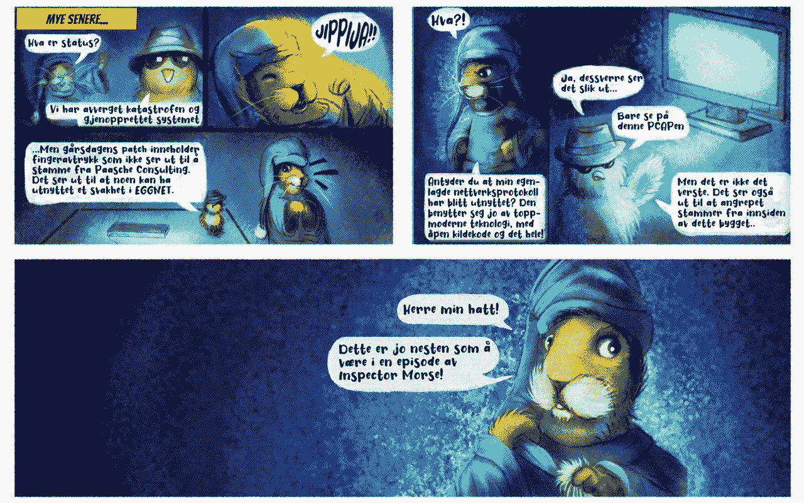

第 3 天—太平洋标准时间[之前](http://p26e.dev)

logg 向我们展示了一个指向:[github.com/paskeharen/eggnett-client](http://github.com/paskeharen/eggnett-client)的 TCP 流

```
GET / HTTP/1.1
user-agent: Eggnett/1.0 <github.com/paskeharen/eggnett-client>
x-egg: 3dcee520913dd353c4263876be8bf22b
accept: */*
host: eggschange.harefjell.local
```

在这里我们可以找到一个单向发送命令的脚本。他们也会加密。

我记得从昨天开始，在电脑屏幕上有一个信息如下:**43 m3 l1g 437。也许这就是破解它的关键。然后我设计了一个 python 脚本来解密所有的 x-egg 文件。我将 Wireshark 的所有散列复制到一个文本文件 [hash-new.txt](https://gist.github.com/suxSx/0cd27069ff5657283298d08990d38817) 中，并将其加载到脚本中。**

它给我以下输出:

```
BEGYNN\r\nEGGNETT KONFIGURASJON SETT oppdateringskilde TIL [https://github.com/paaschecomsulting/eggschange\r\nEGGNETT](https://github.com/paaschecomsulting/eggschange\r\nEGGNETT) KONFIGURASJON SETT OBFUSKERT flagg TIL “When the stars line up And you catch a break People think you’re lucky”\r\n
```

这是对歌曲《时间就是一切》的引用。然后我记起今天的照片与莫尔斯先生有关。一定有什么联系。我在 Wireshark 中再次打开 pcap 文件，查看数据包的时序。

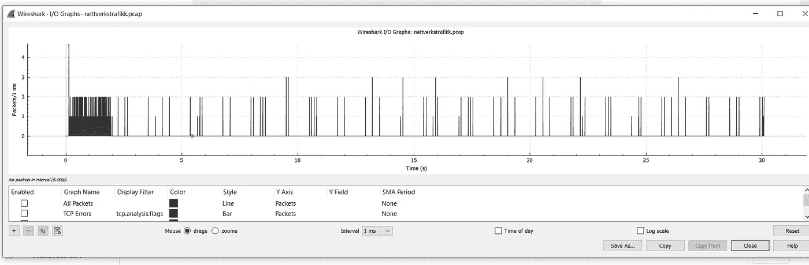

屏幕截图—按作者

一些线比其他线彼此站得更近。他们成群结队地站着，就像他们一头扎进字母和数字里，这可能是莫尔斯电码吗？于是我开始用纸笔数数。如果你计算两行之间的间距，你会得到:

```
--. --- -.. - .-.. . ... - -- . .-.. .-.. --- -- .-.. .. -. .--- . -. .
```

这给了我今天的标志(wellreadbetweenthelines):

```
godtlestmellomlinjene
```

# 1.复活节(1。帕斯凯达格)

在审查证据后，他们承认该行为发生在星期五 13 时 37 分。所有的嫌疑犯都必须解释他们当时在做什么。

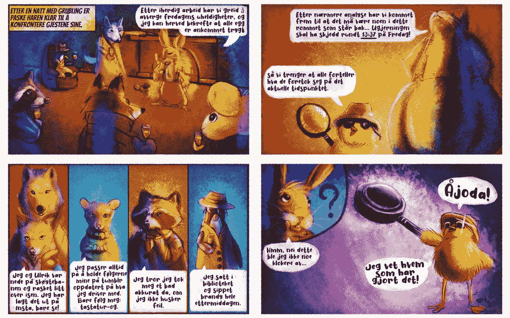

第 4 天—太平洋标准时间[之前](http://p26e.dev)

我们首先查找 tmblr 地址 [**tastatur-og**](https://tastatur-og.tumblr.com/) 。这给了我们一个带有图片链接的帖子，它把我们带到了 flickr。

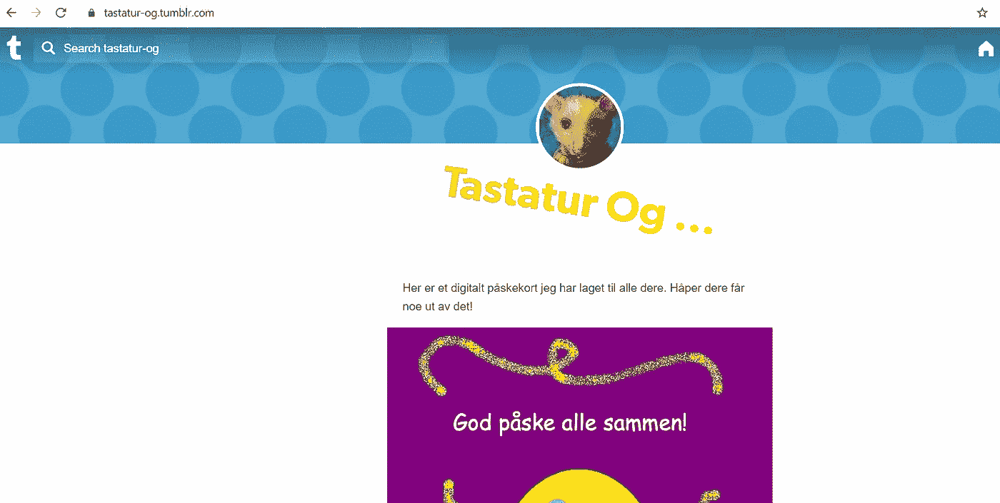

[tumbr](https://tastatur-og.tumblr.com/) 的丝网印刷——作者

flickr 的[元数据](https://www.flickr.com/photos/192650711@N02/51082793808/in/dateposted-public/)告诉我们，我们需要发送一封电子邮件来获取今天的 flagg。

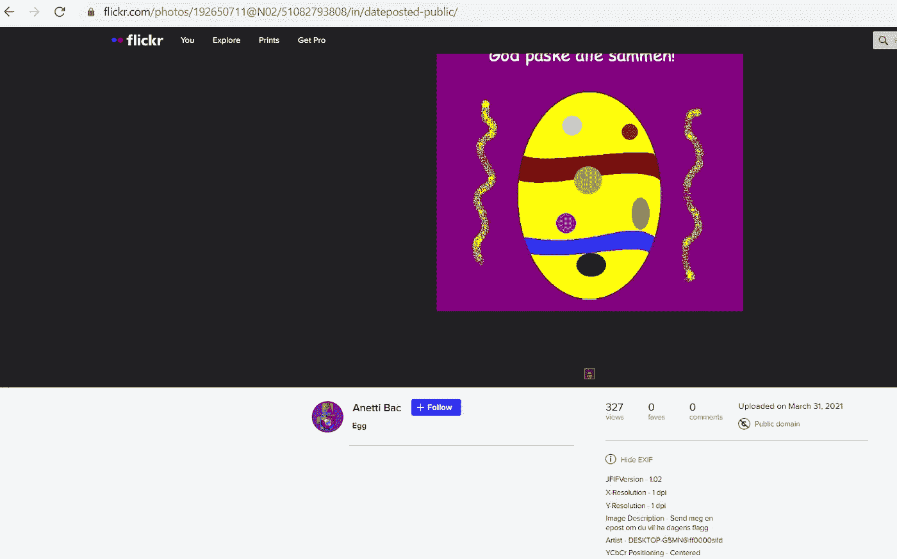

屏幕打印 [flickr](https://www.flickr.com/photos/192650711@N02/51082793808/in/dateposted-public/) —作者

但是我们在哪里可以找到这封邮件呢？本周早些时候，我们参观了 gitHub，其中一个委员会似乎非常重要。相互指责和一些印记。这实际上就像是暗示它很重要。

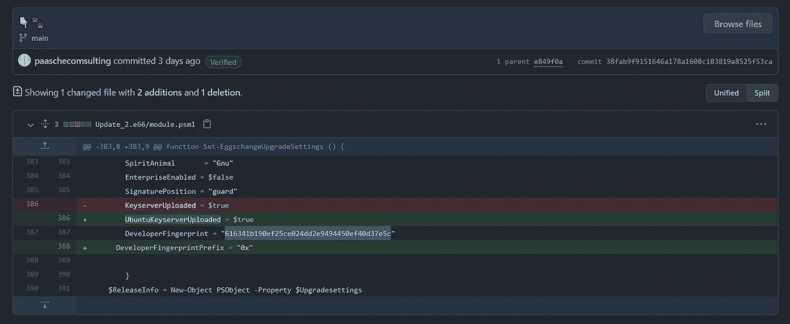

来自 [gitHub](https://github.com/paaschecomsulting/eggschange/commit/38fab9f9151646a178a1608c183819a8525f53ca) 的屏幕打印——作者

一个变化表明这是一个 ubuntu 服务器。因此，我们可以尝试使用以下命令进行查找:

```
gpg --keyserver hkp://keyserver.ubuntu.com --search-key 616341b190ef25ce024dd2e9494450ef40d37e5c
```

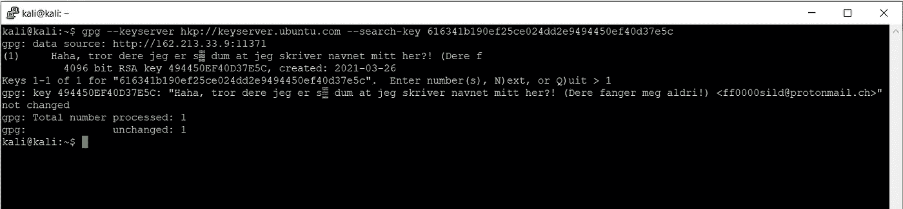

指纹查找—按作者

```
gpg: key 494450EF40D37E5C: “Haha, tror dere jeg er så dum at jeg skriver navnet mitt her?! (Dere fanger meg aldri!) <[ff0000sild@protonmail.ch](mailto:ff0000sild@protonmail.ch)>”
```

太棒了，我们找到了一个邮件地址[**ff 0000 sild @ proton mail . ch**](mailto:ff0000sild@protonmail.ch)。当我们现在尝试向它发送电子邮件时，我们很快得到一个带有今天标志的响应: **PST {tr4ckp4d_3r_n0e_he2k！}**

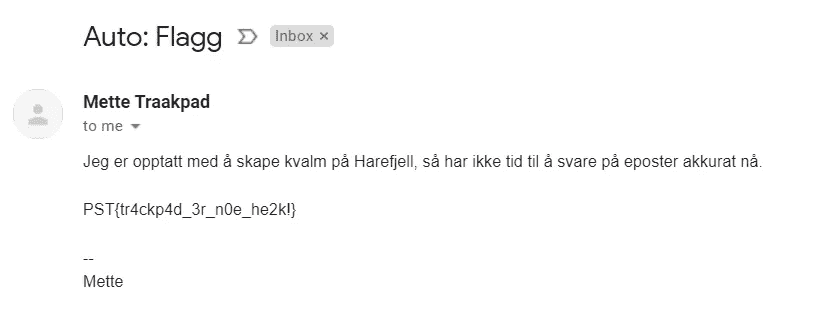

返回带标志的电子邮件—按作者

# 摘要

比赛提供了复活节 CTF 所期待的东西。你必须挖掘并寻找答案的任务。所有这些都夹杂着幽默和小谜团，让每一天都变得越来越有意义。

如果你没有尝试和解决过任何来自 PST(挪威警察安全局)的任务，建议下次加入。同时，你也可以看看我以前为 PST 写的文章。

[](/npst-ctf-2020-write-up-79e47c1a7658) [## NPST CTF 2020 —报道

### 由 PST(挪威警方)为 2020 年 CTF 圣诞挑战赛撰写文章。这篇文章会陪你度过每一天…

infosecwriteups.com](/npst-ctf-2020-write-up-79e47c1a7658) [](/npst-ctf-2021-write-up-96b58464151d) [## NPST CTF 2021 —报道

### PST 制作的 2021 年 CTF 圣诞挑战日历详细演练。

infosecwriteups.com](/npst-ctf-2021-write-up-96b58464151d) 

和往常一样，如果你喜欢这篇文章，在跳到阅读清单上的下一篇激动人心的文章之前，给它 50 次鼓掌。