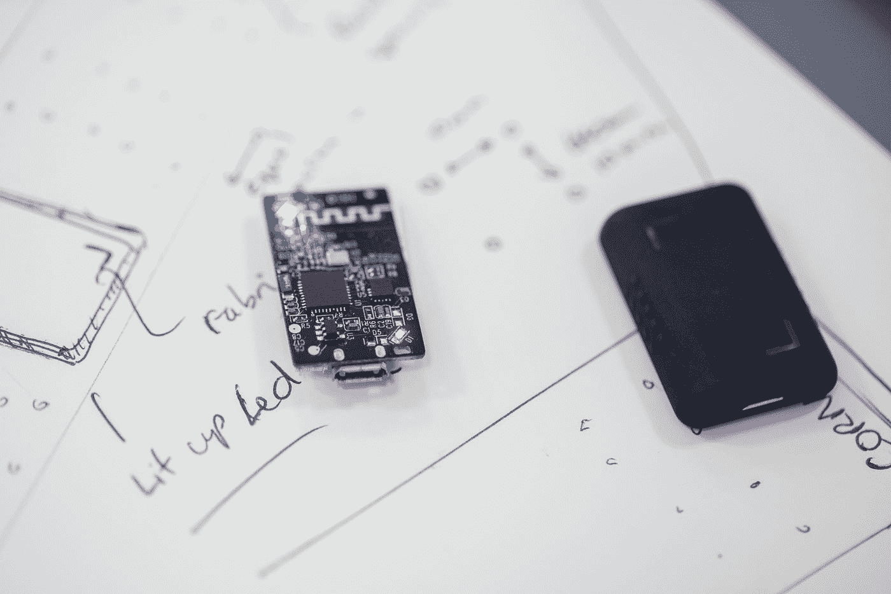
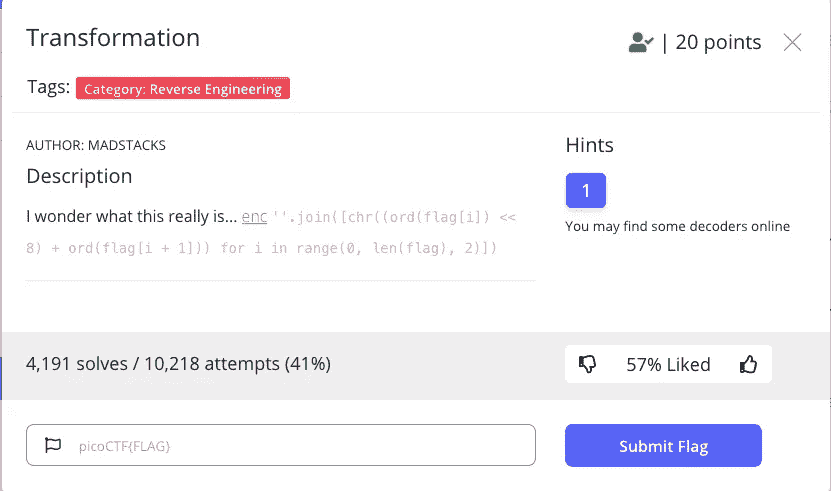
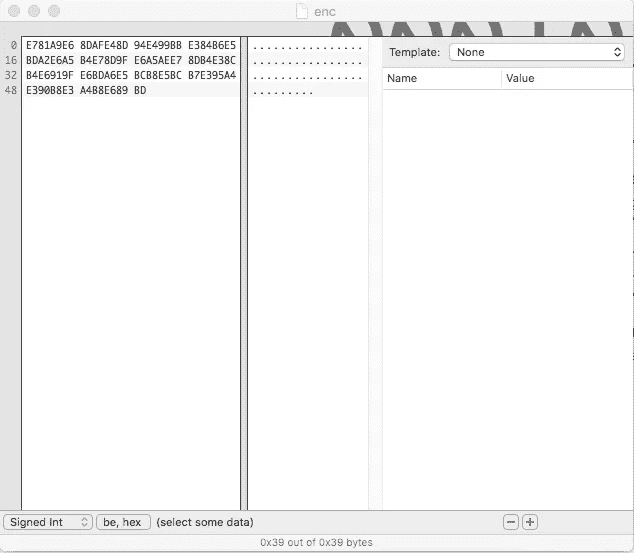
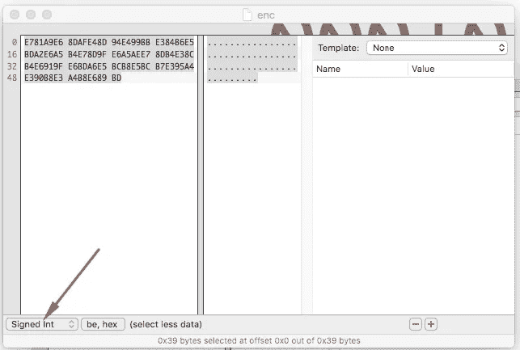
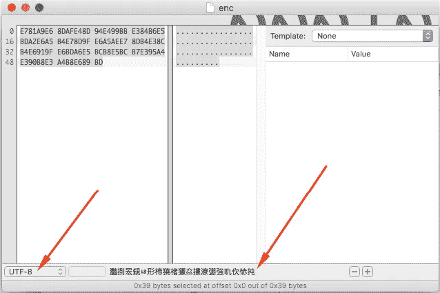
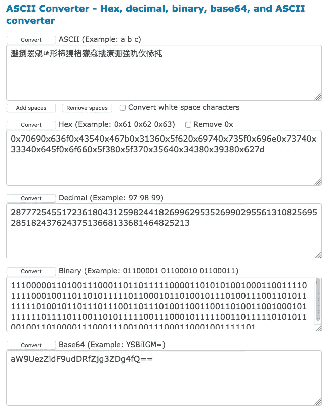
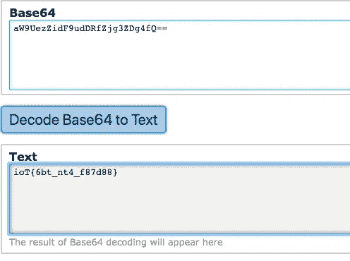

# PicoCTF 2021:转型

> 原文：<https://infosecwriteups.com/picoctf-2021-transformation-6242546fba02?source=collection_archive---------0----------------------->

## 文件隐藏消息的基本逆向工程概念。



在 [Unsplash](https://unsplash.com?utm_source=medium&utm_medium=referral) 上拍摄的 [ThisisEngineering RAEng](https://unsplash.com/@thisisengineering?utm_source=medium&utm_medium=referral)

## 背景故事

我做 Bug Bounty 已经有几年了，你可能知道，在这个领域工作的大多数人都有很多相似之处。他们观看的电影类型，工作的程序，甚至是同一群 YouTubers 用户来获取信息和学习更多的技能。

但是大多数或者说所有的臭虫猎人都有一个共同点，那就是**CTF**。我知道这是什么，但直到今天我才真正对它感兴趣。是的，今天是我第一次玩 CTF。不知怎么的，Youtube 给我发来了一个视频，是一个关于**[**picoctf.org**](https://picoctf.org/)**的 DEFCON** 会议。起初，找到大多数旗帜并不难，直到我手忙脚乱地进入 ***转换*****

> **什么是夺旗？**
> 
> **捕捉旗帜，或者说 CTFs 是一种计算机**安全**竞赛。在计算机安全技能测试中，几组竞争者(或者只是个人)相互竞争。由于其团队建设性质和竞争性，CTF 通常是一个人网络安全职业生涯的开始。**

****

**transformationpicoctf2021.jpg**

**正如我们从照片中看到的，给了我一个要下载的文件，一些 python 代码片段，以及一个尝试解决标志的**提示**。如果你了解 Python**和**的话，这是一个起点。做我自己并不是我开始的地方，尽管我应该这样做。**

# **让我们开始行动**

## **第一枪**

**将文件下载到本地目录进行数据分析后，我将它放入一个十六进制编辑器中检查是否有隐藏的秘密。**

****

**十六进制恶魔编辑器(macOS)**

**乍看之下，你可以看到没有什么重要的发现。在这一点上，我非常失望地认为我进入了死胡同，直到我选择了结果，并将十六进制编辑器从 ***符号整数*** 切换到 **UTF-8** 格式，如下所示；**

****

**from 有符号整数**

****

**到 UTF-8**

**哈！我找到了一些东西，这些是新年夜交响乐的中文单词。现在怎么办？当天解决了一些涉及 **ASCII** 的标志后。我想，如果这只是我需要解码的 ASCII 编码，而不是一个有意义的真实句子呢？原来也不过如此。利用网站上的提示，我试着解码了 **ASCII** ，尽管我当时并不知道那是 **ASCII** 。**

**Using [***branah.com***](https://www.branah.com/ascii-converter) to decode **灩捯䍔䙻ㄶ形楴獟楮獴㌴摟潦弸強㕤㐸㤸扽**, I had the following results below, from all these results the only one that really got my attention was the Base64.**

****

**[https://www.branah.com/ascii-converter](https://www.branah.com/ascii-converter)**

**其中解码成**文本**产生了“ **ioT{6bt_nt4_f87d88}** ”。这真是件好事。**

****

**[https://base64.guru/converter/decode/text](https://base64.guru/converter/decode/text)**

**虽然我知道这是国旗短语的一部分，但它不是国旗的答案，有些东西不见了，但我不知道是什么。标志应该是类似于 **picoCTF{XXXX}** 的东西，而不是 **IoT** 。**

## **第二枪**

**仔细查看 python 代码片段中的随机字符串值，我意识到该脚本使用了 ***chr()*** 和**o*rd()****python 函数，*用于*循环， *len* 。为了重温我在 python 时代的辉煌，我开始寻找 *chr()* 和 *ord()* 的主要用途。就在这个时候，我发现了一个*StackOverflow.com*的帖子，一个家伙在寻求帮助，因为他编写了一个使用 ***ASCII 表*** 对消息进行编码的脚本，但却无法解码。基本上，在我浏览了他的代码后，我明白了我的标志的答案是使用具有这两个功能的 python 脚本编码的。***

***Somehow I needed to create a python **ASCII decoder** script and feed **灩捯䍔䙻ㄶ形楴獟楮獴㌴摟潦弸強㕤㐸㤸扽** to it as an input which then will decode it into plain text.***

***解密 asci 代码的脚本***

***想出这个脚本并在 **Visual Studio 代码**控制台中运行后，我得到了以下结果；***

***解码结果***

***这是我一直在寻找的结果。知道每一面旗帜都以“ **picoctf{xxxx}** ”开头，注意到“*pi”*作为解码信息中的前两个字母，我终于从中文隐藏信息中检索到了旗帜，或者至少我是这么认为的。通过仔细观察，我们可以看到解码后的消息有一些额外的字符串***

```
**pi0co1CT2F{3164_b5it6s_7in8st93410d_11of12_813_7145d1548169817b}18**
```

## *****最后一枪*****

***在所有这些工作之后，我所拥有的是:***

*   ***物联网{6bt_nt4_f87d88}***
*   ****pi 0 co 1c T2 f { 3164 _ b5 it 6s _ 7 in 8st 93410d _ 11of 12 _ 813 _ 7145d 1548169817 b } 18****
*   *****灩捯䍔䙻ㄶ形楴獟楮獴㌴摟潦弸強㕤㐸㤸扽*****

***接下来我该做什么？！这看起来像是结束了。好吧，我决定再试最后一次，以防失败，我会换另一面旗子。***

***最明显的步骤是尝试 **picoctf{6bt_nt4_f87d88}** 而不是 **ioT{6bt_nt4_f87d88}** 显然这不起作用。***

***我继续删除了 **0** 、 **1** 、 **2** 和 **18** 以得到一个更像 ***的标志 picoCTF { 3164 _ b5 it6 s _ 7 in 8 ST 93410d _ 11 of 12 _ 813 _ 7145d 1548169817 b }****、*这也不起作用我所需要做的就是将前两个结果中的内容混合成一个，但是怎么做呢？***

***在沉思我是如何从我的 python 脚本***pi 0 co 1c T2 f { 3164 _ b5 it 6s _ 7 in 8 ST 93410d _ 11 of 12 _ 813 _ 7145d 1548169817 b } 18****，*中得到这个答案的同时，我意识到我的代码写得并不高效，这也是它无法最大限度解码 ASCII 消息的原因。我需要自己用逻辑或猜测找到答案，在凌晨 3 点，调试或重新写我的脚本对我来说不是一个选项。***

## ***突破👊***

***仍然盯着半解码的标志，想着 python 或者仅仅是我的 python 知识是如何让我失望的，就在这个时候，我的内部编码器开始工作了。人们从 1 开始计数，程序员知道 1 实际上意味着 0。这让我注意到在“*pi”*后面有一个 **0** ，后面多了两个字母还有 **1** ，多了两串还有一个 **2** ，以此类推。直到达到数字 **18** 为止。这再加上我脑袋后面有 **ROT13** ，每两个字符串/字母后删除任何数字，最终给了我解码后的标志**！*****

## ***最后的结果***

*   ***pi**0**co**1**CT**2**F {3**4**b**5**it**6**s _**7**in**8**ST**9**34**10【T69*****

***—致***

*   ***picoCTF { 16 _ bits _ inst 34d _ of _ 8 _ 75d 4898 b }***

***瞧，这是这个练习的解码标志。***

## ***个人想法，简单解释，建议***

***第一次尝试 CTF 背后的原因是为了测试“最好的黑客如何学习他们的技术”视频理论中的家伙。他表示，通过像拼图一样一次学习一些小东西，最终将所有这些放在一起，可以使你成为一名优秀的黑客。***

***利用这个概念，我才得以解码这面旗帜。同一天，我解决了一些涉及 ASCII、Base64 和 rot13 的标志。我们都可以看到在这个任务中使用，这里是如何；***

*****1)** 文件字符串使用 **ASCII** 编码***

*****2)** 解码后的消息是一条 **Base64** 格式的消息***

***不知何故，我的脚本的结果给了我一个看起来像是隐藏消息的破碎的结果，类似于写为 **ROT13*****

***综合这三个因素，在 python 知识的帮助下，我完成了我的使命。是的，黑客需要一些编码知识，无论谁告诉你不是这样，都是在骗你。他是对的，小步快跑会让你跑得更快。当你在外面黑东西的时候，总是尝试不同的方法。***

***PicoCTF 是对初学者来说最有趣的 CTF 之一，因为它对每个人来说都足够简单。想看看这个 CTF 旧版本的演练吗？看看这个 [2019 PicoCTF 演练](https://guidedhacking.com/threads/picoctf-walkthrough-writeup-2019.14275/)。***