# PicoCTF 2022 网络开发

> 原文：<https://infosecwriteups.com/picoctf-2022-web-exploitation-558673a65f79?source=collection_archive---------0----------------------->

## 包括，Insp3ct0r，机器人在哪里，Power Cookie

在 [Unsplash](https://unsplash.com?utm_source=medium&utm_medium=referral) 上由 [Boitumelo Phetla](https://unsplash.com/@writecodenow?utm_source=medium&utm_medium=referral) 拍摄的照片

欢迎回来，神奇的黑客们，在很长一段时间后，我再次被另一个有趣的危险 CTF 挑战赛 PicoCTF 2022 的博客所鼓舞。

在这篇文章中，我们将看到一些网络开发的挑战。

第一次挑战 **Insp3ct0r**

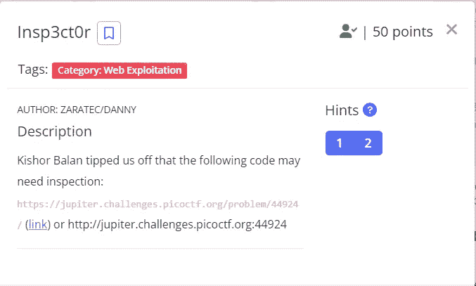

web 界面如下所示:

这背后的线索/提示是检查 Html 页面、javascript 页面，最后查看 CSS 页面。

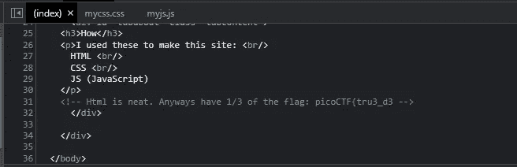

我在检查 index.html 时发现了国旗的一部分

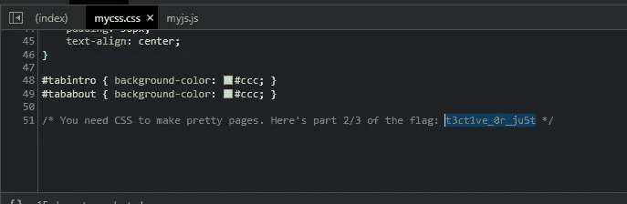

第二部分标志通过检查 **mycss.css**

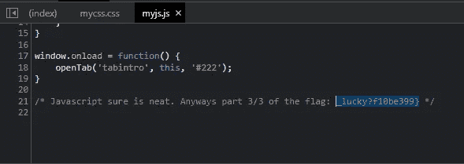

第三部分旗帜通过检验 **myjs.js**

最后，你得到了这次挑战的旗帜。

**机器人在哪:**

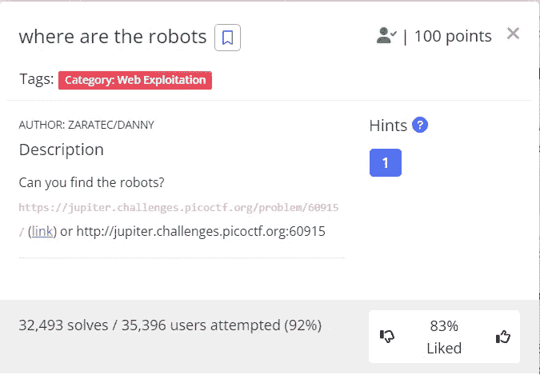

页面看起来像这样

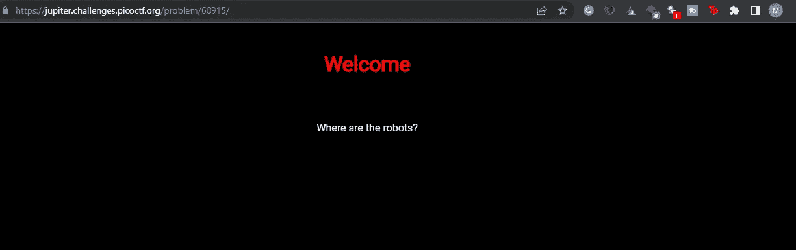

我导航到 robots.txt 页面，发现了一个有趣的位置。

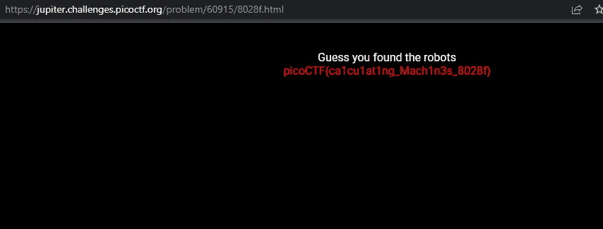

我戳进位置，终于达到了国旗。

**包括:**

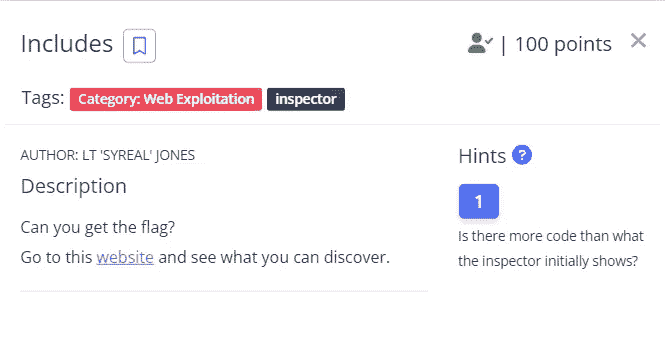

web 界面看起来像这样

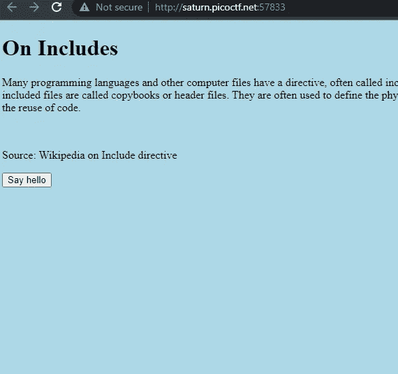

在查看源页面时，我发现了旗帜的第一部分。

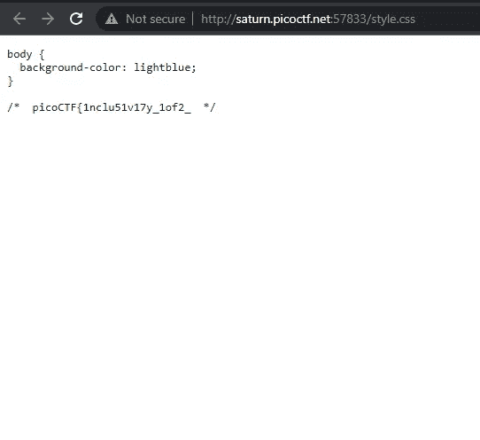

然后查看 script.js，我发现了旗帜的第二部分

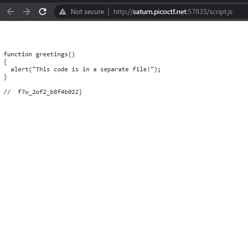

**能量饼干**

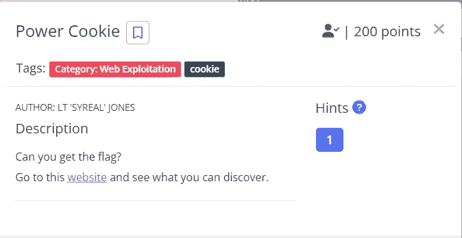

主页

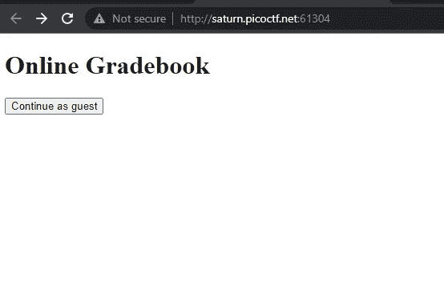

点击**继续做客按钮**点击按钮后没有任何有趣的内容出现。

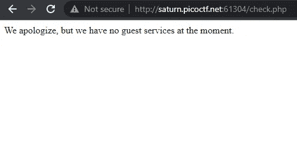

单击该按钮后出现。

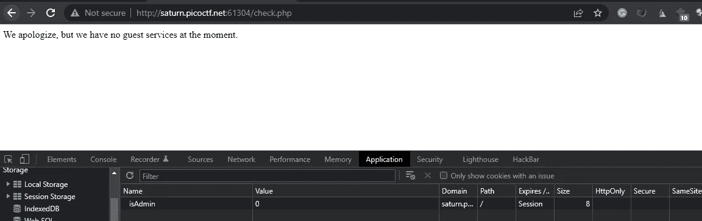