# picoCTF 2022-详细报道

> 原文：<https://infosecwriteups.com/picoctf-2022-writeup-53633ac84ed6?source=collection_archive---------1----------------------->


所以我参加了 2022 picoCTF。我现在能够解决一些挑战，比赛期间我忙于其他工作。一旦我完成一项挑战，我会不断更新记录。

先说 300 分挑战。

1.  **St3go(取证)**

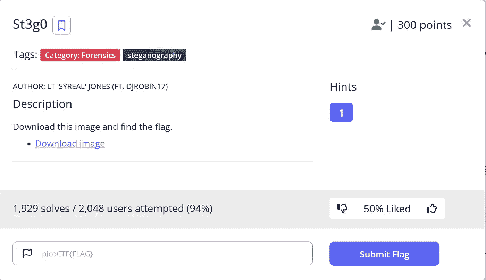

他们给了一个 png 文件下载，当我们打开它，我们可以看到 picoCTF 的标志，但我们需要的旗帜。


所以，让我们进入终端来破解它。

我发现了这个针对 png 文件的隐写工具，它可以帮助我们检测 PNG & BMP、[](https://github.com/zed-0xff/zsteg)**中的隐写数据。**

**当我对图像文件使用这个工具时，我很容易在输出中得到这个标志。**

****

**2. **Bbbbloat(逆向工程)****

**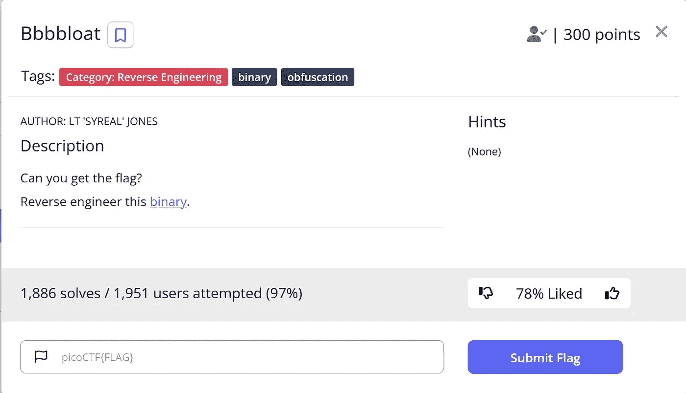**

**我们可以下载二进制文件并检查它。它是一个 64 位的可执行二进制文件。**

**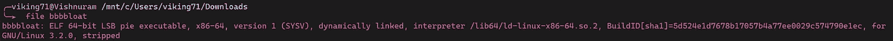**

**所以，让我们在[**GHI DRA**](https://ghidra-sre.org/)(NSA 研究总局开发的软件逆向工程工具套件)中打开这个文件，对其进行反编译，并分析代码。**

**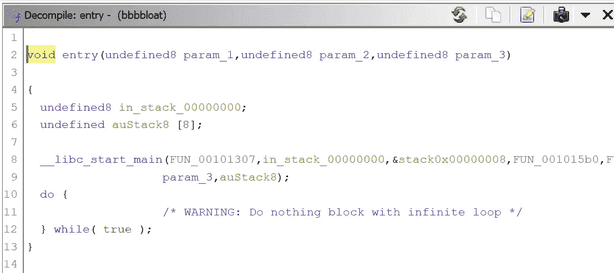**

**当我们检查' entry '函数时，我们可以看到程序是从' FUN_00101307 '函数开始的，所以我们来看一下。**

**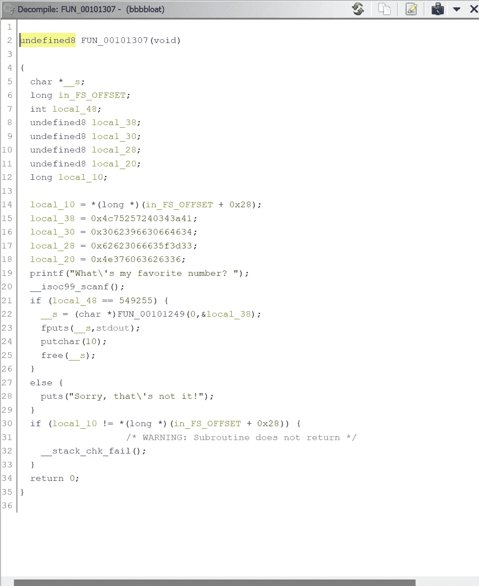**

**所以这个功能是主要功能。当我们看它时，我们可以理解它扫描我们的输入数字并设置一个条件。在我们可以观察到的条件下，输入应该是 549255 数字。试试看。**

**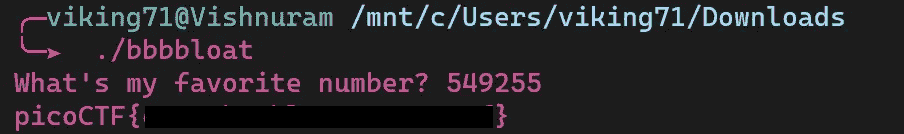**

**很好，我们拿到了旗子，它起作用了。**

**3.**超能力 Cookie(网络利用)****

**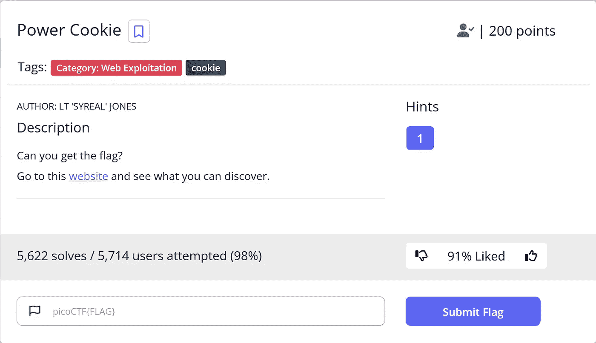**

**在这方面，他们为我们提供了一个网站，并发现了国旗。**

**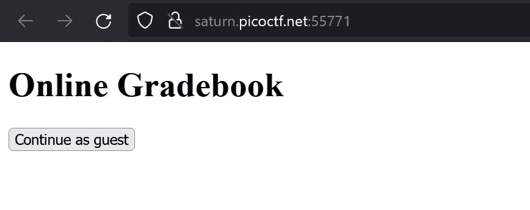**

**因此，当我点击“继续作为客人”，它告诉没有为客人服务。**

**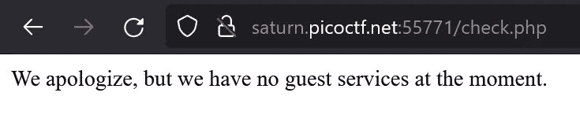**

**所以我检查了修改用户 cookie 的 cookie。但是我发现了一些东西。有一个默认设置为“0”的“isAdmin”头。我使用“[editthiscokie](https://www.google.com/url?sa=t&rct=j&q=&esrc=s&source=web&cd=&cad=rja&uact=8&ved=2ahUKEwjuy-Sf0_32AhVDZN8KHbKIB2AQFnoECBQQAQ&url=https%3A%2F%2Fwww.editthiscookie.com%2F&usg=AOvVaw3Euu7NVrLuhQ9aqiP2Zbsz)”将值更改为“1”，这样我们就将用户设置为 admin。设置并刷新页面以应用更改。**

**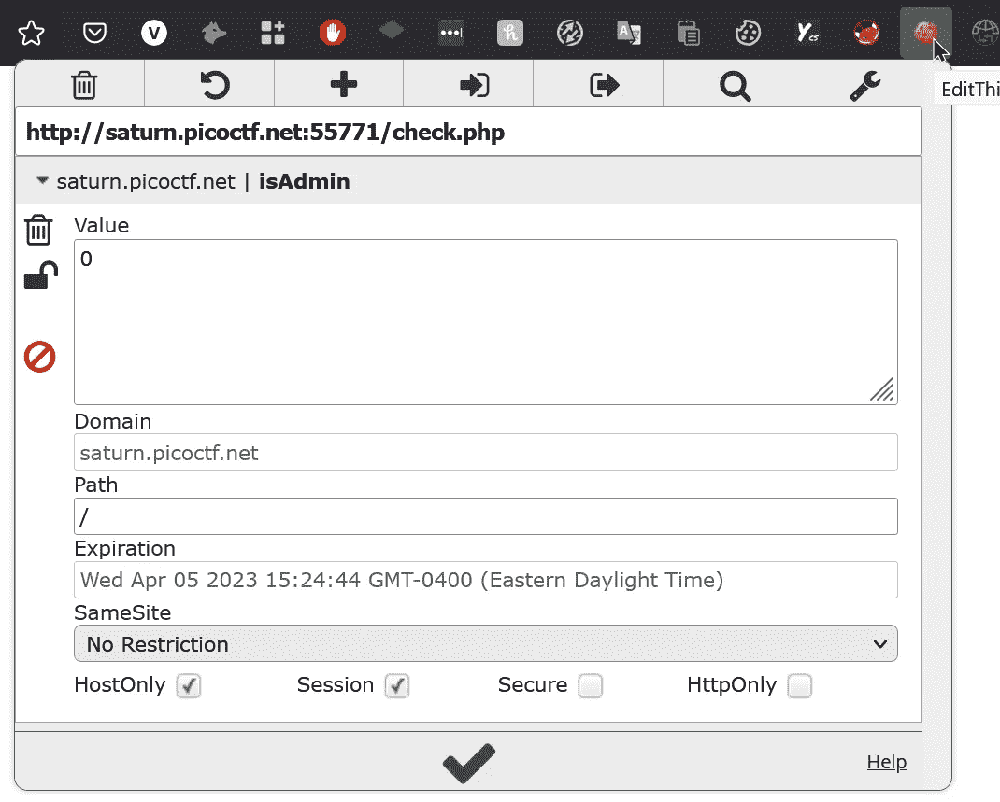**

**太好了，我们拿到旗子了。**

**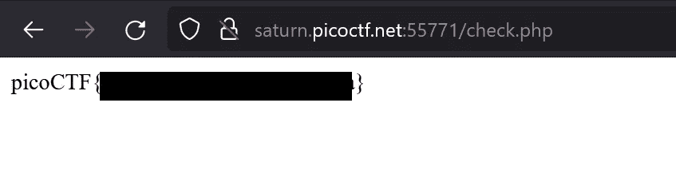**

**4.**新鲜 Java****

**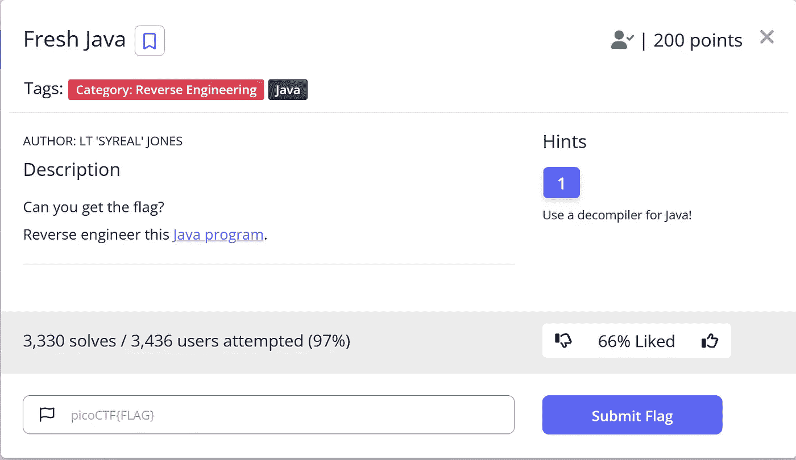**

**他们给了我们一个 java 程序来反编译和反转它。为了反编译它，我使用了在线的[反编译程序](http://www.javadecompilers.com)。我上传了文件。我得到的输出是 java 代码。**

**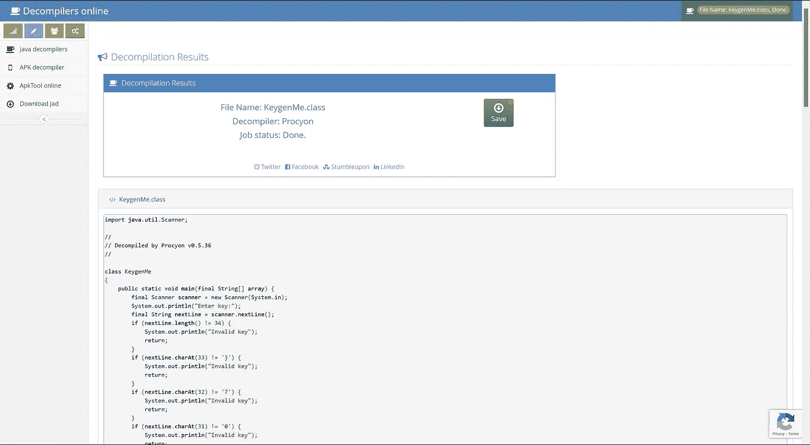**

**如果您检查程序中的 If 条件，我们可以注意到输入字符与程序中的特定字符进行了比较。所以，你必须把所有的字符连接到你的旗帜上。最后一个字符串将是标志，如果你把它提供给有输入的程序，它将返回“ **Valid key** ”。通过这个你可以验证。**

**5.**方石英****

**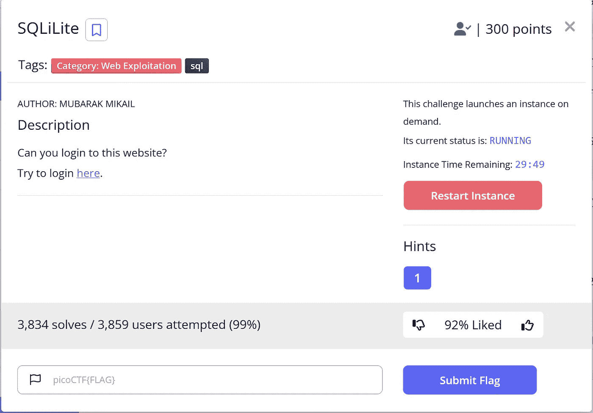**

**我们必须启动一个实例来启动站点。然后点击打开网站，我们可以看到一个登录页面，并在提示中给出的用户是“管理员”。所以，我们来测试一下。**

**用户名:admin**

**密码:admin**

****

```
SELECT * FROM users WHERE name='admin' AND password='admin'
```

**我们给出的输入是输入到 SQL 命令中。因此，我们必须使用 SQL 注入技术来利用这一点。我正在尝试一个普通的 SQli 负载**

```
admin' or 1=1--
```

**基本上，我们传递 SQL 命令条件并设置我们自己的条件。通过这个，我们可以以“管理员”的身份登录。**

**通过添加“—”我们注释了 SQL 命令的剩余部分。“或 1=1”设置为逻辑条件以传递命令。**

**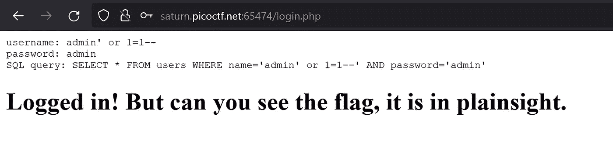**

**现在我们可以看到，我们已经登录，但标志是隐藏的。我检查了页面的源代码。我们拿到旗子了。**

**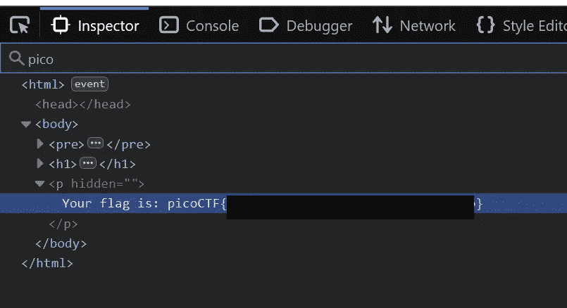**

**6. **SQL Direct****

**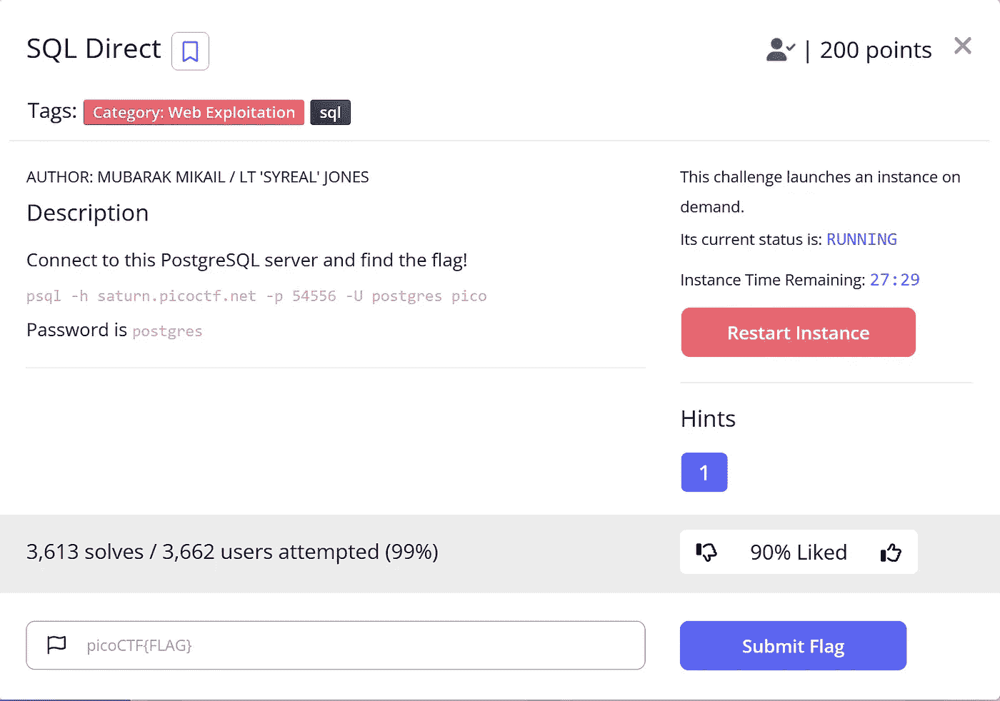**

**与上一个挑战类似，我们启动一个实例进行交互。这次他们给了我们一个 PostgreSQL 命令，用密码连接服务器数据库。**

**稍后我们将得到一个 shell，在这里我们可以执行 SQL 命令来与服务器数据库进行交互。为了显示我们使用的表名**

```
\dt
```

**我们可以看到我们有一个名为 flags 的表，所以我通过**

```
SELECT * FROM flags
```

**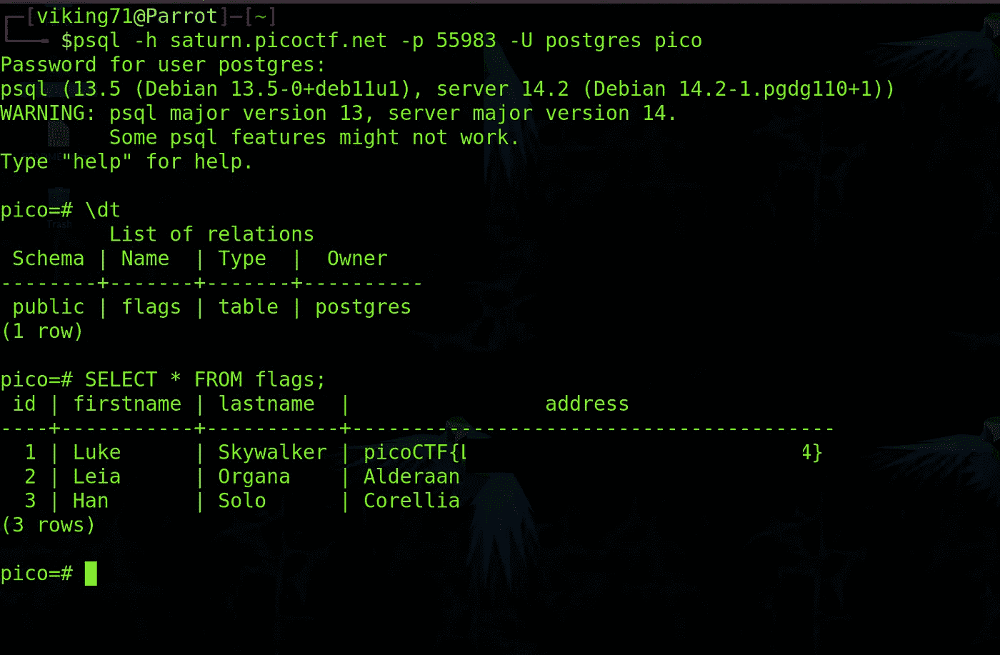**

**最后，我们找到了存储的标志。**

**7.**机器人无****

**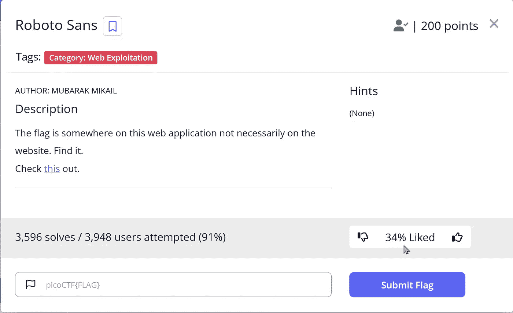**

**打开给出的网站。**

****

**我使用 inspect element 浏览网页，但我找不到旗帜。所以，重读挑战的标题，它给了我搜索该网站“robots.txt”页面的线索。该页面包含网络爬虫不应该爬行的域的细节。**

**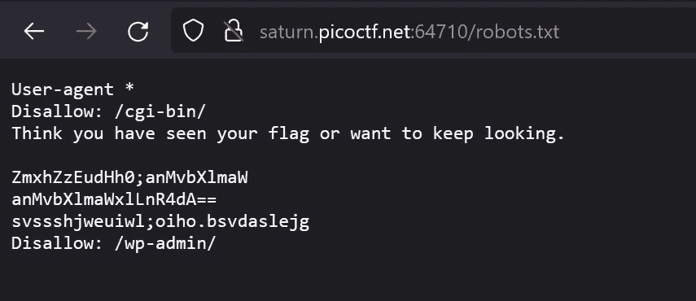**

**我们可以看到/cgi-bin/和/wp-admin/目录不允许爬行。此外，我们可以随机设置一些字符串。特别是我知道第二个字符串是 base64 编码的。因此，我将它传递给 [cyberchef](https://gchq.github.io/CyberChef) 进行解码，这给了我一个域路径，“js/myfile.txt”。**

**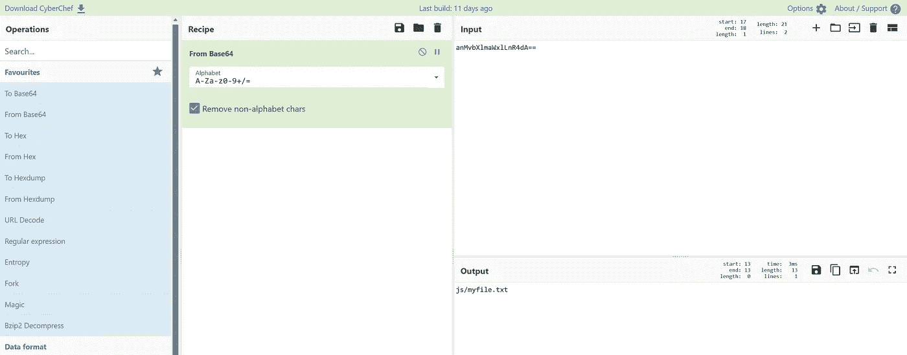**

**本页包含我们的挑战旗帜。**

**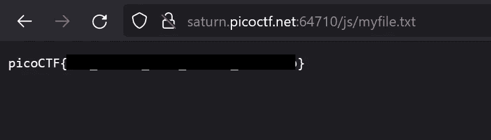**

**8.**搜索源****

**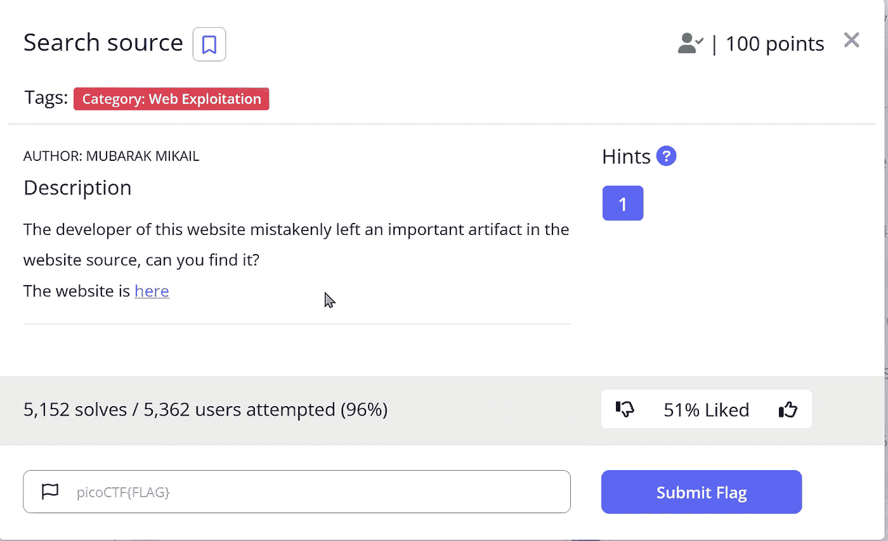**

**打开网站，前往检查控制台。样式编辑器包含所有关于网站的 CSS 文件。一个一个查，就能找到 flag 的明文。**

****

**我会持续更新这篇文章。敬请关注。**

**同时，在这里阅读我的其他文章:**

**网址:[https://vishnuram1999.github.io/](https://vishnuram1999.github.io/)**

**更多其他文章请关注我。**