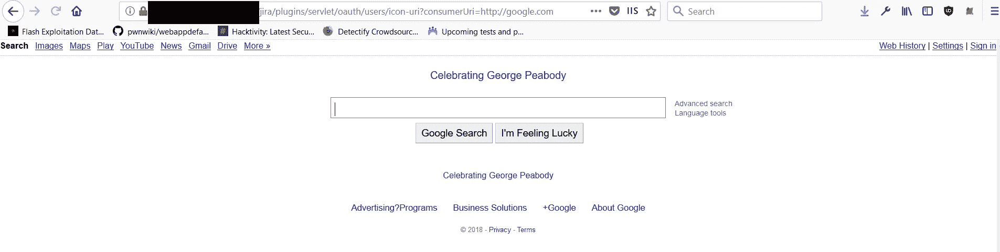
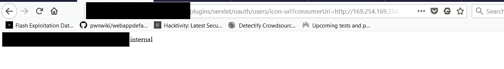
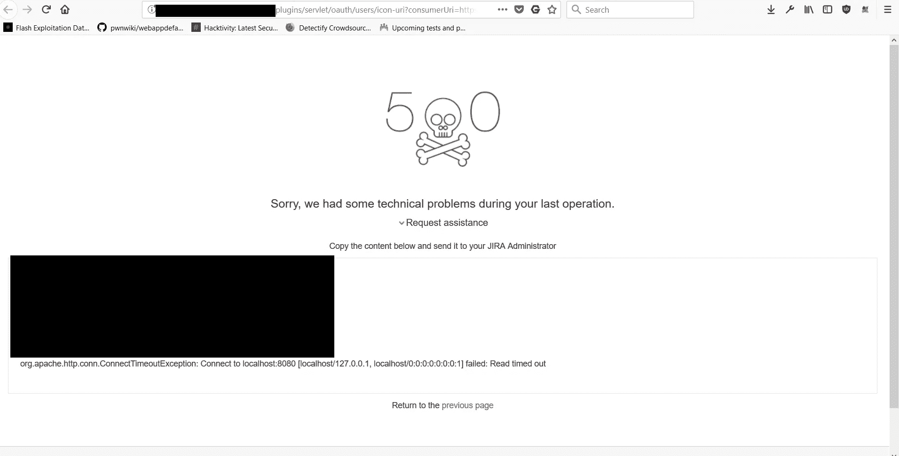
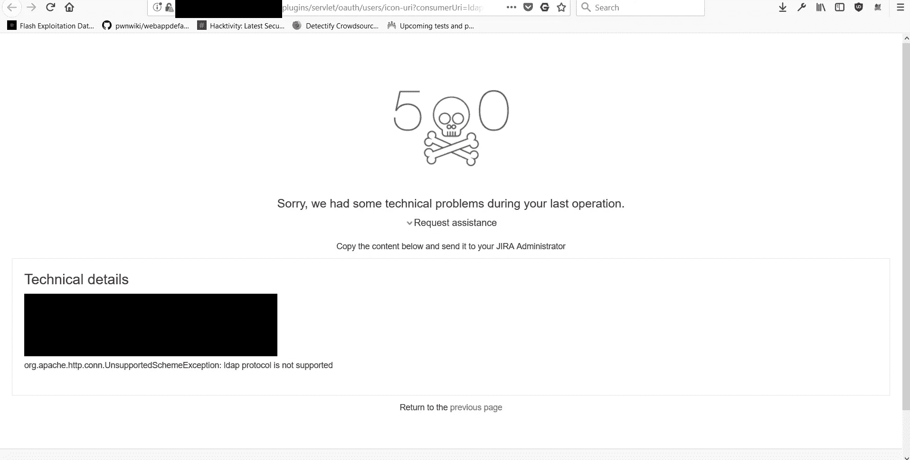
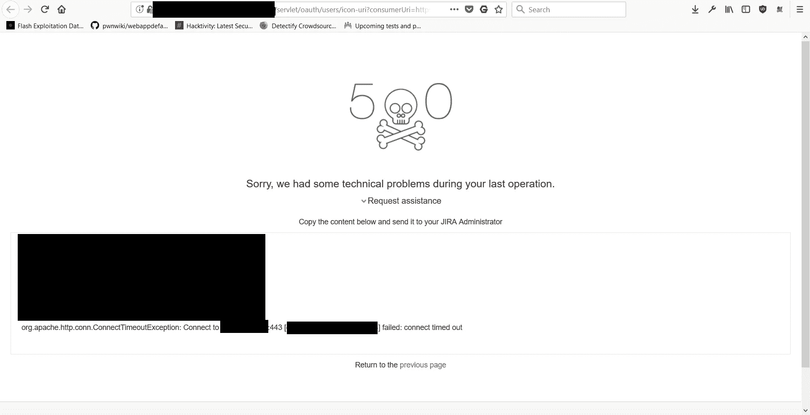
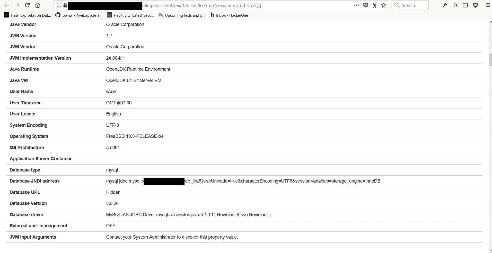

# 穿透面纱:服务器端请求伪造 NIPRNet 访问

> 原文：<https://infosecwriteups.com/piercing-the-veil-server-side-request-forgery-to-niprnet-access-c358fd5e249a?source=collection_archive---------0----------------------->

在我作为国防部漏洞披露的一部分对军事网站进行侦察的过程中，我注意到两个特定的网站正在使用吉拉，这是一个流行的问题跟踪 web 应用程序。我最初写下这些网站，因为当时我不知道有任何利用。

后来，我在查看我的 Twitter feed，注意到一条[推文](https://twitter.com/ankit_anubhav/status/973566620676382721)讨论一个[服务器端请求伪造漏洞](https://www.owasp.org/index.php/Server_Side_Request_Forgery) (SSRF)正在吉拉被积极利用。阅读完这篇文章后，我立即重新访问了我之前发现的两个吉拉实例，看看是否可以使用这种新技术来利用它们。

最初，我通过端点访问 google.com，找到了第一个网站；完整的网址应该是这样的，【https://website.mil/plugins/servlet/oauth/users/icon-uri?】T5
consumer uri = http://Google . com

谷歌被加载向我表明，它仍然是脆弱的！

我从 Brett Buerhaus 的一篇博客文章中了解到，任何 AWS 实例都可以查询一个 ip 并接收与该实例相关的信息，甚至是帐户信息。然后，我通过访问
[http://169 . 254 . 169 . 254/latest/meta-data/local-hostname/](http://169.254.169.254/latest/meta-data/local-hostname/)，通过 [AWS 元数据端点](https://docs.aws.amazon.com/AWSEC2/latest/UserGuide/ec2-instance-metadata.html#instancedata-data-categories)检查本地主机名

我能够看到证明访问云服务器元数据的主机名

在这里，我试图通过访问 http://169 . 254 . 169 . 254/latest/meta-data/iam/security-credential 来获取他们的 AWS 实例的凭证。但是很遗憾，我发现我做不到。在阅读了 AWS 文档后，我开始查询我可以从该端点提取的其他敏感数据，如[http://169 . 254 . 169 . 254/latest/dynamic/instance-identity/document](http://169.254.169.254/latest/dynamic/instance-identity/document)，这些数据显示了私有 IP、帐户 ID、服务器信息等，然后立即进行了报告。

我立即停止了所有的测试，因为我不想违反任何参与规则，并迅速提交了一份关于我的发现的报告。不久后，我收到了分流成员的回复，我开始让他们知道我将尝试升级漏洞，以证明最大的严重性。他们最初将报告标记为中等严重程度的漏洞，但鉴于我目前所能做的，我觉得这是一个关键问题。有了许可，我开始工作，最大限度地旋转和利用端点。

我首先简单地从端口扫描本地主机开始，看看是否有我可以调用的协议。我分别测试了以下端口。

21、(FTP)
22、(SSH)
80、(Web)
443、(SSL Web)
8080、(代理)

让测试这个端点变得非常容易的是，我可以看到发生的各种错误，这可以帮助我探测他们的服务器和网络。这被认为是基于误差的 SSRF。

查询本地主机的结果:8080

接下来，我继续检查不同的协议以涵盖我的所有基础，gopher://(文件分发)
dict://(字典网络协议)
ftp:// (文件传输协议)
File://(文件 URI 方案)
ldap://(轻量级目录访问协议 *)*
尽管这些都没有产生任何结果，因为它们不支持我尝试的任何协议。

不支持 LDAP

在为报告记录了所有这些信息后，我想起了研究员 James Kettle 的一个名为“[破解镜头:瞄准 HTTP 的隐藏攻击面](http://blog.portswigger.net/2017/07/cracking-lens-targeting-https-hidden.html)的演示，其中提到能够访问国防部内部网或隐藏的内部服务，只有通过国防部 IP 才能访问或来自国防部服务。在视频演示中，他展示了两个这样的网站，如果攻击者的 IP 来自国防部，就可以访问这两个网站。

在谷歌搜索了他提到的那篇文章后，我很容易就找到了，于是我开始查询这两个网站，看看它们的结果。结果非常清楚。访问这些内部网站。我查询的第一个网站显示 USG 警告，而另一个网站只是超时。在这个测试过程中，我还发现了其他 intranet web 服务。通过这个，我能够访问 [NIPRnet](https://en.wikipedia.org/wiki/NIPRNet) ，这是一个非机密的内部协议网络，用于处理过于敏感的信息，以至于不能面向互联网，并被确认访问过它。由于这些内部服务或网站的敏感性，我不会公开这些服务或网站。

这个内部网站最终超时，但其他领域的连接和显示给我。

美国政府警告所有敏感信息完全编辑。

我发现的第二个吉拉网站出人意料地难以利用。它没有给出像我上面讨论和展示的那种冗长的错误。我最终发现，我可以根据响应时间来评估内部是否存在某些端口。

例如:查询端口 22 导致 1000 毫秒的响应时间。其中 as 查询端口 21 导致 10，000 毫秒的响应时间。此外，由于缺乏详细的错误，我无法找出任何支持的协议，尽管我最终专注于本文的关键点，即访问 NIPRnet。我还使用 burp collaborator 来查看当它从我控制的服务器请求数据时，泄露了什么类型的信息。

我从请求标头中注意到，它们泄漏了敏感信息，包括泄漏内部 IP 的“X-Forwarded-For”标头。我最后查询了所有与我的“Burp Collaborator”服务器链接交互的 IP，看看是否有什么奇怪的事情发生。然而，除了超时错误之外，什么也没有做。在这一点上，我还发现我无法在这个端点上查询 AWS 元数据，尽管我可以像在第一个网站上一样查询内部网 IP 和国防部服务器。

在报告了我的发现后，两份报告的严重性都提高到了危急。后来，我重新访问了我之前发现并在今年早些时候报告的两个低严重性 SSRF 漏洞，希望通过我在之前的研究中发现的信息来提高严重性。

这两个漏洞通过滥用 HTTP connect 请求来查询特定的 IP 地址，从而利用了 web 应用程序过滤器。这个请求非常简单，我们提交了*连接 IP* ，然后我们可以通过这个方法*枚举服务。*我们还可能滥用主机头对内部 ip 或外部 IP 执行认证请求，例如:*military website . mil @ internal _ IP。*在重新访问它们时，我发现我可以通过查询内部 IP 或服务来执行盲目的服务器端请求伪造，这导致页面告诉我操作超时、SSL 错误或其某种变体。事件发生后，报告的严重性被提高到中等。

# 关于开发阿尔塔西 SSRF 的其他提示

在我研究这些漏洞并使用它们发现 bug bounty 目标的过程中，我发现在漏洞利用的某些情况下，会发生堆栈错误并泄露各种敏感信息。我还没有真正找到为什么在某些情况下会发生而在其他情况下不会发生的原因。您通常可以使用不完整的 HTTP 协议来触发它，比如 http://或者我最初是如何使用， [http://[::]来发现它的。](/[::].)泄露的信息包括数据库 IP、数据库版本、正在使用的插件、操作系统、操作系统的架构等。

泄漏敏感内部信息的堆栈跟踪错误

当您获得这个详细的堆栈跟踪时，您仍然可以利用该网站。我还注意到，有时网站会有链接到其他 Altassian 实例，这是我在测试一个资产时了解到的。他们在不同的子域上有一个 confluence 实例，我发现这是由于一个下拉菜单列出了他们使用的其他实例，这也容易受到漏洞的攻击。

# TL；速度三角形定位法(dead reckoning)

两个过时的吉拉实例容易受到服务器端请求伪造(SSRF)漏洞的攻击，这种攻击被利用，并转入对国防部内部服务和网络的访问。

我们还发现，另一个被利用的网站允许攻击者查看敏感的 AWS 元数据服务的内容，这可能会泄露帐户 ID、私有 IP 和其他与服务器和相关帐户相关的私有配置信息等信息。

攻击者可以利用这两个易受攻击的网站来访问内部可访问的国防部实例。这可能导致敏感数据受损，并可能中断关键任务资产。

国防部的漏洞披露计划范围广泛，并愿意与研究人员合作保护他们的资产。在与此类似的文章中，我讨论了我在国防部发现的常见问题和独特漏洞，你可以在这里找到。

你可以在下面找到披露的报告

【https://hackerone.com/reports/330860
[https://hackerone.com/reports/326043](https://hackerone.com/reports/326043)

# 附录

在撰写本文的过程中，我偶然发现了另一个运行易受攻击的 confluence 实例的国防部网站，其利用方法与前一个完全相同，因此我不会深入讨论这个网站。它的严重性与前两个漏洞报告相同。此外，我被要求暂时把这篇文章记下来，直到这篇文章得到适当的授权并公之于众。随着我的报告被披露，我现在可以发表这些文章了。