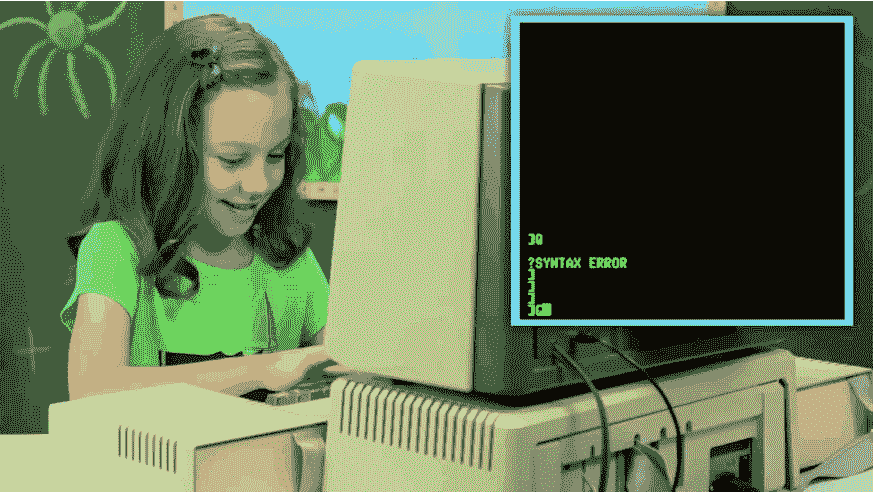

# 给我的 Shell 拉皮条——升级 Netcat Shell 的 5 种方法

> 原文：<https://infosecwriteups.com/pimp-my-shell-5-ways-to-upgrade-a-netcat-shell-ecd551a180d2?source=collection_archive---------0----------------------->



斗争是真实的

每当我用 [netcat](http://sectools.org/tool/netcat/) 捕捉到一个反向 shell 时，尽管我最初很兴奋，但当我想起这些 shell 往往有多么可怕的局限性时，我的热情很快就消失了。因此，我决定编译一个有用的命令列表，让这些 shells 更加可用。希望在阅读完本文后，您能够像 ssh 连接一样轻松地在反向 shells 中导航。

# 1.用 Python 繁殖 TTY

这可能是您对 netcat shell 所能做出的最大改进。PTY 是一个伪终端功能库，是标准 Python 库的一部分。如果远程系统安装了 python，那么您在一行代码中就得到了一个伪终端:

```
python -c ‘import pty;pty.spawn(“/bin/bash”)’
```

与运行`bash -i`不同，PTY 让您能够运行像`su`这样的命令来登录其他本地帐户，或者运行`ssh`来登录其他主机。

Pelebus 为生成交互式 bash 进程的其他方法列出了一个很棒的一行程序列表。然而，其中一些方法可能无法整合我们将在后续步骤中添加的一些功能。

# 2.带 STTY 的制表符结束

每当我试图键入长文件路径或避免键入错误的文件名时，这是一个很好的功能，但我却错过了。然而，这涉及到几个步骤，我通常最终不得不翻遍笔记来找到它们。

如果您还没有伪终端功能，这可能会有点混乱。如果您无法执行第 1 步中的 python 命令，请自担风险。

首先，键入以下命令作为 netcat shell 的背景:

```
Ctrl+z
```

这会显得你好像失去了你的外壳。放心吧！我们会拿回来的。接下来，在本地 shell 中键入:

```
stty raw -echo
```

最后，通过键入以下命令在前台显示 netcat shell:

```
fg + [Enter x 2]
```

这应该会返回带有制表符自动完成的 shell！

# 3.保持清洁；清空屏幕

有时候，能够从头开始工作并清除终端中的所有杂物是件好事。要在 netcat shell 中做到这一点，我们必须运行两个命令。

在本地计算机的 shell 中，键入:

```
echo $TERM
```

您应该得到一些输出作为响应。根据您的系统设置，此输出可能会有所不同(`screen`、`xterm`等)。在 Kali Linux 上默认情况下，`$TERM`被设置为`screen`。

在 netcat shell 类型中:

```
export TERM=screen
```

现在你可以清空你的屏幕了！

## 重新初始化终端(可选)

回到 netcat shell，我们可以通过键入以下命令来重新初始化终端:

```
reset
```

您应该得到一个提示，询问您`"Terminal Type?"`这是您输入`echo $TERM`命令输出的地方。

# 4.历史课

我们当中有谁没有轻微地输入了一个很长的命令，并希望您可以通过按下向上箭头来返回该命令？现在你可以了！

```
export SHELL=bash
```

就是这样！

# 5.宽屏幕

有时，当您在默认的 netcat shell 中键入一个很长的单行程序时，您用完了该行的空间，文本开始换行并覆盖自身。太可怕了。我们不需要那个。

要查看本地计算机的大小，请键入:

```
stty size
```

这将返回两个数字(行、列)。

要使 netcat 终端更大(比如说 100 x 100)，设置 rows 和 cols 变量，如下所示:

```
stty rows 100 cols 100
```

# 额外资源

如果您对向 netcat shells 添加功能的其他方法感兴趣，或者只是想深入了解这个主题，下面是一些我认为有用的资源:

*   https://netsec.ws/?p=337
*   [http://pentest monkey . net/blog/post-exploration-without-a-tty](http://pentestmonkey.net/blog/post-exploitation-without-a-tty)
*   [https://blog . ROP nop . com/upgrading-simple-shell-to-full-interactive-ttys/](https://blog.ropnop.com/upgrading-simple-shells-to-fully-interactive-ttys/)