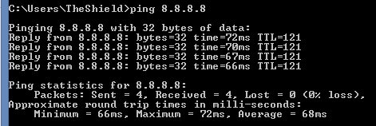
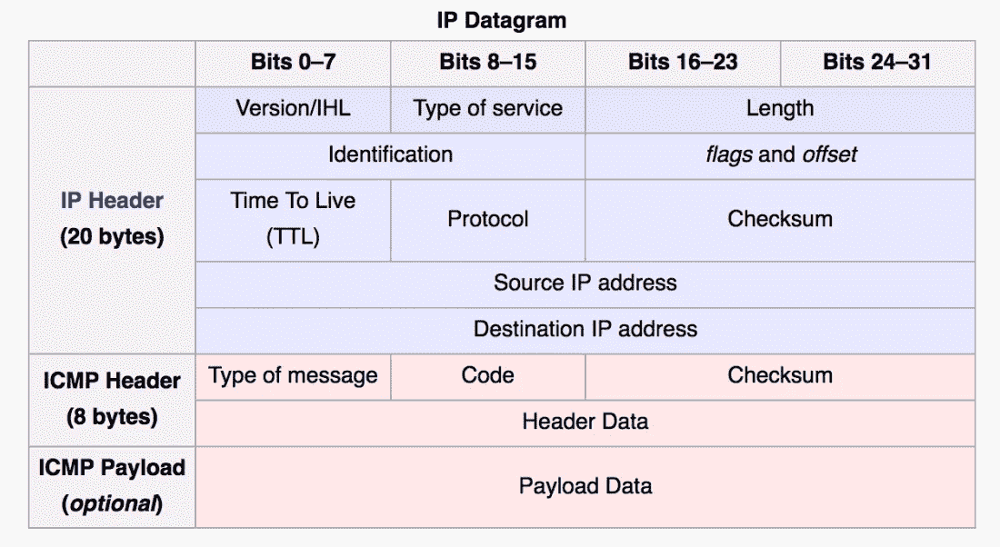
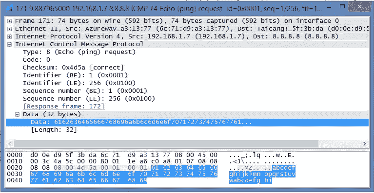
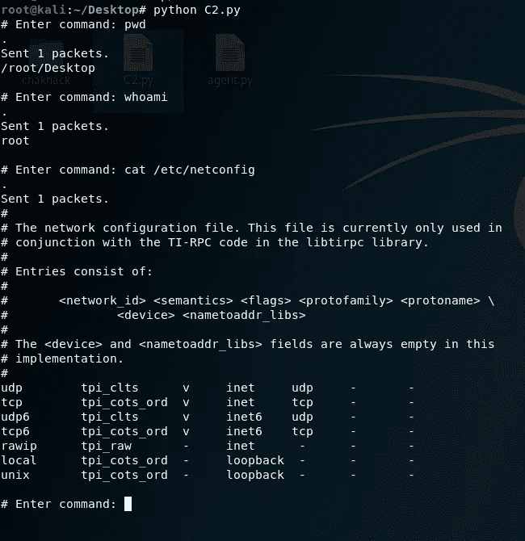
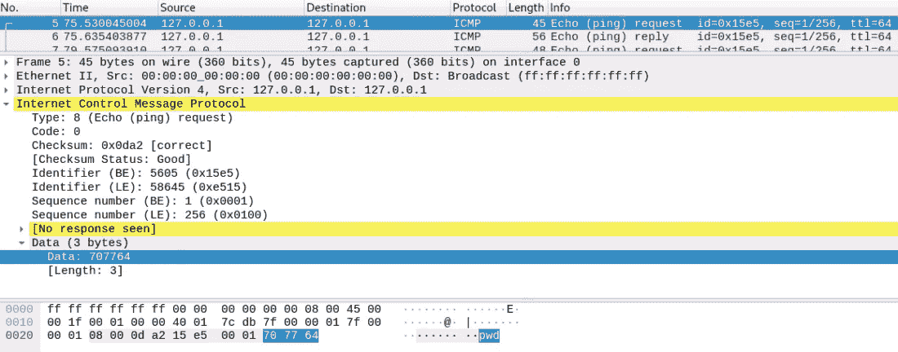
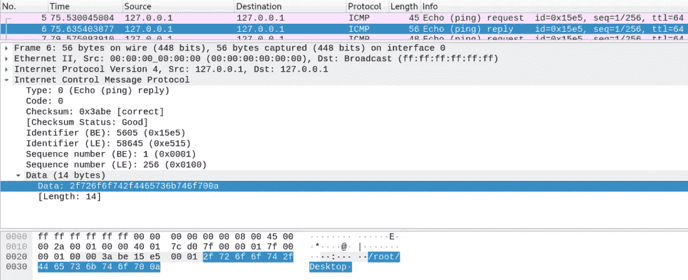
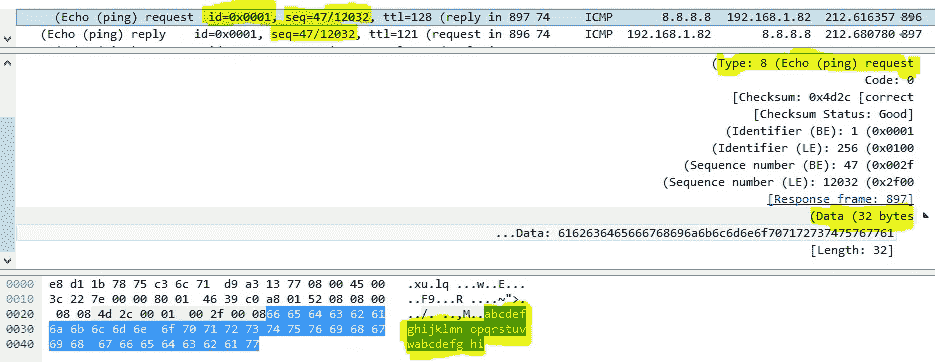

# Ping 电源— ICMP 隧道

> 原文：<https://infosecwriteups.com/ping-power-icmp-tunnel-31e2abb2aaea?source=collection_archive---------0----------------------->

攻击者在其活动中经常需要面对许多挑战。
其中两项挑战包括

1.  克服网络障碍(网络策略、分段等。).
2.  在“隐形模式”下执行不同的操作，这样他就不会被抓到。

应对这些挑战的一个好方法是，当试图创建一个可以跨越网络中不同障碍的秘密连接时，使用 **ICMP 隧道**。

在计算机网络中，**隧道**一般是将一个网络协议封装成另一个网络协议的有效载荷。[阅读更多](https://en.m.wikipedia.org/wiki/Tunneling_protocol)

**ICMP** (互联网控制消息协议)是互联网协议簇中的支持协议。网络设备使用它来发送错误消息和操作信息。最广为人知也可能是最常用的 ICMP 消息是 [Ping](https://en.wikipedia.org/wiki/Ping_(networking_utility)) 消息。

**Ping** 是控制消息，是 ICMP(互联网控制消息协议)的一部分。

Ping 从网络中的一个节点发送到另一个节点。它由第 2 层和第 3 层报头(由 OSI 模块定义的 MAC 和 IP 报头)和一个特殊的 ICMP 数据包构成。发送节点将设置目的地参数，如果目的地收到消息，它将立即返回消息

这是 ping 数据包的 IP 数据报

**ICMP 隧道**可以通过改变有效载荷数据来实现，因此它将包含我们想要发送的数据。

通常，它包含一个默认的有效负载数据，比如这个 ASCII 字符串——“abcdefghijklmnopqrstuvwabcdefghi”

Wireshark — ICMP 数据包，有效负载数据

如果我们在有效载荷数据里面封装一个 HTTP 包，我们会得到这种方法最常见的方式——溜出一个付费 WiFi。

这可以通过使用代理服务器来实现，该代理服务器等待 ping 消息并根据需要发送它们(例如，作为 HTTP)。

1.  使用正确的工具(例如 [ptunnel](http://www.mit.edu/afs.new/sipb/user/golem/tmp/ptunnel-0.61.orig/web/) )，将您想要发送给 Google 的 HTTP 数据包封装到 Ping 数据包中(在有效负载数据中)。然后将其发送到作为目的地的代理服务器 IP 地址。

*   注意—此 IP 不是 HTTP 数据包的目的地(HTTP 数据包的 IP 目的地将是[www.google.com](http://www.google.com)的 IP)

1.  因为机场路由器通常允许 ICMP 流量流出网络，所以路由器会将 Ping 报文传送到代理服务器。
2.  代理服务器接收 Ping 数据包，将其分成两部分——

*   ICMP 标头。
*   包含原始 HTTP 消息的有效负载。
*   注意——代理发送给 Google 的 HTTP 数据包的源 IP 应该是代理服务器本身的 IP，而不是您笔记本电脑(或机场路由器)的 IP，因为 Google 应该回复给代理，而不是您。

这可能是 ICMP 隧道最常见的用法，但是作为一名 Red Teamer，我确实发现它作为一种逃避防火墙和其他网络策略的“隐蔽”方法非常有用。

所有这些都是可能的，因为 ping 报文被允许从“付费 WiFi”局域网通过路由器到达互联网。
为什么有人会允许这种情况发生？

作为一名前网络工程师，我可以告诉你，当试图理解和解决甚至是最复杂的问题时， **ping 有很大的力量**。
大多数故障排除流程都是从测试信息是否从一点传递到另一点开始的。问——这条信息路线到底有没有可能？网络组件是否处于活动状态并能够做出响应？

Ping 消息可以用最简单的方式回答这些问题和许多其他问题。

这些故障排除过程每天都会发生。这意味着网络配置必须允许 ping 消息在网络上从一个节点传输到另一个节点。每个防火墙策略、路由器策略和交换机 ACL(访问列表)都必须允许 ICMP 消息从几乎任何网络组件流向任何其他组件。
这就是为什么 **ping 报文很可能较少受到网络分段和策略的影响**。

了解这一点后，在我看来，为了在网络中创建连接，当您需要通过分段和网络策略等障碍时，代理使用 ICMP 隧道连接 C&C 服务器是一个好主意。

我用 python 写了一个简单的 POC(概念证明)来演示它是如何工作的。

> *注意:*
> 
> *–此 POC 要求您安装*[*Scapy*](https://scapy.net/download/)*(无论如何，这是一个了解* *的伟大工具)*
> 
> *–本概念验证不涉及碎片处理。例如，如果来自代理的回答大于允许的有效载荷数据大小，则会出现碎片。*

此 POC 将涉及一台 C&C 服务器和一个代理。其中 C2 服务器将通过 ICMP 隧道发送代理命令，代理也将通过 ICMP 隧道返回结果。

# C2.py

# Agent.py

使用它会看起来像这样——

使用 Wireshark 查看到底发生了什么总是一个好主意

C2 残疾人司令部

代理— pwd 结果

如您所见，有两条 ICMP 消息，一条是命令，一条是结果。

# D.辩护观点

重要的是从防御的角度来看，并思考我们在构建这种工具时应该考虑什么。

最重要的是要记住，网络安全工具并不以防火墙白名单政策开始和结束。今天的大多数防御工具将包括某种异常检测功能。

首先描述相关主题的常见行为，这是一个绘制出一些有趣异常的好方法。

谈到常规网络中的 ping 报文，我们可以假设以下特征

1.  大多数 ping 消息将以默认方式发送——一次 4 个 ping。
2.  ping 消息来自类型 8(回应 ping 请求), ping 应答来自类型 0(回应 Ping 回复)
3.  每个 ping 数据包都会发送一些字段(使用 Windows 8.1)–

*   *id* = 0x0001
*   重放的*序列*将等于请求的*序列*
*   *有效载荷数据*将保持其默认大小(32 字节)和内容——“abcdefghijklmnopqrstuvwabcdefghi”

了解以上所有内容后，您必须考虑-

1.  构建 C&C 和代理时，要确保每 1 分钟一批中的 ping 消息不超过 4 条(例如)。如果您需要传输的数据需要 15 条 ping 消息，则需要 3 分钟才能通过。这可能会很慢，但如果有人或有东西正在观察这种异常现象，这将是值得的。
2.  **确保** **ping 请求和回复逻辑正确**。例如，如果您发送的每条 ping 消息都是 0 类型的，那么在没有 ping 请求的情况下看到大量 ping 回复就很奇怪了。
3.  尽量和你周围的环境相似。做你的研究。当然，您可以保持这些字段的可配置性，并随时进行更改。
4.  请注意，**有效载荷数据大小**将影响第一部分(每个数据大小的 ping 消息数量)，并且**是一个元数据信息**。
5.  **有效载荷数据内容** —我们来谈谈 DPI……

**DPI —深度数据包检测**

传统数据包检测读取数据包的元数据(主要是报头)，**深度数据包检测实时读取正在通过的数据包的内容**。基本上，它会查看有效载荷，并尝试了解它看起来是否正确。

在我们的例子中，使用协议异常功能的 DPI 工具可以通过查看有效负载来发现 ICMP 隧道，并发现它与它应该的不同。

在这种情况下，它不会帮助我们改变所有其他参数。

那么——我们为什么还要为 ICMP 隧道费心呢？

因为–

1.  DPI 不是一个微不足道的功能，您可能会遇到许多没有此功能的网络。
2.  大多数 DPI 工具依赖于签名数据库，如果没有与 ICMP 消息相关的签名，它将无法检测 ICMP 隧道。
3.  即使数据库中有相关的签名，操作员也应首先将其配置为活动模式。

*   为什么他没有激活它？
*   每个签名检查都占用处理资源(主要是 CPU 和时间)，因此**可能会降低网络速度**。
*   网络检查可以包括具有不同有效载荷大小的不同类型的 ping 消息(例如**ping-l 1234 8.8.8.8**，将发送包含大小为 1234[字节]的有效载荷数据的 ping 消息，以解决涉及 MTU 功能的问题。**激活这种签名会引起很多假阳性警报，从而惹恼监测小组，降低签名的可靠性。**

# 总和+= 1337

ICMP 隧道是一种“在雷达下”进行通信的优秀工具。虽然有时它会不太有效，但取决于网络上现有的防御措施，很多时候您会发现这是一种克服某些限制的简单而方便的方法。

最重要的是，这是一个值得了解的概念。如果你掌握了诀窍，你可以根据需要开发许多不同的解决方案，例如——DNS 隧道、SSH 隧道等等…