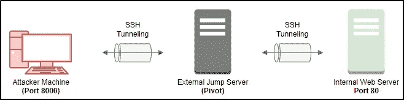
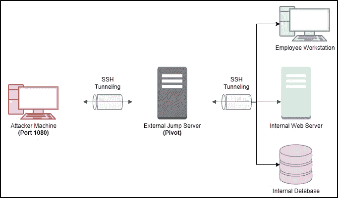
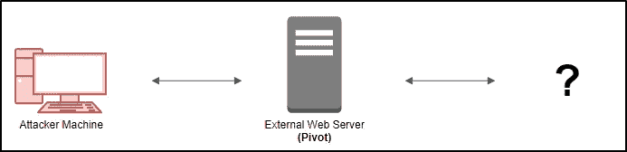
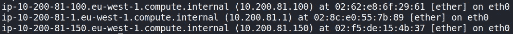
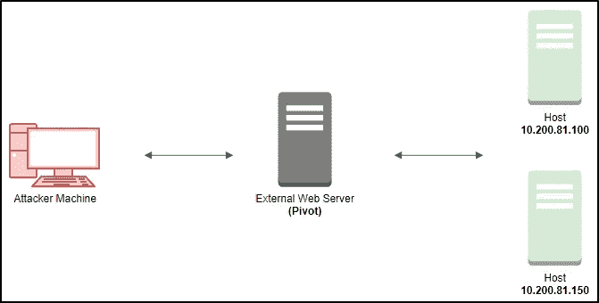
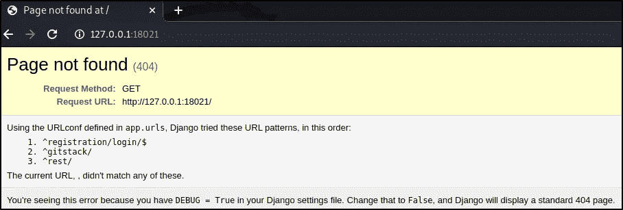
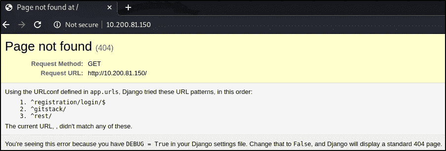

# 花环的旋转技巧

> 原文：<https://infosecwriteups.com/pivoting-techniques-with-thm-wreath-95fecba1b580?source=collection_archive---------0----------------------->


在本文中，我将介绍一些基本的旋转方法，这些方法可以用来访问我们通常无法通过被入侵的计算机访问的网络。为了演示这些旋转技巧，我将使用由用户 [MuirlandOracle](https://tryhackme.com/p/MuirlandOracle) 创建的 [TryHackMe](https://tryhackme.com/room/wreath) 花环网络。旋转是一个很大的主题，这篇文章将只涵盖基本原理，所以说，让我们深入！

# 什么是旋转？

[旋转](https://pentest.blog/explore-hidden-networks-with-double-pivoting/)指的是使用一台被入侵的机器在网络内移动并攻击其他无法访问的系统的技术。这是通过使用各种不同的工具将流量路由通过被入侵的机器来实现的。当讨论旋转时，您会碰到端口转发和隧道/代理这两个术语。

[**端口转发**](https://tryhackme.com/room/wreath) 通过被入侵的主机在本地端口和目标上的单个端口之间创建连接。端口转发往往比代理更快、更可靠，但只允许我们访问单个目标设备上的单个端口(或小范围)。在下面的例子中，SSH 被用于通过跳转服务器传输流量，允许我们通过导航到我们自己的攻击机器上的端口 8000 来访问端口 80 处的内部 web 服务器上的网站。



SSH 端口转发示例。

[**隧道/代理**](https://tryhackme.com/room/wreath) 通过被入侵的机器创建代理类型的连接，以便将所有期望的流量路由到目标网络。这也有可能在另一个协议(例如 SSH 隧道)中通过隧道传输，这对于避开基本的入侵检测系统(IDS)或防火墙很有用。如果我们希望将大量不同类型的流量重定向到我们的目标网络，例如，通过 NMAP 扫描，或者访问多台不同机器上的多个端口，代理是很好的选择。



SSH 隧道示例。

# 旋转枚举

在这个场景中，我们已经入侵了一个面向外部的 Linux web 服务器，并获得了 root 访问权限。虽然提供了环形网络布局，但这些信息最初可能并不总是对我们可用。假设我们不知道网络布局，下图显示了我们目前对花环网络的了解。



环网的最新知识。

为了执行我们的旋转，我们首先需要识别我们可能潜在的目标的任何内部机器或内部网络。为了实现这一点，我们可以从我们的攻击机器上传一个静态的 NMAP 二进制文件到 web 服务器，正如挑战所建议的那样。如果我们不能做到这一点，我们可以检查本地材料，如 ARP 缓存。

```
arp -a
```



ARP 缓存显示目标最近与之交互的主机的 IP 地址。

我可以看到三个 IP 地址，用于识别网络的网络地址(即 10.200.81.1)和两个主机地址(即 10.200.81.100 和 10.200.81.150)。这让我们对环网布局有了更好的了解。



具有两个新识别的宿主的环网。

在两台主机上执行 NMAP 扫描，我可以看到主机 **10.200.81.150 上的以下端口是打开的。**

```
PORT      STATE SERVICE       REASON
80/tcp    open  http          syn-ack ttl 128
135/tcp   open  epmap         syn-ack ttl 128
139/tcp   open  netbios-ssn   syn-ack ttl 128
445/tcp   open  microsoft-ds  syn-ack ttl 128
3389/tcp  open  ms-wbt-server syn-ack ttl 128
5357/tcp  open  wsdapi        syn-ack ttl 128
5985/tcp  open  wsman         syn-ack ttl 128
```

端口 3389(通常为 RDP 保留)和 5985 (WRM / WinRM)打开表明这很可能是一台 Windows 机器。从这里，我们终于可以开始考虑使用什么样的旋转技术来访问 Windows 主机上的服务了😃！


[来源](https://www.pinterest.ie/pin/487162884662300442/)

# SSH 端口转发/代理

**SSH 端口转发**包括创建一个转发(或“本地”)SSH 隧道，当我们拥有对目标的 SSH 访问权限时，可以从我们的攻击机器上完成。在这个场景中，我们在受损的 Linux web 服务器上有一个用户 root 的 SSH 密钥。通过导航到我们自己的攻击机器上的端口 18021，可以使用下面的命令访问 10.200.81.150(通过 10.200.81.200)上的网站。

```
**ssh -L 18021:10.200.81.150:80 root@10.200.81.200 -i id_rsa** 
[root@prod-serv ~]#
```

现在我们可以通过访问 **localhost:18021** 导航到该网页。



通过 10.200.81.150 访问端口 80 上托管的网页。

**SSH 代理**也可以使用 **-D** 开关进行，例如:`-D 1080`。这将打开攻击机器上的端口 1080，作为代理向受保护的网络发送数据。这在与 **proxychains** 等工具结合使用时非常有用。端口 1080 的选择完全是任意的——重要的是该端口可用，并且在 proxychains(或等效的)配置文件中正确设置。设置此代理将允许我们将所有流量路由到目标网络。该命令的一个示例是:

```
**ssh -D 1080 root@10.200.81.200 -i id_rsa** 
[root@prod-serv ~]#
```

然后，我们使用工具，如 NMAP 与 proxychains，来收集更多关于目标的信息:

```
**proxychains nmap -v -sV -sC -p 80 10.200.81.150**PORT   STATE SERVICE VERSION
80/tcp open  http    Apache httpd 2.2.22 ((Win32) mod_ssl/2.2.22 OpenSSL/0.9.8u mod_wsgi/3.3 Python/2.7.2 PHP/5.4.3)
|_http-server-header: Apache/2.2.22 (Win32) mod_ssl/2.2.22 OpenSSL/0.9.8u mod_wsgi/3.3 Python/2.7.2 PHP/5.4.3
|_http-title: Page not found at /
```

# 舒特尔

[Sshuttle](https://github.com/sshuttle/sshuttle) 使用一个 SSH 连接来创建一个隧道代理，其行为就像一个新的接口。简而言之，它模拟了一个 VPN，允许我们通过代理路由我们的流量，而不需要使用代理链(或等效物)。我们可以直接连接到目标网络中的设备，就像我们通常连接到联网设备一样。因为它通过 SSH(安全外壳)创建了一个隧道，所以我们通过隧道发送的任何东西都是加密的，这是一个很好的好处。我们完全在攻击机器上使用 sshuttle，就像 SSH 进入远程服务器一样。

**注意:sshuttle 仅适用于 Linux 目标。它还需要通过 SSH 访问被入侵的服务器，并且还需要在服务器上安装 Python。**

不幸的是，sshuttle 目前似乎没有一种简写方式来指定用于向服务器进行身份验证的私钥。也就是说，我们可以使用`--ssh-cmd`开关轻松绕过这个限制。使用基于密钥的身份验证时，最终的命令如下所示:

```
**sshuttle -r root@10.200.81.200 --ssh-cmd "ssh -i id_rsa" 10.200.81.0/24**[local sudo] Password: 
c : Connected to server.
Failed to flush caches: Unit dbus-org.freedesktop.resolve1.service not found.
fw: Received non-zero return code 1 when flushing DNS resolver cache.
```

我们现在可以使用命令，例如 NMAP，就像正常情况下没有代理链一样:

```
**nmap -v -sV -sC -p 80 10.200.81.150**PORT   STATE SERVICE VERSION
80/tcp open  http    Apache httpd 2.2.22 ((Win32) mod_ssl/2.2.22 OpenSSL/0.9.8u mod_wsgi/3.3 Python/2.7.2 PHP/5.4.3)
|_http-server-header: Apache/2.2.22 (Win32) mod_ssl/2.2.22 OpenSSL/0.9.8u mod_wsgi/3.3 Python/2.7.2 PHP/5.4.3
|_http-title: Page not found at /
```

我们也可以像平常一样访问网页，无需通过其他端口。



使用 sshuttle 访问 10.200.81.150 端口 80 上托管的网页。

# 凿子

前两种转换技术依赖于我们对作为转换点的受损主机的 SSH 访问。 [Chisel](https://github.com/jpillora/chisel) 是一款工具，无论您是否拥有 SSH 访问权限，它都可以用来快速、轻松地通过受损系统建立隧道代理或端口转发。不利的一面是，您必须在攻击机器和受损服务器上都有 chisel 二进制文件的适当副本。chisel 二进制有两种模式:**客户端**和**服务器**。

要创建一个反向 socks 代理，它从一个受损的服务器连接到一个在攻击机器上等待的监听器，我们可以执行以下步骤:

在我们自己的攻击机器上，在我们选择的端口上设置一个监听器:

```
./chisel server -p 30000 --reverse
```

在受损主机(即外部 web 服务器)上，我们将使用以下命令连接回我们攻击机器上的等待监听器，完成代理:

```
./chisel client 10.10.101.50:30000 R:1080:socks
```

这将创建一个反向代理，并在我们的机器上打开端口 1080。现在我们可以修改我们的`proxychains.conf`文件来使用这个代理。在`/etc/proxychains.conf`的底部添加`socks5 127.0.0.1 1080`(注意:凿子使用一个 SOCKS5 代理)。

# 结论

希望这篇关于旋转的短文有助于提供关于旋转是什么以及如何工作的基本概述。还有各种其他工具可以使用，如 Meterpreter 端口转发/代理、Socat、Plink.exe 等。我会向任何想练习旋转技巧的人推荐 THM 花环网。旋转是一个很大的话题，值得了解更多，尤其是如果你对渗透测试感兴趣的话。谢谢你看完，继续黑！😄

来自 Infosec 的报道:Infosec 上每天都会出现很多难以跟上的内容。加入我们的每周简讯，以 5 篇文章、4 个线程、3 个视频、2 个 Github Repos 和工具以及 1 个工作提醒的形式免费获取所有最新的 Infosec 趋势！[](https://weekly.infosecwriteups.com/)