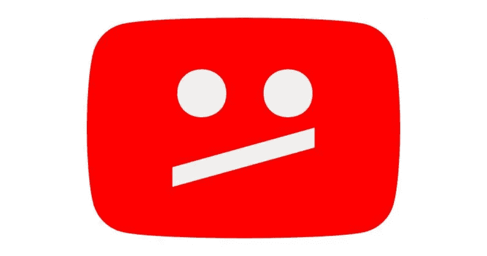
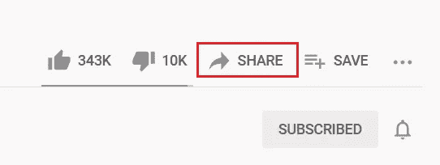
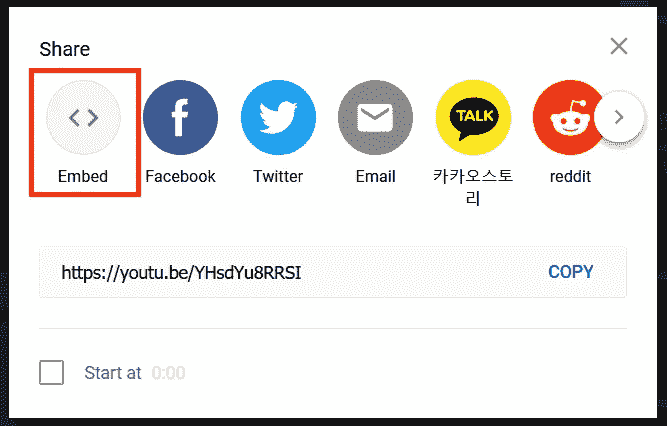
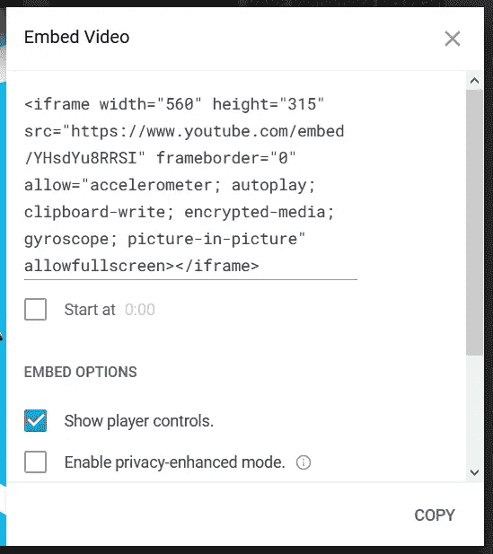
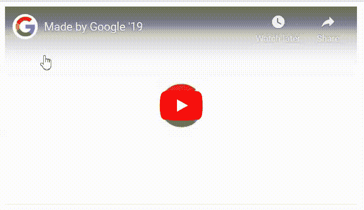
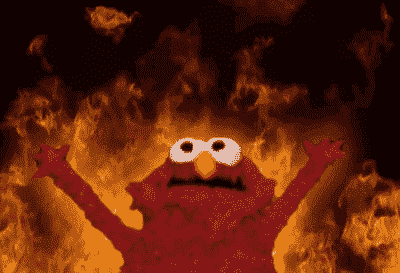
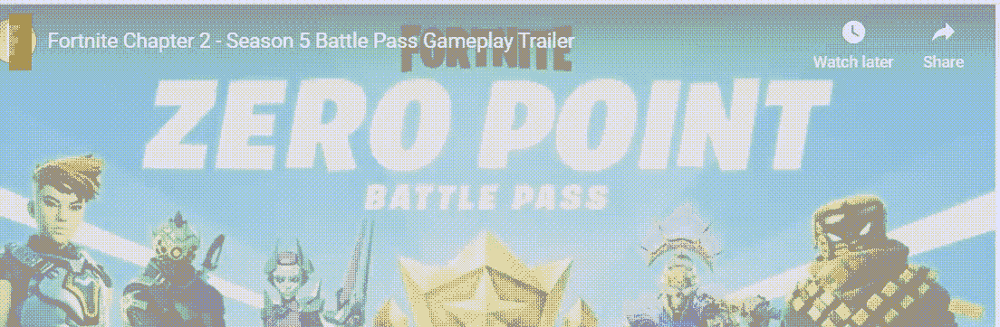
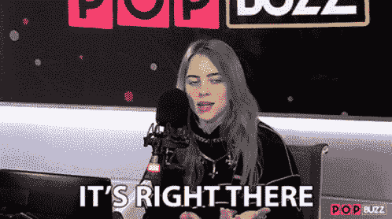
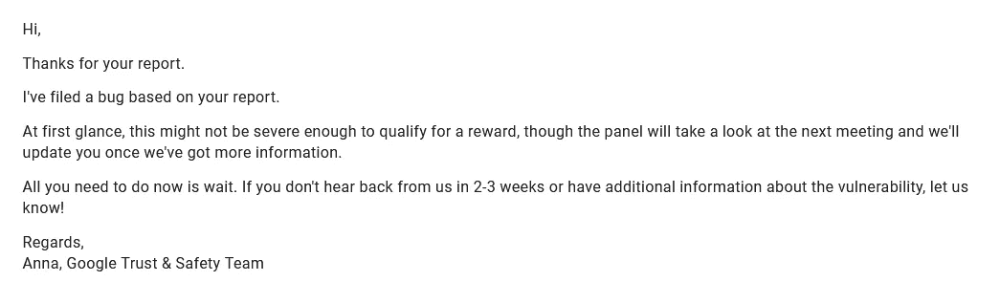
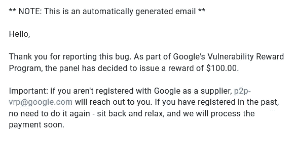

# 玩个游戏，订阅我的频道- YouTube 点击劫持 Bug | #GoogleVRP

> 原文：<https://infosecwriteups.com/play-a-game-get-subscribed-to-my-channel-youtube-clickjacking-bug-googlevrp-6ce1d15542d3?source=collection_archive---------0----------------------->

*注意:不会发表我的一些最好的 bug:)抱歉！！！*

嗯，这是一个令人惊讶的星期天(我们是一家初创公司)。我大约在上午 10:30 到达办公室，我的同事和我一起在办公室。那天他有一个漫长的夜间旅程，所以他决定在我们的办公室小睡 5 个小时:)

我在回顾我之前在谷歌 VRP 报告的错误，我在 YouTube 上听了一首歌。

当我听这首歌的时候，我注意到了 YouTube 中的分享功能，这是我以前从未使用过的。

分享功能有更多的选项，如“分享到脸书”，“分享到推特”，“分享到电子邮件”等等。这次嵌入选项引起了我的注意。

嵌入选项允许用户通过一小段 HTML 代码将 YouTube 视频嵌入到 iframe 的站点中，如下所示:

嗯，一切都很好，直到我决定在我自己的网站上嵌入一个视频。所以，我复制了代码并粘贴到我自己的站点中。我刷新了我的站点，发现我的站点中嵌入了 YouTube 视频。

在播放视频之前，我发现 YouTube 视频中有频道图像。将鼠标悬停在图像上方允许用户直接订阅或取消订阅某个频道，而无需将用户发送到主频道页面来确认订阅。嗯嗯；)

我在想，如果我能把这转换成一个潜在的点击劫持攻击，允许攻击者欺骗受害者订阅或取消订阅某个频道，那就太酷了…

我跳进我的崇高编辑器，开始创建一个小的 HTML 代码，可以说服受害者去做。就像在 5 分钟内，我想出了一个太简单的 HTML 代码，并建立了一个概念。工作原理是这样的:

这是一个非常简单的游戏(虽然不是一个游戏),受害者必须将他的鼠标悬停在红色上，然后沿着路径，当它变成绿色时点击它。我同意这不是超级酷的 POC 脚本，但有 5-10 分钟的时间…这是可以的:)

这也有一个向`Watch Later`添加视频的功能，也可以通过再次创建一个假按钮来将视频添加到受害者的稍后观看列表中。

即使在报告此问题之前也没有任何延迟:

我脑子里想的是，谷歌 VRP 的回复会是什么？

*   复制
*   预期行为
*   不会修复&更多…

我也想知道它怎么会没有被其他顶尖的研究人员注意到。就像这里一样！！

我将此事报告给了谷歌 VRP，两天后我收到了这样一封邮件:

`At first glace, this might not severe enough to qualify for a reward`

我几乎破产了，但还是被接受了，委员会将会考虑。

大约两周后，我收到了这样一封邮件:

奖励剪

是的，评审团决定奖励我 100 美元。我真的笑了，因为我从来没有想过这会得到回报，甚至我的朋友也说“这是一件事，而不是什么都没有”

但我仍然不完全满意，并要求他们做出解释，GVRP 团队回复我说，奖励是根据影响发放的，我们还发现这个场景中有不寻常的用户互动，我也非常同意这一点。还补充说，如果我能减少用户互动，我们会重新考虑这个问题。

2021 年 2 月 2 日

开始做这个，已经快两个月了，决定放弃:(

是的，但是我仍然对陪审团的决定很满意:

隐藏痛苦:)

需要一段视频来更好地理解——请看:

Youtube 视频

感谢阅读:

如果你喜欢这个，写下来鼓掌👏，那我们来连线:

**推特:** [sriramoffcl](https://twitter.com/sriramoffcl)

**insta gram:**[Sri ram _ off cl](https://www.instagram.com/sriram_offcl/)

**LinkedIn:**[sriramkesavan](https://www.linkedin.com/in/sriramkesavan/)

**和平** ✌️ **！！！**