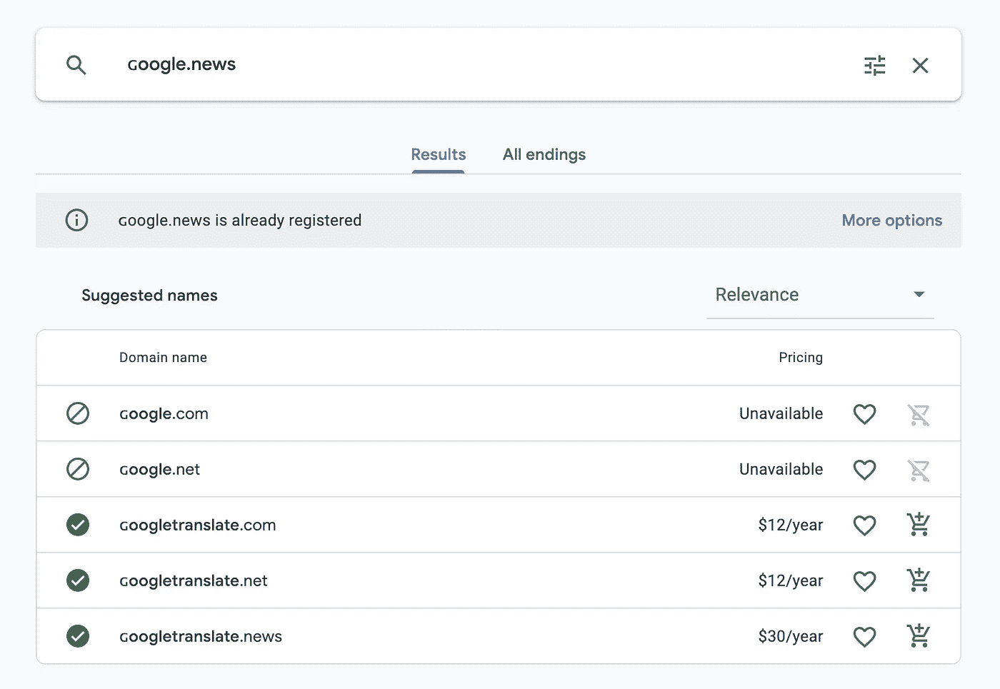
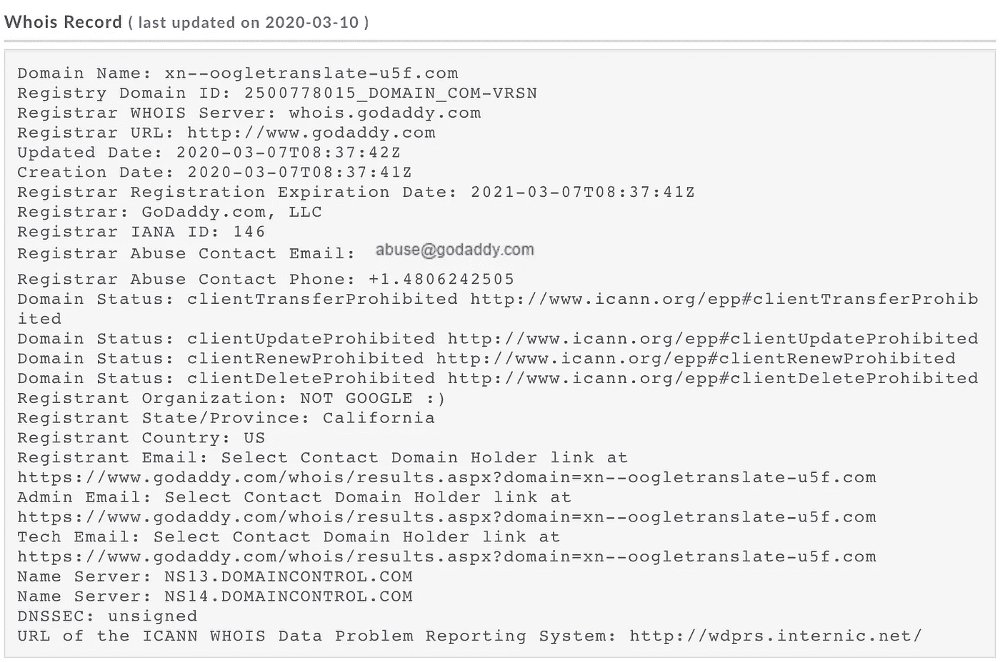
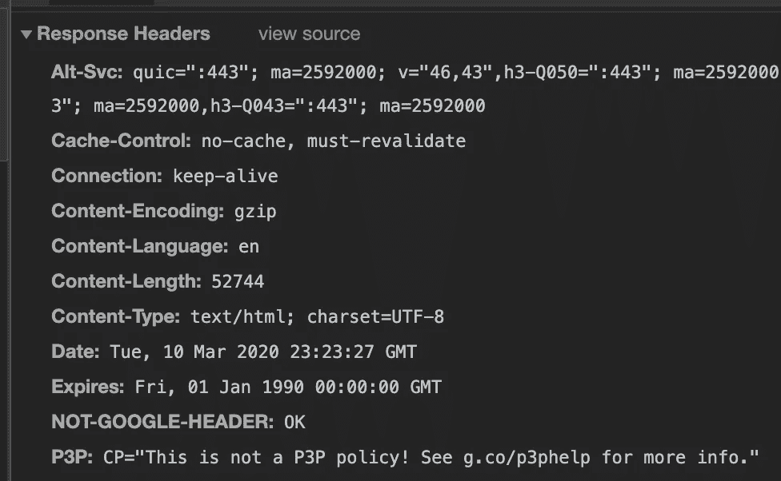
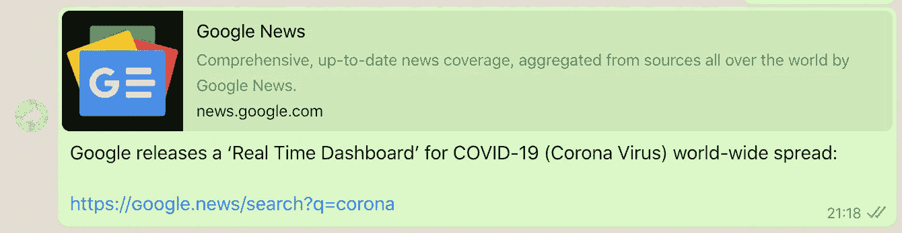
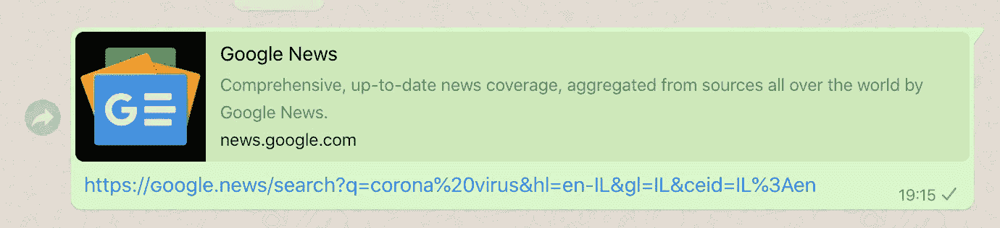
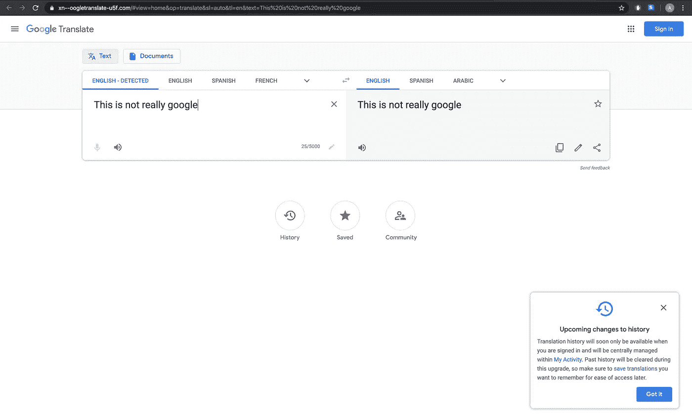
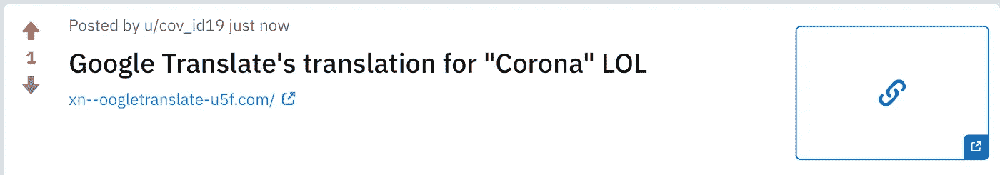
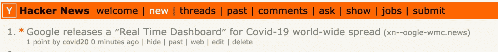

# Google.news 不是 google.news:使用 SSL 的 Google 钓鱼 POC

> 原文：<https://infosecwriteups.com/poc-for-google-phishing-in-10-minutes-%C9%A2oogletranslate-com-dcd0d2c32d91?source=collection_archive---------0----------------------->

2016 年，我看到一个帖子，说有人[要收购ɢoogle.com。](https://www.analyticsedge.com/2016/11/heres-a-secret-%C9%A2oogle-com-is-not-google-com/)
它被用于[钓鱼](https://en.wikipedia.org/wiki/Phishing)草菅人命(注意第一个 G)。
同形异义字符看起来像 ASCII 字母，但它们的编码不同，人眼通常察觉不到。

> **网络钓鱼**是通过在[电子通信](https://en.wikipedia.org/wiki/Electronic_communication)中将自己伪装成一个可信任的实体来获取[敏感信息](https://en.wikipedia.org/wiki/Information_sensitivity)如用户名、密码和[信用卡](https://en.wikipedia.org/wiki/Credit_card)详细信息的欺诈性尝试。通常通过[电子邮件欺骗](https://en.wikipedia.org/wiki/Email_spoofing)或[即时消息](https://en.wikipedia.org/wiki/Instant_messaging)来实现，它经常引导用户在一个与合法网站的[外观和感觉](https://en.wikipedia.org/wiki/Look_and_feel)相匹配的虚假网站上输入个人信息。

来自我和谷歌的一次对话:

> 使用同形异义词(即带有传真 G 的 Google)可能不会愚弄所有人，但根据所采用的策略，可能会遇到安全、网络和其他系统方面的挑战。

我心想:

1.  每年都有新的顶级域名。
    世界从[*ɢoogle.com*收购](https://www.analyticsedge.com/2016/11/heres-a-secret-%C9%A2oogle-com-is-not-google-com/)中学到了什么？
2.  从零开始创建一个好的 Google [钓鱼](https://en.wikipedia.org/wiki/Phishing)网站有多难？
3.  我可以获得这个域的 SSL 证书吗？
4.  谷歌监控任何'ɢoogle'同形异义域名注册吗？
5.  可以通过 [Google Domains](https://domains.google.com) 购买吗？域名注册商有什么建议吗？
6.  我能在谷歌用户和谷歌服务器之间成功进行中间人攻击吗？

> 我分享是因为我在乎。
> 请仅将此用于教育目的。

# 那么，有哪些顶级域名出售呢？

找到一些可用的ɢoogle 域名并不难。只需在任何域名注册商搜索'ɢoogle'，例如 Google Domains，NameCheap 和 GoDaddy。

## 我购买了以下域名:

1.  **company.google.com**(长得像[ɢoogle.company](http://company.google.com/))
2.  **mail.google.com**(长得像[)](http://mail.google.com/)
3.  **tv.google.com**(长得像[)](http://tv.google.com/google.tv)
4.  **life.google.com**(长得像[)](http://life.google.com/google.life)
5.  **live.google.com**(长得像[)](http://live.google.com/google.live)
6.  **news.google.com**(长得像[)](http://news.google.com/google.news)
7.  **ɢoogletranslate.com**(酷似[translate.google.com](http://translate.google.com/))

这些域名是自动建议的，我甚至不需要对它们进行创新。谷歌域名为我推荐了“[ɢoogletranslate.com](https://ɢoogletranslate.com)”！顺便说一句，价格很好…



它成功了…

我在整个过程中使用了一个假身份，用**“不是谷歌:)**作为组织名称:



# 使用 SSL 证书设置钓鱼网站

1.  在云中推出 VPS(AWS、Google Cloud、Azure 等)。)
2.  将 DNS 路由到该服务器。
3.  安装[Nginx](https://www.nginx.com/)/[Apache](https://www.apache.org/)HTTP 服务器。
4.  请求一个 [LetsEncrypt](https://letsencrypt.org/) 证书(是的，我可以从 [LetsEncrypt](https://letsencrypt.org/) 获得这些域的 SSL 证书)。

```
sudo certbot — nginx certonly — dry-run -d “xn — oogletranslate-u5f.com”Saving debug log to /var/log/letsencrypt/letsencrypt.log
Plugins selected: Authenticator nginx, Installer nginx
Cert not due for renewal, but simulating renewal for dry run
Renewing an existing certificate
Performing the following challenges:
http-01 challenge for xn — oogletranslate-u5f.com
Waiting for verification…
Cleaning up challengesIMPORTANT NOTES:
 — The dry run was successful.
```

然后，为了用“Google”查看客户端的流量，我们需要做的就是用代理设置 nginx 配置:

```
server {
    location / {
       proxy_pass https://translate.google.com/;
       add_header NOT-GOOGLE-HEADER OK;
    }
...
}
```

您可以注意到，我为 google 发回的每个响应添加了一个 HTTP 头:

```
NOT-GOOGLE-HEADER OK # You can check it in your browser's dev tools.
```



现在，人们可以使用 **https://** 链接来获得信任，同时提供恶意内容。
看看这个链接，通过媒介把你重定向到我的宝贝出生的[钓鱼](https://en.wikipedia.org/wiki/Phishing)域名、[**ɢoogletranslate.com**](https://ɢoogletranslate.com/#view=home&op=translate&sl=auto&tl=en&text=This%20is%20not%20really%20Google%2C%20you%20are%20proxied%20by%20ɢoogletranslate.com.%0AYou%20made%20an%20SSL%20handshake%20with%20ɢoogletranslate.com%2C%20but%20you%20use%20Google%20Translate%20normally.)**:**

 [## 谷歌翻译

### 谷歌的免费服务可以在英语和 100 多种其他语言之间即时翻译单词、短语和网页。

xn oogletranslate-u5f.com](https://ɢoogletranslate.com/#view=home&op=translate&sl=auto&tl=en&text=This%20is%20not%20really%20Google%2C%20you%20are%20proxied%20by%20ɢoogletranslate.com.%0AYou%20made%20an%20SSL%20handshake%20with%20ɢoogletranslate.com%2C%20but%20you%20use%20Google%20Translate%20normally.) 

使用代理的最大好处是，我的域名链接预览，在每一个平台上，在指向我的链接时，获取谷歌翻译的准确描述。比如看一下 [Whatsapp](https://www.whatsapp.com/) 。



# 结果呢

几分钟内完成设置，无需编码。



很酷吧。
如你所见，chrome 将该域名显示为“安全”(锁图标)。
在手机上，我的域名中的“ **ɢ** ”看起来像一个真正的“g”。
Google 的 [javascript](https://en.wikipedia.org/wiki/JavaScript) 从我的域正常运行。谷歌的 JS 为我做了一切——我甚至不需要模仿谷歌服务。

# 获得一些流量

W 借助一些[社会工程](https://en.wikipedia.org/wiki/Social_engineering_(security))我们可以让用户点击这些域名，不费吹灰之力就获得有机流量，从而证明这种攻击的能力。

我想在面向安全的网站上发布一些链接/帖子，以证明即使是有安全意识的人也可能被这些域名误导。

一些预览看起来更好，一些因为同形异义字符 url 引用而变得不那么吸引人。

来自 [Reddit](https://www.reddit.com/) 和[黑客新闻](https://news.ycombinator.com/)的例子:



最终，没做多少工作，我就拥有了数百名独立访客(不包括机器人和安全扫描仪，也不包括我发帖的平台)。

# 我们能对来访者做些什么？

它的外观和行为就像任何谷歌单页应用程序一样。
正如链接中所解释的，我正在与用户进行 SSL 握手。
最初的 google 应用程序已提供，它的功能与预期一致，但我暴露在用户与该域的流量中。因此，我可以改变谷歌回复的正文。这是一种中间人攻击，利用 [IDN 同形异义攻击](https://en.wikipedia.org/wiki/IDN_homograph_attack)来获得一些牵引力。

我们想要得到的最珍贵的数据可能是登录凭证或令牌。谷歌使用域名**accounts.google.com**进行认证。

例如，我可以覆盖 HTML 中所有的 **<和>** 标签。我们可以将它们指向一个定制的钓鱼登录页面，在[**【ɢoogletranslate**](https://ɢoogletranslate.com)**中，而不是指向[google.com](http://google.com/)(例如[**accounts.google.com**](http://accounts.google.com/))的一个子域。com** 域。

我们可以通过覆盖页面中的链接，并将它们指向[accounts.ɢoogletranslate.com](https://accounts.ɢoogletranslate.com)(登录按钮的 HTML 标签的 href 属性)来窃取用户的登录凭证。

人们还可以在 HTTP 主体中注入恶意的 **<脚本>** 标记，并在客户端的浏览器上执行 JavaScript/其他代码。大多数访问链接的用户代理都是很久没有更新的旧浏览器。
我的访问日志中的许多 Chrome、Firefox 和 Safari 用户代理都是易受 1 天攻击(包括沙盒逃逸)的设备。

# 为了防止这种攻击，可以做些什么？

1.  怀疑链接中域名内的大写/奇怪字母。
2.  2016 年，同样的事情发生在 oogle.com 的ɢ身上，然而'ɢoogle'顶级域名仍在出售。oogle.com 的ɢ被列入黑名单，但这不是解决问题的正确方法。每个包含“ɢ [oogle](http://oogle.com/) ”甚至“oogle”字样的域名都应该被域名注册商和浏览器禁止。
3.  谷歌域名和其他域名注册商的自动推荐域名帮助了社会工程攻击——他们甚至不需要想出域名。🤦🏻‍♂️
4.  从具有单应域的 LetsEncrypt 请求 SSL 证书的能力。
5.  [Translate.google.com](http://translate.google.com/)的 javascript 在页面上运行，而它在 oogletranslate.com[的ɢ](http://oogletranslate.com/)下服务。javascript 应该对此进行检查(window.location 应该是合法的 Google 域),并阻止脚本的其余部分被加载。该服务还可以通过验证请求的**引用方**返回一个 HTTP 错误响应，在我们的例子中，引用方是:[https://xn-oogletranslate-u5f.com/](https://xn--oogletranslate-u5f.com/)。
6.  对于系统管理员—在 IDS/IPS 中实施规则，对网络流量进行静态分析。 [Snort](https://en.wikipedia.org/wiki/Snort_(software)) 、 [Zeek](https://en.wikipedia.org/wiki/Zeek) (Bro)和 [Suricata](https://en.wikipedia.org/wiki/Suricata_(software)) 有针对同型主机的警报和规则。确保你的规则是最新的。恶意主机一直被列入黑名单。

# 谷歌的回应

对我来说这并不意外。谷歌很重视我的安全报告。

> 感谢您提供的大量材料、其背后的想法，以及在创建这份报告时用于保护这些域名的实际资金。同形攻击在它们的社会工程应用中总是令人感兴趣的，但更具挑战性的是部署不仅欺骗用户，而且欺骗基础设施的攻击。您的提交有一些考虑因素…

实际上我们还在讨论。我有一些攻击场景需要澄清和解释，但从那时起，我将 POC 向前推进了一步。

这个问题不是谷歌特有的。互联网可以采取一些小步骤来防止未来发生这种攻击。在找到解决方案之前，每个大公司或服务都必须通过在相似的域名上花费大量金钱来保护他们的域名和资产。

我希望你同意——对于任何具有基本 linux 和网络知识的人来说，重现这种攻击的步骤都非常简单。
我没变什么魔术，也不是第一个(4 年过去了，我只是好奇)。有些攻击真的很难阻挡..我认为 Gmail 会更有趣(我欠ɢ一个人情)。邮箱)。

此处显示了一个成功的概念验证，
如需了解更多信息，请随时联系我。