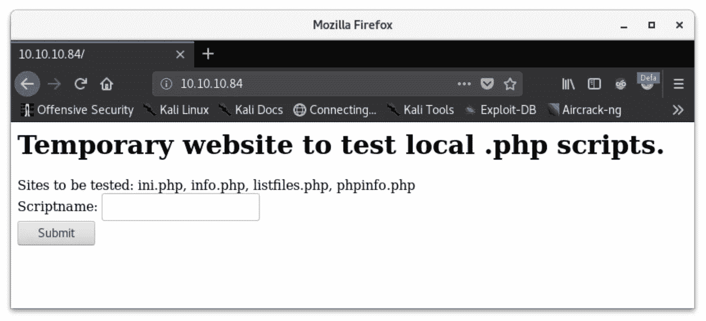
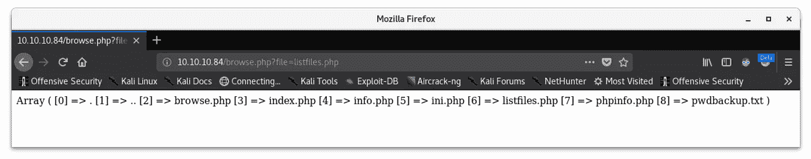
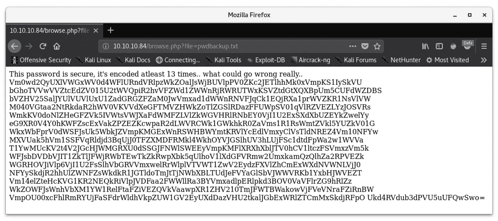
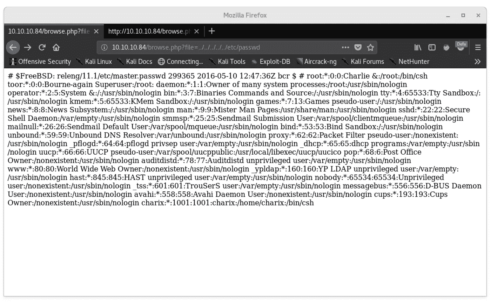
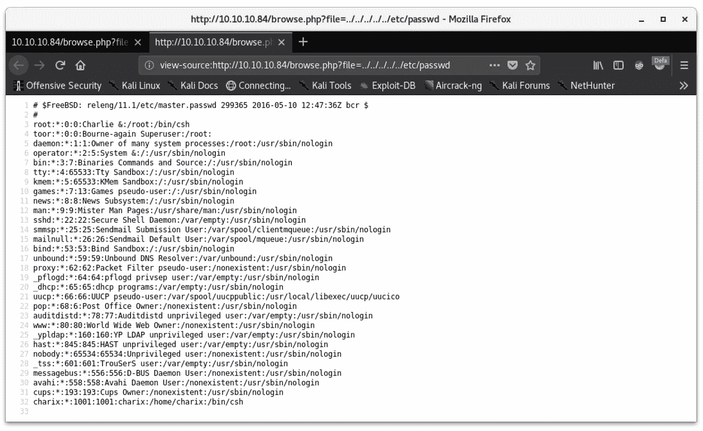
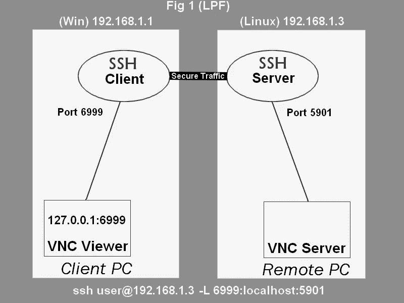
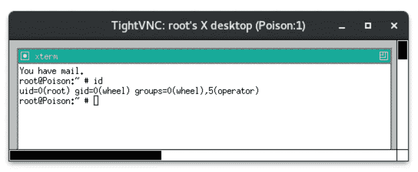

# 毒药—端口转发特权黑客邮箱演练

> 原文：<https://infosecwriteups.com/poison-a-port-forwarding-privesc-hackthebox-walkthrough-afb1d6f7a7f6?source=collection_archive---------1----------------------->


# 摘要

Poison 是一种运行 web 服务器的 Linux 主机，容易受到本地文件包含的攻击。这被用来枚举本地用户并恢复包含编码凭据的文件。这些被组合起来以获得对机器的 SSH 访问。本地枚举返回了一个以根用户身份运行的 VNC 进程，该进程只接受本地连接。端口转发与从主机恢复的密钥相结合，通过 VNC 返回了具有 root 权限的终端。

# 侦察

我开始在这台主机上进行侦察，通过扫描来枚举服务版本，并在默认情况下`nmap`检查的 1000 个公共端口上运行默认脚本:

```
nmap -sV -sC 10.10.10.84
```

> `-sV` —枚举服务版本
> `-sC` —运行默认脚本

纳米粒子加速器

这返回了两个服务，SSH 和 HTTP。每一个都在 FreeBSD 主机上运行。

列举的第一个服务是 HTTP。访问 web 服务器会立即返回一个执行 php 文件的门户:



index.html

运行`listfiles.php`返回一个数组，该数组包含来自默认 web 目录的多个文件，该目录包含本地。主页上引用的 php 脚本。还有一个名为`pwdbackup.txt`的文件:



listfiles.php

查看 URL 可以清楚地看到`listfiles.php`文件是如何被引用的:

```
http://10.10.10.84/browse.php?file=listfiles.php
```

为了查看`pwdbackup.txt`的内容，只需替换 URL 中的文件名:

```
http://10.10.10.84/browse.php?file=pwdbackup.txt
```



pwdbackup.txt

在测试这个 URL 时，我决定看看系统上的其他文件是否可以被抓取:

```
http://10.10.10.84/browse.php?file=../../../../../etc/passwd
```



/etc/密码

这成功了！然而，它不可读或不容易解析。这可以通过查看页面的源代码来轻松解决:



较好的

此时，已经从主机枚举了用户列表和编码密码。现在是时候将这两个工件放在一起并获得对系统的本地访问了。

# 局部访问

文件`pwdbackup.txt`包含一个提示，密码已经“被编码了至少 13 次”。它似乎是 base64 编码的。为了快速恢复密码，并且不用费心确定字符串被编码了多少次(实际上正好是 13 次)，我编写了一个 python 脚本来解码字符串，直到它变成明文:

decode.py

为了枚举系统上拥有有效登录 shell 的用户，我使用了`grep`来过滤掉`/usr/sbin/nologin` shell:

```
grep -v “nologin” passwd
```

> `-v` —反向匹配

用户

用户`root`和`charix`都有交互式的`/bin/csh`外壳。FreeBSD 中的默认备份帐户用户`toor`没有分配 shell。用户`uucp`是 FreeBSD 中的另一个默认帐户，没有交互式 shell。

使用解码的密码和用户名`charix`授权 SSH 访问机器。

# 权限提升

在`charix`用户的主目录中，有一个名为`secrets.zip`的文件。将文件传输到主机并使用用户密码解压缩，会返回一个带有“非 ISO 扩展 ASCII 文本”的文件:

```
[|Ֆz!
```

查看以 root 用户身份运行的进程会返回一个有趣(并且非常冗长)的进程:

```
ps -U root
```

> `-U` —指定用户

根进程

有一个以 root 用户身份运行的`Xvnc`会话。研究此过程的每个参数，可以确定存在连接到此 VNC 会话的身份验证密钥，并且它仅侦听本地连接。

我们可以通过运行`sockstat`来确认监听端口 5091 正在监听连接:

```
sockstat -P tcp
```

> `-P` —指定协议

sockstat

VNC 是一个图形用户界面程序。因为只有 SSH 可以访问机器，所以不能从远程 shell 启动 VNC 会话；没有弹出窗口可供 VNC 会话生成。我们也不能远程连接到 VNC 会话，因为它只监听本地连接。

为了实现这一点，我们必须通过 SSH 建立我们的 VNC 连接，这个过程在本文的[和图表](https://cects.com/ssh-local-and-remote-port-forwarding-with-vnc/)中有非常有效的描述和解释:



VNC 港口运输

## 第一步:

设置端口转发以到达 5901 vnc 会话:

```
ssh -L 5902:localhost:5901 charix@10.10.10.84
```

在整个步骤 2 中保持运行。

## 第二步:

回到我的机器上，我将`vncviewer`连接到本地端口 5902，这将通过 SSH 隧道将连接反弹到端口 5901 的 Poison 上。由于流量通过 SSH 隧道，它看起来像是到 VNC 进程的本地连接，我们能够使用从`secret.zip`提取的文件/密钥进行身份验证:

```
vncviewer localhost:5902 -passwd secret
```

这将在 VNC 上空返回一个根壳。



我是 root