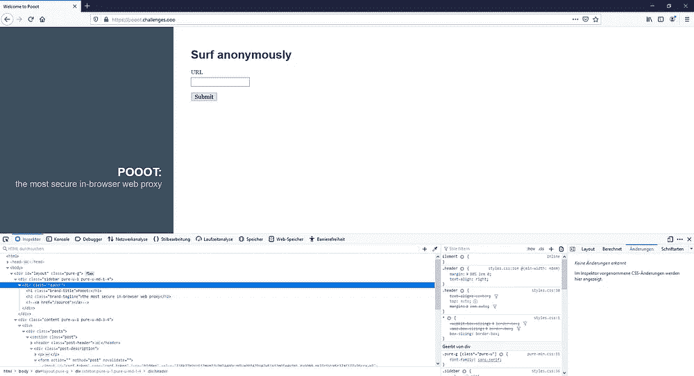
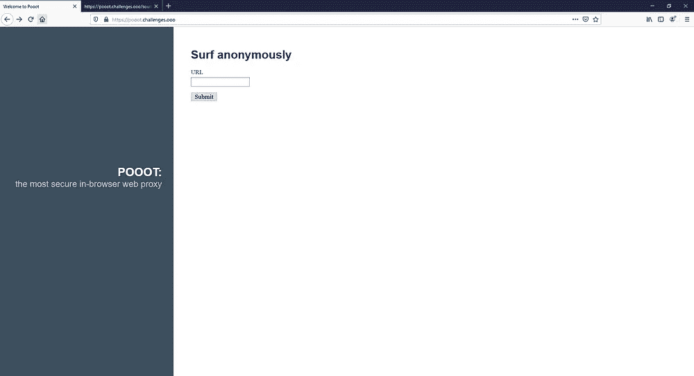

# Pooot 书面报告

> 原文：<https://infosecwriteups.com/pooot-writeup-217384a6b69c?source=collection_archive---------3----------------------->


## CTF 等级防御战

是的… DEFCON 今年真的取消了，不过我没有错过玩 DEFCON CTF Quals 的机会。我参加了 Sauercloud 团队，大部分时间都在参加 pooot 网络挑战赛。不幸的是，在测试结束之前，我们没有成功解决这个问题，但是我继续努力，最终找到了解决方案。为了记录我自己的解决方案，并希望帮助那些没有解决挑战的人，这里是我的记录。

## 我们有什么？

> 网络每天都变得越来越危险。我们的安全 pooot 代理允许您安全地继续浏览，并对您访问的网站隐藏您的 IP 地址！在这里摇摆一下:pooot.challenges.ooo

当我们打开网站时，我们看到一个输入 URL 和匿名冲浪的字段。提交后，网站渲染相应的网站。第一个有趣的提示是 HTML 中的注释，它将我们引向我上传的网站的来源[这里](https://gist.github.com/FHantke/796e6f31a78f10503829873bd9713ad4)。



索引页(左)和反馈表(右)

该网站使用 Flask 并提供以下端点:

*   `/`
*   `/<string:domain>/<path:path>`
*   `/source`
*   `/feedback`

*域/路径* URL 使用 python 请求来`GET`所请求的网站，并修改所有链接以与代理一起工作。之后，它呈现内容。反馈路径用于给出关于损坏页面的反馈。它使用 Redis 队列来调度任务。整个服务隐藏在一个代理后面。

## 我们在找什么？

我们的第一个想法是利用 SSRF 与 Redis 联系。所以，我们建立了一个 nginx 服务器，它回复了一个重定向到*pooot.challenges.ooo/<我的服务器>* 的请求，并且成功了。我们收到了两个请求。然而，当我们试图重定向到内部 IP 时，我们收到错误“*不允许内部 IP 地址[…]”。*服务器检查请求是否来自 *172.25.0.100，*本地 IP，由于我们的源地址来自我们自己的 PC，请求被阻止。

```
if request.headers.getlist("X-Forwarded-For"):
    client_ip = request.headers.getlist("X-Forwarded-For")[0]
else:
    client_ip = request.remote_addr
if isIP(domain):
    protocol = “http”
    if client_ip != “172.25.0.100”:
        app.logger.error(f”Internal IP address [...] not allowed.” )
        return “Internal IP address not allowed”, 400
```

接下来，我们想知道工人的工作是什么。

```
from worker import task
url = re.sub(r'http[s]*://', '', form.url.data)
job = q.enqueue(task,url)
```

当我们在表单中提交我们的服务器域时，一个请求出现在我们的 nginx 访问日志中。接下来，我们通过回复一个执行 JS 的 html 文档(如下)来请求我们的服务器——XSS，从而进行测试。是的，我们收到了两个请求。html 由执行 JS 的无头 chrome 调用。从这一点来看，我们有一个由内部浏览器发起的请求。因此，我们可以调用/ <ip>并通过内部 IP 检查。现在是时候找到 Redis 并与之对话了…好吧，我将跳过这一部分，因为它将我们引向了一个我们永远无法逃脱的死胡同...</ip>

请求内部 IP 的 html 内容

## 最终解决方案

CTF 结束后，有人提出将工人任务中的 XSS 与服务工人结合起来，以检查其他被访问的 URL。这让我开始研究服务人员，这是我以前不知道的概念。服务人员实质上是您网站/浏览器中的代理，可以拦截来自浏览器的请求，并从缓存中提取这些请求。它还可以做的是，它可以发送请求或关于请求的信息到另一个服务器！

我精心制作了一个服务工作者，为这个任务注册了它，然后立即收到了另一个请求。在下面的访问日志中，我们可以看到无头 chrome 也访问了 *172.25.0.102:3000* 。使用上面的方法，我请求了这个 IP，我终于有了标志！！！

服务人员 js

注册服务人员的 html 内容

访问日志

> OOO { m3lt 1 ng _ p0t _ of _ S3 cur 1 ty _ 0 R1 G1 n 5 }

## 摘要

挑战非常有趣，我学到了很多。这对我来说是最重要的部分——我喜欢在玩 CTFs 的时候学习新的东西。感谢溢出秩序组织的挑战，感谢我的团队给我展示了许多很酷的技巧。继续黑！