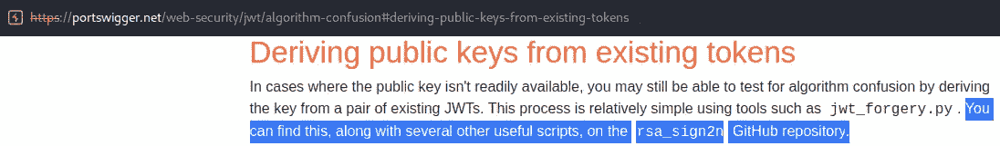
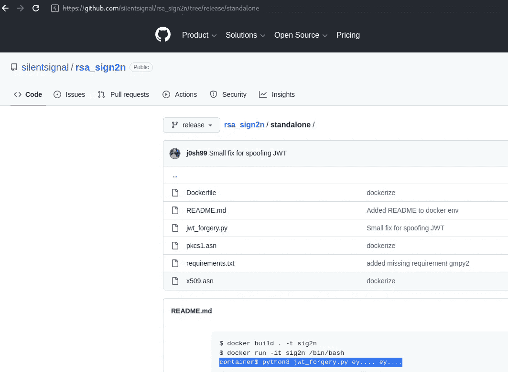
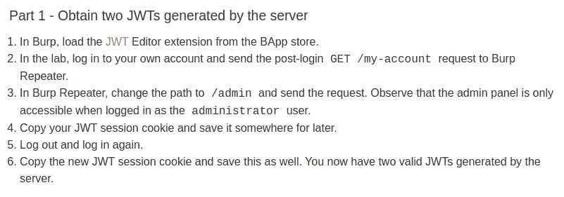
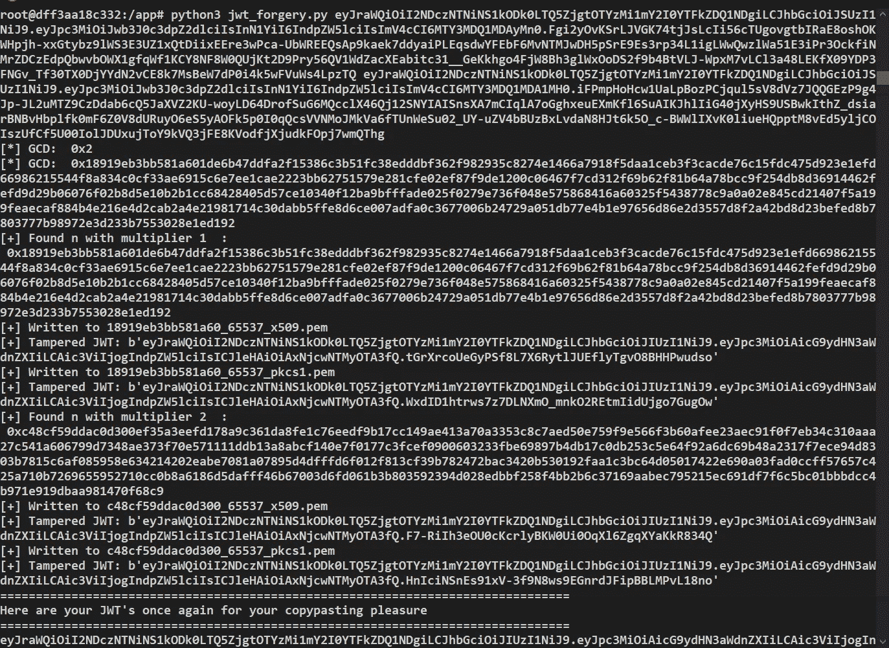
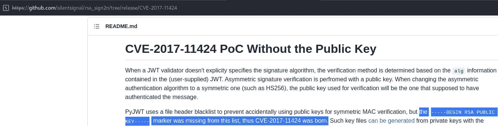
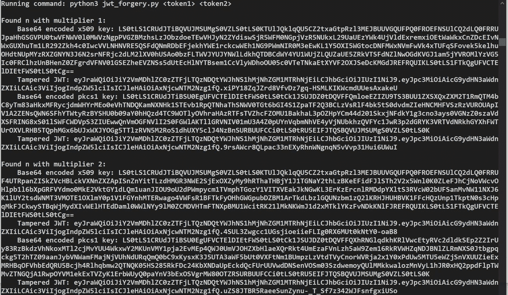
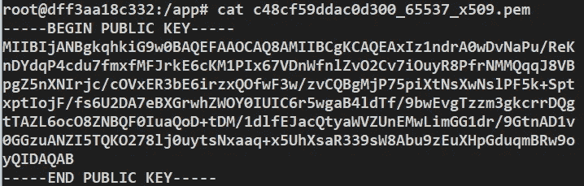
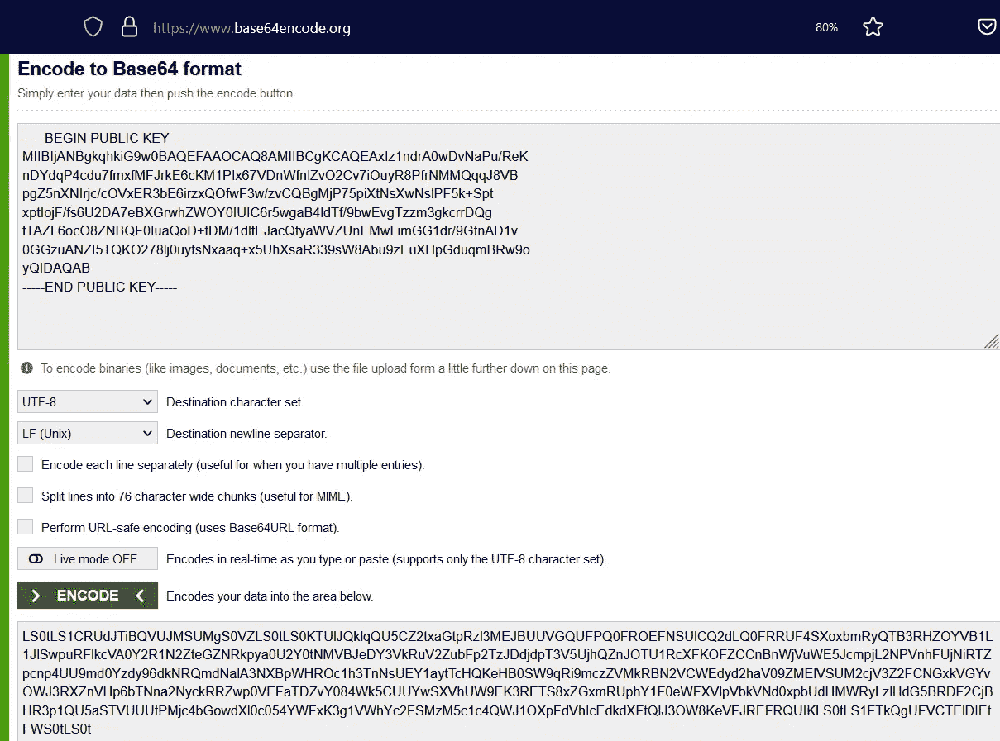
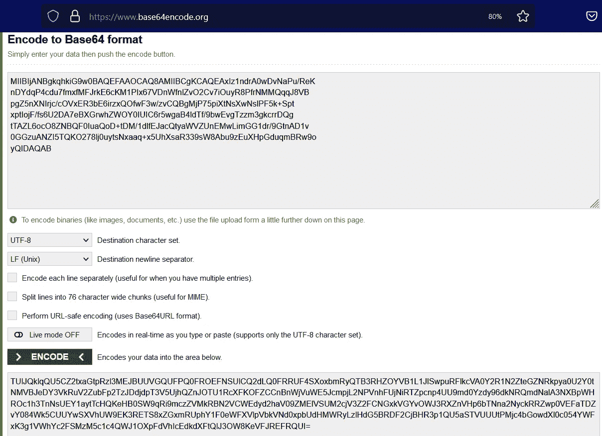

# Portswigger 实验室:通过算法混淆绕过 JWT 身份验证，没有暴露密钥，这是一个略有不同的演练

> 原文：<https://infosecwriteups.com/portswigger-lab-jwt-authentication-bypass-via-algorithm-confusion-with-no-exposed-key-a-slightly-e28602b6ef70?source=collection_archive---------4----------------------->

## ，或者我是如何再次认识到 RTFM 的重要性的

我的意思是，完全诚实地说，这篇文章开始时是我脑中的一个巨大抱怨，当时我正致力于解决[实验室的问题](https://portswigger.net/web-security/jwt/algorithm-confusion/lab-jwt-authentication-bypass-via-algorithm-confusion-with-no-exposed-key)，但最终证明我错了。因此，这里有一个与本实验室解决方案下的社区演练不同的演练。而且，如果你认为自己在看起来应该聪明的时候不够聪明，从而导致沮丧/愤怒，请记住深呼吸，冷静下来，把事情想清楚。当你慢慢来的时候，你会惊讶于你能走多远，即使你确信你已经正确地做了所有的事情，你认为解决方案只是你错过的一件小事，所以你尝试并加速寻找它。但是，你当然找不到它，因为它不仅仅是一件小事。你会发现你更加愤怒，因为你一直在精神上穿过这个迷宫，你找不到奶酪，但你可以闻到它，这让你发疯。相反，只要从一开始就慢慢开始，奶酪的味道就不会均匀地散布在整个迷宫中，让你不知该往哪个方向走。这意味着，你可以更快地吃到奶酪，而不会失去冷静。我不知道为什么迷宫和奶酪的比喻，但你去:)

**聪明的部分**

在后面的部分——建议使用合适的工具而不是简化的版本——这让我感到疯狂或愚蠢，或者两者兼而有之。

我的意思是，接受挑战: )起初，这似乎只是达到相同结果的不同方式。剧透——我错了。

设置非常简单:

docker，不用担心依赖性等。

然后我们到了好的部分，根据实验室的解决方案，它似乎是不言自明的:

简单:)

然后我们到了另一部分，让我心烦意乱的部分:

**你说我应该有 JWT 和 Base64？**

因此，请记住，我使用的不是该工具的简化版本，而是“复杂”的 jwt 伪造者工具，相比之下，它提供了看起来非常复杂的输出:

复杂的输出，除了 JWT 之外没有任何 base64 编码

我就不跟你说我试图将各种东西编码到 base64 中，试图用它签署被篡改的 jwt 会话并失败，然后不得不深呼吸几下冷静下来的截图了。

切到:

**RTFM**

在这种情况下，解决方案是要么说，拧它并抓住简化的工具，或者阅读在…哦，我不知道，工具本身的 github repo 上找到的页面。在两条路中，我选择了人迹较少的一条，这使一切都变得不同，因为我学到了一些新东西:

突出显示的部分非常重要

那么，这个亮点如何解决我的问题呢？这一行:开始 RSA 公钥，这看起来很明显，因为它不是秘密，不需要猜测，它实际上和代码中的注释一样。对吗？不对。事实证明，至少在这种情况下，这很重要。我试图让“复杂”工具输出的正确部分工作，但这并不是完全错误的。我只是没有完全按照说明去做。如中所示，需要进行 base64 编码的文本实际上是由“复杂”工具生成的 x509.pem 文件。整个事情都要被编码。但是，在我无限的智慧(更像是愚蠢)中，我认为我应该只对 BEGIN 公钥和 END 公钥之间的文本进行编码，而不是这两行。这是错误的。

下面是简化工具呈现输出的方式，这使得实验室的使用和求解变得极其简单:

准备复制/粘贴，有 JWT 文本，有 Base64 编码的 x509 密钥，不需要做任何更多的事情

顺便说一下，这是它如何使用“复杂”工具的:

第 1 部分:要进行 base64 编码的内容

然后你就可以对整个事情进行编码:

第二部分:正确的方法

这是我最初做错时得到的结果，这解释了为什么它不起作用:

请注意当您省略顶部和底部行时的主要区别，这当然是意料之中的

**将所有这些放在一起**

剩下的就交给读者了。我是说，现在都在这里了。最难的部分已经结束了，现在只需要使用社区版也提供的 burp 工具/扩展，并输入从您选择的工具中获得的值。

这就是为什么有时候你不得不把自我关在门外。我还了解到我必须更多地研究密码学，这有点讽刺，因为我在很多年前，在寻找 bug 之前，就已经对它很感兴趣了，但却找不到一种方法将所有的理论应用到实际的黑客攻击中。我想现在我知道在哪里可以再次使用它了，希望如此:)

## 来自 Infosec 的报道:Infosec 每天都有很多内容，很难跟上。[加入我们的每周简讯](https://weekly.infosecwriteups.com/)以 5 篇文章、4 个线程、3 个视频、2 个 GitHub Repos 和工具以及 1 个工作提醒的形式免费获取所有最新的 Infosec 趋势！