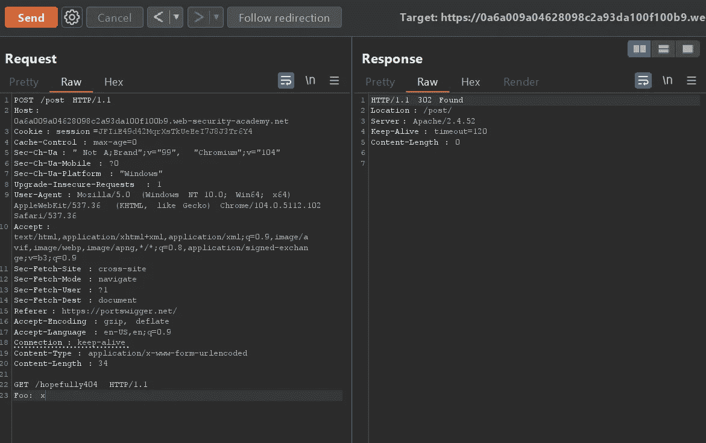
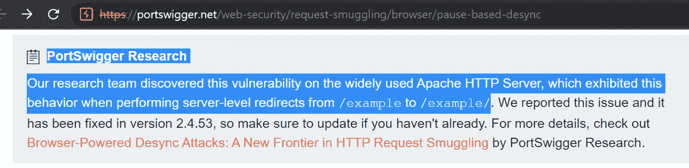
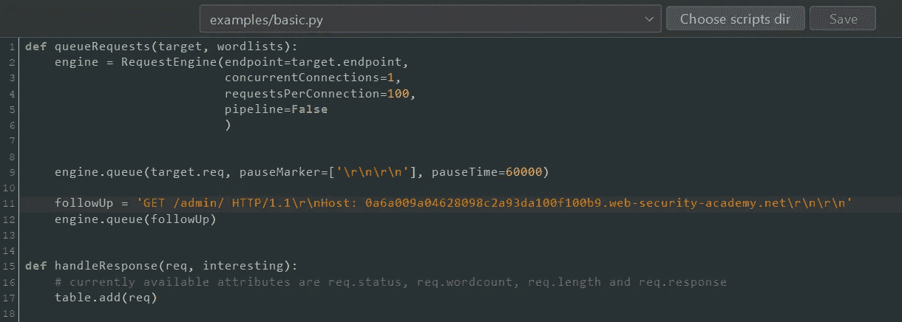
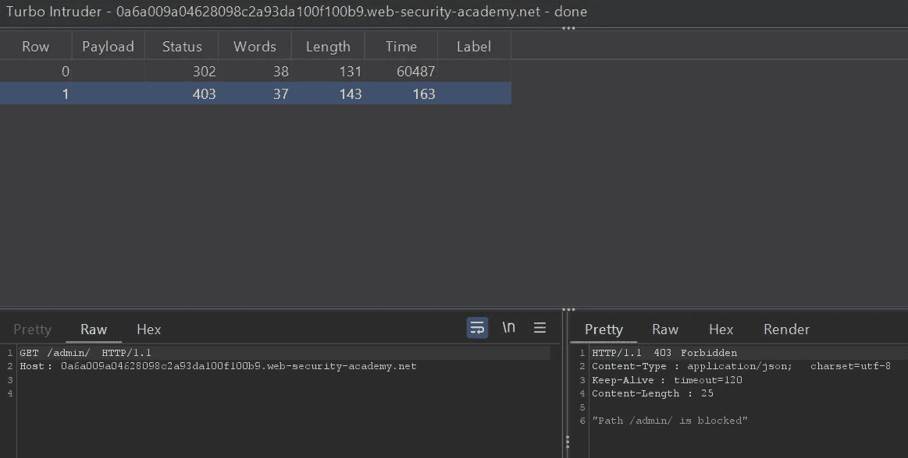
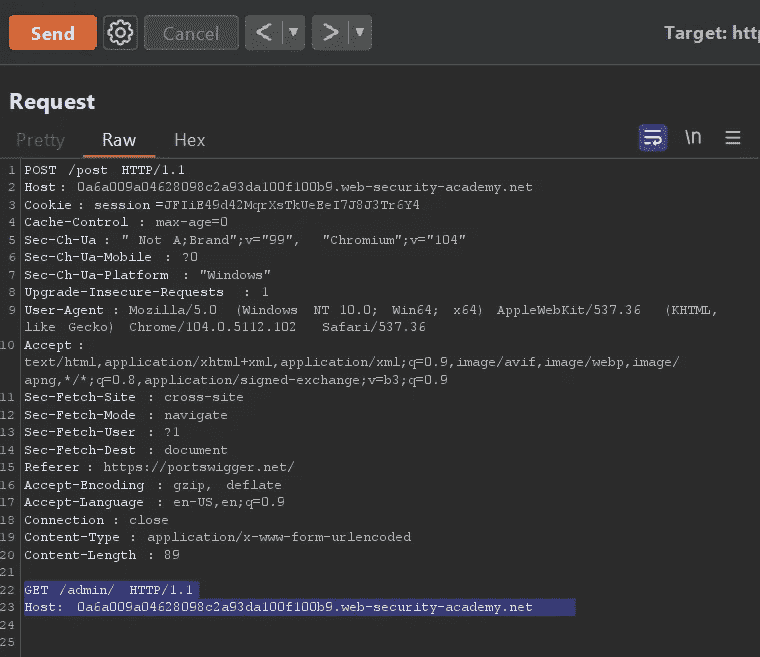
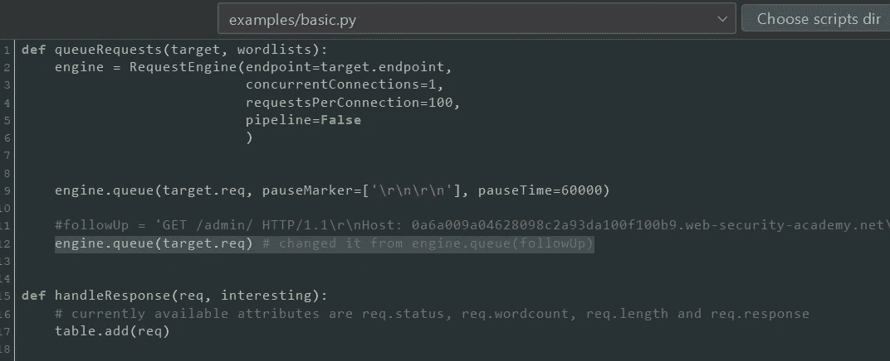
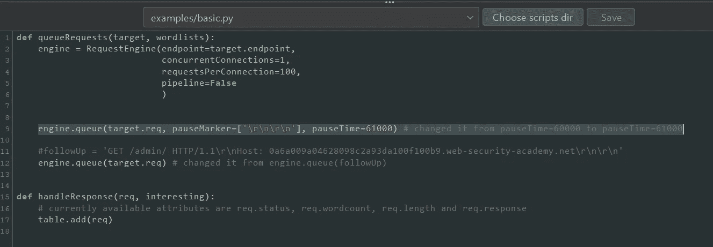
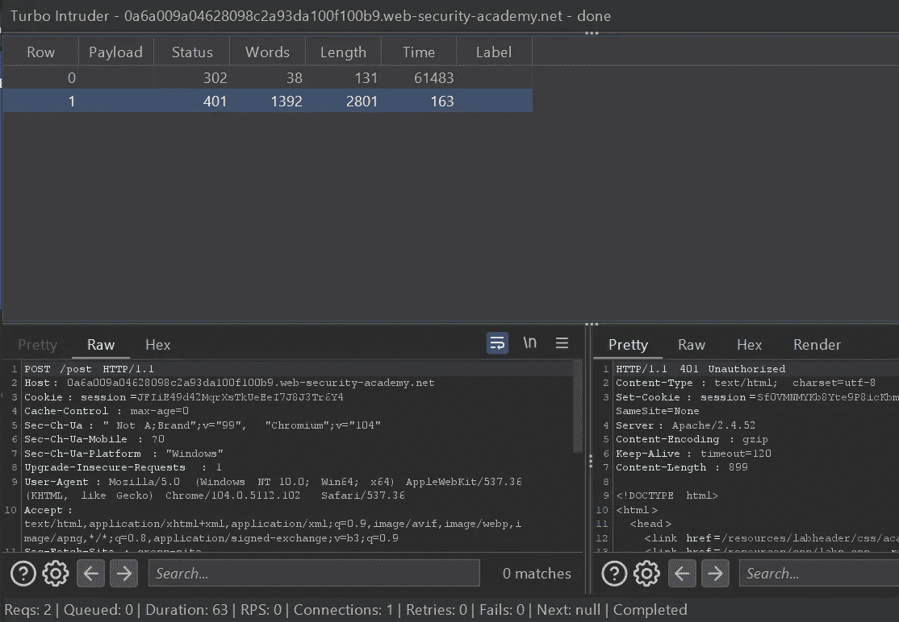
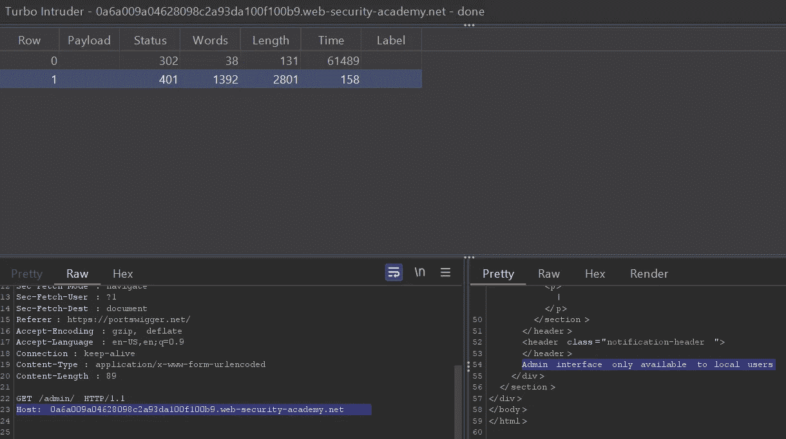
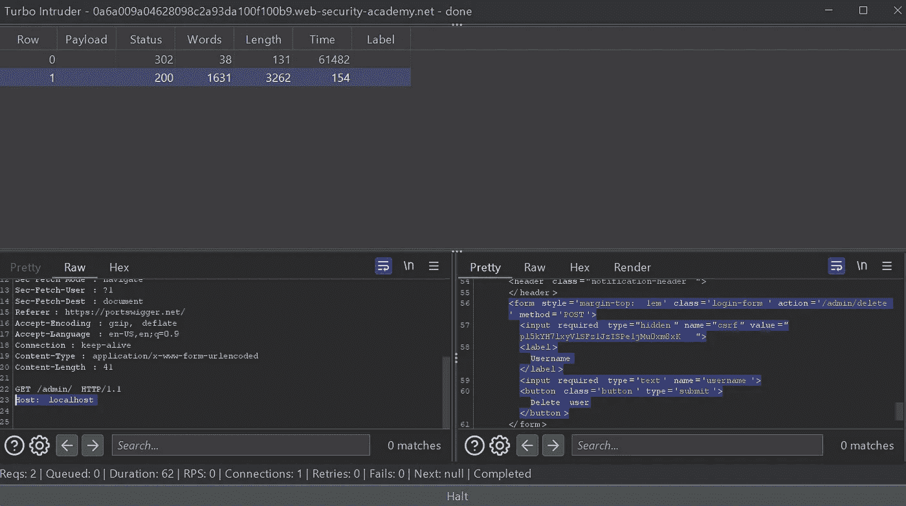

# Portswigger Labs，如何充分利用它

> 原文：<https://infosecwriteups.com/portswigger-labs-how-to-get-the-most-out-of-it-7add3553f88c?source=collection_archive---------1----------------------->

## 或者为什么在实验室下面寻找答案不是作弊，而是学习的一部分

除了为戴着各种帽子的黑客、pentesters、IT sec 人员、bug 赏金猎人和其他人提供的众所周知的工具之外，portswigger 还免费提供优秀的课程。实践与理论相结合，在实验室中你可以测试你学到的东西，甚至测试你自己的想法，这使得 https://portswigger.net 的网络安全学院成为你可以在现实世界中实际应用知识的最佳“一站式商店”之一。

但是，有一个小问题，它可能是故意的，或者我可能没有我想象的那么聪明，它不是一个真正的交易破坏者，一点也不是，它在某种程度上是一个交易助手。我将重点介绍最近的研究，你可以在这里阅读:[https://ports wigger . net/research/browser-powered-desync-attacks](https://portswigger.net/research/browser-powered-desync-attacks#pause)，本文的重点将是*基于暂停的 desync 攻击。*

**实验室:基于服务器端暂停的请求走私**

我首先通过可用的学习材料来学习这些课程，对于本实验，学习材料在这里:[https://ports wigger . net/we b-security/request-straighting/browser/pause-based-desync](https://portswigger.net/web-security/request-smuggling/browser/pause-based-desync)

**简介**

简单点说吧。这是根据学习材料的规格填写的打嗝重复器的屏幕截图:

注意 GET /post 是根据寻找一个路径的解释，该路径将在响应中添加尾随斜杠

然后是如何配置/编码 turbo 入侵者脚本的解释。根据学习材料，它看起来是这样的，请注意后续的相关代码:

有问题的实验室需要访问/admin/

关于后续部分的解释似乎有点混乱。或者至少对我来说，这似乎有点不对劲。根据学习资料，这是一个任意的请求，我认为这是想要的请求(尽管初始请求中有 GET/hopely 404，但由于某种原因它没有主机头),因此我添加了/admin/

但是，当我试图让它为正在讨论的实验室工作时，它失败了，或者说，它按照我的预期失败了，而实际上它确实如预期的那样工作:

不是我所期待的

我花了相当多的时间，可以说我浪费了一些时间去尝试那些行不通的东西，因为很明显，根据我最终不得不查找的解决方案，它并不打算工作。当然，我真的真的很想通过使用学习材料而不是查找解决方案来使它工作，因此浪费了时间。但是……它以一种只有程序员和黑客才能欣赏的奇怪的方式有趣着(:

**第 1 部分:走向正确**

于是调试开始了。我首先必须更改主请求，因为不带主机头的 GET/hopely 404 似乎也是错误的。这是那部分的样子:

这样做在打嗝中继器，然后发送到涡轮入侵者

现在，Turbo Intruder 中的第一个调整必须是删除后续部分(或者为了这篇文章的缘故，将其注释掉)，并对它下面的一行代码进行轻微的更改。最终看起来像这样:

所以，这是个大问题？

注意持续时间:62

我想，这是问题的一部分。正如解决方案所建议的，对 Turbo Intruder 的第二个修复是对单行代码的另一个细微调整，实际上是一个字符:

所以，这是最后一件正确的事:

注意持续时间比前一个长

**第二部大结局(差不多)**

现在，我希望如果你读到这里，根据下面的截图，你应该知道下一步该做什么:

我在某种程度上强调了解决方案:)

这是最后一步:

这部分不需要解释，我希望；)

现在，实验室的描述是删除用户卡洛斯以便解决。我会说类似于詹姆斯凯特尔在他的研究演示中倾向于说的话，我会把剩下的留给读者练习。

所以，是的，这很有趣，有时也令人沮丧。我不知道为什么 60 秒没用，但是 61 秒用了。该解决方案还建议每个连接使用 500 个请求，但显然我设法让每个连接使用 100 个请求。无论哪种方式，我希望你在查找解决方案之前使用这个和学习材料，并且希望你不需要像我一样查找解决方案(:

*来自 Infosec 的报道:Infosec 上每天都有很多事情发生，很难跟上。* [***加入我们的每周简讯***](https://weekly.infosecwriteups.com/) *以 5 篇文章、4 个线程、3 个视频、2 个 Github Repos 和工具以及 1 个工作提醒的形式免费获取所有最新的 Infosec 趋势！*