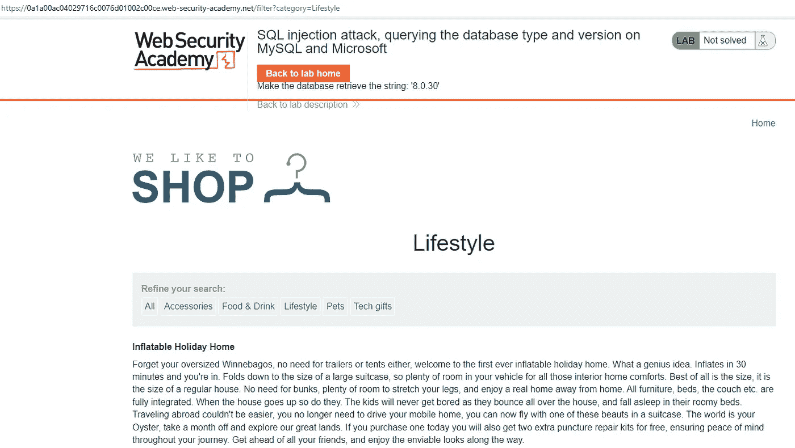
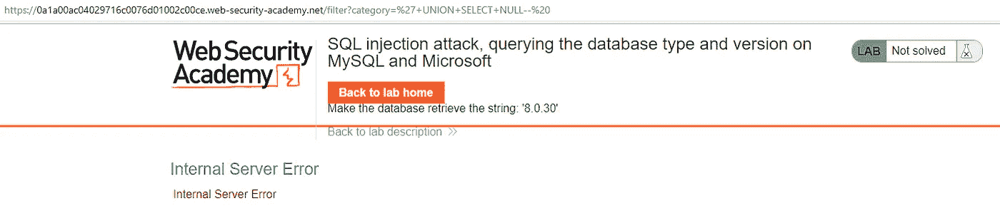
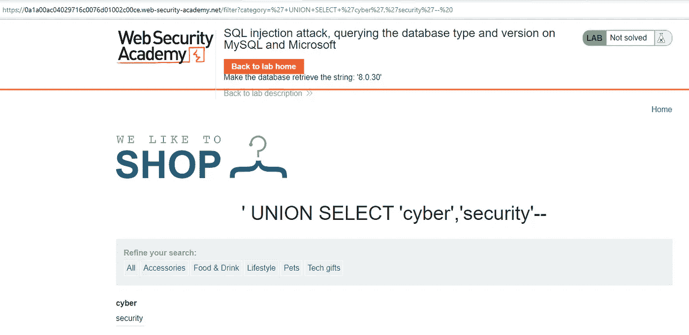
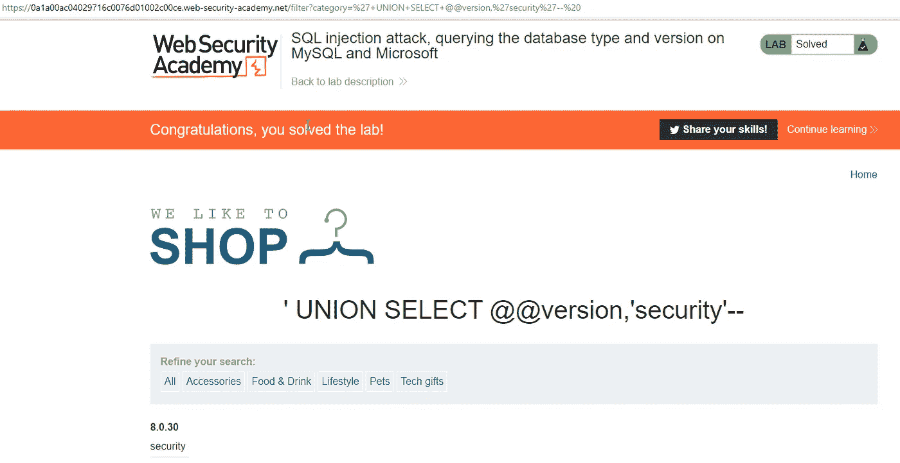

# PortSwigger Web Security Academy 实验室:SQL 注入攻击，在 MySQL 和 Microsoft 上查询数据库类型和版本

> 原文：<https://infosecwriteups.com/portswigger-web-security-academy-lab-sql-injection-attack-querying-the-database-type-and-versio-c6ca5bd380e2?source=collection_archive---------2----------------------->

在本文中，我们可以通过 SQL 注入漏洞将查询与联合结合起来，来处理版本的版本以及数据库信息是如何过时的。

数据库信息是否符合他们获取以下信息的要求:

*甲骨文*

从 v $版本中选择横幅

从 v $实例中选择版本

*微软 SQL 服务器*

选择@ @版本

*PostgreSQL*

选择版本()

*MySQL*

选择@ @版本

当我们进入网页时，欢迎我们的屏幕如下:



现在让我们首先确定有多少列。为此，我们先假设我们的数据库是 MySQL。(https://dev.mysql.com/doc/relnotes/mysql/)

如果列数超过 10，我们可以当作是 Oracle。同时，让我们检查一下评论。

神谕

```
--yorum
```

微软

```
--yorum
/*yorum*/
```

一种数据库系统

```
--yorum
/*yorum*/
```

关系型数据库

```
#yorum
-- yorum
/*yorum*/
```



我们已经确定了两列，现在让我们检查哪些数据可以打印在哪些列中。



让我们在第一列打印关于数据库的信息。这样，我们完成了实验。



*来自 Infosec 的报道:Infosec 上每天都会出现很多难以跟上的内容。* [***加入我们的每周简讯***](https://weekly.infosecwriteups.com/) *以 5 篇文章、4 个线程、3 个视频、2 个 Github Repos 和工具以及 1 个工作提醒的形式免费获取所有最新的 Infosec 趋势！*