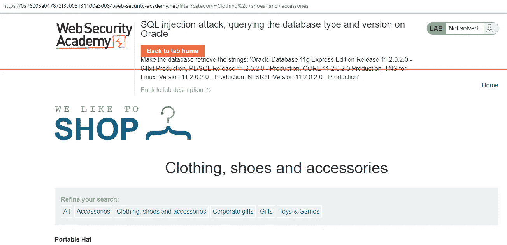
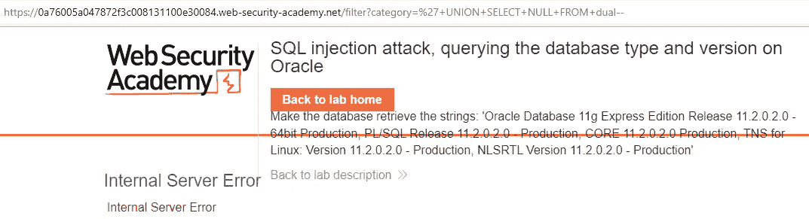
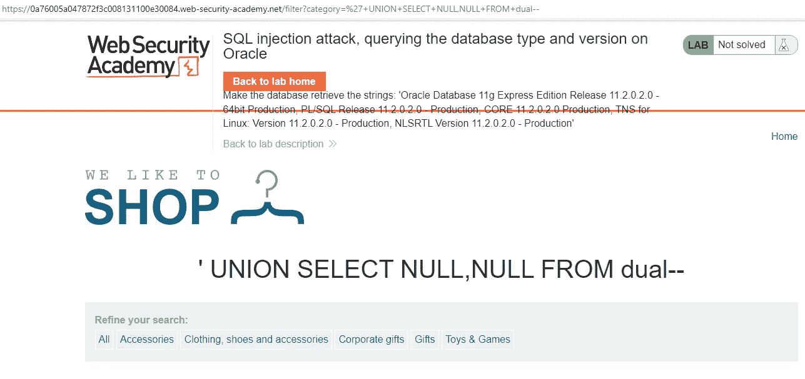
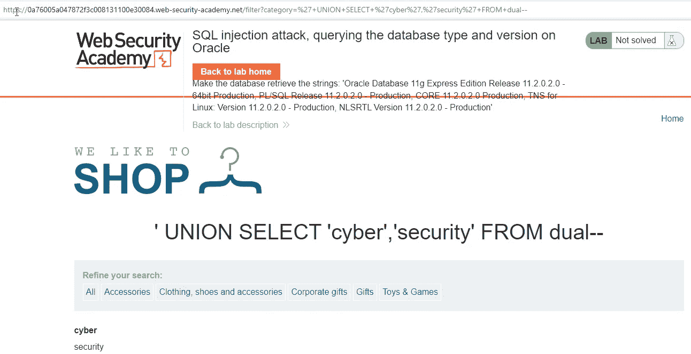
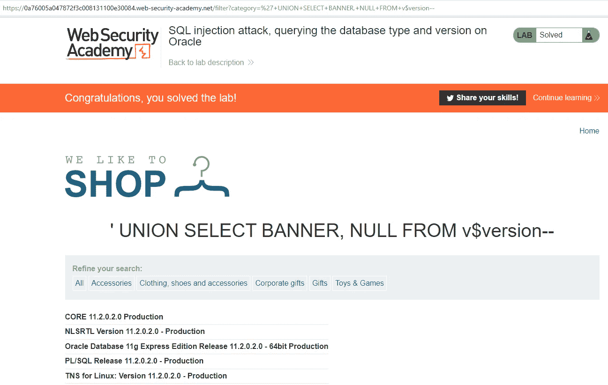

# PortSwigger Web Security Academy 实验室:SQL 注入攻击，在 Oracle 上查询数据库类型和版本

> 原文：<https://infosecwriteups.com/portswigger-web-security-academy-lab-sql-injection-attack-querying-the-database-type-and-version-acd2688592aa?source=collection_archive---------3----------------------->

在本文中，我们将讨论如何通过 SQL 注入漏洞，通过联合和查询来获取数据库版本和数据库信息。

可用于获取数据库信息的查询如下:

*甲骨文*

从 v $版本中选择横幅

从 v $实例中选择版本

*微软 SQL 服务器*

选择@ @版本

*PostgreSQL*

选择版本()

*MySQL*

选择@ @版本

在 Oracle 数据库中，FROM 关键字必须用在 SELECT 语句之后。这就是为什么 Oracle 有一个可以使用的名为 **dual** 的内置表。

当我们进入网页时，欢迎我们的屏幕如下:

我们记得在过去的实验中，category 参数中有一个 SQL 注入漏洞。让我们不要忘记，我们不应该使用 FROM 关键字，因为屏幕上有一个关于 Oracle 的警告。

现在，让我们首先确定有多少列:

检测到有两列后，让我们检查哪一列在屏幕上打印数据。

网络和安全单词印在屏幕上。现在，让我们将第一列中的横幅信息打印到屏幕上。因此，我们确保实验室的完成。

*来自 Infosec 的报道:Infosec 上每天都会出现很多难以跟上的内容。* [***加入我们的每周简讯***](https://weekly.infosecwriteups.com/) *以 5 篇文章、4 个线程、3 个视频、2 个 Github Repos 和工具以及 1 个工作提醒的形式免费获取所有最新的 Infosec 趋势！*