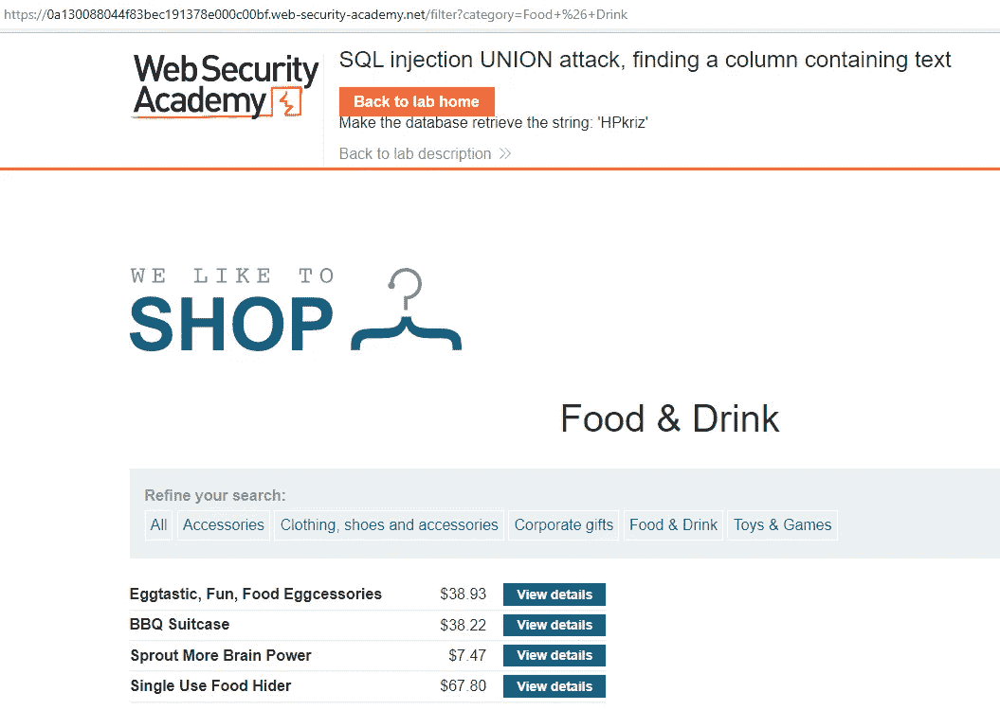
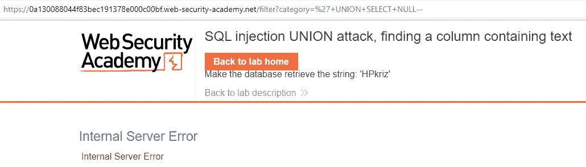
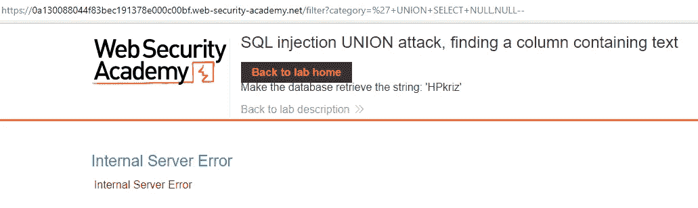
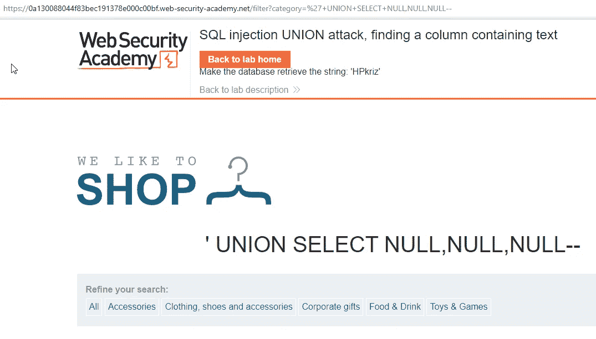
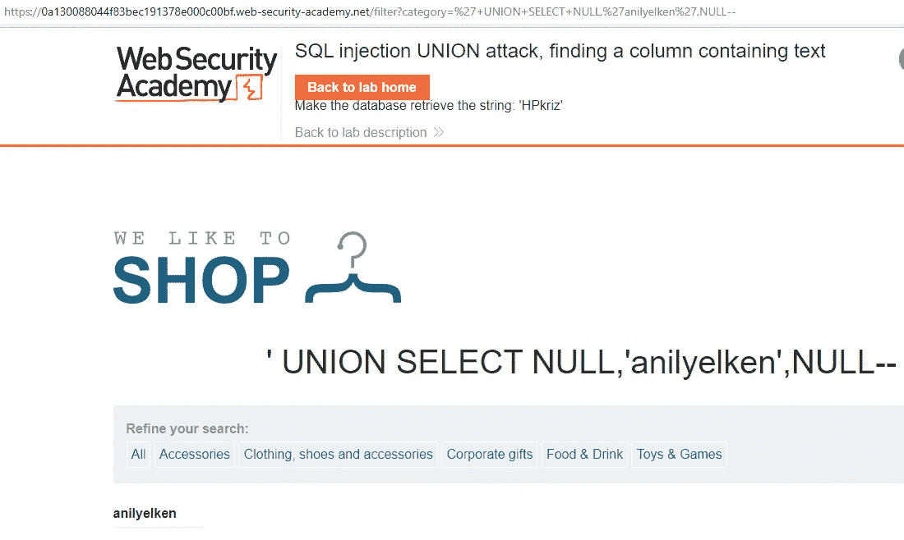
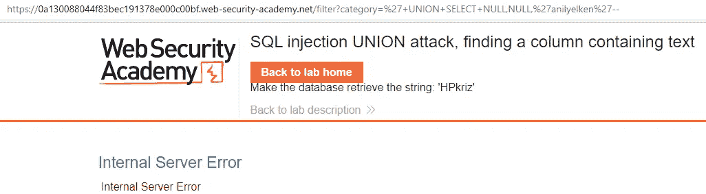
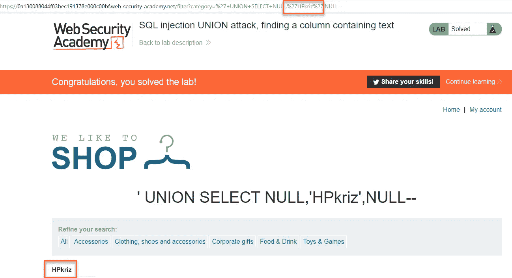

# PortSwigger Web Security Academy 实验室:SQL 注入联盟攻击，发现包含文本的列

> 原文：<https://infosecwriteups.com/portswigger-web-security-academy-lab-sql-injection-union-attack-finding-a-column-containing-text-f67728a4240a?source=collection_archive---------1----------------------->

在本实验中，我们将首先确定使用 SQL 注入漏洞的列数。然后，我们将确定从哪一列提取的数据写入哪个字段。如果需要，我们可以安排用 UNION 进行的 SQL 查询来收集关于数据库的信息。

+UNION+SELECT+NULL —

+UNION+SELECT+NULL，NULL —

通过不断增加上面的有效负载语句，我们添加空语句，直到屏幕上没有任何语句，或者直到我们没有收到错误消息。

现在，让我们写一个字符串来确定哪一列的数据被写入哪个字段，而不是 NULL。已经确定第二列中的表达式打印在屏幕上。

我们确保打印出的是表达式“HPkriz”，而不是我写的表达式“anilyelken”。这样，实验就完成了。

来自 Infosec 的报道:Infosec 上每天都会出现很多难以跟上的内容。 [***加入我们的每周简讯***](https://weekly.infosecwriteups.com/) *以 5 篇文章、4 个线程、3 个视频、2 个 Github Repos 和工具以及 1 个工作提醒的形式免费获取所有最新的 Infosec 趋势！*