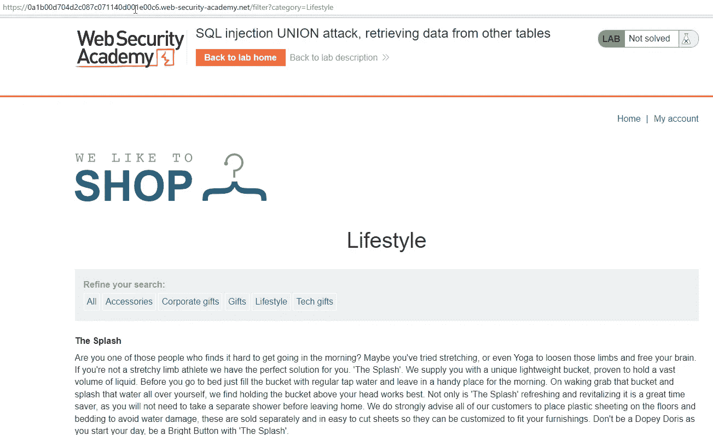
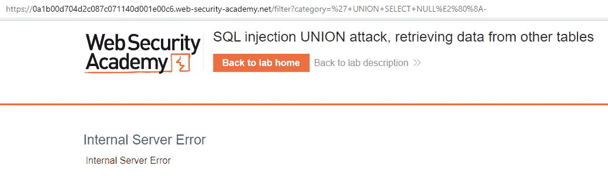
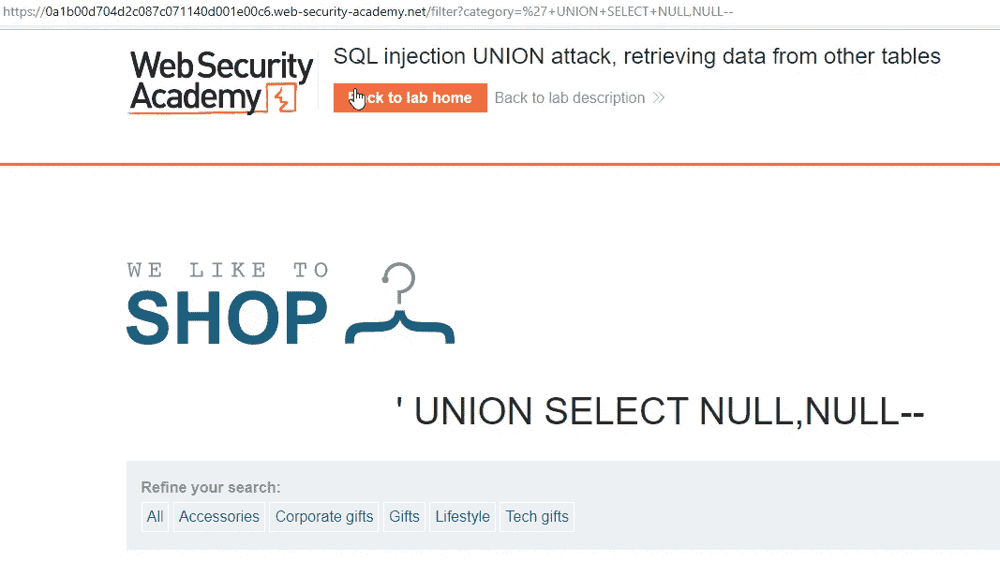
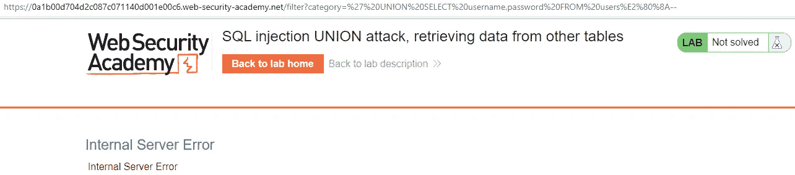
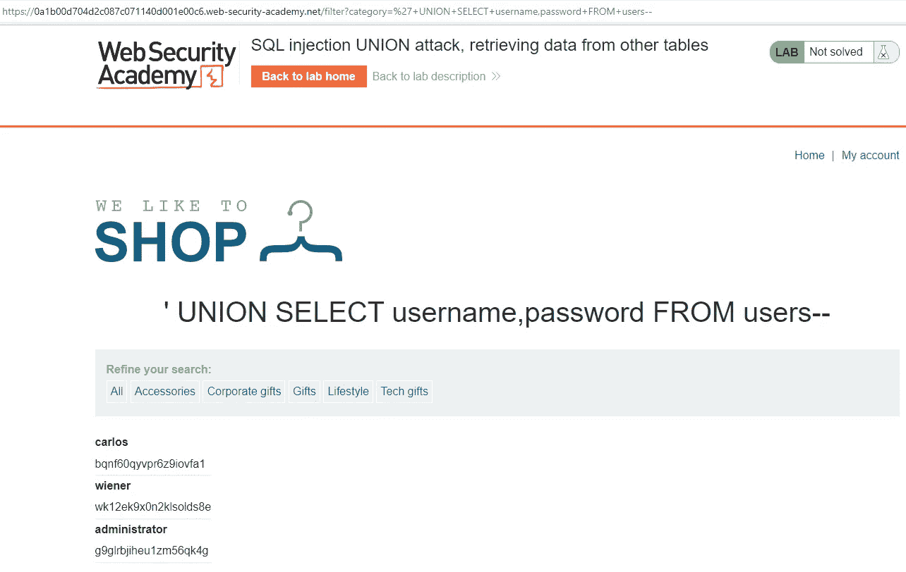
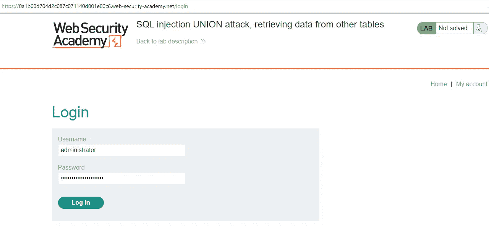
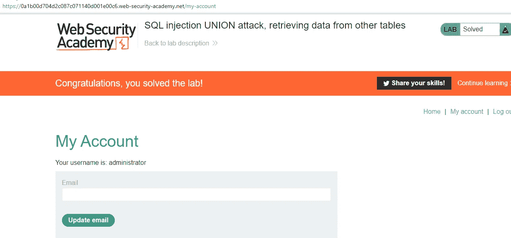

# PortSwigger 网络安全学院实验室:SQL 注入联盟攻击，从其他表中检索数据

> 原文：<https://infosecwriteups.com/portswigger-web-security-academy-lab-sql-injection-union-attack-retrieving-data-from-other-tables-92d776fa0059?source=collection_archive---------2----------------------->

在本文中，请求利用 SQL 注入漏洞获取用户表中的用户名和密码信息。

让我们首先确定列的数量:

联合选择空值—

+UNION+SELECT+NULL —

我们发现有两列。

为此，我们可以使用 UNION 关键字创建 SQL 查询，如下所示。

UNION SELECT 用户名，来自用户的密码—

+联合+选择+用户名，密码+发件人+用户- -

让我们用管理员用户登录系统。

成功登录后，我们完成了实验。

来自 Infosec 的报道:Infosec 上每天都会出现很多难以跟上的内容。 [***加入我们的每周简讯***](https://weekly.infosecwriteups.com/) *以 5 篇文章、4 个线程、3 个视频、2 个 Github Repos 和工具以及 1 个工作提醒的形式免费获取所有最新的 Infosec 趋势！*