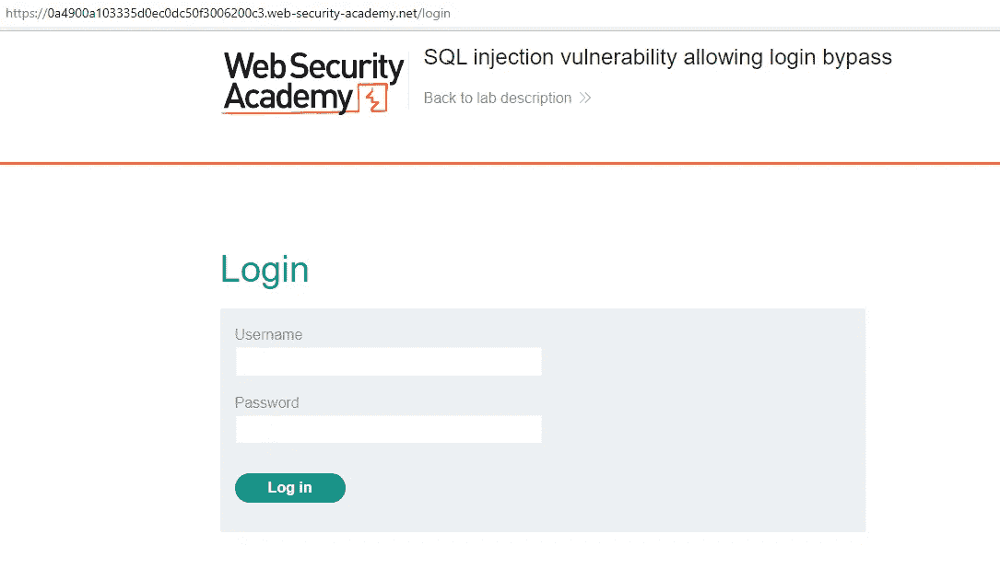
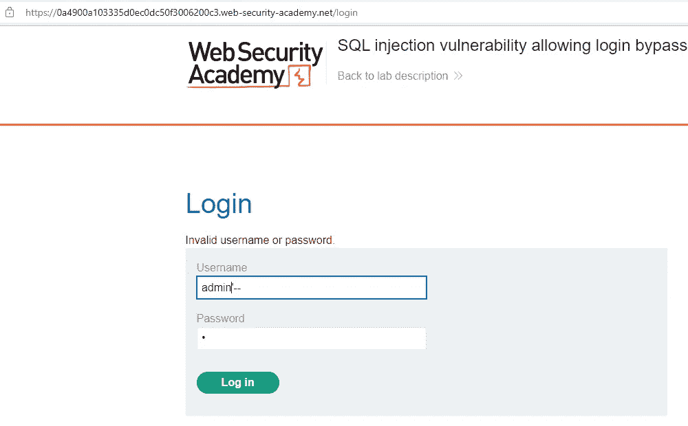
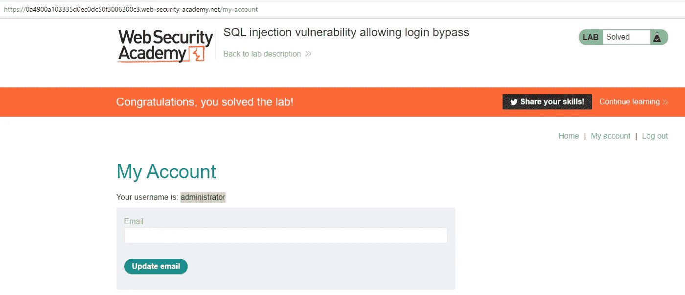

# PortSwigger Web Security Academy 实验室:允许绕过登录的 SQL 注入漏洞

> 原文：<https://infosecwriteups.com/portswigger-web-security-academy-lab-sql-injection-vulnerability-allowing-login-bypass-2cb40fcf4a10?source=collection_archive---------4----------------------->

在这篇文章中，我们将讨论如何绕过 SQL 注入登录页面。

SQL 查询可以如下所示:

select * from users 其中用户名=“”，密码=“”

要绕过这个查询，我们可以将 admin 添加到 username 并关闭引号，然后注释掉表达式的其余部分。

select * from users 其中用户名='admin' —'和密码= ' '

黑色斜体表达式将是我们将使用的有效载荷。斜体表示已经被注释掉了。

已为管理员用户尝试了以下有效负载:

“管理员”

在这种情况下，可能的 SQL 查询是:

select * from users 其中 username = ' administrator '—' and password = ' '当我们输入有效负载时，登录成功并定向到电子邮件更新页面。

来自 Infosec 的报道:Infosec 上每天都会出现很多难以跟上的内容。 [***加入我们的每周简讯***](https://weekly.infosecwriteups.com/) *以 5 篇文章、4 个线程、3 个视频、2 个 Github Repos 和工具以及 1 个工作提醒的形式免费获取所有最新的 Infosec 趋势！*