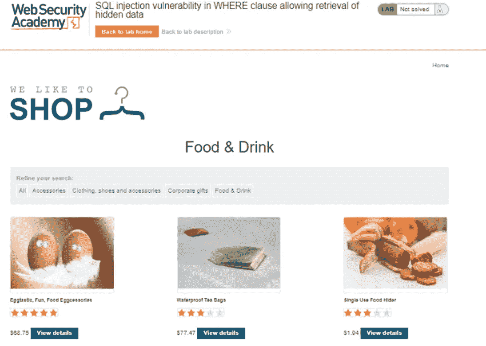
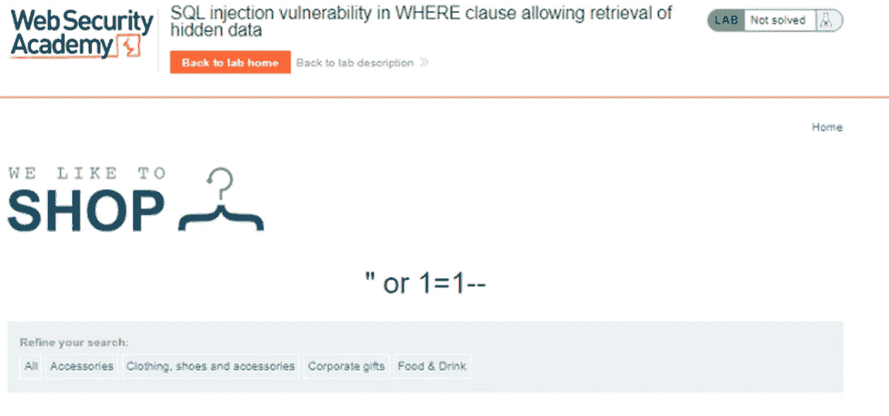
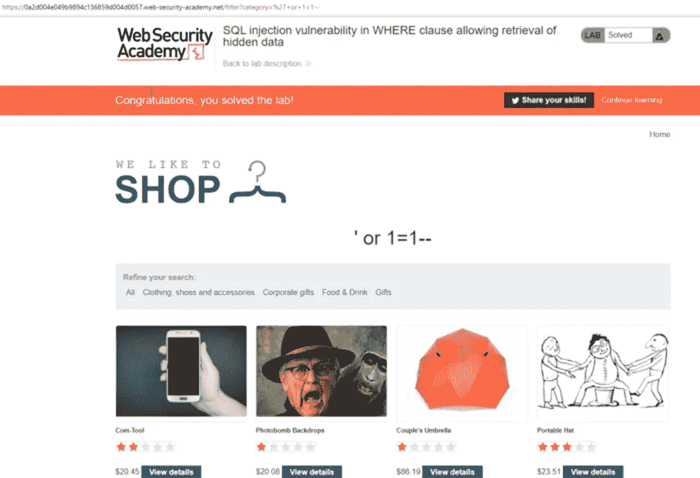

# PortSwigger Web Security Academy Lab:WHERE 子句中的 SQL 注入漏洞允许检索隐藏数据

> 原文：<https://infosecwriteups.com/portswigger-web-security-academy-lab-sql-injection-vulnerability-in-where-clause-allowing-be11d2611987?source=collection_archive---------2----------------------->

你好，

在本系列文章中，我们可以讨论 PortSwigger Web Security Academy 实验室的解决方案。第一个实验室:

**实验室:允许检索隐藏数据的 WHERE 子句中的 SQL 注入漏洞**

如果在“类别”字段中进行选择，页面上显示的对象会发生变化。人们认为该类别中的信息是出于这个原因从数据库中提取的。

[https://0a 2d 004 e 049 b 9894 c 136859d 004d 0057 . we b-security-academy . net/filter？类别=公司+礼品](https://0a2d004e049b9894c136859d004d0057.web-security-academy.net/filter?category=Corporate+gifts)

[https://0a 2d 004 e 049 b 9894 c 136859d 004d 0057 . we b-security-academy . net/filter？类别=食物+% 26+饮料](https://0a2d004e049b9894c136859d004d0057.web-security-academy.net/filter?category=Food+%26+Drink)

访问网页的 SQL 查询如下:

select * from table _ name where category = ' '

在使用 GET 方法发出的查看所有表中数据的请求中，category 变量的以下值和页面返回的响应如下:

“或者 1=1 —

成功的有效负载:'+或+1=1 —

因为带-的注释行后面的所有字符都将被视为注释，所以 SQL 查询后面的语句不再重要。

*来自 Infosec 的报道:Infosec 上每天都会出现很多难以跟上的内容。* [***加入我们的每周简讯***](https://weekly.infosecwriteups.com/) *以 5 篇文章、4 个线程、3 个视频、2 个 Github Repos 和工具以及 1 个工作提醒的形式免费获取所有最新的 Infosec 趋势！*