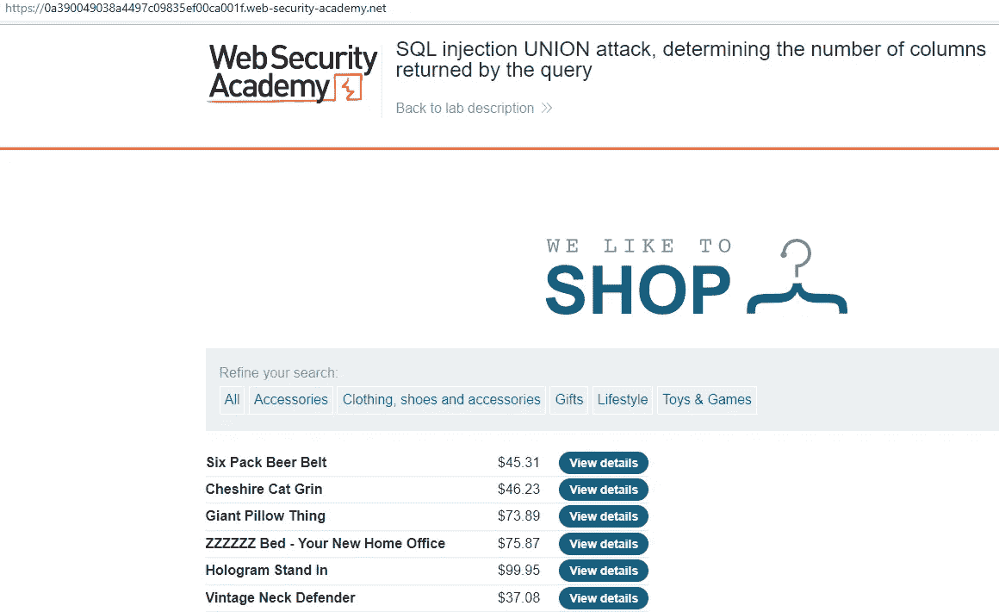
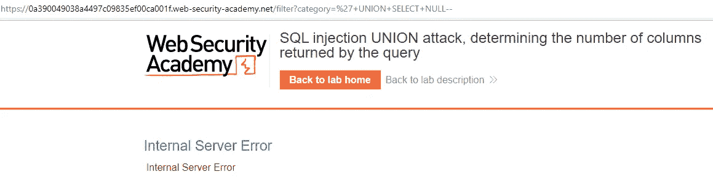
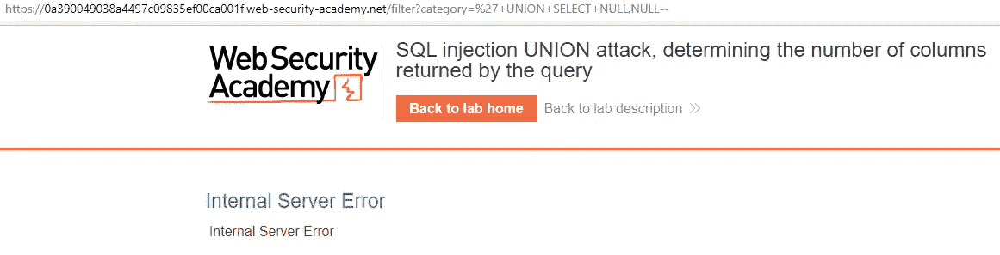
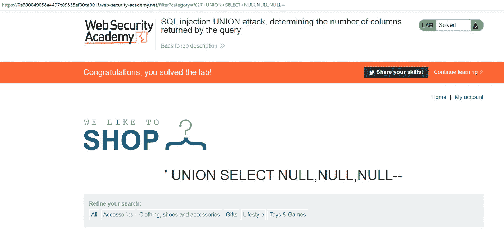

# PortSwigger Web 安全实验室:SQL 注入联合攻击，确定查询返回的列数

> 原文：<https://infosecwriteups.com/portswigger-web-security-lab-sql-injection-union-attack-determining-the-number-of-columns-5f0a4fa95e5e?source=collection_archive---------2----------------------->

您好，在本文中，我们将讨论 SQL 注入联盟攻击的解决方案，确定 Port Swigger Web Security Lab 中查询实验室返回的列数。

我们记得在类别参数中有 SQL 注入。我们可以使用以下有效负载来检测一个表中有多少列:

联合选择 1，2，3，…, —

UNION SELECT NULL，NULL，NULL，。—

+UNION+SELECT+NULL，NULL，NULL —

+联合+选择+1，2，3 —

对于解决方案，应该继续添加该值，直到错误消息消失，或者直到出现包含空值的内容。

或者我们可以尝试使用 order by 来检测列的数量。如果我们得到一个错误，我们可能会认为我们已经超过了列数。

按 1 排序—

按 2 排序—

按 3 排序—

来自 Infosec 的报道:Infosec 上每天都会出现很多难以跟上的内容。 [***加入我们的每周简讯***](https://weekly.infosecwriteups.com/) *以 5 篇文章、4 个线程、3 个视频、2 个 Github Repos 和工具以及 1 个工作提醒的形式免费获取所有最新的 Infosec 趋势！*