# 邮递员— HackTheBoxWriteup

> 原文：<https://infosecwriteups.com/postman-hacktheboxwriteup-6a184e272ba3?source=collection_archive---------1----------------------->

## Postman 是一个易难度机器，其特征是在[**【Redis】**](https://redis.io/)**、**上执行未经授权的代码，破解加密的 SSH 密钥来获取用户。对于 root 用户，我们利用了存在密码重用的 Webmin 包更新漏洞。在附加部分中，我介绍了以 root 用户身份执行命令的另一种方法，并对密码更改功能进行了一些调整。

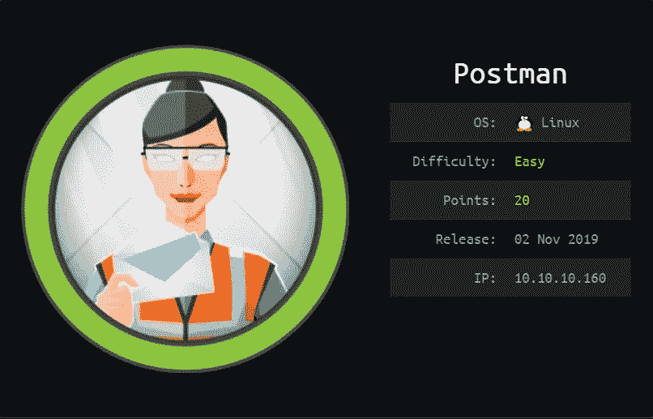

由于忙于我的 OSCP，我已经很久没有发表文章了。

***更新 2020 年 3 月 17 日*** *:我过了 OSCP*

# 列举

像往常一样，让我们从 Nmap 扫描开始。

```
**22/tcp    open  ssh     OpenSSH 7.6p1 Ubuntu 4ubuntu0.3 (Ubuntu Linux; protocol 2.0)
| ssh-hostkey: 
|   2048 46:83:4f:f1:38:61:c0:1c:74:cb:b5:d1:4a:68:4d:77 (RSA)
|   256 2d:8d:27:d2:df:15:1a:31:53:05:fb:ff:f0:62:26:89 (ECDSA)
|_  256 ca:7c:82:aa:5a:d3:72:ca:8b:8a:38:3a:80:41:a0:45 (ED25519)
80/tcp    open  http    Apache httpd 2.4.29 ((Ubuntu))
|_http-server-header: Apache/2.4.29 (Ubuntu)
|_http-title: The Cyber Geek's Personal Website
6379/tcp open  redis   Redis key-value store 4.0.9
10000/tcp open  http    MiniServ 1.910 (Webmin httpd)
|_http-title: Site doesn't have a title (text/html; Charset=iso-8859-1).
Service Info: OS: Linux; CPE: cpe:/o:linux:linux_kernel**
```

# 80 — HTTP

访问[**http://10 . 10 . 10 . 160**](http://10.10.10.160)向我们展示了一个个人博客页面。


这里似乎没有什么有趣的东西，还有《捉鬼敢死队》。继续到其他端口…

# 10000 —网民

我们有一条重定向消息。

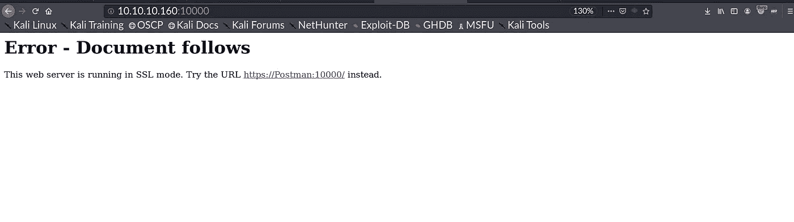

让我们将`**Postman**`添加到我们的主机文件中

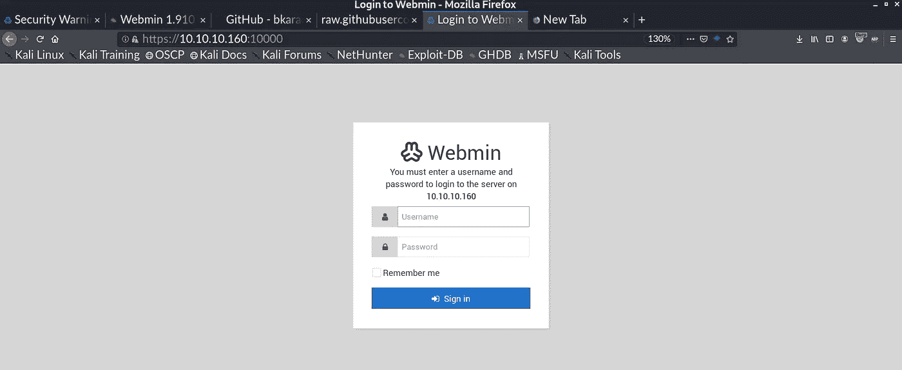

尝试使用一些默认凭证似乎无法让我们登录。转移到其他端口…

# 6379 — Redis

> Redis 是开源的(BSD 许可)，内存中的**数据结构存储**，用作数据库、缓存和消息代理。支持范围查询的[字符串](https://redis.io/topics/data-types-intro#strings)、[哈希](https://redis.io/topics/data-types-intro#hashes)、[列表](https://redis.io/topics/data-types-intro#lists)、[集合](https://redis.io/topics/data-types-intro#sets)、[排序集合](https://redis.io/topics/data-types-intro#sorted-sets)、位图、[超级日志](https://redis.io/topics/data-types-intro#hyperloglogs)、半径查询的[地理空间索引](https://redis.io/commands/geoadd)和[流](https://redis.io/topics/streams-intro)等数据结构。Redis 内置了[复制](https://redis.io/topics/replication)、 [Lua 脚本](https://redis.io/commands/eval)、 [LRU 驱逐](https://redis.io/topics/lru-cache)、[事务](https://redis.io/topics/transactions)和不同级别的[磁盘持久化](https://redis.io/topics/persistence)，并通过 [Redis Sentinel](https://redis.io/topics/sentinel) 和 [Redis Cluster](https://redis.io/topics/cluster-tutorial) 自动分区提供高可用性。

我们在机器上安装了 **Redis 键值存储 4.0.9** 。

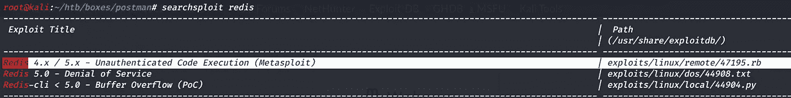

> [***https://book . hack tricks . XYZ/pentesting/6379-pentesting-redis***](https://book.hacktricks.xyz/pentesting/6379-pentesting-redis)*是很好的参考。*

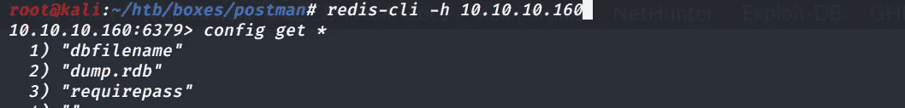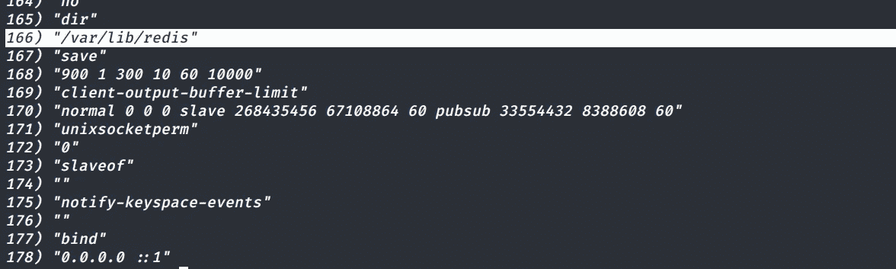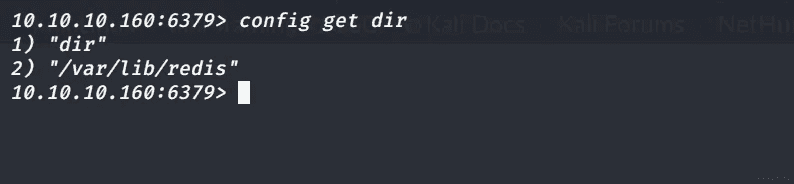

按照上面文章中提到的步骤。我们得到路径为`**/var/lib/redis/**`

在下面的漏洞利用中，更改 SSH 文件夹的路径会给我们一个作为 Redis 用户的 shell。

将行[**https://github . com/Avinash-acid/Redis-Server-Exploit/blob/master/Redis . py # L39**](https://github.com/Avinash-acid/Redis-Server-Exploit/blob/master/redis.py#L39)**改为**

```
**cmd4 = cmd1 + ' config set  dir' + " /var/lib/redis/.ssh/"**
```

# **作为 redis 的 Shell**

**`**python redis.py 10.10.10.160 redis**`**

**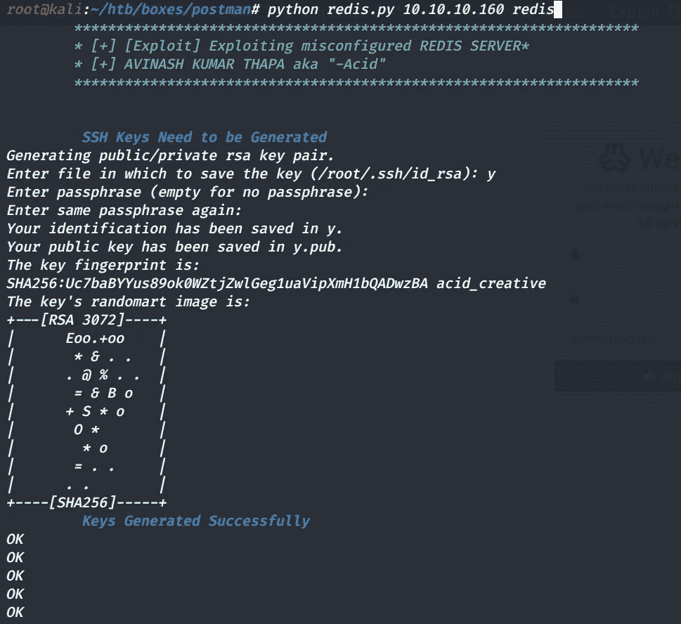****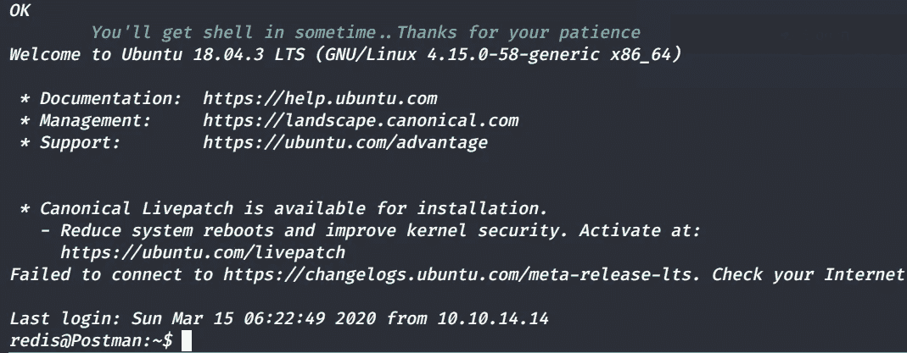**

# **无光泽外壳**

**在枚举文件系统时，我们在`**/opt**`文件夹中有备份 RSA 密钥，它是加密的。让我们将文件传输回 Kali 虚拟机。**

**利用[**ssh 2 John . py**](https://raw.githubusercontent.com/koboi137/john/bionic/ssh2john.py)**，**我们来破解 id_rsa.bak 文件。**

**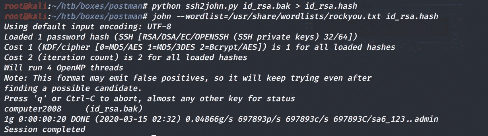**

**`**computer2008**` 是密码。既然我们知道，`**Matt**` 是机器上的有效用户，让我们尝试通过 SSH 登录。**

**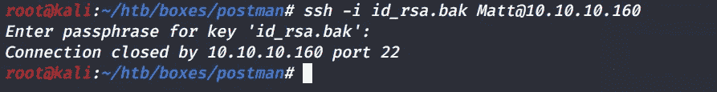**

**SSH 正在服务器上运行，但我们似乎无法登录，因为服务器正在关闭连接。**

**使用`**su Matt**` 我们可以得到用户标志。**

# ****外壳为亚光****

**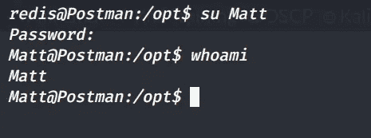**

**因为我们有一组有效的凭证，并且从 Nmap 扫描中，我们让 Webmin 运行，这需要凭证。让我们看看是否有密码重用。**

# ****Privesc Matt - > Root****

**使用`**Matt : computer2008**` 我们可以登录 Webmin 面板，它运行的是 1.910 版本(来自 Nmap 扫描)。**

**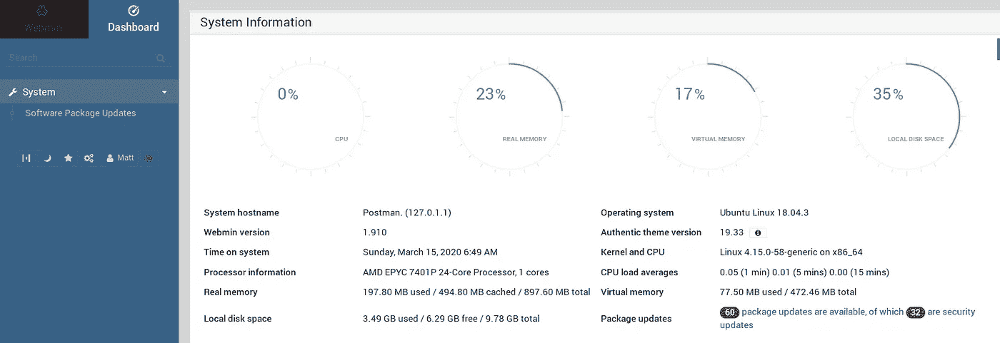**

**软件包更新功能可用。有一个远程代码执行 MSF 模块可以实现同样的功能，**

**[](https://www.exploit-db.com/exploits/46984) [## 攻击性安全利用数据库档案

### Webmin 1.910 -“包更新”远程命令执行(Metasploit)。CVE-2019-12840。Linux 的远程利用…

www.exploit-db.com](https://www.exploit-db.com/exploits/46984) 

让我们启动 MSF，以下是选项。

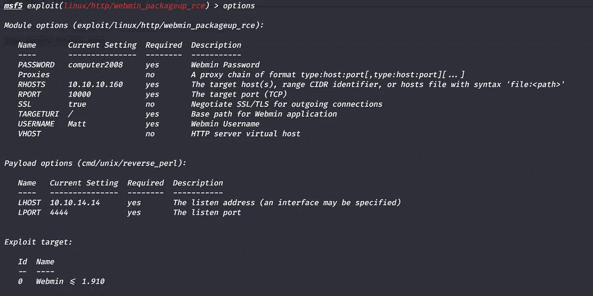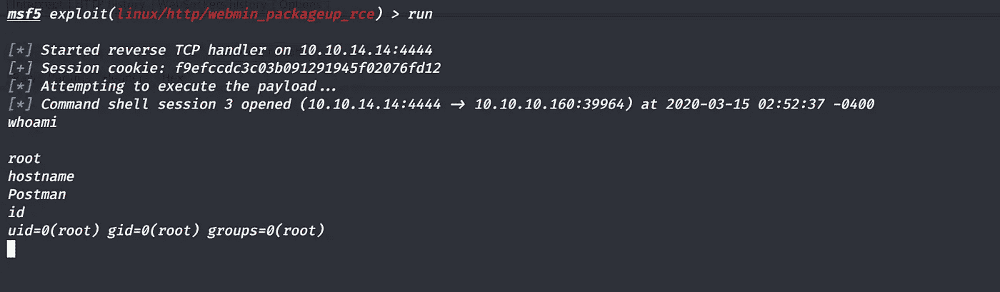

这就是我们的根命令 shell。

# 附加— Webmin 1.920 未授权 RCE

软件包更新 RCE 为 CVE:[2019–12840](https://nvd.nist.gov/vuln/detail/CVE-2019-12840)，漏洞发布于 2019–06–11。有最新的未经认证的 RCE 对 Webmin 1.920 的密码重置功能。

这是未授权 RCE 后密码重置的漏洞。CVE[2019–15107](https://nvd.nist.gov/vuln/detail/CVE-2019-15107)

视频剥削同样，[https://www.youtube.com/watch?v=MehGoua01Zg](https://www.youtube.com/watch?v=MehGoua01Zg)

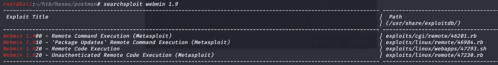

让我们试试 MSF 模块。

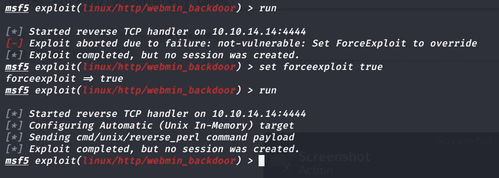

没用。但是手动访问[https://postman:10000/password _ change . CGI](https://postman:10000/password_change.cgi)给我们一个警告

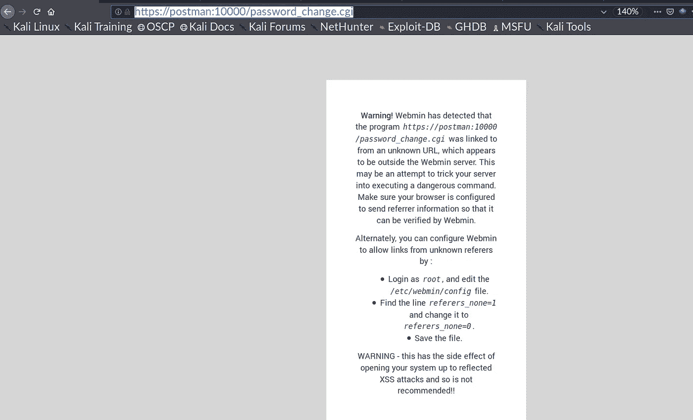

让我们做警告页面中提到的更改。

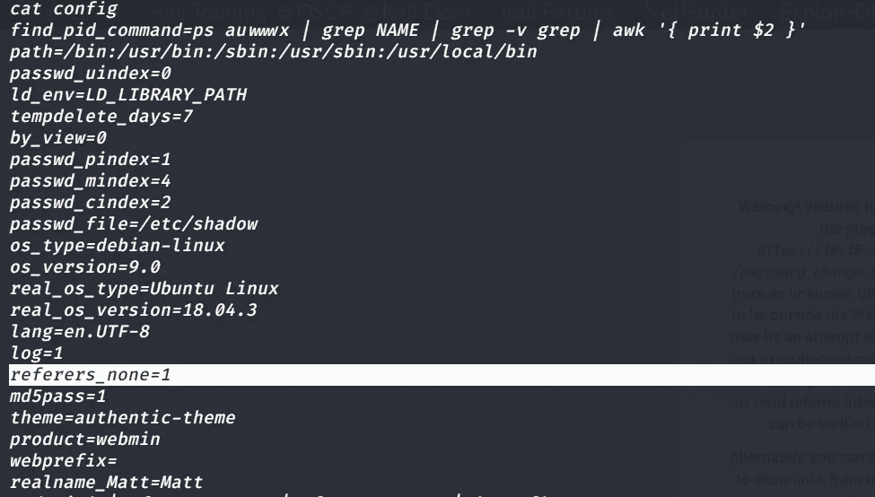

```
**sed -i 's|referers_none=1|referers_none=0|g' config**
```

现在服务器说，

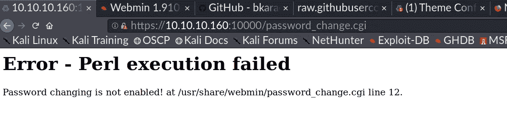

让我们改变一下`**/usr/share/webmin/password_change.cgi**`

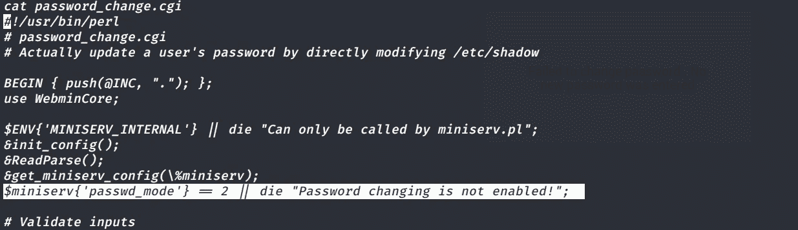

我已经将高亮显示的行更改为`**$miniserv{'password_mode'} == 2**`

并刷新了[https://10 . 10 . 10 . 160:10000/password _ change . CGI](https://10.10.10.160:10000/password_change.cgi)

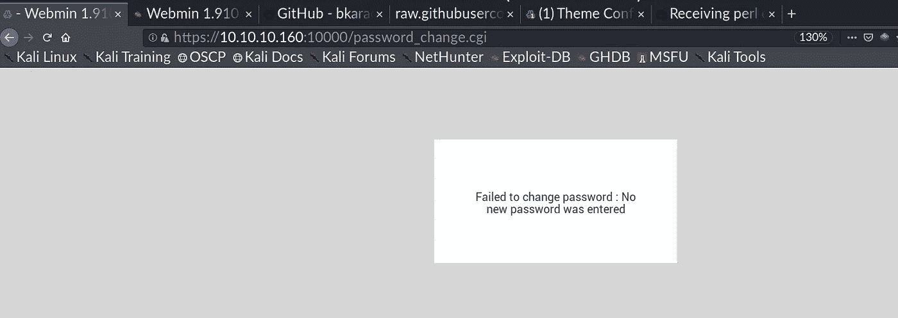

让我们再次运行 MSF 模块。以下是选项。

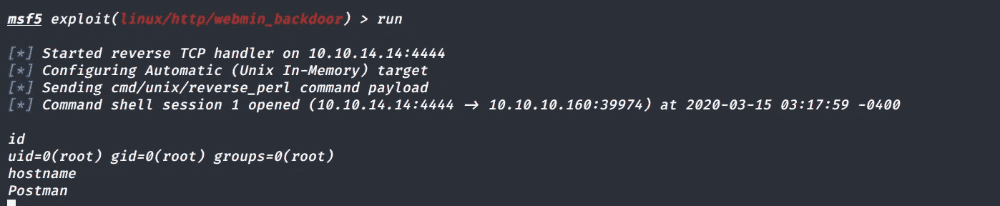

这就是了，我们以 root 用户身份执行命令

谢谢，祝黑客快乐！希望你喜欢阅读这篇文章，并学到一些新技巧。** 

***关注* [*Infosec 报道*](https://medium.com/bugbountywriteup) *获取更多此类精彩报道。***

**[](https://medium.com/bugbountywriteup) [## 信息安全报道

### 收集了世界上最好的黑客的文章，主题从 bug 奖金和 CTF 到 vulnhub…

medium.com](https://medium.com/bugbountywriteup)**