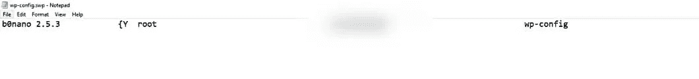
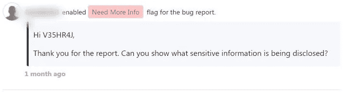
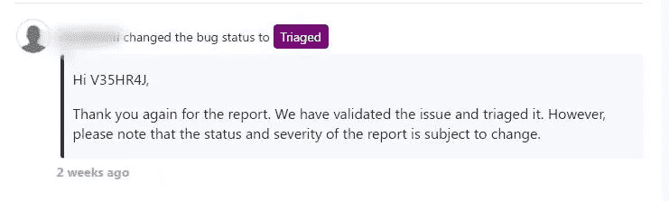
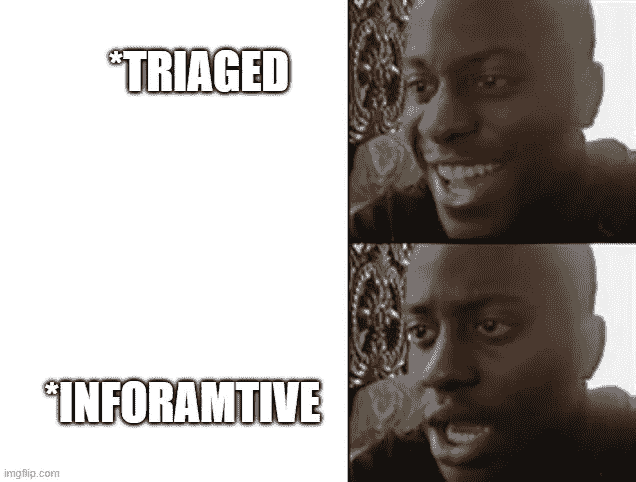
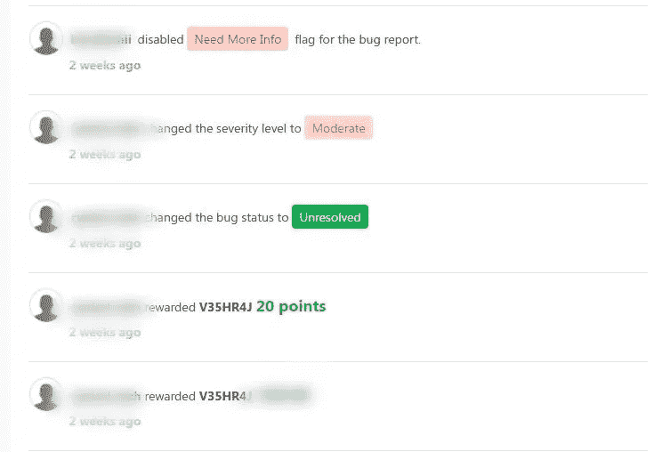

# 侦查的力量:轻松取胜(Vim 攻击)

> 原文：<https://infosecwriteups.com/power-of-recon-easy-win-vim-attack-e38edba7e562?source=collection_archive---------2----------------------->

大家好，我是来自尼泊尔的 Veshraj Ghimire。这是我的第二篇文章，在这篇文章中，我将告诉你一个我完全意想不到的赏金故事，这个故事只有通过侦察才有可能实现。

所以，不浪费你的时间，让我快速地讲一个我的小故事。

让我们开始:V

> 严重性:中等

一天，当我在[*【Bugv】*](https://bugv.io)看节目时，我浏览了一个 WordPress 网站。首先，我访问了该网站，并检查我是否可能会发现一些有趣的东西，但该网站似乎是静态的，所以我没有发现任何有趣的东西。然后我计划枚举子域，但最终一无所获。

根本没有子域:V

然后，像往常一样，我开始用 SecList 的 [*ffuf*](https://github.com/ffuf/ffuf) 使用 [*这个*](https://raw.githubusercontent.com/danielmiessler/SecLists/master/Discovery/Web-Content/dirsearch.txt) 单词表来模糊主域，期望得到一些有用的东西。

让我们模糊它:V

过了一段时间，我发现了一个不寻常的公开文件，这是我从未在任何目标上看到过的。该文件是:

> /wp-config.swp

得去看看:V

发现端点后，我在浏览器上打开它，它在我的电脑上下载了一个名为 wp-config.swp 的文件，基本上包含编辑器名称、版本、根目录和用户名，如下图所示:

用户名模糊:V

看到这种情况，我很快谷歌了一下。swp 文件，并了解到系统使用*交换文件将内存暂时“交换”到磁盘。*

文件似乎很有趣:V

为了避免重复，我很快就报告了，因为我们都知道这是非常痛苦的。但是我的概念验证不够充分，因为没有显示合理的文件，他们将其标记为需要更多信息。

需要更多信息:V

好的:V

有了这个回复，我有点高兴知道它不是重复的。所以现在我必须更加努力地研究来展示它的影响。然后我开始了我的研究，过了一段时间，我得到了 [*这篇*](https://webdevetc.com/blog/how-to-get-someones-database-credentials-while-they-are-editing-config-files-on-a-live-server/#section_proof-of-concept) 文章，解释了某人如何利用同一个漏洞获取数据库凭证。我就像哇哦，很有趣！！

兴趣:V

然后在读了那篇有趣的文章后，我开始创建自己的概念证明。我很快在我的 VPS 中安装了 WordPress，然后制作了一个视频，展示了如果用 vim 编辑文件，有人如何获得数据库凭证。在此，我附上了我发给他们的 POC:

> 总结:
> 
> 设置一个脚本，保持每秒下载几次 http://target.com/.wp-config.php.swp。如果有人正在 Vim 中编辑服务器上的文件，并且您下载了该 URL，您将获得交换文件。下载完成后，只需运行 vim -r .wp-config.php.swp，在 vim 对话框中按 enter 键，您应该会看到他们对文件所做的任何更改。这其实没什么大不了的，但是如果您知道某人正在编辑公共目录(/public，/public_html/ etc)中的文件，并且使用 Vim 而不改变默认的交换文件目录，那么他就可能会利用这一点。

概念验证:五

经过几天的审查，它得到了审判。但这让我有点困惑。因为我以前从未在任何报道/黑客活动中见过类似的报告，
所以我不知道严重性，所以我以低严重性报告了它，但他们在分类时的评论让我感到困惑，因为敏感信息实际上并没有被披露，但这是可能的。所以我很担心。

严重性可能会发生变化: (

因为他们提到“严重性是可以改变的”，我也觉得他们可能会在某个地方将其更改为信息性的并关闭它。我祈祷上帝不要发生这样的事

我担心的是

但是感谢上帝，可能是我的祈祷起作用了，所以它没有发生，几天后嘣！！！，严重性被改为中等，他们奖励我$ 🥳🥳

波利时代🥳🥳

快乐的我跳舞:V

> 时间线:
> 
> 报道时间:2021 年 04 月 08 日 17 时 49 分
> 
> 需要更多信息:2021 年 4 月 9 日 11:09
> 
> POC 视频发送时间:2021 年 4 月 9 日 12:07
> 
> 已分类:2021 年 4 月 27 日 10 时 59 分
> 
> 将安全级别从低更新为中:2021 年 5 月 2 日 08:27
> 
> 奖励$ $:2021 年 05 月 02 日 08:27

外卖:

1.  永不放弃，永远努力证明影响。
2.  当什么都没有了，模糊的。

如果你愿意，可以在 [*推特*](https://twitter.com/GhimireVeshraj) 和我联系。

再见，直到下一篇文章，保持安全，保持快乐。和平✌️✌️