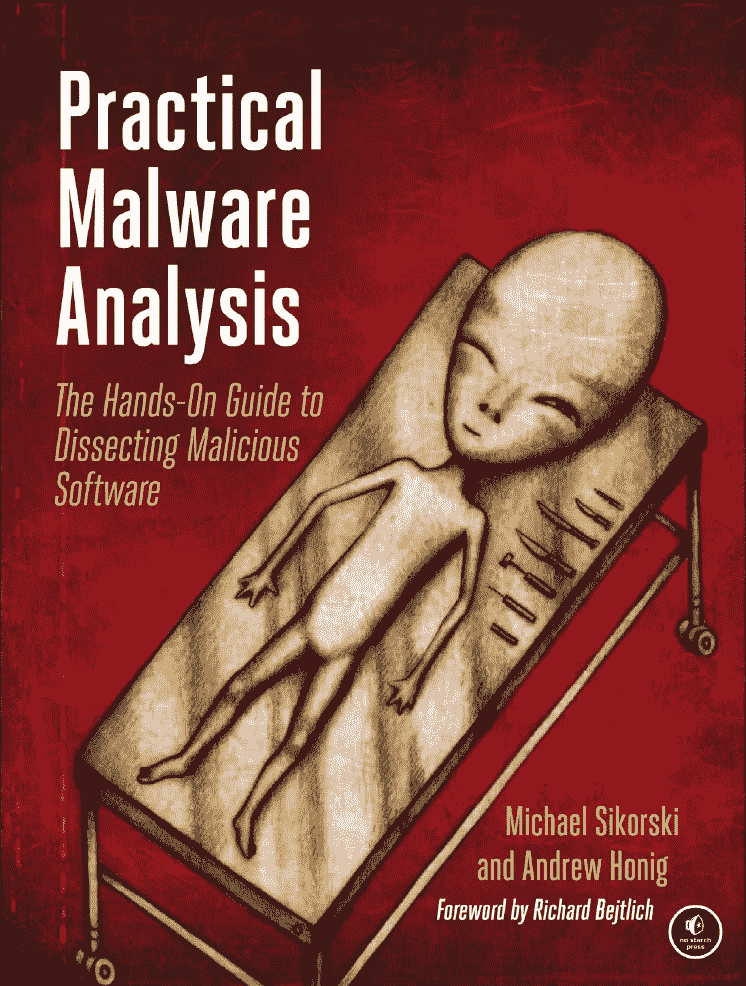
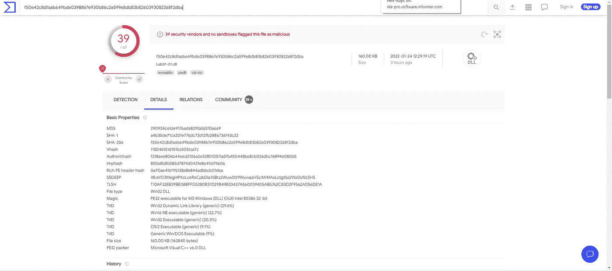
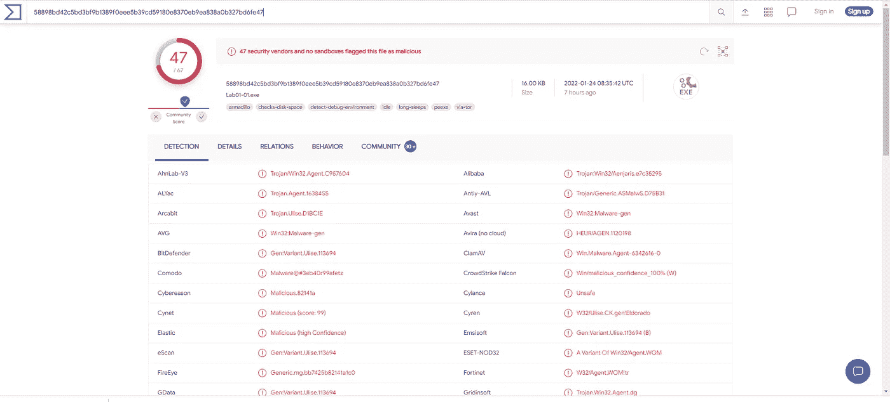
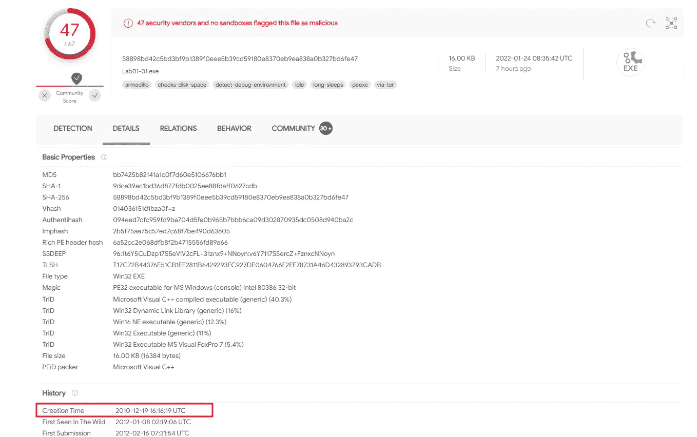
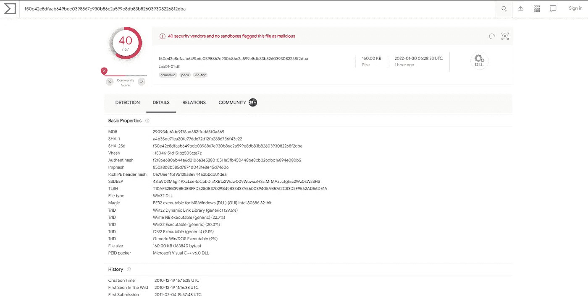
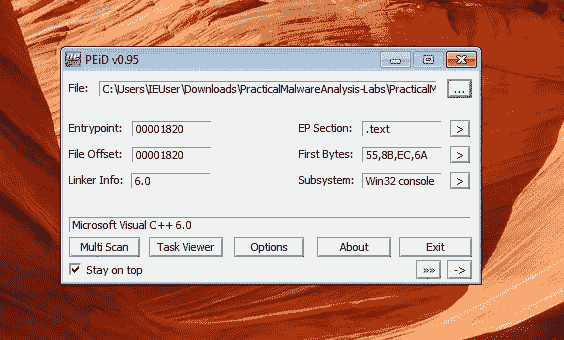
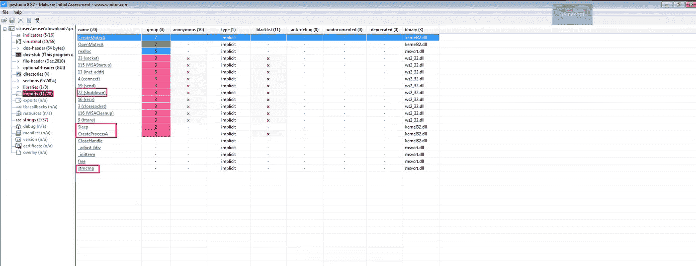
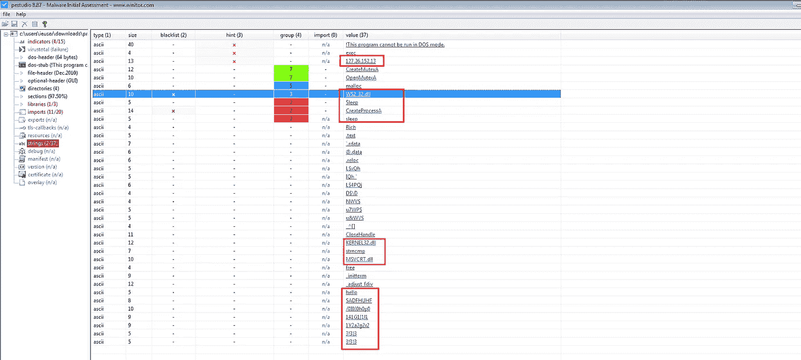
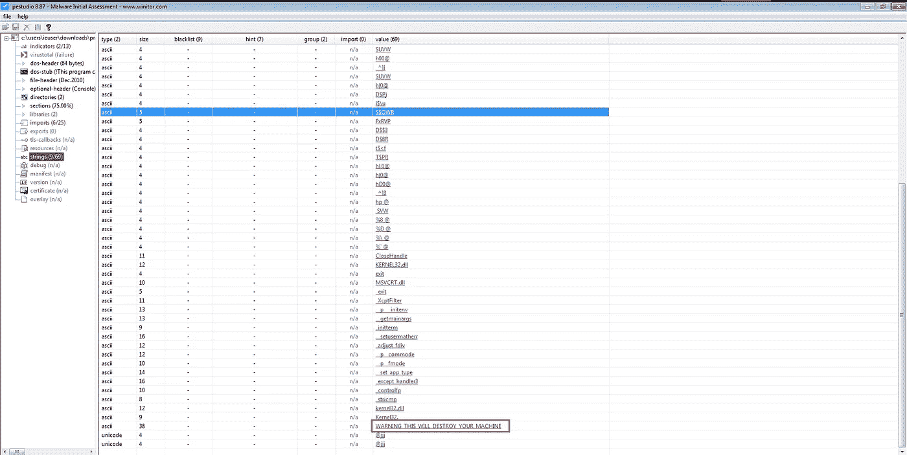

# 实用恶意软件分析实验室第一部分

> 原文：<https://infosecwriteups.com/practical-malware-analysis-lab-part-i-12e39598a77?source=collection_archive---------2----------------------->

本实验室使用 Lab01–01.exe 和 Lab01–01.dll 的文件。使用本章中描述的工具和技术来获取有关文件的信息，并回答下面的问题。

问题

1.  将文件上传到 http://www.VirusTotal.com/[并查看报告。这两个文件是否匹配任何现有的防病毒签名？](http://www.VirusTotal.com/)

这是第一个 dll 文件。这里我们可以看到 VirusTotal 将该文件识别为恶意文件。这意味着该文件与恶意文件的签名相匹配。

分析第二份文件。它是一个 exe(可执行)文件。是的，和第一个一样。证明这个是恶意文件。给定的两个文件是恶意文件。许多反病毒软件检测到这些文件与以前发现的恶意文件的特征相匹配。

2)这些文件是何时编译的？

打开“virustotal 详细信息”部分，我们可以看到大量关于恶意文件的详细信息。创建时间与编译时间相同。是 exe 文件的编译时间。

这里我们可以看到 dll 文件的编译时间。

3)是否有迹象表明这些文件被打包或混淆了？
如果是，这些指标是什么？

在大多数情况下，恶意软件是打包的。打包器有什么用？很简单。打包程序用于压缩或加密整个程序。它完全改变了程序的结构，很难分析。这是恶意软件作者停止或阻止分析阶段的主要目的。许多打包程序都可以在互联网上找到。在大多数情况下，他们使用其中任何一种。

PEiD 是一个用于检测程序所使用的打包程序的工具。这里我们可以看到微软 Visual C++ 6.0 Dll。但不是打包机。它是一个编译器

与 Dll 相同。这两个程序都不使用任何类型的打包程序。但是 PEiD 太旧了。但这已经足够了

在这里，我介绍一个我最喜欢的和最强大的工具来检测包装。众所周知，检测它很容易。这是一个免费的开源工具，而且非常有效。它给你一个深度报告。

4)是否有任何导入暗示了该恶意软件的作用？如果有，它们是哪些进口
？

大多数恶意软件和其他软件程序都在系统库中使用。为什么？这种方法有助于减小程序的规模，提高工作效率。所以在恶意软件执行时，它会导入系统库函数。如果恶意软件动态链接到库，我们可以通过分析 PE 头找到导入的库函数

在 dll 的情况下。这里我使用 PEstudio 来分析可移植的可执行文件。它收集与该可执行文件相关的所有数据。在导入部分，我们可以看到恶意软件使用的库和函数

kernel32.dll，ws2_32.dll，msvcrt.dll 这个库就是恶意软件用的。

> 内核 32。dll 文件是一个 32 位动态链接库文件，在 Windows 中用于**处理内存管理、输入/输出操作、中断、同步和进程创建**。
> 
> ws2_32。dll 是一个动态链接库，用于**处理网络连接**。它是一个与软件进程相关的小程序，类似于 EXE 文件，但是它不给出命令。dll 文件允许应用程序进行通信。
> 
> msvcrt.dll 是一个包含标准 C 库函数的模块，比如 printf、memcpy 和 cos。它是 Microsoft C 运行时库的一部分。

我们可以看到一些不需要的函数调用。在某些情况下，它是恶意的

*   CreateProcess:这个函数创建并启动一个新的进程。如果恶意软件创建了一个新进程，也需要对新进程进行分析。
*   CreateMutexA:该函数创建一个互斥对象，恶意软件可以使用该对象来确保在任何给定的时间只有一个恶意软件实例在系统上运行。恶意软件通常对互斥体使用固定的名称，这可以是检测恶意软件附加安装的良好的基于主机的指示器。

LAB001.exe

在 EXE 的情况下，

*   CreateFile:创建新文件或打开现有文件。
*   FindFirstFile/FindNextFile:这个函数用于搜索一个目录并枚举文件系统。
*   CopyFileA:将现有文件复制到新文件中。

5)在受感染的系统上，有没有其他文件或基于主机的指标可以让您查找
？

这里我们需要检查琴弦。它打印文件中可打印字符的序列。我们发现 dll 和 exe 不是打包的可执行文件，所以我们可以从字符串中找到一些有趣的东西

LAB001.dll

LAB001.exe

6)哪些基于网络的指标可用于在
受感染的机器上发现该恶意软件？

在这里，您可以看到字符串中存在一个 ip 地址。有时，该可执行文件会创建一个到该 ip 地址的外部连接。不确定

7)您认为这些文件的用途是什么？

我认为这是一个间谍软件或后门。因为它的库函数和字符串信息提供了一种恶意的方法。但我是个菜鸟，所以这些是我的发现。

# 🔈 🔈Infosec Writeups 正在组织其首次虚拟会议和网络活动。如果你对信息安全感兴趣，这是最酷的地方，有 16 个令人难以置信的演讲者和 10 多个小时充满力量的讨论会议。[查看更多详情并在此注册。](https://iwcon.live/)

[**https://iwcon.live/**](https://iwcon.live/)