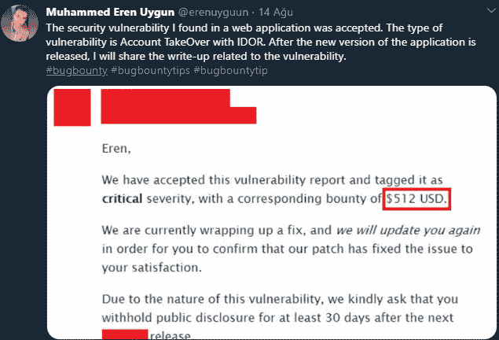
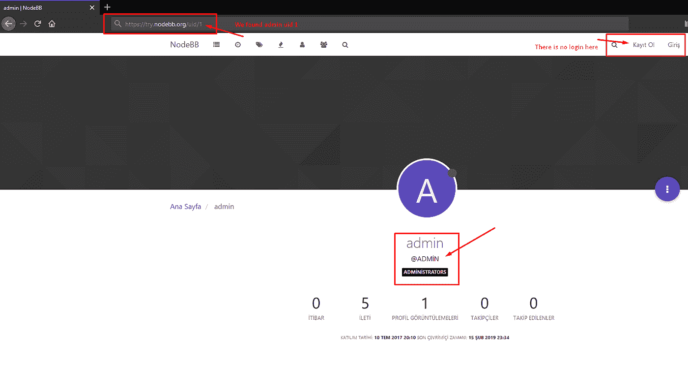
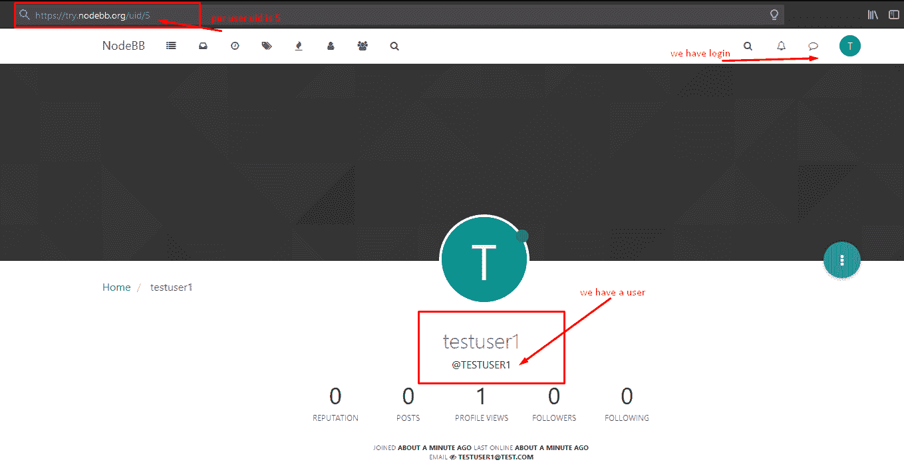
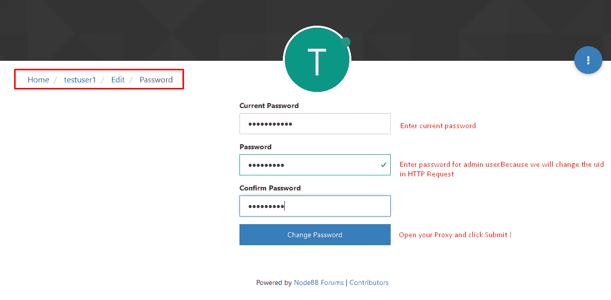
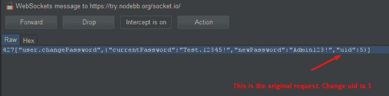
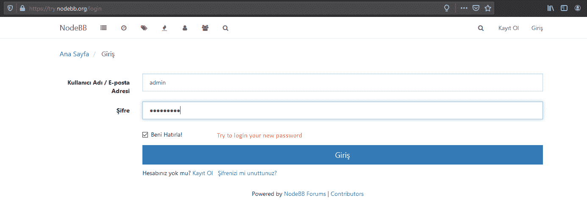
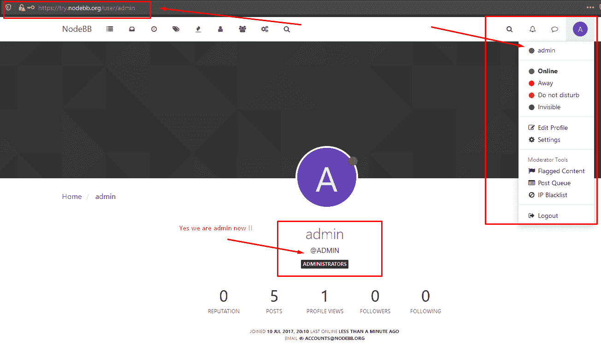

# 通过 NodeBB 论坛软件上的帐户接管提升权限— Bug Bounty (512 美元)—CVE-2020–15149

> 原文：<https://infosecwriteups.com/privilege-escalation-via-account-takeover-on-nodebb-forum-software-512-a593a7b1b4a4?source=collection_archive---------1----------------------->

大家好。

我希望你们都过得好。✌️

大约一个月前，我告诉你，我在一个 web 应用程序中发现了一个帐户接管漏洞，如下图所示。随着带有漏洞的 web 应用程序的新补丁的到来，我现在可以与您分享我是如何发现该漏洞的。

这是我的第一个 bug 赏金写，所以我写 P1 合格的漏洞。,

让我们来谈谈吧。

当我对 NodeBB 论坛软件进行测试时，我发现每个用户帐户的密码都可以更改。

现在，我将告诉您利用此漏洞的步骤。

1.  首先，确定**【admin】**用户的 uid:

[T3【https://try.nodebb.org/uid/*】T5](https://try.nodebb.org/uid/*)

我在标有星号(*)的地方试了试数字，发现 admin 帐户的 **uid** 值是 **1** 。

[**https://try.nodebb.org/uid/1**](https://try.nodebb.org/uid/1)**->**[**https://try.nodebb.org/user/admin**](https://try.nodebb.org/user/admin)

2-我为自己创建了一个名为**“测试用户 1”**的用户。

3-我从我的用户资料转到密码更改页面，在第一个框中输入了我们当前的密码。然后，我在第二个和第三个框中写下了我们想要更改的密码。

4-然后，在按提交按钮之前，我打开了 Burp Suite，它有一个代理选项，我将请求上的 uid 值替换为 1，这是 admin 用户的 uid 值，然后我发送了请求。

5-我在用户名框中写了“admin ”,在密码框中写了我在步骤 5 中写的密码。

6-因此，我获得了“admin”用户的帐户。

因此，由于我在 NodeBB 公司发现的这个漏洞，我赢得了 512 美元的奖金。🏆🏆🏆

可以点击下面的链接查看 NodeBB 论坛软件的名人堂名单。

[**https://blog.nodebb.org/bounty/**](https://blog.nodebb.org/bounty/)

下面是 github 页面的链接，其中包含漏洞已被关闭的信息。

[**https://github . com/nodeb/nodeb/security/advisories/GHSA-hr66-c8pg-5mg 7**](https://github.com/NodeBB/NodeBB/security/advisories/GHSA-hr66-c8pg-5mg7)

我希望你们能从中学到一些东西，如果是这样的话，请击掌。✋

感谢您阅读我的文章。你可以通过下面的链接联系到我。

健康的日子！😷

[https://twitter.com/erenuyguun](https://twitter.com/erenuyguun)

https://www.linkedin.com/in/3ren-uygun/