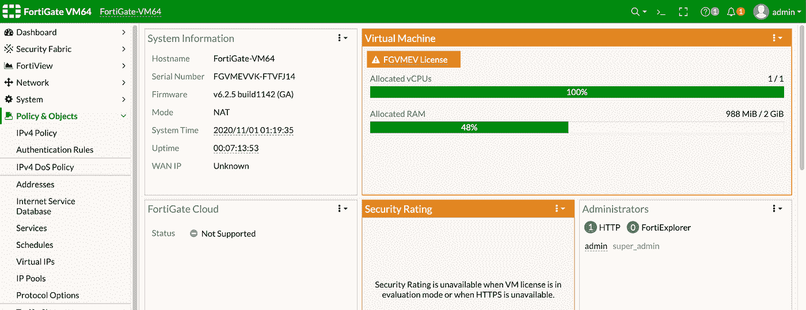
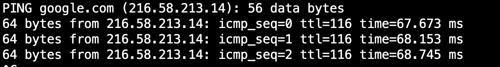
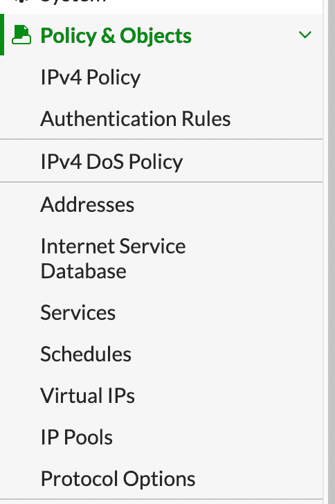
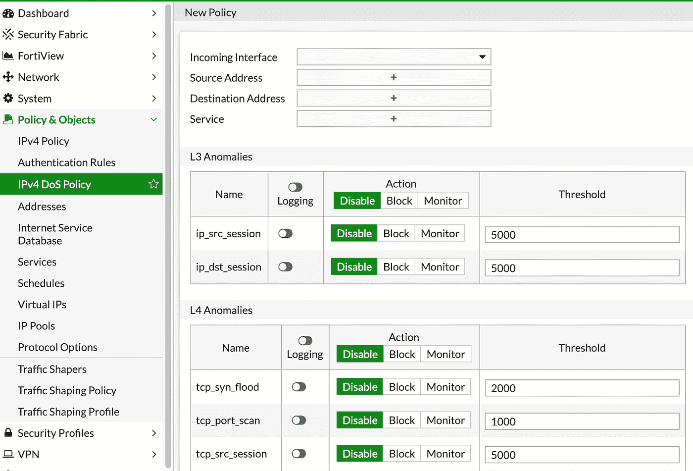
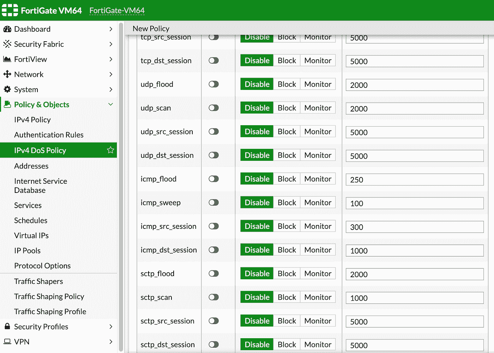
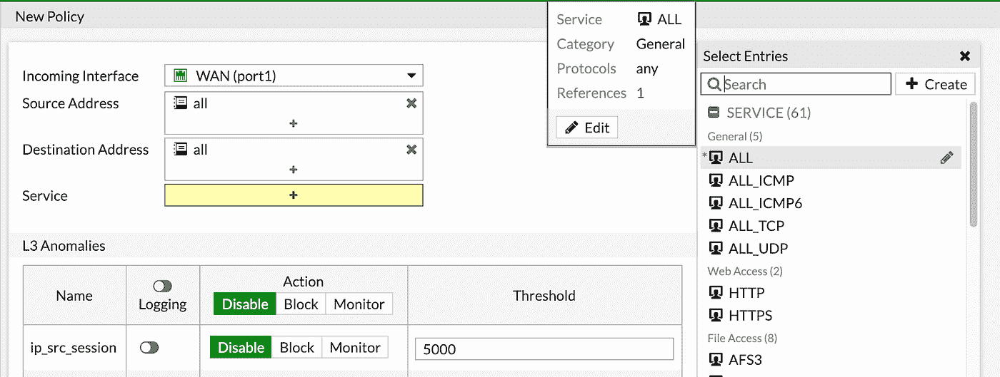
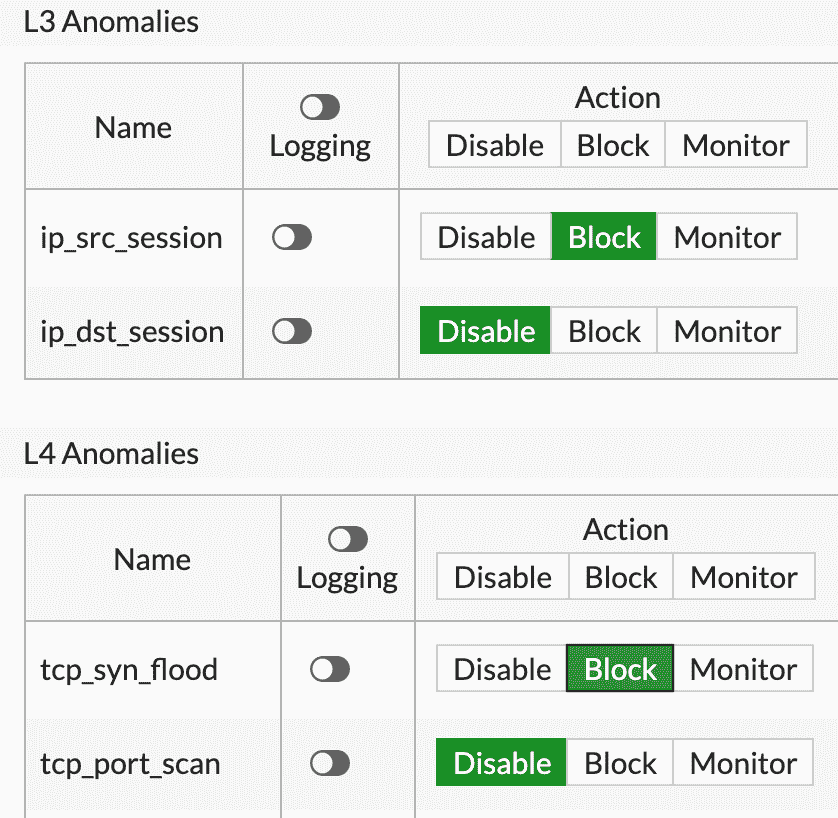
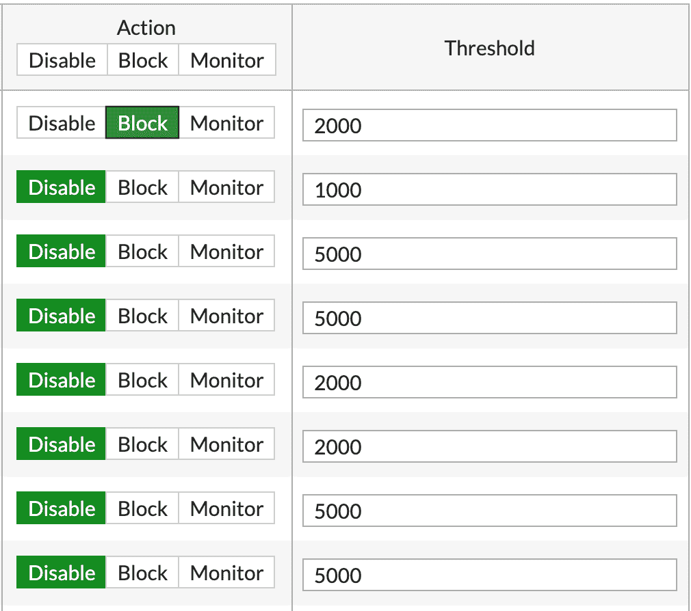
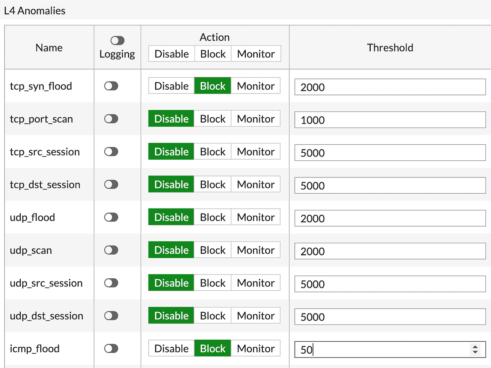

# 使用您的防火墙保护您的企业免受 DoS 攻击

> 原文：<https://infosecwriteups.com/protect-your-business-from-a-dos-attack-with-your-firewall-5f9587ea4af0?source=collection_archive---------1----------------------->

在过去 30 年的所有网络威胁中，拒绝服务攻击可能是对您的企业而言最知名、最复杂的一种。话虽如此，但它是最容易执行的，这里有一篇文章介绍了如何针对我的家用路由器[**https://medium . com/bugbountywriteup/some-may-call-it-a-dos-attack-I-just-tryed-to-find-how-my-streamer-behaviors-under-stress-36 fead 7643 E4？source = friends _ link&sk = 2d cdae 27987 fdf 4 ea 862 e 61 c 47d 7 B3 d 6**](https://medium.com/bugbountywriteup/some-may-call-it-a-dos-attack-i-just-tried-to-find-how-my-streamer-behaves-under-stress-36fead7643e4?source=friends_link&sk=2dcdae27987fdf4ea862e61c47d7b3d6)

# **DoS 攻击有很多种类型，但想法是一样的，攻击者想要摧毁您的关键基础设施，让您的客户和员工无法使用。**

# **坏东西**

*   大多数 DoS 攻击利用众所周知的端口，如端口 80
*   DoS 攻击是分布式的
*   它们可以使用低 CPU 设备如 IP 摄像机来执行
*   仅有防火墙是不够的
*   使用第 3、4 和 7 层的攻击变得越来越复杂
*   IPS 检查将占用其他操作可能需要的资源
*   IPS 引擎的检测可能会导致误报事件
*   新的 DoS 技术出现了

**DOS 攻击可以像 ICMP flood 攻击一样非常快，也可以像 slowloris 攻击一样非常慢**[https://en . Wikipedia . org/wiki/slow loris _(computer _ security)](https://en.wikipedia.org/wiki/Slowloris_(computer_security))

# **敌人在**之内

DOS 攻击可以毫无理由地从内部发起，也可以通过连接到受感染 PC 的僵尸网络进行控制。

使用网络行为分析(一旦您有了稳定的网络基线)和基于速率的阈值，可以快速缓解 DDOS 攻击，该阈值可以针对异常情况发出警报并提供保护，例如一秒钟内从一个源或向一个目的地发送太多 SYN 请求、CPU 过载…

**话虽如此，但在本文中，我们将研究使用 ICMP flood 的简单攻击，以及如何使用我们的 IPS 和 DDOS 策略来保护它。那么让我们开始**

# **第一步**

我假设您已经设置好了 LAN 和 WAN，我们的任务是保护您的 WAN 接口免受恶意 ICMP flood 攻击，即攻击者试图用 ICMP 回应请求淹没您的服务器。ICMP 回应请求也称为 PING，用于排除连通性问题

**在你的堡垒**上[https://amzn.to/3phfikH](https://amzn.to/3phfikH)上**导航到政策&对象**

**选择 IPV4 DoS 策略**

您的 DOS 策略(FortiGate 防火墙中有多种类型的策略，其中一种是 DOS 策略)使用 FortiGate IPS 引擎来跟踪您网络中发生的各种异常情况。

**IPS**(入侵防御系统)引擎是每个下一代防火墙的一部分，如 FortiGate、checkpoint、Paloalto 防火墙。它的主要任务是保护您的网络免受以下两种情况的影响:异常、网络中的异常行为(如 UDP 数据包的突然增加)，或者更高的 CPU 百分比和利用众所周知的签名的攻击

**您的 FortiGate IPS 使用签名数据库**，但它还做了另外一件事，**它对众所周知的协议**进行解码，并查看它们的内部结构，这样做时，它会检查流量的数据包是否到位，其行为是否符合标准，一个很好的例子就是发送到您的 WAN 接口的 ICMP 数据包。这种数据包的标准在大多数情况下是 56 字节(不包括报头)，另一个原因可能是过多的 HTTP 报头不符合标准

# **步骤 3 —选择新的 Dos 策略**

当您选择创建新的 DoS 策略时，您将看到以下屏幕

**在这里，您将配置不同的第 3 层和第 4 层异常**

您需要提供的第一个信息是传入接口，通常是您的 WAN 接口，至于源地址、目的地和服务，您可以非常细化，但在大多数情况下，我们将使用所有

**现在到了实际创建不同传感器的阶段，这些传感器将跟踪异常情况。您可以将传感器应用于 4 种协议:**

*   传输控制协议（Transmission Control Protocol）
*   用户数据报协议(User Datagram Protocol)
*   网间控制报文协议(Internet Control Messages Protocol)
*   SCTP

**您还可以在一个策略中为不同的层应用不同的传感器**

**您将在政策中看到的主要异常情况有:**

*   泛洪-检测大量协议
*   扫描/扫描-检测探测尝试
*   源-检测来自单个 IP 的大量数据
*   目的地-检测流向单个 IP 的大量数据

在每个传感器的右侧，您会注意到阈值，每个异常都有其阈值，您可以(并建议)根据您的拓扑和网络基线来这样做

扫描、淹没和扫描传感器的阈值被定义为每秒的会话数

# **那么，我们如何配置 ICMP flood DOS 传感器**

导航到第 4 层异常

# **在动作窗格中，选择阻止**

在“阈值”面板中，选择 ICMP 的秒数。例如，如果您选择 **50** ，您的传感器将丢弃数据包编号 **51**

**一段视频，取自我的 Linux 机器，在那里我对我的家庭网关发起了洪水攻击，但在 20 个数据包后，它就停止了，这符合我的 IPS 异常阈值**

我的 Fortigate 管理指南手册【https://amzn.to/3brDX1t 

你可以订阅我在 youtube.com/fortitip 的频道或者参加我在 https://www.udemy.com/course/fortigate-admin-crash-course/?[的 FortiGate 课程 referral code = 0 b 534 DCF 7 a6 D8 BD 3417 e](https://www.udemy.com/course/fortigate-admin-crash-course/?referralCode=0B534DCF7A6D8BD3417E)