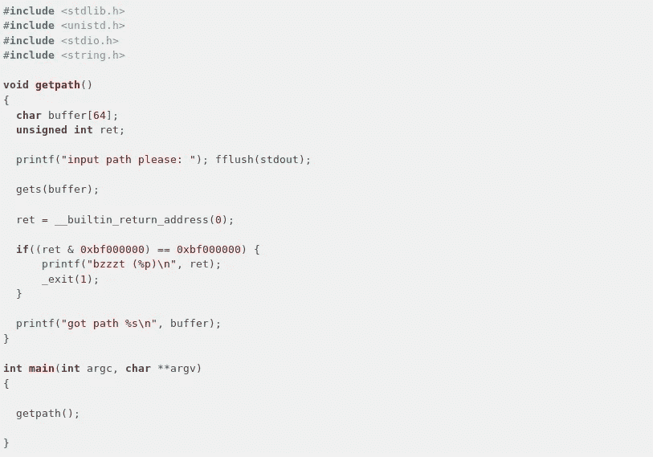
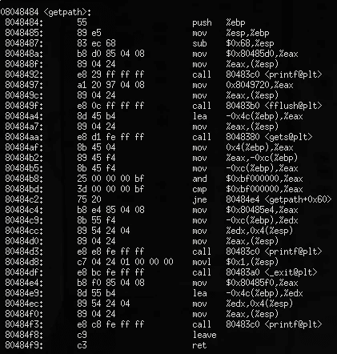
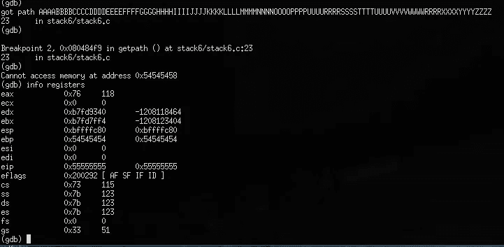
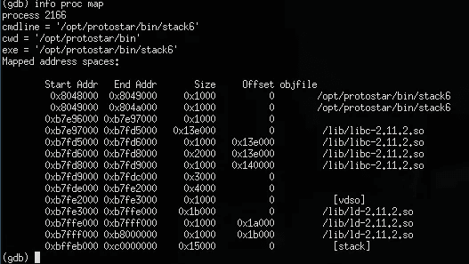
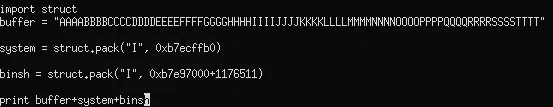
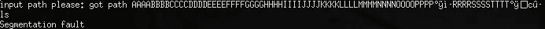
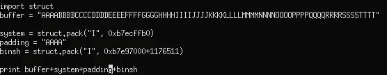
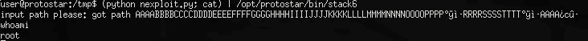

# 原恒星堆栈 6 ret2libc

> 原文：<https://infosecwriteups.com/protostar-stack6-24680c38a3a8?source=collection_archive---------1----------------------->

我已经有一段时间没有写博客了——原因是我一直在做黑客盒子挑战。当我完成这些挑战时，它们通常仍然存在，所以我不能发表评论。然而，最近我已经进入逆向工程。我认为我的第一个 ret2libc 挑战是一个很好的切入点，因为其他挑战都很简单。

让我们从挑战的代码开始。以下是一个快照:

堆栈 6.c

首先，我们从之前的挑战中知道会有缓冲区溢出。正如我们在代码中看到的，我们需要的所有东西都在函数 getpath()中，所以让我们做一个 objdump:

> objdump-S/opt/protostar/bin/stack 6

stack6.c 中 getpath 的 objdump

在没有看到代码的情况下，我们可以查看这个输出并确定一些事情。1)有一个我们知道易受攻击的 gets。在 gets 的手册页中，它说“永远不要使用 gets()。因为在事先不知道数据的情况下，不可能知道 gets()将读取多少字符，并且因为 gets()
将继续存储超过缓冲区结尾的字符，所以使用它是极其危险的。它已经被用来破坏计算机安全。
请改用 fgets()。

接下来，我们在 0x80484bd 处看到一个比较，如果在 0x80484c2 处不相等，则看到一个跳转。这告诉我们，存在某种比较，如果不成立，则跳转。在代码片段中，我们将其视为

> if((ret & 0x BF 000000)= = 0x BF 000000){

如果我们溢出了我们的缓冲区，我们也许可以写入堆栈指针并指向堆栈外的另一个函数。让我们扔一大串，比如 4 A，4 B，c，等等。使用 gdb，我们反汇编 getpath 函数，并在 gets 和 ret 函数处设置断点。：

我们可以看到，ebp 和 eip 已被 54 和 55 覆盖。这给了我们一个线索，我们可以用一个新地址覆盖 eip。我们可以找出缓冲区溢出中的哪些值使用 python 成功覆盖了 eip:

> > > > chr(0x 54)
> ' T '
> >>>chr(0x 55)
> ' U '

现在我们知道我们可以在 eip 变量中添加一个新的地址，它将跳转到程序的末尾。我们可以使用 system()函数来调用系统命令。为了找到这个地址，我们可以这样做

> (gdb) p system
> $1 = { <文本变量，无调试信息>} 0x b 7 ecffb 0<_ _ libc _ system>

我们的系统地址是 0xb7ecffb0。我们将它作为一个新变量添加到我们的漏洞脚本中:

> system = struct.pack("I "，0xb7ecffb0)

接下来，我们需要一个已知包含“/bin/sh”的字符串。libc 库包含字符串“/bin/sh”，但是我们不知道它在哪里。我们可以使用工具“字符串”来找到从文件开始的偏移量:

> user @ protostar:/tmp＄strings-t d/lib/libc . so . 6 | grep/bin/sh
> 1176511/bin/sh

好了，我们有了偏移。但我们需要 libc 开始的地址。我们可以跑

我们走吧！现在我们知道了 libc 的地址和字符串“/bin/sh”存储位置的偏移量。让我们把它加入到我们的利用中:

现在让我们在程序中运行它

> (python exploit.pycat) | /opt/protostar/bin/stack6

哦，太好了，一个新的分段错误。在这种情况下，我学会的最好的办法是添加填充——几个“A”就足够了。

好，我们再跑一次

嘣，我们有根了！

如果你想更详细地了解这个漏洞，可以查看 youtube 上的 liveoverflow。他有一个播放列表是关于利用原星上的二进制挑战的。下次见！