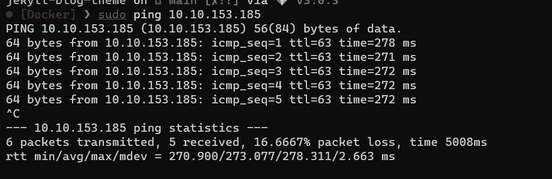
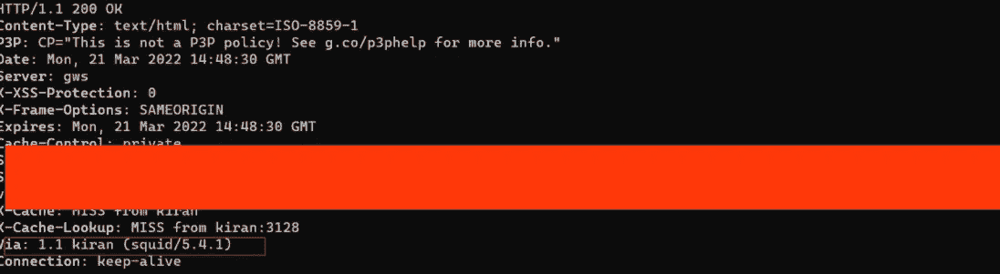
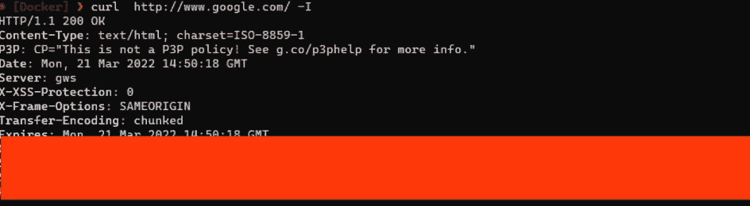
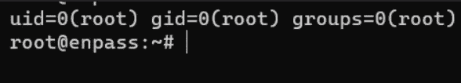
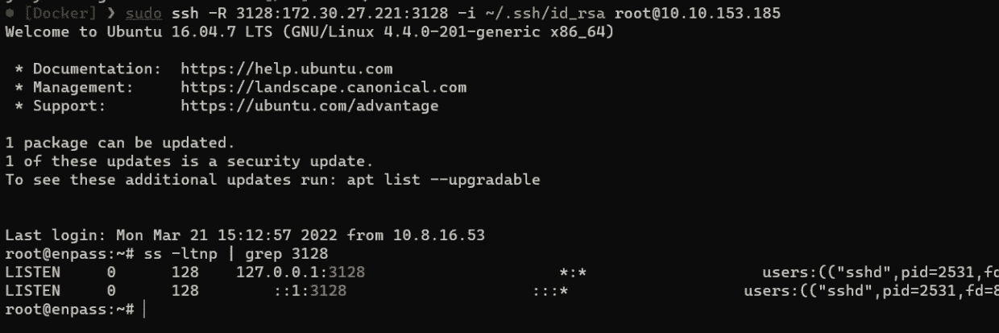
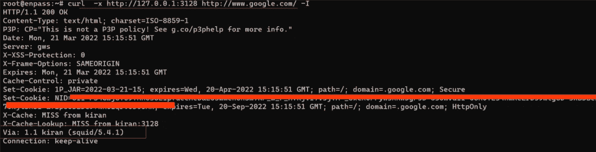
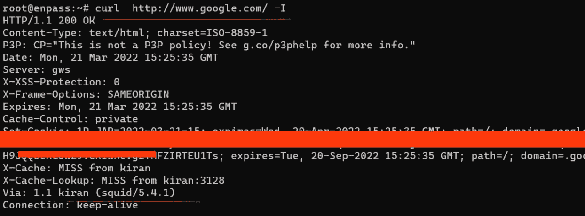
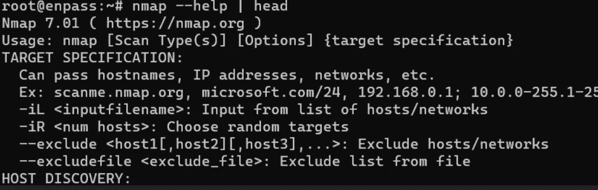

# 代理:访问网络连接

> 原文：<https://infosecwriteups.com/proxy-accessing-network-connection-a97e15f0cf73?source=collection_archive---------5----------------------->

在这篇博客中，我将解释如何在 Tryhackme/HTB/etc 机器上访问网络连接。当我们尝试 pwn 机器或玩攻击/防御挑战时，有一个互联网连接将使它变得容易得多，尽管它可能很慢但很有效。


# 设置

我正在我的机器上表演，它可以在 TryHackMe 链接上免费播放: [**EnPass**](https://tryhackme.com/room/enpass)

机器启动了。



我们必须在本地机器上安装一个代理服务器。我将使用*鱿鱼代理*。我在 wsl2 上使用 arch。

```
For arch: sudo pacman **-Sy** squid
For ubuntu: sudo apt install squid **-y**
```

然后启用 squid 服务并启动它。

```
sudo systemctl enable squid
sudo systemctl start squid
or
sudo service squid start
```

让我们局部检查它是否工作。



如您所见，连接是通过 squid 代理建立的。正常情况下，它应该是这样的(没有 Via: header)。



到目前为止，我们的设置很好。现在，让我们首先获得对远程机器的 root 访问权限。

# 受过训练会玩把戏的

现在，我作为根用户在远程机器上。



**squid 代理**在端口 3128 上运行。我们必须首先通过 ssh 将我们的流量转发到远程机器。

基本上，它是一个**远程端口**转发，所有的流量/连接通过 SSH 客户端从 SSH 服务器传递到
远程服务器。
简而言之，我们向不能访问的人提供访问，而在**本地端口转发**中，我们访问我们不能访问的资源。



我们已成功进行端口转发。

```
ssh **-R** 3128:<your-ip>:3128 **-i** id_rsa root@<machine-ip>
ss **-ltnp** | grep 3128
```

我们借助 curl 来确认一下。



```
curl  **-x** http://127.0.0.1:3128 http://www.google.com/ **-I**
```

*我们对此很满意*

我们已经成功地建立了网络连接。

# 额外的

如果我们想下载软件包呢？没有互联网连接，apt cmdline 不会下载或更新任何东西。只需几个步骤，它就会开始工作。

将以下行添加到“*/etc/profile”*中。这将使代理环境对全局所有用户启用。

```
export http_proxy=http://127.0.0.1:3128/
```



我们现在不必提及“-x”标志。
*apt* 现在也能工作了。可以看到 *Nmap* 没有先安装。我们试试安装 **Nmap** 吧。



是的，我们现在成功地获得了互联网连接。

如果您不能安装任何包( **apt** )，那么您可以尝试将下面一行添加到文件" **/etc/apt/apt.conf** "中。
找不到就创建。

```
Acquire::http::Proxy "http://127.0.0.1:3128/";
```

感谢您的阅读。:)

祝你白天/晚上愉快。