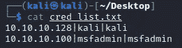
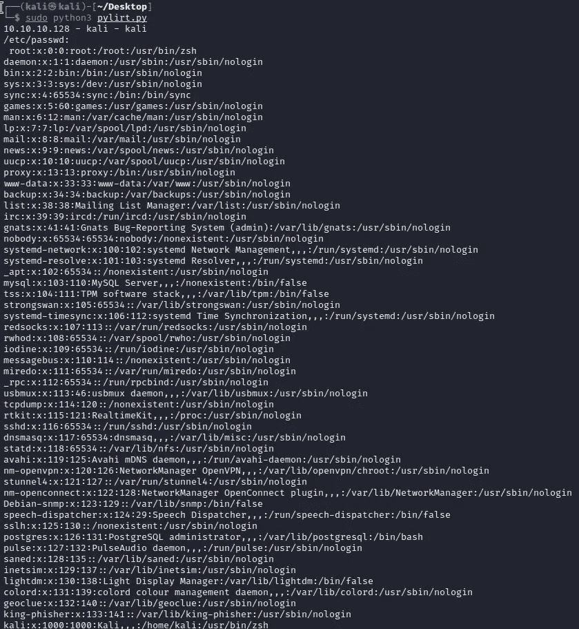

# py lrt——Python Linux 事件响应工具包

> 原文：<https://infosecwriteups.com/pylirt-python-linux-incident-response-toolkit-d04fdbadae6c?source=collection_archive---------1----------------------->

测试了 Kali 2022.1

# 描述

该应用程序旨在通过在 Linux 操作系统中收集信息来加速事件响应过程。

# 特征

信息收集在以下内容中。

/etc/passwd

卡特彼勒/etc/集团

卡特彼勒/etc/sudoers

最后日志

cat /var/log/auth.log

正常运行时间/进程/内存信息

ps aux

/etc/resolv.conf

/etc/hosts

iptables -L -v -n

find/-type f-size+512k-exec ls-LH { }/；

查找/ -mtime -1 -ls

ip a

netstat -nap

arp -a

echo $PATH

# 装置

https://github.com/anil-yelken/pylirt

cd 皮套

sudo pip3 安装 paramiko

# 使用

应在 cred_list.txt 文件中指定以下信息:

IP |用户名|密码

sudo python3 plirt.py

# 接触

https://twitter.com/anilyelken06

 [## 阿尼尔·耶尔肯培养基

### 阅读媒介上阿尼尔·耶尔肯的作品。彭斯特，威胁猎人，研究员 https://twitter.com/anilyelken06…

medium.com](https://medium.com/@anilyelken) 

## 来自 Infosec 的报道:Infosec 每天都有很多内容，很难跟上。[加入我们的每周时事通讯](https://weekly.infosecwriteups.com/)以 5 篇文章、4 个线程、3 个视频、2 个 GitHub Repos 和工具以及 1 个工作提醒的形式免费获取所有最新的 Infosec 趋势！